# GitHub CI/CD map for Political Sphere

This document explains the CI/CD triggers, key jobs, ownership, and how to run workflows locally.

## 📁 .github Directory Structure

```mermaid
graph LR
    GitHub[📁 .github/]

    GitHub --> .gi_actions[📁 actions/]
        .gi_actions --> act_actions[📁 actions/]
            act_actions --> act_setup_terraform[📁 setup-terraform/]
                act_setup_terraform --> set_action_yaml[📄 action.yaml]
        .gi_actions --> act_deploy[📁 deploy/]
            act_deploy --> dep_test[📁 test/]
                dep_test --> tes_integration_tests_sh[📄 integration-tests.sh]
                dep_test --> tes_test_runner_sh[📄 test-runner.sh]
            act_deploy --> dep_action_yml[📄 action.yml]
            act_deploy --> dep_argocd_sync_sh[📄 argocd-sync.sh]
            act_deploy --> dep_build_and_push_sh[📄 build-and-push.sh]
            act_deploy --> dep_CHANGELOG_md[📄 CHANGELOG.md]
            act_deploy --> dep_helm_deploy_sh[📄 helm-deploy.sh]
            act_deploy --> dep_kubectl_apply_sh[📄 kubectl-apply.sh]
            act_deploy --> dep_README_md[📄 README.md]
            act_deploy --> dep_rollback_sh[📄 rollback.sh]
            act_deploy --> dep_run_deploy_sh[📄 run-deploy.sh]
            act_deploy --> dep_validate_manifests_sh[📄 validate-manifests.sh]
        .gi_actions --> act_quality_checks[📁 quality-checks/]
            act_quality_checks --> qua_action_yml[📄 action.yml]
            act_quality_checks --> qua_CHANGELOG_md[📄 CHANGELOG.md]
            act_quality_checks --> qua_README_md[📄 README.md]
        .gi_actions --> act_run_tests[📁 run-tests/]
            act_run_tests --> run_tests[📁 tests/]
                run_tests --> tes_test_runner_sh_1[📄 test-runner.sh]
            act_run_tests --> run_action_yml[📄 action.yml]
            act_run_tests --> run_CHANGELOG_md[📄 CHANGELOG.md]
            act_run_tests --> run_coverage_config_json[📄 coverage.config.json]
            act_run_tests --> run_parse_results_mjs[📄 parse-results.mjs]
            act_run_tests --> run_README_md[📄 README.md]
            act_run_tests --> run_run_tests_sh[📄 run-tests.sh]
            act_run_tests --> run_upload_artifacts_sh[📄 upload-artifacts.sh]
        .gi_actions --> act_setup_node[📁 setup-node/]
            act_setup_node --> set_action_yml[📄 action.yml]
            act_setup_node --> set_CHANGELOG_md[📄 CHANGELOG.md]
            act_setup_node --> set_README_md[📄 README.md]
            act_setup_node --> set_setup_node_sh[📄 setup-node.sh]
        .gi_actions --> act_setup_node_deps[📁 setup-node-deps/]
            act_setup_node_deps --> set_action_yml_1[📄 action.yml]
            act_setup_node_deps --> set_CHANGELOG_md_1[📄 CHANGELOG.md]
            act_setup_node_deps --> set_README_md_1[📄 README.md]
    GitHub --> .gi_documentation[📁 documentation/]
        .gi_documentation --> doc_CODEOWNERS[📄 CODEOWNERS]
        .gi_documentation --> doc_SECURITY_md[📄 SECURITY.md]
        .gi_documentation --> doc_SUPPORT_md[📄 SUPPORT.md]
    GitHub --> .gi_ISSUE_TEMPLATE[📁 ISSUE_TEMPLATE/]
        .gi_ISSUE_TEMPLATE --> ISS_bug_report_yml[📄 bug_report.yml]
        .gi_ISSUE_TEMPLATE --> ISS_feature_request_yml[📄 feature_request.yml]
        .gi_ISSUE_TEMPLATE --> ISS_security_report_yml[📄 security_report.yml]
    GitHub --> .gi_PULL_REQUEST_TEMPLATE[📁 PULL_REQUEST_TEMPLATE/]
        .gi_PULL_REQUEST_TEMPLATE --> PUL_PULL_REQUEST_TEMPLATE_md[📄 PULL_REQUEST_TEMPLATE.md]
    GitHub --> .gi_scripts[📁 scripts/]
        .gi_scripts --> scr_generate_diagram_mjs[📄 generate-diagram.mjs]
    GitHub --> .gi_workflows[📁 workflows/]
        .gi_workflows --> wor_workflows[📁 workflows/]
            wor_workflows --> wor_application_release_yaml[📄 application-release.yaml]
            wor_workflows --> wor_build_and_test_yaml[📄 build-and-test.yaml]
            wor_workflows --> wor_deploy_argocd_yaml[📄 deploy-argocd.yaml]
            wor_workflows --> wor_iac_plan_yaml[📄 iac-plan.yaml]
            wor_workflows --> wor_migrate_yml[📄 migrate.yml]
            wor_workflows --> wor_security_scan_yaml[📄 security-scan.yaml]
            wor_workflows --> wor_vault_client_yml[📄 vault-client.yml]
        .gi_workflows --> wor_audit_yml[📄 audit.yml]
        .gi_workflows --> wor_ci_yml[📄 ci.yml]
        .gi_workflows --> wor_docker_yml[📄 docker.yml]
        .gi_workflows --> wor_release_yml[📄 release.yml]
        .gi_workflows --> wor_security_yml[📄 security.yml]
        .gi_workflows --> wor_test_run_tests_action_yml[📄 test-run-tests-action.yml]
        .gi_workflows --> wor_test_setup_node_action_yml[📄 test-setup-node-action.yml]
        .gi_workflows --> wor_update_github_diagram_yml[📄 update-github-diagram.yml]
    GitHub --> .gi_copilot_instructions_md[📄 copilot-instructions.md]
    GitHub --> .gi_dependabot_yml[📄 dependabot.yml]
    GitHub --> .gi_README_md[📄 README.md]

    style GitHub fill:#FF6F00,stroke:#E65100,stroke-width:3px,color:#fff
    style .gi_actions fill:#1565C0,stroke:#0D47A1,stroke-width:2px,color:#fff
    style act_actions fill:#1565C0,stroke:#0D47A1,stroke-width:2px,color:#fff
    style act_setup_terraform fill:#1565C0,stroke:#0D47A1,stroke-width:2px,color:#fff
    style set_action_yaml fill:#90CAF9,stroke:#42A5F5,stroke-width:1px
    style act_deploy fill:#1565C0,stroke:#0D47A1,stroke-width:2px,color:#fff
    style dep_test fill:#1565C0,stroke:#0D47A1,stroke-width:2px,color:#fff
    style tes_integration_tests_sh fill:#90CAF9,stroke:#42A5F5,stroke-width:1px
    style tes_test_runner_sh fill:#90CAF9,stroke:#42A5F5,stroke-width:1px
    style dep_action_yml fill:#90CAF9,stroke:#42A5F5,stroke-width:1px
    style dep_argocd_sync_sh fill:#90CAF9,stroke:#42A5F5,stroke-width:1px
    style dep_build_and_push_sh fill:#90CAF9,stroke:#42A5F5,stroke-width:1px
    style dep_CHANGELOG_md fill:#90CAF9,stroke:#42A5F5,stroke-width:1px
    style dep_helm_deploy_sh fill:#90CAF9,stroke:#42A5F5,stroke-width:1px
    style dep_kubectl_apply_sh fill:#90CAF9,stroke:#42A5F5,stroke-width:1px
    style dep_README_md fill:#90CAF9,stroke:#42A5F5,stroke-width:1px
    style dep_rollback_sh fill:#90CAF9,stroke:#42A5F5,stroke-width:1px
    style dep_run_deploy_sh fill:#90CAF9,stroke:#42A5F5,stroke-width:1px
    style dep_validate_manifests_sh fill:#90CAF9,stroke:#42A5F5,stroke-width:1px
    style act_quality_checks fill:#1565C0,stroke:#0D47A1,stroke-width:2px,color:#fff
    style qua_action_yml fill:#90CAF9,stroke:#42A5F5,stroke-width:1px
    style qua_CHANGELOG_md fill:#90CAF9,stroke:#42A5F5,stroke-width:1px
    style qua_README_md fill:#90CAF9,stroke:#42A5F5,stroke-width:1px
    style act_run_tests fill:#1565C0,stroke:#0D47A1,stroke-width:2px,color:#fff
    style run_tests fill:#1565C0,stroke:#0D47A1,stroke-width:2px,color:#fff
    style tes_test_runner_sh_1 fill:#90CAF9,stroke:#42A5F5,stroke-width:1px
    style run_action_yml fill:#90CAF9,stroke:#42A5F5,stroke-width:1px
    style run_CHANGELOG_md fill:#90CAF9,stroke:#42A5F5,stroke-width:1px
    style run_coverage_config_json fill:#90CAF9,stroke:#42A5F5,stroke-width:1px
    style run_parse_results_mjs fill:#90CAF9,stroke:#42A5F5,stroke-width:1px
    style run_README_md fill:#90CAF9,stroke:#42A5F5,stroke-width:1px
    style run_run_tests_sh fill:#90CAF9,stroke:#42A5F5,stroke-width:1px
    style run_upload_artifacts_sh fill:#90CAF9,stroke:#42A5F5,stroke-width:1px
    style act_setup_node fill:#1565C0,stroke:#0D47A1,stroke-width:2px,color:#fff
    style set_action_yml fill:#90CAF9,stroke:#42A5F5,stroke-width:1px
    style set_CHANGELOG_md fill:#90CAF9,stroke:#42A5F5,stroke-width:1px
    style set_README_md fill:#90CAF9,stroke:#42A5F5,stroke-width:1px
    style set_setup_node_sh fill:#90CAF9,stroke:#42A5F5,stroke-width:1px
    style act_setup_node_deps fill:#1565C0,stroke:#0D47A1,stroke-width:2px,color:#fff
    style set_action_yml_1 fill:#90CAF9,stroke:#42A5F5,stroke-width:1px
    style set_CHANGELOG_md_1 fill:#90CAF9,stroke:#42A5F5,stroke-width:1px
    style set_README_md_1 fill:#90CAF9,stroke:#42A5F5,stroke-width:1px
    style .gi_documentation fill:#6A1B9A,stroke:#4A148C,stroke-width:2px,color:#fff
    style doc_CODEOWNERS fill:#CE93D8,stroke:#AB47BC,stroke-width:1px
    style doc_SECURITY_md fill:#CE93D8,stroke:#AB47BC,stroke-width:1px
    style doc_SUPPORT_md fill:#CE93D8,stroke:#AB47BC,stroke-width:1px
    style .gi_ISSUE_TEMPLATE fill:#E65100,stroke:#BF360C,stroke-width:2px,color:#fff
    style ISS_bug_report_yml fill:#FFCC80,stroke:#FFA726,stroke-width:1px
    style ISS_feature_request_yml fill:#FFCC80,stroke:#FFA726,stroke-width:1px
    style ISS_security_report_yml fill:#FFCC80,stroke:#FFA726,stroke-width:1px
    style .gi_PULL_REQUEST_TEMPLATE fill:#00838F,stroke:#006064,stroke-width:2px,color:#fff
    style PUL_PULL_REQUEST_TEMPLATE_md fill:#80DEEA,stroke:#26C6DA,stroke-width:1px
    style .gi_scripts fill:#1565C0,stroke:#0D47A1,stroke-width:2px,color:#fff
    style scr_generate_diagram_mjs fill:#BCAAA4,stroke:#8D6E63,stroke-width:1px
    style .gi_workflows fill:#2E7D32,stroke:#1B5E20,stroke-width:2px,color:#fff
    style wor_workflows fill:#2E7D32,stroke:#1B5E20,stroke-width:2px,color:#fff
    style wor_application_release_yaml fill:#A5D6A7,stroke:#66BB6A,stroke-width:1px
    style wor_build_and_test_yaml fill:#A5D6A7,stroke:#66BB6A,stroke-width:1px
    style wor_deploy_argocd_yaml fill:#A5D6A7,stroke:#66BB6A,stroke-width:1px
    style wor_iac_plan_yaml fill:#A5D6A7,stroke:#66BB6A,stroke-width:1px
    style wor_migrate_yml fill:#A5D6A7,stroke:#66BB6A,stroke-width:1px
    style wor_security_scan_yaml fill:#A5D6A7,stroke:#66BB6A,stroke-width:1px
    style wor_vault_client_yml fill:#A5D6A7,stroke:#66BB6A,stroke-width:1px
    style wor_audit_yml fill:#A5D6A7,stroke:#66BB6A,stroke-width:1px
    style wor_ci_yml fill:#A5D6A7,stroke:#66BB6A,stroke-width:1px
    style wor_docker_yml fill:#A5D6A7,stroke:#66BB6A,stroke-width:1px
    style wor_release_yml fill:#A5D6A7,stroke:#66BB6A,stroke-width:1px
    style wor_security_yml fill:#A5D6A7,stroke:#66BB6A,stroke-width:1px
    style wor_test_run_tests_action_yml fill:#A5D6A7,stroke:#66BB6A,stroke-width:1px
    style wor_test_setup_node_action_yml fill:#A5D6A7,stroke:#66BB6A,stroke-width:1px
    style wor_update_github_diagram_yml fill:#A5D6A7,stroke:#66BB6A,stroke-width:1px
    style .gi_copilot_instructions_md fill:#F48FB1,stroke:#EC407A,stroke-width:1px
    style .gi_dependabot_yml fill:#BCAAA4,stroke:#8D6E63,stroke-width:1px
    style .gi_README_md fill:#B0BEC5,stroke:#78909C,stroke-width:1px
```



### Directory Purpose

| Directory/File               | Purpose                                                      |
| ---------------------------- | ------------------------------------------------------------ |
| **workflows/**               | GitHub Actions workflow definitions for CI/CD automation     |
| **actions/**                 | Reusable composite actions used across workflows             |
| **documentation/**           | Project governance documents (CODEOWNERS, SECURITY, SUPPORT) |
| **ISSUE_TEMPLATE/**          | Issue templates for bug reports, feature requests, etc.      |
| **PULL_REQUEST_TEMPLATE.md** | Template for pull request descriptions                       |
| **dependabot.yml**           | Automated dependency update configuration                    |
| **copilot-instructions.md**  | GitHub Copilot custom instructions and coding standards      |
| **README.md**                | This file - CI/CD documentation and workflow guide           |

---

## Triggers → Jobs → Required Checks

- `verify-github-config` (manual / PRs touching `.github/`) — validates GHA linting, naming conventions, and single dependency bot.
- `verify-github-config` job runs: `actionlint`, `yamllint`, `scripts/ci/verify-github-config.mjs`.
- `verify-ci` (main CI) — comprehensive pipeline: pre-flight checks, lint/typecheck, tests, security scans, build, integration/e2e.

## Who owns what

- Platform engineering (`@political-sphere/platform-team`) owns GitHub workflows and `.github/actions`.
- Infrastructure team owns IaC and `apps/infrastructure`.
- Security team owns security scans and `SECURITY.md`.

## Running checks locally

Prereqs: `node` and `npm` or `pnpm` installed. For local run of GHA lints you can use `npx` or install tools globally.

Run the GitHub Actions lints and custom checks locally:

```bash
# From repository root
npm run ci:lint-gha
```

To run workflows locally you can use `act` (https://github.com/nektos/act). Example:

```bash
act workflow_dispatch -W .github/workflows/verify-github-config.yml
```

Note: `act` may not support all actions and service containers exactly as GitHub-hosted runners do. Use it for lightweight checks only.

## Available Composite Actions

### setup-node-deps

Sets up Node.js and installs dependencies with caching.

```yaml
- uses: ./.github/actions/setup-node-deps
  with:
    node-version: "22" # default: '22'
    cache: "npm" # default: 'npm'
    install-command: "npm ci" # default: 'npm ci'
```

### setup-node

Sets up Node.js with optional package manager caching (no installation).

```yaml
- uses: ./.github/actions/setup-node
  with:
    node-version: "20"
    cache: "npm" # npm|yarn|pnpm|none
```

### quality-checks

Runs linting, type checking, and format validation.

```yaml
- uses: ./.github/actions/quality-checks
  with:
    run-lint: "true" # default: 'true'
    run-typecheck: "true" # default: 'true'
    run-format-check: "true" # default: 'true'
```

### run-tests

Orchestrates test execution with coverage and sharding support.

```yaml
- uses: ./.github/actions/run-tests
  with:
    test-type: "unit" # unit|integration|e2e|coverage
    coverage-enabled: "true"
    coverage-threshold: 80
```

### deploy

Handles deployment to various environments (staging, production).

See [actions/deploy/README.md](actions/deploy/README.md) for details.

## Conventions

- Workflow files must use kebab-case filenames and start with a verb token (e.g., `run-tests.yml`, `publish-release.yml`). This repo includes an automated check `verify-github-config` - it warns on violations.
- Composite actions in `.github/actions/*` must include `action.yml` and `README.md` with inputs/outputs and an explicit changelog section.
- Single source of truth for dependency automation: dependabot.yml is used for this repo.

### Local prerequisites for full validation

To run the full validation locally (including `actionlint`), install the following locally:

```bash
# install actionlint locally (recommended for full checks)
npm install -D actionlint || pnpm add -D actionlint

# yamllint is a Python tool; install via pip if you want YAML validation locally
python3 -m pip install --user yamllint
```

After installing, `npm run ci:lint-gha` will run the verifier and `actionlint` locally.

## Contacts & Escalation

If a workflow or action causes incidents, tag `@political-sphere/platform-team` and open an incident in `reports/`.
