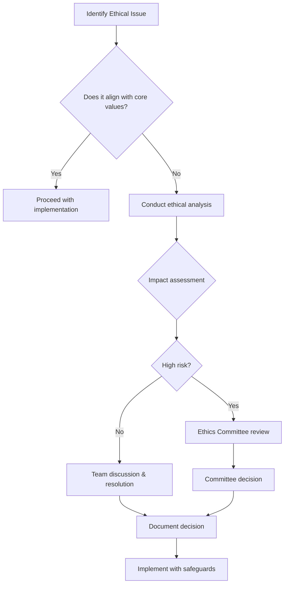

# Core Values & Ethics

> **Political Sphere's guiding principles and ethical framework for responsible AI-powered political education**

| Classification | Version | Last Updated |       Owner        | Review Cycle |
| :------------: | :-----: | :----------: | :----------------: | :----------: |
|  🔒 Internal   | `1.0.0` |  2025-10-29  | Ethics Committee   |  Quarterly   |

---

## 🎯 Purpose

Our Core Values & Ethics framework establishes the fundamental principles that guide every decision, interaction, and innovation at Political Sphere. This document ensures our work with AI, political simulation, and civic education maintains the highest standards of integrity, responsibility, and societal benefit.

### Purpose of Values

These values exist to:

Guide all game design and development decisions

Ensure fairness and trust between players

Protect the simulation from abuse or real-world influence

Provide clarity for moderation and governance

Anchor long-term development integrity

The values apply to gameplay, community, and development practices.

### 💡 Business Value

<table>
<tr>
<td width="20%"><b>🛡️ Trust</b></td>
<td>Builds user confidence in our platform and mission</td>
</tr>
<tr>
<td><b>⚖️ Compliance</b></td>
<td>Ensures adherence to EU AI Act and ethical standards</td>
</tr>
<tr>
<td><b>🌟 Reputation</b></td>
<td>Establishes Political Sphere as an ethical leader</td>
</tr>
<tr>
<td><b>🔍 Accountability</b></td>
<td>Provides clear standards for decision-making</td>
</tr>
<tr>
<td><b>🤝 Partnerships</b></td>
<td>Enables collaboration with ethical organizations</td>
</tr>
</table>

---

## 🌟 Core Values

### Fairness

All players operate on equal terms

No paid advantages or influence

Rules are applied consistently

Server-authoritative simulation

**Meaning:**
Outcome is earned through in-world conduct, strategy, and relationships — not money, manipulation, or privilege.

### Integrity of Simulation

The game world behaves consistently and predictably

Parliamentary processes work as rules-based systems

No arbitrary changes to how political systems behave

**Meaning:**
Systems follow transparent rules; cause → effect is understandable.

### Player Safety & Respect

No harassment, intimidation, or targeted abuse

No discrimination or hate content

No doxxing, real-world targeting, or personal attacks

**Meaning:**
Players engage in political simulation — not personal aggression.

### Ethical Boundaries

Strict separation between in-game politics and real-world politics

No real-world persuasion, mobilisation, recruitment, or ideological promotion

No exploitation of sensitive political issues

**Meaning:**
Political Sphere simulates — it does not influence real-world politics.

### Transparency & Accountability

Rules and moderation criteria are visible

Decisions explained when possible

Appeals processes exist

Audit trails for sensitive actions

**Meaning:**
Trust is built through openness and clear reasoning.

### Accessibility & Inclusion

Game systems and UI support broad participation

Features do not exclude based on ability, background, or identity

Assistive features when possible (within resource constraints)

**Meaning:**
Players of different abilities and experiences can succeed.

### Player Agency With Consequence

Players have meaningful strategic freedom

Conduct and decisions carry in-world outcomes

Leadership roles earned through conduct, not purchased

**Meaning:**
Power in the game is earned and accountable.

### Responsible Use of AI

AI supports gameplay, moderation, and simulation

No manipulation or psychological influence

Local models only; transparent guardrails

Human override for moderation decisions

**Meaning:**
AI enhances the world, but never controls real-world beliefs or behaviour.

### Continuous Improvement

Systems evolve while maintaining core fairness

Feedback loops with players

Ethical review of changes

Change logs and decision documentation

**Meaning:**
The game grows, but values remain stable.

---

## 🛡️ Ethical Framework

### Explicit Prohibitions

No pay-to-win

No political ads

No monetising personal data

No external political campaigning

No use of real politicians/parties as mechanics

No psychological manipulation or persuasion systems

No dark patterns

### Behaviour Standards

Build and play respectfully

Challenge ideas, not people

Follow structured debate rules

Report misconduct responsibly

Accept outcomes and appeals process

Maintain anonymity/privacy boundaries

Act to preserve simulation integrity

### Alignment Statements

Game-world integrity over speed of development

Ethics precede growth

Community trust is a core asset

Security and safety > convenience

Design choices must preserve fairness and equal access

No real-world political influence — ever

### AI Ethics Principles

#### 🤖 Human-Centric AI
**AI serves human needs and enhances human capabilities, never replaces human judgment in democratic processes.**

**Requirements:**
- All AI recommendations include human oversight options
- Users can always access unfiltered information alongside AI summaries
- AI tools are designed to educate, not persuade or manipulate
- Regular human review of AI-generated content for contextual appropriateness

#### 📊 Data Ethics
**We collect, process, and use data responsibly, respecting individual privacy and collective benefit.**

**Requirements:**
- GDPR compliance with additional privacy protections for political data
- Data minimization: collect only what's necessary for educational purposes
- Transparent data usage with user consent and control
- Regular privacy impact assessments for new features

#### 🔍 Algorithmic Transparency
**Users understand how our AI works and can verify its outputs independently.**

**Requirements:**
- Open-source core algorithms where legally permissible
- Clear explanations of AI decision-making processes
- Ability for users to challenge and correct AI outputs
- Regular third-party audits of algorithmic fairness

### Political Simulation Ethics

#### 🎭 Simulation Integrity
**Our simulations accurately represent political processes while clearly distinguishing reality from simulation.**

**Requirements:**
- All simulations based on verified historical and current data
- Clear disclaimers about simulation limitations and assumptions
- Educational framing that teaches critical thinking about models
- Regular validation against real-world political outcomes

#### ⚖️ Neutrality Standards
**We present diverse political perspectives fairly and encourage critical thinking over partisanship.**

**Requirements:**
- Balanced representation of political viewpoints in content
- Fact-checking of all political claims regardless of source
- Tools to help users evaluate information quality
- Avoidance of algorithmic personalization that creates echo chambers

#### 🌍 Global Responsibility
**Our work considers global impacts and respects diverse political and cultural contexts.**

**Requirements:**
- Content localization that respects local political contexts
- Consideration of international human rights standards
- Avoidance of content that could incite violence or division
- Support for democratic processes worldwide

---

## 📋 Ethical Decision Framework

### Decision-Making Process

### Ethical Risk Assessment

**High-Risk Categories:**
- Content that could influence elections or policy votes
- AI features that personalize political information
- Data collection about political beliefs or affiliations
- Simulations of sensitive political scenarios

**Assessment Criteria:**
1. **Potential Harm**: Could this cause individual or societal harm?
2. **User Autonomy**: Does this respect user choice and understanding?
3. **Transparency**: Can users understand and control this feature?
4. **Accountability**: Can we justify this decision to stakeholders?

### Escalation Triggers

**Immediate Escalation to Ethics Committee:**
- Any feature that could be classified as "high-risk AI" under EU AI Act
- Content involving controversial political figures or events
- Changes to core algorithms that affect political neutrality
- Data practices that could compromise user privacy

---

## 🤝 Ethical Commitments

### To Our Users
- **Accuracy**: We will never knowingly spread misinformation
- **Privacy**: Your political exploration remains confidential
- **Empowerment**: We provide tools for informed decision-making
- **Respect**: We honor diverse political beliefs and backgrounds
- **Safety**: Our platform promotes constructive civic discourse

### To Society
- **Democratic Health**: We contribute to stronger democratic institutions
- **Educational Access**: We reduce barriers to political understanding
- **Civic Engagement**: We encourage active participation in democracy
- **Social Cohesion**: We foster respectful political dialogue
- **Transparency**: We are open about our methods and limitations

### To Our Partners
- **Integrity**: We maintain independence from political influences
- **Collaboration**: We work with organizations sharing our values
- **Accountability**: We measure and report our societal impact
- **Innovation**: We advance ethical AI and civic technology
- **Standards**: We uphold the highest ethical standards in our field

---

## 🔐 Security Requirements

### 🎯 Overall Objectives

Protect players and their data

Ensure safe political simulation (no real-world political mobilisation)

Maintain fairness and integrity of gameplay

Stay legally compliant while operating at £0 infrastructure cost

Use free, self-hostable or local tooling only

### 🔐 Security Requirements

#### 1. Account & Authentication

Strong secure password hashing (bcrypt/argon2)

JWT access tokens + refresh tokens

Optional 2FA later (TOTP)

Rate limits on login + brute-force protection

Session revocation

No external auth providers required
(unless free + optional self-hosted later like Keycloak)

#### 2. Access Control

Role-based & attribute-based permissions:

Player

Moderator

Admin

World-scoped access (tenant_id)

Server-authoritative game actions only

Idempotency keys for write actions (no double votes, etc.)

#### 3. Input & Data Validation

Everything validated server-side (Zod or JSON-schema)

Validate payload types, lengths, and IDs

Reject unsafe HTML, scripts, or deep nested objects

Sanitise user content before storage/display

#### 4. Rate Limiting & Abuse Prevention

Per-IP + per-user + per-session request limits

Burst limits for chat, speeches, debate actions

WS connection limits per browser + origin

Cooldown timers on political actions (anti-spam/denial tactics)

#### 5. Logging & Audit

Log auth events, bans, moderation actions

Append-only audit log for sensitive actions

Store correlation_id per request (helps debugging)

Ensure logs never store passwords or raw tokens.

#### 6. Data Encryption & Secrets

HTTPS enforced (self-signed ok for dev)

Tokens/Passwords never in logs

Environment secrets stored in:

Local .env (dev only)

Self-hosted secrets store later if used

#### 7. Code & Deployment Security

Automated checks in CI:

Lint

Type safety

Dependency vulnerability scan (npm audit or OSV)

No secrets pushed to repo

No remote code execution in AI modules

#### 8. AI Safety Controls

Local models only

No real-world political persuasion

AI restricted to:

NPC behaviour with constraints

Summarisation

Moderation suggestions (not final decision)

Guardrails prompt templates

Logs for AI actions > human moderation oversight

### 🛡️ Compliance Requirements

#### 1. Data Privacy

Minimise personal data

Username

Email

(optional) avatar text key

No real-world political data stored

Allow user account deletion + data export

Alignment target: GDPR core principles, but simplified

#### 2. Player Safety

Clear community rules

Reporting system

Human moderation review

Appeals system

Content filters for harassment + threats

Strong stance against:

Hate speech

Targeted harassment

Doxxing

Real-world extremist content

#### 3. No Real-World Political Influence

Game world must remain fictional, closed, and contained

No real-world voting advice

No campaigning or mobilisation

No targeted persuasion

No political party recruitment

Clear in-game boundary messaging

Simulation only — not activism

#### 4. Accessibility

Baseline commitment to WCAG-aligned UI practices:

Keyboard navigation

Screen-reader friendly structure

Alt text + semantic HTML

Colour contrast baseline

Does not require paid tooling — just discipline.

#### 5. Transparency & Fairness

Documented moderation rules

Appeal process

Explainable bans and penalties

Server-side authority for game outcomes

No paid power advantages

#### 6. Intellectual Property & Integrity

Original content only

No copyrighted parliamentary transcripts or logos

Fictional political figures only

### 🧪 Security Testing (Free)

npm audit / OSV scanner

ZAP local scans (free)

Manual threat modelling (STRIDE-lite)

Dependency pinning

### 🚧 Non-Goals (explicit exclusions)

No advertising

No microtransactions

No political data brokerage

No selling user data

No scraping social media

No third-party analytics requiring spend

Optional free analytics may be allowed later (Plausible self-hosted etc.)

### ✅ Summary for Dev Prompts

Political Sphere must be secure, fair, and privacy-respecting, using only free tools and local/self-hosted resources. Priorities: player safety, simulation fairness, no real-world political influence, minimal personal data, deterministic systems, transparent moderation, and strong guardrails against abuse and harassment.

---

## 📊 Ethics Program Metrics

### Compliance Metrics
- **Audit Results**: 100% compliance with ethical standards
- **Incident Response**: < 24 hours average response time
- **Training Completion**: > 95% of team members annually
- **User Reports**: < 0.01% of users reporting ethical concerns

### Impact Metrics
- **Trust Scores**: > 4.5/5.0 user trust ratings
- **Content Accuracy**: 99.9% factual accuracy maintained
- **Bias Audits**: < 1% bias detected in AI outputs
- **Privacy Compliance**: 100% GDPR compliance rate

### Development Metrics
- **Ethical Reviews**: All high-risk features reviewed
- **Diverse Input**: Input from 50+ countries in content development
- **Transparency Reports**: Quarterly public ethics reporting
- **Community Feedback**: > 10,000 user inputs annually

---

## 🏛️ Governance Structure

### Ethics Committee
**Independent oversight body ensuring ethical compliance across all operations.**

**Composition:**
- 5 members: ethicists, legal experts, user representatives, technical experts
- Independent from executive leadership
- Diverse geographic and cultural representation

**Responsibilities:**
- Review high-risk decisions and features
- Conduct regular ethics audits
- Develop and update ethical guidelines
- Provide ethics training and consultation

### Ethics Officers
**Embedded ethics expertise in each major team.**

**Roles:**
- Product Ethics Officer: Reviews product features
- Data Ethics Officer: Oversees data practices
- AI Ethics Officer: Monitors algorithmic development
- Content Ethics Officer: Ensures content integrity

### Ethics Training
**Mandatory training for all team members.**

**Curriculum:**
- Core values and ethical principles
- EU AI Act compliance requirements
- Decision-making frameworks
- Case studies and simulations
- Regular refreshers and updates

---

## 🚨 Ethical Incident Response

### Reporting Process
1. **Immediate Reporting**: Any team member can report ethical concerns
2. **Initial Assessment**: Ethics Officer evaluates within 24 hours
3. **Escalation**: High-risk issues go to Ethics Committee within 48 hours
4. **Investigation**: Thorough review with stakeholder input
5. **Resolution**: Clear decision with documented rationale
6. **Follow-up**: Monitoring and prevention measures

### Whistleblower Protection
- Anonymous reporting channels available
- Protection from retaliation for good-faith reports
- Independent investigation process
- Support for reporters throughout the process

### Transparency Requirements
- Public summary of major ethical incidents (anonymized)
- Lessons learned shared across the organization
- Updates to policies and procedures as needed

---

## 🔄 Continuous Improvement

### Annual Ethics Review
- Comprehensive assessment of ethics program effectiveness
- Stakeholder input including users, partners, and experts
- Updates to policies based on new ethical challenges
- Benchmarking against industry best practices

### Emerging Issues Monitoring
- Regular scanning of ethical developments in AI and politics
- Participation in industry ethics working groups
- Academic partnerships for cutting-edge ethical research
- Proactive policy development for anticipated challenges

---

## 📞 Contact & Support

<table>
<tr>
<td width="50%">

### 🏛️ Ethics Committee

- 📧 **Email:** ethics@politicalsphere.com
- 💬 **Slack:** `#ethics-committee`
- 🕒 **Office Hours:** Bi-weekly open forums
- 📺 **Meetings:** Monthly public ethics discussions

</td>
<td width="50%">

### 🚨 Ethics Reporting

- 📧 **Report:** ethics-report@politicalsphere.com
- 🌐 **Portal:** ethics.politicalsphere.com/report
- 📞 **Hotline:** Available 24/7 for urgent concerns
- 🔒 **Anonymous:** Full anonymity protection

</td>
</tr>
</table>

---

## ❓ Frequently Asked Questions

### Q: How do you handle political bias in AI algorithms?

**A:** We employ multiple safeguards: diverse training data, regular bias audits by independent experts, algorithmic transparency requirements, and human oversight of all political content. Our AI is designed to present balanced perspectives rather than favor any particular viewpoint.

### Q: What if users want to use the platform for partisan purposes?

**A:** We welcome all users regardless of political affiliation, but maintain strict neutrality in our content and tools. Users can explore any political topic, but our educational framing encourages critical thinking and fact-based understanding over partisan advocacy.

### Q: How do you ensure content accuracy in rapidly changing political environments?

**A:** We maintain a network of political experts and fact-checkers, use automated fact-checking tools, and have rapid update procedures for breaking news. All time-sensitive content includes clear timestamps and update notifications.

### Q: What happens if you discover an ethical issue with existing features?

**A:** We immediately pause the feature, conduct a thorough investigation, implement fixes or safeguards, communicate transparently with users, and update our policies to prevent similar issues. Major incidents are publicly reported with lessons learned.

---

### 📋 Document Control

|         Field         |          Value          |
| :-------------------: | :---------------------: |
| 🏷️ **Classification** |        Internal         |
|    🔢 **Version**     |         `1.0.0`         |
|  📅 **Last Review**   |       2025-10-29        |
|  🔄 **Next Review**   |       2026-01-29        |
|    ✍️ **Approver**    |   Ethics Committee      |

---

**Made with ❤️ by the Political Sphere Ethics Committee**

