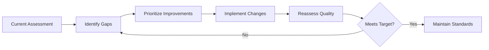

# Standards Overview

## Table of Contents

- [Quality](#quality)
- [Code Quality](#code-quality)
- [Testing](#testing)
- [Documentation](#documentation)
- [Observability](#observability)
- [Reliability and Resilience](#reliability-and-resilience)
- [Scalability](#scalability)
- [Deployment and Release](#deployment-and-release)
- [Security](#security)
- [Compliance](#compliance)
- [AI Trust and Safety](#ai-trust-and-safety)
- [Data Quality](#data-quality)
- [Efficiency](#efficiency)
- [Environmental Impact](#environmental-impact)
- [Design](#design)
- [User Experience](#user-experience)
- [Developer Experience](#developer-experience)
- [Accessibility](#accessibility)
- [Value](#value)
- [Innovation](#innovation)
- [Automation](#automation)
- [Moderation](#moderation)
- [Ethics](#ethics)
- [Learning and Continuous Improvement](#learning-and-continuous-improvement)
- [Governance](#governance)
- [Organisation](#organisation)
- [Strategic Alignment](#strategic-alignment)
- [Risk Maturity](#risk-maturity)

## Quality {#quality}

<table>
  <thead>
    <tr>
      <th>Level</th>
      <th>Rating/Vibe Check</th>
      <th>Indicators</th>
      <th>Measurable Criteria</th>
      <th>Evidence/Artifacts</th>
    </tr>
  </thead>
  <tbody>
    <tr>
      <td>0</td>
      <td>Unacceptable. 🚨 "Burn it. Start again."</td>
      <td>Fundamentally broken, unsafe, or non-compliant. Needs total rework.</td>
      <td>Crashes, security holes, missing requirements, chaos</td>
      <td>❌ Fails core acceptance criteria ❌ No testing ❌ Fails security/accessibility baseline</td>
      <td>None. Missing docs. Failing builds. No logs.</td>
    </tr>
    <tr>
      <td>1</td>
      <td>At Risk / Poor 😬 "Works on my machine, kinda."</td>
      <td>Works in parts, sloppy and unstable.</td>
      <td>Inconsistent behavior, high failure rate, debugging by luck</td>
      <td><50% tests passing Coverage <20% Error rate high No SLAs/SLOs</td>
      <td>Ad-hoc notes, manual scripts, partial configs</td>
    </tr>
    <tr>
      <td>2</td>
      <td>Adequate / Minimum Standard 🤷‍♂️ "It works. Don't zoom in."</td>
      <td>Meets basics but lacks polish and resilience.</td>
      <td>Basic functionality, visible debt, manual processes</td>
      <td>≥70% acceptance criteria Tests exist but weak Minimal monitoring</td>
      <td>Basic docs, partial tests, CI runs but limited gates</td>
    </tr>
    <tr>
      <td>3</td>
      <td>Good / Professional👍 "Nice. This is competent work."</td>
      <td>Reliable, maintainable, industry standard quality.</td>
      <td>Clear structure, proactive checks, stable behavior</td>
      <td>>90% criteria met Tests + lint + scanning required Error budget respected</td>
      <td>CI/CD pipeline, logs, docs, runbooks, tests w/ coverage</td>
    </tr>
    <tr>
      <td>4</td>
      <td>Excellent✨ "You could put this in a portfolio."</td>
      <td>Polished, scalable, efficient, ethical, well-documented.</td>
      <td>Elegant patterns, automation, observability, low defects</td>
      <td>>95% criteria met Stress tested Security & accessibility validated</td>
      <td>Traceable decisions, dashboards, full tests, ADRs, docs</td>
    </tr>
    <tr>
      <td>5</td>
      <td>Example (Benchmark) 🏆 "This is the model everyone copies."</td>
      <td>Sets the standard. Innovative, auditable, joyful, future-proof.</td>
      <td>Self-monitoring, self-improving, AI-assist metadata, audit trails</td>
      <td>100% criteria met + peer review + governance approval Self-auditing + resilience demonstrated</td>
      <td>AI-readable docs, structured logs, proof of load/chaos tests, governance/change records</td>
    </tr>
  </tbody>
</table>

---

## Efficiency

<table>
  <thead>
    <tr>
      <th>Level</th>
      <th>Rating (w/ vibe)</th>
      <th>Meaning</th>
      <th>Indicators *(what you see)*</th>
      <th>Measurable Criteria *(checkpoints)*</th>
      <th>Evidence / Artifacts *(proof)*</th>
    </tr>
  </thead>
  <tbody>
    <tr>
      <td><strong>0</strong></td>
      <td><strong>Wasteful / Unacceptable 🗑️</strong> "Burning money and CPU like confetti."</td>
      <td>Dramatic waste — time, compute, process steps. Actively harmful.</td>
      <td>Constant bottlenecks, overbuilt systems, manual grind, idle compute, chaos workflows</td>
      <td>❌ >50% redundant work ❌ No batching/caching ❌ High compute cost per unit of value ❌ Slow critical paths</td>
      <td>No automation, huge logs of manual operations, high cloud bills, unoptimised queries, lack of profiling</td>
    </tr>
    <tr>
      <td><strong>1</strong></td>
      <td><strong>Inefficient / At Risk 🐌</strong> "Why is this 10 clicks & a prayer?"</td>
      <td>Bloated, slow, redundant steps, CPU & mental overuse.</td>
      <td>Manual routines, repeated queries, underutilised caches, constant context switching</td>
      <td><60% productive time No async No batching Multiple manual approvals</td>
      <td>Evidence of repetitive tasks, queue backlogs, long cycle times, hotfix scripts</td>
    </tr>
    <tr>
      <td><strong>2</strong></td>
      <td><strong>Functional but Clunky 🤦</strong> "2009 enterprise IT vibes."</td>
      <td>Gets job done but with obvious friction or waste.</td>
      <td>Working system with noticeable drag, some automation, occasional spikes in load or cost</td>
      <td>Meets deadlines w/ friction Basic caching Some automation Slow build/test times</td>
      <td>Scripts exist but scattered, pipeline exists but slow, ops dashboards show periodic saturation</td>
    </tr>
    <tr>
      <td><strong>3</strong></td>
      <td><strong>Efficient / Standard ✅</strong> "Just works smoothly."</td>
      <td>Good balance — resource-conscious, streamlined.</td>
      <td>Automation for repeat tasks, sensible batching, async where needed</td>
      <td>>80% automated routine tasks p95 latency target met Reasonable compute cost SLAs</td>
      <td>CI/CD pipeline, caching strategy, profiling reports, performance budget tracking, workload dashboards</td>
    </tr>
    <tr>
      <td><strong>4</strong></td>
      <td><strong>Lean & Optimised 🏎️</strong> "This glides — someone *engineered* it."</td>
      <td>Minimal waste, fast, scalable, intelligent automation.</td>
      <td>Low cognitive load flows; automated provisioning; caching; async pipelines</td>
      <td>>90% automation for routine flows Efficient batching & caching p95 latency significantly under target Builds <5 min</td>
      <td>Code profiling logs, load test reports, peering configs, async job queues, infra-as-code, resource dashboards</td>
    </tr>
    <tr>
      <td><strong>5</strong></td>
      <td><strong>High-Performance / Sovereign-Grade Efficiency 🧠⚡</strong> "Feels unfair — but ethically."</td>
      <td>Systems thinking, self-optimising, zero-waste mindset; comp-aware; async where wise.</td>
      <td>Autotuning, autoscaling, self-healing, intelligent caching, compute fairness, predictable perf under load</td>
      <td><2 min builds AIOps alerts w/ auto-remediation Self-profiling workloads 90th+ percentile resource efficiency</td>
      <td>Chaos + load test history, AIOps artifacts, predictive scaling rules, automated performance gates in CI, perf regression dashboards</td>
    </tr>
  </tbody>
</table>

---

## Security

<table>
  <thead>
    <tr>
      <th>Level</th>
      <th>Rating (w/ vibe)</th>
      <th>Meaning</th>
      <th>Indicators *(what you see)*</th>
      <th>Measurable Criteria *(checkpoints)*</th>
      <th>Evidence / Artifacts *(proof)*</th>
    </tr>
  </thead>
  <tbody>
    <tr>
      <td style="text-align: right;"><strong>0</strong></td>
      <td><strong>Catastrophic / Dangerous 💥</strong> "Congrats, you've invented ransomware-as-a-feature."</td>
      <td>Vulnerable by design. No safeguards. Data, users, systems at risk.</td>
      <td>Clear public credentials, unencrypted sensitive data, no access controls, frequent breaches</td>
      <td>❌ Secrets in repo/S3 ❌ No authentication/MFA ❌ No logging or monitoring</td>
      <td>No security policies, open buckets, screenshots of creds, incident tickets with major data loss</td>
    </tr>
    <tr>
      <td style="text-align: right;"><strong>1</strong></td>
      <td><strong>High-Risk / Negligent 🔓</strong> "Passwords in a Google Doc and public S3 buckets energy."</td>
      <td>Security ignored, minimal controls, huge attack surface.</td>
      <td>Weak IAM, plaintext secrets, ad-hoc patching, many third-party exposures</td>
      <td><50% systems have MFA Deprecated TLS/cipher usage present No dependency scanning</td>
      <td>Inventory gaps, manual patch lists, evidence of leaked creds, partial IAM policies</td>
    </tr>
    <tr>
      <td style="text-align: right;"><strong>2</strong></td>
      <td><strong>Basic / Reactive 🩹</strong> "Fixes vulnerabilities only after someone tweets about it."</td>
      <td>Meets bare minimum. Patches when stuff breaks. Security is an afterthought.</td>
      <td>Basic perimeter controls, occasional scans, incident-driven fixes, limited hardening</td>
      <td>Vulnerability scanning run occasionally (not regular) Secrets scanning enabled but not enforced Backups exist but not tested</td>
      <td>Periodic scan reports, ad-hoc pentest findings, basic incident response playbook (unexecuted)</td>
    </tr>
    <tr>
      <td style="text-align: right;"><strong>3</strong></td>
      <td><strong>Secure / Professional 🔐</strong> "Sensible grown-up security. CIS/SOC2 vibes."</td>
      <td>Good baseline. Encryption, IAM principles, patching, threat awareness.</td>
      <td>Centralized identity, TLS everywhere, automated vulnerability scanning, logging & alerting</td>
      <td>MFA for all privileged accounts Automated dependency & infra scanning in CI Retention of logs & baseline alerts</td>
      <td>CI scan results, IAM policy docs, audit logs, runbooks, documented SLOs for patching</td>
    </tr>
    <tr>
      <td style="text-align: right;"><strong>4</strong></td>
      <td><strong>Hardened / Proactive 🛡️</strong> "Logs, alerts, least privilege, separation of concerns."</td>
      <td>Threat-modelling, zero-trust, continuous scanning, defence-in-depth.</td>
      <td>Least-privilege enforced, network segmentation, continuous scanning, automated remediation pipelines</td>
      <td>Formal threat model for major flows Automatic secrets rotation Regular pentests + remediation SLA</td>
      <td>Threat model docs, pentest reports + remediation log, network diagrams, policy-as-code, automated remediation logs</td>
    </tr>
    <tr>
      <td style="text-align: right;"><strong>5</strong></td>
      <td><strong>Sovereign-Grade / Offensive Culture 🏰</strong> "Nation-state hard. Hack me, I dare you."</td>
      <td>Red-teaming, AI threat-detection, automatic patching, cryptographic integrity, tamper-evidence.</td>
      <td>Continuous red/blue team cycles, automated hardening, cryptographic signing, immutable audit trail</td>
      <td>Scheduled red-team exercises (≤quarterly) Automated patching with safe rollbacks Tamper-evident logs + WORM storage</td>
      <td>Red-team reports, signed release artifacts, immutable audit logs, SOC/ISO certification evidence, ATO-style artifacts</td>
    </tr>
  </tbody>
</table>

---

## Value

<table>
  <thead>
    <tr>
      <th>Level</th>
      <th>Rating (w/ vibe)</th>
      <th>Meaning</th>
      <th>Indicators *(what you see)*</th>
      <th>Measurable Criteria *(checkpoints)*</th>
      <th>Evidence / Artifacts *(proof)*</th>
    </tr>
  </thead>
  <tbody>
    <tr>
      <td style="text-align: right;"><strong>0</strong></td>
      <td><strong>Negative Value / Harmful 🔥🚮</strong> "Congrats, you innovated a problem."</td>
      <td>Creates work, adds risk, confuses users, or moves us backwards.</td>
      <td>Work adds friction, breaks trust, increases cost, causes rework</td>
      <td>❌ Net negative outcomes ❌ Creates more work than it saves ❌ Increases risk or confusion</td>
      <td>Bug reports, user complaints, rework plans, incident logs</td>
    </tr>
    <tr>
      <td style="text-align: right;"><strong>1</strong></td>
      <td><strong>Minimal Value / Busywork ⏳</strong> "PowerPoint theatre and meetings that should've been emails."</td>
      <td>Looks active but contributes little. Activity ≠ impact.</td>
      <td>Output without impact, filling space, motion not progress</td>
      <td>Vague business benefit No measurable outcomes No lasting effect</td>
      <td>Slides, docs, tasks completed but no performance metrics improved</td>
    </tr>
    <tr>
      <td style="text-align: right;"><strong>2</strong></td>
      <td><strong>Baseline Value ✅</strong> "Decent. You did the job."</td>
      <td>Meets expectations, incremental progress.</td>
      <td>Requirements met, no major improvement, status quo maintained</td>
      <td>Objectives satisfied User need fulfilled Minor efficiency/experience improvement</td>
      <td>Delivery logs, task complete artifacts, acceptance tests</td>
    </tr>
    <tr>
      <td style="text-align: right;"><strong>3</strong></td>
      <td><strong>Meaningful Value ⚙️</strong> "Nice. That actually helps."</td>
      <td>Saves time, improves results, solves real problems.</td>
      <td>Clear benefit to users or team, tangible improvements</td>
      <td>>10–30% efficiency or performance gain Positive user feedback Clear problem solved</td>
      <td>Before/after metrics, user reviews, dashboards, PRDs with outcomes tracked</td>
    </tr>
    <tr>
      <td style="text-align: right;"><strong>4</strong></td>
      <td><strong>High Strategic Value 🚀</strong> "This just made the org better."</td>
      <td>Significantly improves efficiency, capability, or experience.</td>
      <td>Noticeable uplift, system-level improvement, unlocks scaling or new performance</td>
      <td>>30–100% improvement in key metric Enables faster delivery or clearer decisions Cross-team benefit</td>
      <td>OKR impact, performance benchmarks, cost/time savings report, adoption metrics</td>
    </tr>
    <tr>
      <td style="text-align: right;"><strong>5</strong></td>
      <td><strong>Transformational Value 🌍💫</strong> "This shifts the future."</td>
      <td>Changes the game. Compounding, scalable, new capability unlocked.</td>
      <td>Innovation, paradigm shift, repeatable value multiplier</td>
      <td>>100% impact or new value stream created Long-term strategic acceleration Value compounds over time</td>
      <td>System-wide adoption evidence, strategic roadmap crossover, success metrics, published playbook or reusable asset</td>
    </tr>
  </tbody>
</table>

---

## Accessibility

<table>
  <thead>
    <tr>
      <th>Level</th>
      <th>Rating (w/ vibe)</th>
      <th>Meaning</th>
      <th>Indicators *(what you see)*</th>
      <th>Measurable Criteria *(checkpoints)*</th>
      <th>Evidence / Artifacts *(proof)*</th>
    </tr>
  </thead>
  <tbody>
    <tr>
      <td style="text-align: right;"><strong>0</strong></td>
      <td><strong>Exclusionary / Harmful 🚫</strong> "If you're not neurotypical, sighted, fast, and able-bodied… good luck."</td>
      <td>Major groups of users literally can't use it. Blocks access.</td>
      <td>Missing alt text, keyboard traps, poor contrast, overwhelming UI, no assistive support</td>
      <td>❌ 0 accessibility checks ❌ No semantic HTML/ARIA ❌ Blockers for users with disability Fails WCAG</td>
      <td>Complaints, screenshots, broken tab order, inaccessible color palette, failure reports</td>
    </tr>
    <tr>
      <td style="text-align: right;"><strong>1</strong></td>
      <td><strong>Inaccessible / Non-Compliant ⚠️</strong> "Alt text? Never heard of her."</td>
      <td>Obvious barriers. Accessibility ignored.</td>
      <td>Partial support, inaccessible components, relies on mouse, no captions/transcripts</td>
      <td><30% WCAG compliance No accessibility linting/tests No screen reader passes</td>
      <td>No accessibility statement, missing labels/roles, failed axe/WAVE scans</td>
    </tr>
    <tr>
      <td style="text-align: right;"><strong>2</strong></td>
      <td><strong>Basic Compliance / Reactive 🩹</strong> "Fixed accessibility after complaints."</td>
      <td>Meets minimum legal standards, reactive fixes.</td>
      <td>Some accessibility patterns but inconsistent, bolted-on fixes</td>
      <td>Meets WCAG A only Manual alt text + ARIA Contrast fixes applied reactively</td>
      <td>Basic checklist completed, manual patch notes, single pass audit, "quick fixes" PRs</td>
    </tr>
    <tr>
      <td style="text-align: right;"><strong>3</strong></td>
      <td><strong>Usable & Considerate ✅</strong> "Designed for humans, not robots."</td>
      <td>Thoughtful experience for varied users. WCAG AA baseline.</td>
      <td>Keyboard-friendly, clear content, readable fonts, consistent patterns</td>
      <td>WCAG AA compliance Keyboard + screen reader navigable Captions + focus states present</td>
      <td>Accessibility test logs, design tokens, semantic structure, inclusive writing</td>
    </tr>
    <tr>
      <td style="text-align: right;"><strong>4</strong></td>
      <td><strong>Inclusive by Design 🌱</strong> "This expects human diversity."</td>
      <td>Accessibility planned from start, tested across varied needs.</td>
      <td>Built-in preferences, reduced cognitive load, motion/reduced motion options</td>
      <td>Automated AND manual testing Assistive tech QA Inclusive UX heuristics</td>
      <td>Testing scripts, research notes, user feedback, accessibility in PRD/design docs</td>
    </tr>
    <tr>
      <td style="text-align: right;"><strong>5</strong></td>
      <td><strong>Universal & Empowering 🌍✨</strong> "Everyone feels like the product was built for them."</td>
      <td>Surpasses standards, adaptive experiences, lived-experience validated.</td>
      <td>Multimodal interaction, personalisation, respectful UX, neurodiverse-friendly defaults</td>
      <td>WCAG AAA target areas Custom accessibility profiles Accessibility telemetry & continuous audits</td>
      <td>Real user panels, AA/AAA score reports, adaptive preferences system, accessibility release notes</td>
    </tr>
  </tbody>
</table>

---

## Risk Maturity

<table>
  <thead>
    <tr>
      <th>Level</th>
      <th>Rating (w/ vibe)</th>
      <th>Meaning</th>
      <th>Indicators *(what you see)*</th>
      <th>Measurable Criteria *(checkpoints)*</th>
      <th>Evidence / Artifacts *(proof)*</th>
    </tr>
  </thead>
  <tbody>
    <tr>
      <td style="text-align: right;"><strong>0</strong></td>
      <td><strong>Critical / Existential Risk 💀</strong> "If this goes wrong we end up on the news."</td>
      <td>Threatens mission, trust, legal standing, or safety. Catastrophic if ignored.</td>
      <td>No safeguards, unknown blast radius, direct harm possible, no rollback path</td>
      <td>❌ No risk assessment ❌ No controls ❌ No monitoring High blast radius + high likelihood</td>
      <td>Missing risk logs, no approvals, no contingency plan, incident "post-mortem" missing because the fire never stopped</td>
    </tr>
    <tr>
      <td style="text-align: right;"><strong>1</strong></td>
      <td><strong>Severe / High Risk 🔥</strong> "This is how regulators discover us."</td>
      <td>Very likely to cause serious harm or legal/ethical issues.</td>
      <td>Weak controls, known vulnerabilities, unscoped harm potential</td>
      <td>Identified risk but not mitigated No formal owner No SLA for remediation</td>
      <td>Single risk doc, internal warning notes, "we'll fix later" comments</td>
    </tr>
    <tr>
      <td style="text-align: right;"><strong>2</strong></td>
      <td><strong>Moderate Risk ⚠️</strong> "Someone will complain—and they'll be right."</td>
      <td>Could cause disruption or reputational/operational pain.</td>
      <td>Partial safeguards, patchy documentation, reactive handling</td>
      <td>Documented risk Mitigation in progress Some monitoring Unclear fallback</td>
      <td>Risk register entry, partial mitigation plan, ad-hoc testing, ticket references</td>
    </tr>
    <tr>
      <td style="text-align: right;"><strong>3</strong></td>
      <td><strong>Managed / Acceptable Risk 🛡️</strong> "We know the risk and we have guard rails."</td>
      <td>Understood, documented, monitored, mitigated.</td>
      <td>Known blast radius, controls applied, incident playbook exists</td>
      <td>Formal risk assessment SOPs + mitigations Regular review Rollback path tested</td>
      <td>Risk log + owner Testing evidence Incident runbook Audit trail</td>
    </tr>
    <tr>
      <td style="text-align: right;"><strong>4</strong></td>
      <td><strong>Low Risk 🍃</strong> "If it goes wrong it's a mild annoyance."</td>
      <td>Minor downside, small blast radius, minimal impact.</td>
      <td>Redundancy, clear controls, predictable failure modes</td>
      <td>Continuous monitoring Low likelihood and small impact Fail-safe / graceful degradation</td>
      <td>Monitoring dashboards, resilience docs, test logs, fallback behavior demos</td>
    </tr>
    <tr>
      <td style="text-align: right;"><strong>5</strong></td>
      <td><strong>Minimal / Negligible Risk ✅</strong> "Built like a tank wearing safety goggles."</td>
      <td>Essentially safe; hardened controls; near-zero probability + negligible impact.</td>
      <td>Automated checks, antifragility, zero trust, layered safeguards</td>
      <td>Regular stress + chaos testing Auto-detection + auto-recovery Immutable audit logs Risk reviewed in governance cycles</td>
      <td>Chaos test evidence, auto-remediation logs, cryptographic audit trails, independent review notes / ethics or governance board approval</td>
    </tr>
  </tbody>
</table>

---

## Design

<table>
  <thead>
    <tr>
      <th>Level</th>
      <th>Rating (w/ vibe)</th>
      <th>Meaning</th>
      <th>Indicators *(what you see)*</th>
      <th>Measurable Criteria *(checkpoints)*</th>
      <th>Evidence / Artifacts *(proof)*</th>
    </tr>
  </thead>
  <tbody>
    <tr>
      <td style="text-align: right;"><strong>0</strong></td>
      <td><strong>Broken / Hostile Design 😡</strong> "I clicked one thing and my soul left my body."</td>
      <td>Confusing, chaotic, frustrating; blocks user goals.</td>
      <td>Inconsistent layout, unreadable UI, confusion, rage-clicking, UX dead ends</td>
      <td>❌ Fails basic heuristics ❌ Missing UI logic + hierarchy ❌ High abandonment rate</td>
      <td>User complaints, session recordings w/ struggle, failed heuristics checklist</td>
    </tr>
    <tr>
      <td style="text-align: right;"><strong>1</strong></td>
      <td><strong>Low-Quality / Cluttered 🤢</strong> "1998 corporate intranet energy."</td>
      <td>Ugly, inconsistent, no hierarchy, zero intent.</td>
      <td>Clutter, random spacing, mismatched fonts, excessive controls</td>
      <td>Inconsistent design tokens No spacing/typography system No design review process</td>
      <td>Screenshots w/ inconsistency, absence of design system, messy Figma files</td>
    </tr>
    <tr>
      <td style="text-align: right;"><strong>2</strong></td>
      <td><strong>Functional But Bland 😐</strong> "Tables n' buttons. Nothing hurts, nothing excites."</td>
      <td>Works, but dull; clarity present; no emotional lift.</td>
      <td>Plain UI, minimal styling, usable but unmemorable, no motion</td>
      <td>WCAG A Basic semantic structure Functional flows w/ friction</td>
      <td>Wireframes, basic component library, "minimum viable" screens, no UI polish tickets</td>
    </tr>
    <tr>
      <td style="text-align: right;"><strong>3</strong></td>
      <td><strong>Good, User-Centered Design 😊</strong> "Ahhh, things just make sense."</td>
      <td>Intuitive, accessible, consistent, purposeful.</td>
      <td>Clear hierarchy, predictable patterns, easy learning curve, accessible UI</td>
      <td>WCAG AA Design tokens in use Component library adoption</td>
      <td>Style guide, Figma library, accessibility audit, user testing notes</td>
    </tr>
    <tr>
      <td style="text-align: right;"><strong>4</strong></td>
      <td><strong>Polished & Delightful ✨</strong> "This feels premium. Someone cared."</td>
      <td>Balanced aesthetics, thoughtful micro-interactions, motion used with restraint.</td>
      <td>Smooth transitions, feedback loops, emotional tone, brand alignment</td>
      <td>Interaction design standards Usability score >80 Motion accessibility toggle available</td>
      <td>Interaction spec docs, animation library, UX testing results, brand system in use</td>
    </tr>
    <tr>
      <td style="text-align: right;"><strong>5</strong></td>
      <td><strong>Iconic / Emotionally Resonant 🌟</strong> "I feel something. This will be copied."</td>
      <td>Beautiful, expressive, intuitive at depth, emotionally compelling.</td>
      <td>Emotional resonance, pleasure in use, cultural signal strength, distinctive feel</td>
      <td>WCAG AAA intent Consistent emotional tone Design principles documented + followed Design longevity & recognition</td>
      <td>Usability + delight studies NPS/Design satisfaction metrics Principles handbook Motion + interaction guidelines</td>
    </tr>
  </tbody>
</table>

---

## User Experience

<table>
  <thead>
    <tr>
      <th>Level</th>
      <th>Rating (w/ vibe)</th>
      <th>Meaning</th>
      <th>Indicators *(what you see)*</th>
      <th>Measurable Criteria *(checkpoints)*</th>
      <th>Evidence / Artifacts *(proof)*</th>
    </tr>
  </thead>
  <tbody>
    <tr>
      <td style="text-align: right;"><strong>0</strong></td>
      <td><strong>Broken / Hostile UX 😡</strong> "Why is the logout button inside settings → advanced → despair??"</td>
      <td>Confusing, frustrating, unpredictable. Users fail or rage quit.</td>
      <td>Users lost, maze-like flows, inconsistent controls, error dead-ends</td>
      <td>❌ Task completion <50% ❌ Frequent confusion clicks ❌ Rage clicks & abandon events</td>
      <td>Session recordings, user complaints, UX audit logs, no flow mapping</td>
    </tr>
    <tr>
      <td style="text-align: right;"><strong>1</strong></td>
      <td><strong>Poor / Clunky UX 😖</strong> "I get there eventually, but it hurts."</td>
      <td>Functional-ish but awkward, slow, inconsistent.</td>
      <td>Extra steps, unclear copy, slow responses, awkward patterns</td>
      <td>Task success ~60% High cognitive load indicators Slow task time</td>
      <td>User feedback, friction logs, usability notes, inconsistent UI components</td>
    </tr>
    <tr>
      <td style="text-align: right;"><strong>2</strong></td>
      <td><strong>Basic / Barebones UX 😐</strong> "I can use it, but I wouldn't brag about it."</td>
      <td>Works, but uninspired; learning curve; not intuitive yet.</td>
      <td>Standard UI, minimal feedback, no joy, tolerable friction</td>
      <td>Task success ~75% WCAG A Basic consistency & navigation</td>
      <td>Low-fidelity wireframes, basic tests, bug reports w/ UX notes</td>
    </tr>
    <tr>
      <td style="text-align: right;"><strong>3</strong></td>
      <td><strong>Good / Usable UX 🙂</strong> "Everything is where I expect it to be."</td>
      <td>Predictable, clear flows, low friction.</td>
      <td>Intuitive structure, clear feedback, good pacing, obvious actions</td>
      <td>Task success >85% UX review checklist passed WCAG AA</td>
      <td>Flow maps, prototype testing videos, consistent design tokens</td>
    </tr>
    <tr>
      <td style="text-align: right;"><strong>4</strong></td>
      <td><strong>Delightful & Intuitive UX ✨</strong> "Wait—why doesn't every system work like this?"</td>
      <td>Efficient, thoughtful, polished, low cognitive effort.</td>
      <td>Smooth interactions, helpful microcopy, subtle delight, fast flows</td>
      <td>Task success >95% Consistent interaction patterns Reduced cognitive load UX proof</td>
      <td>UX research studies, delight notes, interaction specs, UX scorecard</td>
    </tr>
    <tr>
      <td style="text-align: right;"><strong>5</strong></td>
      <td><strong>Transformational / Empowering UX 🌟</strong> "This teaches me, supports me, and makes me feel smart."</td>
      <td>Invisible complexity, emotional trust, empowering choices.</td>
      <td>Users feel skilled, supported, respected; mastery develops naturally</td>
      <td>Proven skill uplift for users Adaptive UX personalization Emotional UX scoring</td>
      <td>User learning analytics, NPS + task success combined, accessibility + empowerment proof, UX playbook</td>
    </tr>
  </tbody>
</table>

---

## Developer Experience

<table>
  <thead>
    <tr>
      <th>Level</th>
      <th>Rating (w/ vibe)</th>
      <th>Meaning</th>
      <th>Indicators *(what you see)*</th>
      <th>Measurable Criteria *(checkpoints)*</th>
      <th>Evidence / Artifacts *(proof)*</th>
    </tr>
  </thead>
  <tbody>
    <tr>
      <td style="text-align: right;"><strong>0</strong></td>
      <td><strong>Hostile / Chaotic DX 🤬</strong> "Why does onboarding feel like solving a crime scene?"</td>
      <td>Painful, confusing, brittle, slow, undocumented, unpredictable.</td>
      <td>Onboarding blockers, tribal knowledge, flaky builds, manual chaos</td>
      <td>❌ Onboarding >2 days ❌ No docs ❌ Frequent build breaks ❌ Manual deploys</td>
      <td>Slack threads w/ setup cries, broken scripts, missing docs, "it works on my machine" moments</td>
    </tr>
    <tr>
      <td style="text-align: right;"><strong>1</strong></td>
      <td><strong>Poor / Manual / Fragile DX 😖</strong> "Run six scripts, edit config, pray."</td>
      <td>Basics exist but constant friction, manual tasks, breakable workflows.</td>
      <td>Many steps, inconsistent scripts, unclear errors, config juggling</td>
      <td>Manual setup scripts CI exists but flaky No environment parity Tooling inconsistent</td>
      <td>Setup guides in random docs, terminal history screenshots, patched scripts</td>
    </tr>
    <tr>
      <td style="text-align: right;"><strong>2</strong></td>
      <td><strong>Barebones / Functional DX 😐</strong> "You can build here, but you won't boast about it."</td>
      <td>Works, but minimal automation; docs exist but are light.</td>
      <td>Install → run works, but rough edges & learning curve</td>
      <td>Onboarding <1 day Partial scripts Basic CI Slow builds</td>
      <td>README + basic setup guide, CI pass/fail logs, some templates</td>
    </tr>
    <tr>
      <td style="text-align: right;"><strong>3</strong></td>
      <td><strong>Good DX 🙂</strong> "I can get things done without emotional damage."</td>
      <td>Clear setup, consistent patterns, helpful tooling, reliable builds.</td>
      <td>Predictable dev env, standard scripts, linters, CI reliability</td>
      <td>Onboarding <2 hours CI stable Env parity (local/dev/prod) Automated lint + tests</td>
      <td>Devcontainer, scripts folder, CI config, style guide, docs, onboarding checklist</td>
    </tr>
    <tr>
      <td style="text-align: right;"><strong>4</strong></td>
      <td><strong>Excellent & Efficient DX ⚡</strong> "Flow state unlocked. Fewer tears, more shipping."</td>
      <td>Fast builds, great CLIs, smart tooling, strong conventions, rapid feedback loops.</td>
      <td>Dev feels smooth, hot reload, scaffold commands, structured repo</td>
      <td><5 min CI Hot reload Code generators Pre-commit hooks Error messages actionable</td>
      <td>CLI tools, nx/dev scripts, pre-commit config, performance dashboards, repo standards doc</td>
    </tr>
    <tr>
      <td style="text-align: right;"><strong>5</strong></td>
      <td><strong>Sovereign-Grade / Joyful DX 🧠🚀</strong> "Building here feels like playing with superpowers."</td>
      <td>Self-documenting, AI-assistable, frictionless pipelines, auto-fix tooling, instant feedback.</td>
      <td>AI understands repo, workflow automation, documentation in code, autopatching, tool-driven elegance</td>
      <td>Onboarding <30 min (one command) Autofix pipelines Instant feedback flows AI-discoverable structure</td>
      <td>AI config, design tokens, devcontainers, CI quality gates, code-gen templates, doc generators, DX telemetry</td>
    </tr>
  </tbody>
</table>

---

## Compliance

<table>
  <thead>
    <tr>
      <th>Level</th>
      <th>Rating (w/ vibe)</th>
      <th>Meaning</th>
      <th>Indicators *(what you see)*</th>
      <th>Measurable Criteria *(checkpoints)*</th>
      <th>Evidence / Artifacts *(proof)*</th>
    </tr>
  </thead>
  <tbody>
    <tr>
      <td style="text-align: right;"><strong>0</strong></td>
      <td><strong>Non-Compliant / Dangerous 💀</strong> "This could end in court."</td>
      <td>Violates laws or standards. High legal & ethical exposure.</td>
      <td>No policies, unlawful data handling, zero governance</td>
      <td>❌ GDPR/ICO blindspots ❌ No consent handling ❌ No audit trail ❌ No data retention policy</td>
      <td>Regulatory risk log, missing docs, legal notices, privacy violations, no audit logs</td>
    </tr>
    <tr>
      <td style="text-align: right;"><strong>1</strong></td>
      <td><strong>Partial & Reactive Compliance ⚠️</strong> "We wait for problems then panic-solve."</td>
      <td>Basic policies exist but not consistently followed.</td>
      <td>Firefighting behaviour, selective controls, reactive fixes</td>
      <td>Partial compliance checks No continuous review Training absent or ad-hoc</td>
      <td>Policy docs no one reads, emails fixing breaches after they happen, inconsistent logs</td>
    </tr>
    <tr>
      <td style="text-align: right;"><strong>2</strong></td>
      <td><strong>Baseline / Paper Compliance 🗂️</strong> "Documents exist. Does anyone follow them? Ehhh."</td>
      <td>Meets minimum standards but procedural, not lived.</td>
      <td>Policy shelfware, compliance theatre, check-box vibe</td>
      <td>Policies approved Some training Manual audits No control automation</td>
      <td>Docs in repo/confluence, template privacy policy, manual DPIA forms, basic risk register</td>
    </tr>
    <tr>
      <td style="text-align: right;"><strong>3</strong></td>
      <td><strong>Operational Compliance ✅</strong> "We follow rules on purpose, not by accident."</td>
      <td>Policies applied consistently. Systems monitored. Training in place.</td>
      <td>Clear roles, recurring audits, real logs, consistent enforcement</td>
      <td>Regular internal audits MFA, data retention, incident process Mandatory compliance training</td>
      <td>Audit logs, DPO notes, onboarding checklists, DPIA logs, access control reports</td>
    </tr>
    <tr>
      <td style="text-align: right;"><strong>4</strong></td>
      <td><strong>Proactive & Embedded Compliance 🧠</strong> "Compliance is a culture, not paperwork."</td>
      <td>Compliance baked into workflows, automation, active oversight.</td>
      <td>CI compliance checks, automated access controls, data cataloguing</td>
      <td>Compliance gates in CI Automated logging & retention Scheduled regulatory stress-tests</td>
      <td>Evidence of automated checks, compliance dashboards, training registry, disclosed transparency reports</td>
    </tr>
    <tr>
      <td style="text-align: right;"><strong>5</strong></td>
      <td><strong>Sovereign-Grade / Regulator-Proof 🏛️✨</strong> "We don't just meet standards — we set them."</td>
      <td>Transparent, auditable, self-improving, real-time controls. Publicly trustworthy.</td>
      <td>Tamper-evident logs, audit trail, policy evolution, regulator-ready posture</td>
      <td>Continuous compliance checks Immutable event logs External audits Commit history tied to governance</td>
      <td>Independent audit reports, public trust portal, cryptographic logs, live compliance dashboards, policy change registry</td>
    </tr>
  </tbody>
</table>

---

## Learning and Continuous Improvement

<table>
  <thead>
    <tr>
      <th>Level</th>
      <th>Rating (w/ vibe)</th>
      <th>Meaning</th>
      <th>Indicators *(what you see)*</th>
      <th>Measurable Criteria *(checkpoints)*</th>
      <th>Evidence / Artifacts *(proof)*</th>
    </tr>
  </thead>
  <tbody>
    <tr>
      <td style="text-align: right;"><strong>0</strong></td>
      <td><strong>Stagnant / Anti-Learning 💀</strong> "We don't make mistakes — we make disasters repeatedly."</td>
      <td>Rejects feedback, repeats mistakes, defensive, no growth.</td>
      <td>Blame culture, repeated failures, no retros, dismissive attitude</td>
      <td>❌ No retros ❌ Same errors reoccur ❌ Feedback ignored ❌ No documented lessons</td>
      <td>Incident logs showing recurrence, no retro notes, complaints, churn, ignored user feedback</td>
    </tr>
    <tr>
      <td style="text-align: right;"><strong>1</strong></td>
      <td><strong>Reactive Learning 😬</strong> "We wait for pain, then adjust a little."</td>
      <td>Learns only after failure or pressure.</td>
      <td>Fixes only when forced, panic-driven updates, no proactive improvement</td>
      <td>Lessons addressed only after failure Fixes without root cause analysis</td>
      <td>Post-mortem docs only after big issues, emergency patches, scattered notes</td>
    </tr>
    <tr>
      <td style="text-align: right;"><strong>2</strong></td>
      <td><strong>Occasional Learning 🤷</strong> "We learn… when we remember."</td>
      <td>Learns sometimes, inconsistently, informal practices.</td>
      <td>Ad-hoc fixes, irregular improvement, tribal knowledge</td>
      <td>Some retros Inconsistent follow-through No central knowledge system</td>
      <td>Occasional retro notes, loose improvement tasks, sporadic documentation</td>
    </tr>
    <tr>
      <td style="text-align: right;"><strong>3</strong></td>
      <td><strong>Consistent Learning ✅</strong> "We review, we adapt, we improve."</td>
      <td>Regular reflection, structured iteration, feedback loops.</td>
      <td>Routine retros, user feedback fed into roadmap, evolves practices</td>
      <td>Retros scheduled & done Feedback loops in sprints Action items tracked</td>
      <td>Retro logs, roadmap updates, user research notes, improvement tickets</td>
    </tr>
    <tr>
      <td style="text-align: right;"><strong>4</strong></td>
      <td><strong>Deliberate & Structured Learning 🧠</strong> "Mistakes fuel the playbook. We level up on purpose."</td>
      <td>Codifies learning; shares knowledge across system.</td>
      <td>Playbooks created, patterns documented, internal training</td>
      <td>Documented RCA (root cause analysis) Knowledge base maintained Internal talks/training</td>
      <td>Playbooks, internal guides, learning dashboards, reusable patterns repo, training archives</td>
    </tr>
    <tr>
      <td style="text-align: right;"><strong>5</strong></td>
      <td><strong>Self-Improving / Learning Organisation 🚀</strong> "We evolve continuously — learning is our superpower."</td>
      <td>Learning is automatic, cultural, and amplified by tech + behaviour.</td>
      <td>AI-assisted learning loops, continuous improvement metrics, culture of curiosity</td>
      <td>Automated feedback systems Continuous improvement OKRs Real-time telemetry for learning</td>
      <td>Self-improving pipelines, AI feedback logs, published knowledge library, structured cultural rituals, innovation cadence logs</td>
    </tr>
  </tbody>
</table>

---

## Governance

<table>
  <thead>
    <tr>
      <th>Level</th>
      <th>Rating (w/ vibe)</th>
      <th>Meaning</th>
      <th>Indicators *(what you see)*</th>
      <th>Measurable Criteria *(checkpoints)*</th>
      <th>Evidence / Artifacts *(proof)*</th>
    </tr>
  </thead>
  <tbody>
    <tr>
      <td style="text-align: right;"><strong>0</strong></td>
      <td><strong>Power Chaos / No Governance 💥</strong> "Who's in charge? Everyone and no one."</td>
      <td>No rules, no accountability, arbitrary decisions.</td>
      <td>No documented authority, random decisions, power grabs, unclear stewardship</td>
      <td>❌ No governance docs ❌ No approval paths ❌ No logs ❌ No appeals</td>
      <td>Missing policies, no audit trail, ad-hoc decisions, chaos meetings</td>
    </tr>
    <tr>
      <td style="text-align: right;"><strong>1</strong></td>
      <td><strong>Ad-Hoc / Rule-by-Whim 🎲</strong> "Governance by vibes and Slack threads."</td>
      <td>Reactive decisions; informal norms; inconsistent enforcement.</td>
      <td>Inconsistent authority, undocumented processes, backchannel decisions</td>
      <td>Decisions not repeatable Partial rules ignored Case-by-case chaos</td>
      <td>DMs deciding policy, inconsistent access control, reactive "fixes", minimal documentation</td>
    </tr>
    <tr>
      <td style="text-align: right;"><strong>2</strong></td>
      <td><strong>Basic Governance / Paper Rules 📄</strong> "We have rules… somewhere. In theory."</td>
      <td>Policies exist but not meaningfully applied.</td>
      <td>Written docs, fragile enforcement, accountability gaps</td>
      <td>Written rules but weak audits Manual governance No structured appeals</td>
      <td>Policy PDFs, shared docs, governance "intent", no logs, inconsistent enforcement record</td>
    </tr>
    <tr>
      <td style="text-align: right;"><strong>3</strong></td>
      <td><strong>Operational Governance ✅</strong> "We know how power flows, and it's consistent."</td>
      <td>Clear rules, defined authority, consistent oversight, transparency.</td>
      <td>Documented authority, reproducible decisions, audit logs</td>
      <td>Formal approvals Record of decisions Appeal path exists Logs + versioning</td>
      <td>Governance docs, RACI, decision logs, review cycles, transparency notes</td>
    </tr>
    <tr>
      <td style="text-align: right;"><strong>4</strong></td>
      <td><strong>Robust Democratic Governance 🏗️</strong> "Fair, transparent, and accountable by design."</td>
      <td>Separation of powers, checks & balances, community inclusion, appeals.</td>
      <td>Roles separated, transparent decisions, appeals & moderation boards</td>
      <td>Multi-tier authority Community input Independent review Audit trails</td>
      <td>Judicial moderation logs, RFC process, constitution file, appeal reports, tamper-resistant logs</td>
    </tr>
    <tr>
      <td style="text-align: right;"><strong>5</strong></td>
      <td><strong>Self-Improving Constitutional Governance 🌍✨</strong> "Constitutional intelligence. This is how systems should run."</td>
      <td>Governance evolves via evidence; AI+human oversight; tamper-proof logs; civic realism.</td>
      <td>Structured amendment process, automated compliance, AI governance guards, civic simulation</td>
      <td>Versioned constitution AI-assisted checks Immutable logs Governance KPIs Continuous review</td>
      <td>Constitutional repository, governance changelog, multi-sig approvals, on-chain or hash-verified logs, public governance reports</td>
    </tr>
  </tbody>
</table>

---

## Moderation

<table>
  <thead>
    <tr>
      <th>Level</th>
      <th>Rating (w/ vibe)</th>
      <th>Meaning</th>
      <th>Indicators *(what you see)*</th>
      <th>Measurable Criteria *(checkpoints)*</th>
      <th>Evidence / Artifacts *(proof)*</th>
    </tr>
  </thead>
  <tbody>
    <tr>
      <td style="text-align: right;"><strong>0</strong></td>
      <td><strong>No Moderation / Anarchy 💥</strong> "Lord of the Flies with Wi-Fi."</td>
      <td>No rules or enforcement; harassment & abuse thrive.</td>
      <td>Unchecked abuse, hate, chaos, player exodus</td>
      <td>❌ No rules ❌ No moderation ❌ No reporting ❌ No logs</td>
      <td>Screenshots of harassment, no mod docs, unchecked reports, trust collapse</td>
    </tr>
    <tr>
      <td style="text-align: right;"><strong>1</strong></td>
      <td><strong>Reactive & Arbitrary Moderation 🧯</strong> "We moderate by panic + vibes."</td>
      <td>Only responds to blow-ups; inconsistent fairness; zero standards.</td>
      <td>Firefighting, bias risk, mod "gut calls," PR-driven action</td>
      <td>No SLA No training Inconsistent decisions No formal review</td>
      <td>Discord logs, Slack mod calls, DM-based decisions, no appeal trail</td>
    </tr>
    <tr>
      <td style="text-align: right;"><strong>2</strong></td>
      <td><strong>Basic Rules & Enforcement ⚠️</strong> "The rules exist… somewhere. Good luck."</td>
      <td>Rules exist but poorly enforced; slow response; unclear appeals.</td>
      <td>Rulebook present, inconsistent moderation, unclear punishments</td>
      <td>Terms published Basic reporting Manual mod actions</td>
      <td>Rule page, DM reports, slow mod response logs, scattered enforcement</td>
    </tr>
    <tr>
      <td style="text-align: right;"><strong>3</strong></td>
      <td><strong>Structured Moderation System ✅</strong> "We act fairly and transparently."</td>
      <td>Clear rules, consistent actions, trained moderators, audit logs.</td>
      <td>Documented policies, visible enforcement, logs, trained moderators</td>
      <td>Moderator training Case tracking Appeals available SLA for review</td>
      <td>Case tracker, mod handbook, moderation logs, appeal resolution docs</td>
    </tr>
    <tr>
      <td style="text-align: right;"><strong>4</strong></td>
      <td><strong>Advanced Moderation & Governance 🛡️</strong> "Safe, fair, predictable environment."</td>
      <td>Tiered roles, formal appeals, proactive detection & education tools.</td>
      <td>Community reporting tools, automated detection, mod layers, scalable ops</td>
      <td>Tiered escalation model Proactive detection Clear public enforcement reports</td>
      <td>Transparency reports, automated detection logs, moderator certification, appeal dashboard</td>
    </tr>
    <tr>
      <td style="text-align: right;"><strong>5</strong></td>
      <td><strong>Constitutional Moderation & Civic Safety 🌍⚖️</strong> "Digital democracy with rights, due process, and safety built in."</td>
      <td>Hybrid AI-human oversight, tamper-proof logs, restorative justice, fairness audits.</td>
      <td>Constitutional moderation, education-first sanctions, citizen participation, audit trails</td>
      <td>Immutable logs Restorative options Fairness audits Independent oversight council</td>
      <td>Blockchain/hashed mod logs, fairness audit results, appeal council records, restorative program evidence</td>
    </tr>
  </tbody>
</table>

---

## Automation

<table>
  <thead>
    <tr>
      <th>Level</th>
      <th>Rating (w/ vibe)</th>
      <th>Meaning</th>
      <th>Indicators *(what you see)*</th>
      <th>Measurable Criteria *(checkpoints)*</th>
      <th>Evidence / Artifacts *(proof)*</th>
    </tr>
  </thead>
  <tbody>
    <tr>
      <td style="text-align: right;"><strong>0</strong></td>
      <td><strong>No Automation / Manual Chaos 🥵</strong> "Why are we copy-pasting configs at 2am again?"</td>
      <td>Everything done manually. High friction & error-prone.</td>
      <td>Manual deploys, config edits, repeated steps, tribal knowledge</td>
      <td>❌ No scripts ❌ Manual environments ❌ Human gatekeeping ❌ Frequent mistakes</td>
      <td>No CI, manual runbooks, Slack "how do I…" threads, shell history full of ad-hoc commands</td>
    </tr>
    <tr>
      <td style="text-align: right;"><strong>1</strong></td>
      <td><strong>Ad-Hoc Automation 🩹</strong> "I automated my workflow, good luck everyone else."</td>
      <td>Individual scripts, no structure, fragile hacks.</td>
      <td>Random bash files, personal scripts, no consistency, hard to debug</td>
      <td>Scripts exist but undocumented No shared conventions Breaks often</td>
      <td>Script folder chaos, private automation notes, inconsistent paths & env flags</td>
    </tr>
    <tr>
      <td style="text-align: right;"><strong>2</strong></td>
      <td><strong>Basic Scripted Automation 🧰</strong> "It works… if you know the incantation."</td>
      <td>Some repeatable tasks automated; human babysitting required.</td>
      <td>Build scripts, manual triggers, partial CI, flaky runs, manual fixes</td>
      <td>CI exists but limited Manual approvals Documented but rough process</td>
      <td>CI config, Makefile/NPM scripts, docs with "run these steps" and caveats</td>
    </tr>
    <tr>
      <td style="text-align: right;"><strong>3</strong></td>
      <td><strong>Reliable Automation ✅</strong> "Most routine work handles itself."</td>
      <td>CI/CD, jobs are consistent, logs, repeatable workflows.</td>
      <td>Scripted pipelines, environment parity, clear logs, automated tests</td>
      <td>Automated tests + lint CI required for merges Rollback plan exists</td>
      <td>CI dashboard, versioned workflows, deployment logs, error handling scripts</td>
    </tr>
    <tr>
      <td style="text-align: right;"><strong>4</strong></td>
      <td><strong>Intelligent Automation 🤝</strong> "Systems collaborate with humans, not nag them."</td>
      <td>Smart triggers, health checks, orchestration, automated rollbacks.</td>
      <td>Observability-driven automation, event triggers, safe deploys</td>
      <td>Canary/blue-green Self-checks + alerts Queue/backpressure handling</td>
      <td>Canary logs, rollback pipeline, orchestration config (Argo/Nx/Temporal), health dashboards</td>
    </tr>
    <tr>
      <td style="text-align: right;"><strong>5</strong></td>
      <td><strong>Autonomous + Auditable Automation 🧠🔐</strong> "The system runs itself — with constitutional guardrails."</td>
      <td>Self-optimising, AI-assisted, tamper-evident logs, risk gating.</td>
      <td>AI-suggested improvements, automated remediation, constitutional controls</td>
      <td>Immutable audit logs Risk gate checks Automated rollback AI support tasks</td>
      <td>Hash-verified logs, AIOps history, compliance pipelines, audit dashboards, automated RCA reports</td>
    </tr>
  </tbody>
</table>

---

## Ethics

<table>
  <thead>
    <tr>
      <th>Level</th>
      <th>Rating (w/ vibe)</th>
      <th>Meaning</th>
      <th>Indicators *(what you see)*</th>
      <th>Measurable Criteria *(checkpoints)*</th>
      <th>Evidence / Artifacts *(proof)*</th>
    </tr>
  </thead>
  <tbody>
    <tr>
      <td style="text-align: right;"><strong>0</strong></td>
      <td><strong>Unethical / Harmful 💀</strong> "If Facebook's worst era had a baby with Cambridge Analytica."</td>
      <td>Actively harms people, democracy, trust, fairness, or dignity.</td>
      <td>Manipulative UX, deception, data abuse, discrimination, power abuse, dark patterns</td>
      <td>❌ No ethical review ❌ Harmful behavior or incentives ❌ User exploitation ❌ Obscured data practices</td>
      <td>Leaks, complaints, dark patterns, press scandals, whistleblower docs</td>
    </tr>
    <tr>
      <td style="text-align: right;"><strong>1</strong></td>
      <td><strong>Ethics-Optional / Exploitative ⚠️</strong> "We care about ethics when PR requires it."</td>
      <td>Ethics ignored unless forced; optics > integrity.</td>
      <td>Performative ethics, PR patching, harmful defaults, attention extraction</td>
      <td>Ethical policy docs exist but unused No audit trail Reactive "spin" when caught</td>
      <td>PR responses, post-hoc fixes, ignored user trust surveys, complaint inbox</td>
    </tr>
    <tr>
      <td style="text-align: right;"><strong>2</strong></td>
      <td><strong>Ethics-Aware but Inconsistent 🩹</strong> "Ethics as a fire extinguisher."</td>
      <td>Good intentions, inconsistent application, patching after harm.</td>
      <td>Occasional reviews, ad-hoc safeguards, reactive improvements</td>
      <td>Occasional risk reviews Some consent mechanisms Inconsistent fairness checks</td>
      <td>Meeting notes, partial DPIAs, ethical fixes after incidents, case-by-case logs</td>
    </tr>
    <tr>
      <td style="text-align: right;"><strong>3</strong></td>
      <td><strong>Responsible & Fair ✅</strong> "We do the right thing most of the time, on purpose."</td>
      <td>Built-in dignity, fairness, transparency, user respect.</td>
      <td>Clear consent, user control, ethical defaults, documented review pipeline</td>
      <td>Ethical review required for changes Audit logging for decisions User rights respected</td>
      <td>Ethics checklist, UX transparency features, privacy dashboards, DP logs</td>
    </tr>
    <tr>
      <td style="text-align: right;"><strong>4</strong></td>
      <td><strong>Principled & Accountable 🛡️</strong> "Ethics is a core system, not a side-note."</td>
      <td>Structured ethics framework; oversight; explainability; appeals; participatory input.</td>
      <td>Independent review, fairness audits, transparent decisions, community voice</td>
      <td>Algorithmic transparency Appeals system Bias analysis & mitigation Stakeholder representation</td>
      <td>Fairness reports, algorithm explainability docs, governance records, appeals logs</td>
    </tr>
    <tr>
      <td style="text-align: right;"><strong>5</strong></td>
      <td><strong>Constitutional & Pro-Human Ethics 🌍✨</strong> "Tech that strengthens society, not extracts from it."</td>
      <td>AI + human co-governance; harm prevention; civic uplift; tamper-evident ethics checks.</td>
      <td>Ethical guardrails enforced by systems, civic education, power decentralised</td>
      <td>Immutable audit logs AI + human review Civic impact measurement Ethical red-teaming</td>
      <td>Public ethics ledger, immutable logs, civic training modules, independent ethics board approvals</td>
    </tr>
  </tbody>
</table>

---

## Reliability and Resilience

<table>
  <thead>
    <tr>
      <th>Level</th>
      <th>Rating (w/ vibe)</th>
      <th>Meaning</th>
      <th>Indicators *(what you see)*</th>
      <th>Measurable Criteria *(checkpoints)*</th>
      <th>Evidence / Artifacts *(proof)*</th>
    </tr>
  </thead>
  <tbody>
    <tr>
      <td style="text-align: right;"><strong>0</strong></td>
      <td><strong>Fragile / Chaotic 💥</strong> "Blink and it breaks."</td>
      <td>Frequent outages, no root cause, manual restarts, data at risk.</td>
      <td>Panic fixes, downtime, unknown failure modes, zero observability</td>
      <td>❌ No uptime target ❌ No backups ❌ Manual restarts ❌ No monitoring</td>
      <td>Downtime screenshots, missing runbooks, broken logs, user complaints</td>
    </tr>
    <tr>
      <td style="text-align: right;"><strong>1</strong></td>
      <td><strong>Unstable / Reactive 🧯</strong> "We fight fires, a lot."</td>
      <td>Incidents occur often; reactive hotfix culture; no SLOs.</td>
      <td>Inconsistent uptime, patching after failures, firefighting</td>
      <td>Uptime inconsistent No SLO/SLA defined Ad-hoc monitoring</td>
      <td>Pager history, Slack fire drills, emergency patches, partial logs</td>
    </tr>
    <tr>
      <td style="text-align: right;"><strong>2</strong></td>
      <td><strong>Basic Reliability 😐</strong> "Okay until it's not."</td>
      <td>Stable under normal load; fragile under stress; limited monitoring.</td>
      <td>Occasional outages; manual failover; basic alerts</td>
      <td>Basic uptime target Some monitoring No load/chaos tests Backups exist but untested</td>
      <td>Monitoring dashboards, basic runbooks, backup config, but no restore logs</td>
    </tr>
    <tr>
      <td style="text-align: right;"><strong>3</strong></td>
      <td><strong>Reliable & Managed ✅</strong> "Predictable and fixable."</td>
      <td>SLOs defined, runbooks, on-call rotation, RCA/postmortems.</td>
      <td>Reliable behavior, repeatable recovery, root-cause culture</td>
      <td>SLOs & SLIs documented On-call rotation Error budget policy Routine postmortems</td>
      <td>SLO docs, on-call runbooks, incident reports, audit logs, uptime dashboards</td>
    </tr>
    <tr>
      <td style="text-align: right;"><strong>4</strong></td>
      <td><strong>Resilient by Design 🛡️</strong> "Stuff fails, users barely notice."</td>
      <td>Redundancy, graceful degradation, automated scaling, chaos testing.</td>
      <td>Services degrade instead of break; multi-zone readiness; automated scaling</td>
      <td>Multi-AZ/region Graceful degradation paths Chaos tests Autoscaling working</td>
      <td>Chaos test logs, failover drills, fallback modes, HA architecture docs</td>
    </tr>
    <tr>
      <td style="text-align: right;"><strong>5</strong></td>
      <td><strong>Antifragile / Self-Healing 🧠⚡</strong> "Learns from failure, gets stronger."</td>
      <td>Auto-repair, autonomous failover, continuous drills, error budgets enforced.</td>
      <td>System detects, fixes, and learns from failures; resilience telemetry</td>
      <td>Auto healing Automated rollback Continuous chaos tests Learning dashboards</td>
      <td>Self-healing scripts, predictive analytics, immutable audit logs, resilience reports, automated RCA outputs</td>
    </tr>
  </tbody>
</table>

---

## Testing

<table>
  <thead>
    <tr>
      <th>Level</th>
      <th>Rating (w/ vibe)</th>
      <th>Meaning</th>
      <th>Indicators *(what you see)*</th>
      <th>Measurable Criteria *(checkpoints)*</th>
      <th>Evidence / Artifacts *(proof)*</th>
    </tr>
  </thead>
  <tbody>
    <tr>
      <td style="text-align: right;"><strong>0</strong></td>
      <td><strong>No Testing / Chaos 💥</strong> "Ship it and pray."</td>
      <td>No tests. Bugs everywhere. Quality roulette.</td>
      <td>Breaks constantly, production is the test environment, panic fixes</td>
      <td>❌ 0 tests ❌ No QA process ❌ Releases unverified</td>
      <td>No test suites, hotfix commits, bug reports from users, frantic Slack threads</td>
    </tr>
    <tr>
      <td style="text-align: right;"><strong>1</strong></td>
      <td><strong>Ad-Hoc Testing 🧯</strong> "Click around and hope."</td>
      <td>Manual checks only; inconsistent; human memory = test plan.</td>
      <td>Spot checking, emotional confidence, flaky behavior</td>
      <td>Manual test-only No repeatable test cases No regression checks</td>
      <td>Screenshots, random test notes, "works for me" comments</td>
    </tr>
    <tr>
      <td style="text-align: right;"><strong>2</strong></td>
      <td><strong>Basic / Partial Coverage 😐</strong> "Core paths only — edge cases who?"</td>
      <td>Some automated tests, limited coverage, missing edge cases.</td>
      <td>Simple scripts, basic CI tests, manual regressions</td>
      <td>~20–50% coverage Unit tests on core logic Basic UI checks</td>
      <td>Test directory exists, coverage report, inconsistent test naming</td>
    </tr>
    <tr>
      <td style="text-align: right;"><strong>3</strong></td>
      <td><strong>Structured Test Suite ✅</strong> "Coverage, consistency, confidence."</td>
      <td>Unit, integration, and regression tests; reliable CI; test culture.</td>
      <td>CI gates, deterministic tests, stable builds, regression prevention</td>
      <td>60–80% coverage Test pyramid in place CI required for merge Basic mocking fixtures</td>
      <td>Coverage dashboard, CI logs, testing strategy doc, test data fixtures</td>
    </tr>
    <tr>
      <td style="text-align: right;"><strong>4</strong></td>
      <td><strong>Comprehensive + Automated 🧠</strong> "If it breaks, we know immediately."</td>
      <td>End-to-end tests, load tests, fuzzing, accessibility & security checks.</td>
      <td>Multi-layer testing, observability, pre-merge confidence, rapid iterations</td>
      <td>E2E pipeline Load/perf testing A11y & security tests Mutation testing</td>
      <td>Cypress/Playwright suites, k6/Gatling results, a11y reports, mutation score</td>
    </tr>
    <tr>
      <td style="text-align: right;"><strong>5</strong></td>
      <td><strong>Self-Evolving Test Intelligence 🚀</strong> "Quality is autonomous."</td>
      <td>AI-augmented testing, self-healing tests, risk-based coverage, simulation.</td>
      <td>AI proposes tests, flaky test auto-fixing, chaos tests, model-based testing</td>
      <td>>90% meaningful coverage Self-remediation Continuous fuzzing Real-world scenario simulation</td>
      <td>AI testing logs, test generation prompts, chaos test logs, self-healing reports</td>
    </tr>
  </tbody>
</table>

---

## Documentation

<table>
  <thead>
    <tr>
      <th>Level</th>
      <th>Rating (w/ vibe)</th>
      <th>Meaning</th>
      <th>Indicators *(what you see)*</th>
      <th>Measurable Criteria *(checkpoints)*</th>
      <th>Evidence / Artifacts *(proof)*</th>
    </tr>
  </thead>
  <tbody>
    <tr>
      <td style="text-align: right;"><strong>0</strong></td>
      <td><strong>No Documentation / Tribal Chaos 💥</strong> "If you want to know how it works, ask Steve. Steve left in 2021."</td>
      <td>No docs, institutional memory only, chaos.</td>
      <td>Tribal knowledge, Slack archaeology, repeated questions, confusion</td>
      <td>❌ No docs ❌ No onboarding material ❌ No recorded decisions</td>
      <td>Empty / outdated docs folder, Slack Q&A trails, "lost knowledge" moments</td>
    </tr>
    <tr>
      <td style="text-align: right;"><strong>1</strong></td>
      <td><strong>Scattered / Out-of-Date Docs 🧯</strong> "Confluence graveyard but with fresh dust."</td>
      <td>Docs exist but outdated, scattered, or unreliable.</td>
      <td>Stale pages, contradictions, abandoned wikis, unclear truth source</td>
      <td>Docs exist but <50% correct No versioning No doc ownership</td>
      <td>Confluence/Notion graveyard, conflicting READMEs, stale runbooks</td>
    </tr>
    <tr>
      <td style="text-align: right;"><strong>2</strong></td>
      <td><strong>Basic / Minimal Docs 😐</strong> "Enough to start if you squint and pray."</td>
      <td>Only essential docs exist; useful but shallow.</td>
      <td>Setup notes, core READMEs, but missing detail & guidance</td>
      <td>README + install guide Some comments Unstructured ADRs</td>
      <td>Basic onboarding doc, minimal architecture notes, sporadic updates</td>
    </tr>
    <tr>
      <td style="text-align: right;"><strong>3</strong></td>
      <td><strong>Structured & Maintained ✅</strong> "You can onboard without crying."</td>
      <td>Organized, up-to-date docs with ownership and structure.</td>
      <td>Clear sections, ADRs, how-tos, troubleshooting notes, real source of truth</td>
      <td>Versioned docs Review cycle Docs required on PRs Onboarding <2h</td>
      <td>Versioned docs repo, ADR log, onboarding checklist, doc review in CI</td>
    </tr>
    <tr>
      <td style="text-align: right;"><strong>4</strong></td>
      <td><strong>Comprehensive & Accessible 🧠</strong> "The documentation *teaches* you."</td>
      <td>Deep guides, diagrams, searchable, inclusive, auto-checked.</td>
      <td>Tutorials, decision history, architecture, glossary, self-service knowledge</td>
      <td>Tutorials + walkthroughs Style guide Docs auto-linting WCAG accessibility applied</td>
      <td>Diagrams, video walkthroughs, glossary, doc-linter reports, knowledge base</td>
    </tr>
    <tr>
      <td style="text-align: right;"><strong>5</strong></td>
      <td><strong>Self-Evolving / AI-Augmentable Docs 🚀</strong> "Docs are a living system. AI-readable, real-time, and delightful."</td>
      <td>Docs update w/ change, structured metadata, AI-navigable, interactive.</td>
      <td>AI-enhanced navigation, structured docs, auto-sync w/ code, embedded examples</td>
      <td>Docs as code Structured metadata Searchable by AI Continuous doc CI</td>
      <td>"Docs as code" repo, schema + templates, auto-generated sections, interactive docs, traceable doc change history</td>
    </tr>
  </tbody>
</table>

---

## Observability

<table>
  <thead>
    <tr>
      <th>Level</th>
      <th>Label</th>
      <th>Meaning</th>
      <th>Vibe</th>
      <th>Indicators *(what you see)*</th>
      <th>Measurable Criteria</th>
      <th>Evidence / Artifacts</th>
    </tr>
  </thead>
  <tbody>
    <tr>
      <td style="text-align: right;"><strong>0</strong></td>
      <td><strong>Blind / Hope-Driven Debugging</strong></td>
      <td>No logs, no metrics, no alerts — flying in the dark.</td>
      <td>😵‍💫 "If something breaks, we find out when Twitter does."</td>
      <td>No telemetry, "print debugging", mystery outages</td>
      <td>❌ 0 dashboards ❌ No tracing ❌ No alerts</td>
      <td>Firefighting Slack threads, no logs, user-reported outages</td>
    </tr>
    <tr>
      <td style="text-align: right;"><strong>1</strong></td>
      <td><strong>Minimal Logging / Panic Mode</strong></td>
      <td>Some logs but inconsistent; alerts only after disasters.</td>
      <td>🔕 "Is the system down or just quiet?… both."</td>
      <td>Scattered logs, noisy alerts, manual digging</td>
      <td>Basic logging only No metrics Manual checks</td>
      <td>Raw logs, ad-hoc dashboards, on-call trauma</td>
    </tr>
    <tr>
      <td style="text-align: right;"><strong>2</strong></td>
      <td><strong>Partial Observability</strong></td>
      <td>Core logs + basic metrics; slow triage; gaps in data.</td>
      <td>🧐 "We know something's wrong… somewhere."</td>
      <td>Basic dashboards, some traces, laggy metrics</td>
      <td>Logs + metrics exist No tracing Manual correlation</td>
      <td>Single dashboard, partial metrics, "grep until sunrise" workflow</td>
    </tr>
    <tr>
      <td style="text-align: right;"><strong>3</strong></td>
      <td><strong>Structured Observability</strong></td>
      <td>Logs + metrics + traces; alerting with playbooks; fast diagnosis.</td>
      <td>✅ "We see problems before users do."</td>
      <td>Clear dashboards, structured logs, real tracing, on-call confidence</td>
      <td>L+M+T standard SLOs defined Alert runbooks</td>
      <td>ELK/Grafana/Prom dashboards, tracing map, on-call runbooks, postmortems</td>
    </tr>
    <tr>
      <td style="text-align: right;"><strong>4</strong></td>
      <td><strong>Proactive & Predictive Monitoring</strong></td>
      <td>SLO-based alerts, anomaly detection, user-impact metrics, chaos testing.</td>
      <td>🔭 "We know what's breaking before it breaks."</td>
      <td>User experience metrics, anomaly alerts, stress tests</td>
      <td>SLO burn rate alerts UX monitoring Chaos drills</td>
      <td>SLO dashboards, anomaly logs, chaos reports, synthetic user tests</td>
    </tr>
    <tr>
      <td style="text-align: right;"><strong>5</strong></td>
      <td><strong>Autonomous & Self-Healing Telemetry</strong></td>
      <td>AI-assisted root cause, remediation, auto-tuning, tamper-proof logs.</td>
      <td>🧠⚡ "The system watches itself like a paranoid genius."</td>
      <td>Auto-remediation, self-tuning, predictive failure, AI RCA</td>
      <td>Auto detection & rollback Error budgets enforced Immutable logs</td>
      <td>AI RCA reports, self-healing configs, audit-backed logs, resilience telemetry</td>
    </tr>
  </tbody>
</table>

---

## Code Quality

<table>
  <thead>
    <tr>
      <th>Level</th>
      <th>Rating (w/ vibe)</th>
      <th>Meaning</th>
      <th>Indicators *(what you see)*</th>
      <th>Measurable Criteria *(checkpoints)*</th>
      <th>Evidence / Artifacts *(proof)*</th>
    </tr>
  </thead>
  <tbody>
    <tr>
      <td style="text-align: right;"><strong>0</strong></td>
      <td><strong>Spaghetti / Hazardous Code 💥</strong> "Abandon hope, all ye who debug here."</td>
      <td>No standards, tangled logic, risky side-effects.</td>
      <td>Global state, copy-paste blobs, dead code, magic values</td>
      <td>❌ Linters off ❌ 0 reviews ❌ Build warnings ignored</td>
      <td>Failing lint, ad-hoc commits, no structure, production hotfixes</td>
    </tr>
    <tr>
      <td style="text-align: right;"><strong>1</strong></td>
      <td><strong>Inconsistent / Fragile 😖</strong> "It compiles by accident."</td>
      <td>Style + patterns vary, brittle behavior.</td>
      <td>Hidden deps, mutable shared state, long functions</td>
      <td>Lint passes sporadically Complexity often > 15 Duplication > 10%</td>
      <td>Mixed formatting, scattered TODOs, bug regressions, weak reviews</td>
    </tr>
    <tr>
      <td style="text-align: right;"><strong>2</strong></td>
      <td><strong>Adequate / Works But Messy 😐</strong> "Ship now, refactor later (never)."</td>
      <td>Functional but with visible debt; hard to extend.</td>
      <td>God files, weak typing, minimal tests</td>
      <td>Basic lint/format in CI Coverage ~40–60% (unit-heavy) Type coverage < 70%</td>
      <td>Basic README, some tests, warnings in build, ad-hoc ADRs</td>
    </tr>
    <tr>
      <td style="text-align: right;"><strong>3</strong></td>
      <td><strong>Clean & Maintainable 🙂</strong> "Readable, predictable, fixable."</td>
      <td>Clear structure, tests, types, conventions.</td>
      <td>Small modules, pure functions, clear naming</td>
      <td>Zero build warnings Coverage 70–85% meaningful Type coverage ≥ 85% Duplication < 5%</td>
      <td>Lint/format enforced, test reports, ADRs, module boundaries doc</td>
    </tr>
    <tr>
      <td style="text-align: right;"><strong>4</strong></td>
      <td><strong>Elegant & Robust ⚡</strong> "Sharp boundaries, low surprise."</td>
      <td>Strong domain boundaries, low complexity, performance-aware.</td>
      <td>Stable APIs, immutability by default, defensive coding</td>
      <td>p95 complexity < 10 Zero critical smells Perf budgets met in CI Security/static analysis clean</td>
      <td>Sonar/Semgrep reports, architectural diagrams, perf budgets, review checklists</td>
    </tr>
    <tr>
      <td style="text-align: right;"><strong>5</strong></td>
      <td><strong>Example / Benchmark 🧠✨</strong> "The code explains itself."</td>
      <td>Reference-grade clarity; self-documenting; AI-assistable; future-proof.</td>
      <td>Hex/DDD layering, contracts, observability hooks, zero code smells</td>
      <td>Contract/prop tests for invariants Mutation score > 70% Type coverage ≥ 95% Architecture rules enforced in CI</td>
      <td>Architecture lints (dep-graph rules), mutation testing reports, change-log discipline, living docs</td>
    </tr>
  </tbody>
</table>

---

## Deployment and Release

<table>
  <thead>
    <tr>
      <th>Level</th>
      <th>Rating (w/ vibe)</th>
      <th>Meaning</th>
      <th>Indicators *(what you see)*</th>
      <th>Measurable Criteria *(checkpoints)*</th>
      <th>Evidence / Artifacts *(proof)*</th>
    </tr>
  </thead>
  <tbody>
    <tr>
      <td style="text-align: right;"><strong>0</strong></td>
      <td><strong>YOLO / Manual Chaos 💥</strong> "SSH into prod and hope."</td>
      <td>Manual deploys, no rollback, surprise outages.</td>
      <td>Night deploys, copy-paste commands, hotfix roulette</td>
      <td>❌ No CI/CD ❌ No rollback plan ❌ No versioning ❌ No release notes</td>
      <td>Shell history, ad-hoc scripts, user-reported outages</td>
    </tr>
    <tr>
      <td style="text-align: right;"><strong>1</strong></td>
      <td><strong>Scripted but Risky 🧯</strong> "It's a script… when it works."</td>
      <td>Some scripts; downtime common; approvals unclear.</td>
      <td>One-shot scripts, manual checks, env drift</td>
      <td>Single-step deploy Manual approvals Downtime tolerated</td>
      <td>Bash/NPX scripts, checklist docs, inconsistent env config</td>
    </tr>
    <tr>
      <td style="text-align: right;"><strong>2</strong></td>
      <td><strong>Basic CI/CD 😐</strong> "Push button, cross fingers."</td>
      <td>CI builds; CD exists but flaky; rollbacks manual.</td>
      <td>Pipeline per service, limited gates, migrations risky</td>
      <td>Build → test → deploy pipeline Rollbacks documented but manual Release notes sporadic</td>
      <td>CI config, failing gates history, manual rollback runbook</td>
    </tr>
    <tr>
      <td style="text-align: right;"><strong>3</strong></td>
      <td><strong>Reliable Releases ✅</strong> "Predictable, reversible, boring."</td>
      <td>Gated CI/CD, feature flags, tested rollbacks, scheduled windows.</td>
      <td>Versioned artifacts, zero/low-downtime deploys</td>
      <td>Semantic versioning Rollback ≤ 10 min SLO Change failure rate ≤ 15%</td>
      <td>Signed artifacts, changelogs, feature flag config, rollback drills</td>
    </tr>
    <tr>
      <td style="text-align: right;"><strong>4</strong></td>
      <td><strong>Progressive Delivery ⚙️✨</strong> "Ship continuously, harm never."</td>
      <td>Canary/blue-green, automated health checks, DB migrations safe.</td>
      <td>Automated promotion on SLOs, traffic shaping</td>
      <td>Canary to ≤10% users Auto-halt on SLO burn Zero-downtime schema changes</td>
      <td>Canary dashboards, migration plan (expand/contract), promotion policies</td>
    </tr>
    <tr>
      <td style="text-align: right;"><strong>5</strong></td>
      <td><strong>Sovereign-Grade Release Engineering 🧠🏁</strong> "Fast, safe, auditable — always."</td>
      <td>Policy-as-code, signed SBOMs, auto-rollback, chatops, audit-ready.</td>
      <td>Self-service safe deploys, continuous verification, tamper-evident trail</td>
      <td>Lead time < 1h P50 Deploy freq ≥ daily CFR ≤ 5% MTTR < 15 min SBOM + signature required</td>
      <td>Provenance (SLSA), SBOMs, immutable logs, CV (continuous verification) reports, release health scorecards</td>
    </tr>
  </tbody>
</table>

---

## AI Trust and Safety

<table>
  <thead>
    <tr>
      <th>Level</th>
      <th>Rating (w/ vibe)</th>
      <th>Meaning</th>
      <th>Indicators *(what you see)*</th>
      <th>Measurable Criteria *(checkpoints)*</th>
      <th>Evidence / Artifacts *(proof)*</th>
    </tr>
  </thead>
  <tbody>
    <tr>
      <td style="text-align: right;"><strong>0</strong></td>
      <td><strong>Uncontrolled AI / Risk Machine 💀</strong> "Hope is the safety strategy."</td>
      <td>No guardrails, no audit, unknown failures, safety roulette.</td>
      <td>Unpredictable behaviors, harmful outputs, shadow prompts, data leaks</td>
      <td>❌ No safety filters ❌ No logs ❌ No red-teaming ❌ No consent or safeguards</td>
      <td>Rogue model outputs, no traceability, user harm reports, no policy</td>
    </tr>
    <tr>
      <td style="text-align: right;"><strong>1</strong></td>
      <td><strong>Ad-Hoc Safety ⚠️</strong> "We fix safety when things explode."</td>
      <td>Manual patching, reactive filters, unclear rules.</td>
      <td>Keyword filters, panic blocks, inconsistent moderation</td>
      <td>Basic filters No evals Manual reviews only</td>
      <td>Blocklists, emergency fixes, case-by-case moderation</td>
    </tr>
    <tr>
      <td style="text-align: right;"><strong>2</strong></td>
      <td><strong>Basic Responsible AI 😐</strong> "Trying — but mostly vibes."</td>
      <td>Some safety rules + human checks, but inconsistent + shallow.</td>
      <td>Policy docs exist; lightweight monitoring; manual approvals</td>
      <td>Safety checklist Partial logging Human review on risky actions</td>
      <td>Policy PDF, manual risk reports, partial prompt logs</td>
    </tr>
    <tr>
      <td style="text-align: right;"><strong>3</strong></td>
      <td><strong>Operational AI Safety ✅</strong> "Guardrails on. Traceable. Auditable."</td>
      <td>Defined principles, consistent filtering, explainability baseline, human-in-loop.</td>
      <td>Stable guardrails, logging, safe-fail patterns, escalation</td>
      <td>Safety evals per release Explainability required Audit logs retained</td>
      <td>Eval reports, explainability notes, red-flags logs, human-review queue</td>
    </tr>
    <tr>
      <td style="text-align: right;"><strong>4</strong></td>
      <td><strong>Proactive & Accountable 🛡️</strong> "Safety designed into every decision."</td>
      <td>AI red-teaming, bias checks, appeal paths, incident reporting pipeline.</td>
      <td>Fairness dashboards, prompt & output versioning, layered safety</td>
      <td>Bias tests Appeal system Incident registry Prompt change governance</td>
      <td>Safety cards, fairness evaluation reports, model + prompt changelog, transparency reports</td>
    </tr>
    <tr>
      <td style="text-align: right;"><strong>5</strong></td>
      <td><strong>Constitutional AI / Civic-Aligned 🌍⚖️</strong> "AI governed like public power."</td>
      <td>Tamper-evident logs, consent layers, oversight board, autonomy limits, civic learning.</td>
      <td>Hybrid governance, user explainability rights, fail-safe design, proven pro-societal behavior</td>
      <td>Real-time audit External oversight Reproducible AI decisions Safety as code User representation</td>
      <td>Immutable audit trail, safety council minutes, public risk dashboards, constitutional constraints + proofs</td>
    </tr>
  </tbody>
</table>

---

## Data Quality

<table>
  <thead>
    <tr>
      <th>Level</th>
      <th>Rating (w/ vibe)</th>
      <th>Meaning</th>
      <th>Indicators *(what you see)*</th>
      <th>Measurable Criteria</th>
      <th>Evidence / Artifacts</th>
    </tr>
  </thead>
  <tbody>
    <tr>
      <td style="text-align: right;"><strong>0</strong></td>
      <td><strong>Garbage Data / Chaos 💥</strong> "We store vibes, not truth."</td>
      <td>Unreliable, unsafe, inconsistent, corrupted, or unverifiable data.</td>
      <td>Inaccurate records, missing data, no validation, silent failures</td>
      <td>❌ No schema ❌ No validation ❌ Data loss ❌ User trust breaks</td>
      <td>Complaints, broken reports, corrupted tables</td>
    </tr>
    <tr>
      <td style="text-align: right;"><strong>1</strong></td>
      <td><strong>Ad-Hoc Hygiene 🩹</strong> "We fix data by hand when things explode."</td>
      <td>Manual fixes, reactive cleanup, inconsistent rules.</td>
      <td>Human patching, random scripts, CSV emergencies</td>
      <td>Basic schema No lineage No retention rules</td>
      <td>Hand-edited sheets, post-incident cleanup patches</td>
    </tr>
    <tr>
      <td style="text-align: right;"><strong>2</strong></td>
      <td><strong>Basic Structured Data 😐</strong> "Mostly right, sometimes wrong, rarely proven."</td>
      <td>Defined schemas + minimal checks; limited monitoring.</td>
      <td>Some typing, basic constraints, manual audits</td>
      <td>Schema enforced Spot-checks Manual reconciliation</td>
      <td>DB schema, manual QA reports, partial lineage notes</td>
    </tr>
    <tr>
      <td style="text-align: right;"><strong>3</strong></td>
      <td><strong>Reliable Data 🚦✅</strong> "Trustworthy in production."</td>
      <td>Strong validation, monitoring, lineage, consistent integrity.</td>
      <td>Data contracts, alerts, reproducible reports</td>
      <td>Validation on write Data SLAs CI checks on schema changes</td>
      <td>Data contracts, schema migrations, dashboards, audit logs</td>
    </tr>
    <tr>
      <td style="text-align: right;"><strong>4</strong></td>
      <td><strong>Proactive & Governed 🧠</strong> "Data has owners, quality has metrics."</td>
      <td>Governance, lineage, quality scoring, automated proof checks.</td>
      <td>Data stewards, QA pipelines, anomaly detection</td>
      <td>Data quality SLIs Lineage maps Automated anomaly alerts</td>
      <td>Data dictionary, owner registry, lineage graph, quality KPIs</td>
    </tr>
    <tr>
      <td style="text-align: right;"><strong>5</strong></td>
      <td><strong>Constitutional-Grade / Tamper-Evident 🧠🔐🌍</strong> "Truth with cryptographic memory."</td>
      <td>Immutable lineage, automated reconciliation, civic accountability.</td>
      <td>Hash chains, reproducibility, ethical data governance, audit-ready transparency</td>
      <td>Immutable logs Zero-trust verification User data rights + audit trails</td>
      <td>Merkle proofs, consent ledger, continuous quality reports, public trust dashboard</td>
    </tr>
  </tbody>
</table>

---

## Innovation

<table>
  <thead>
    <tr>
      <th>Level</th>
      <th>Label</th>
      <th>Meaning</th>
      <th>Vibe</th>
      <th>Indicators *(what you see)*</th>
      <th>Measurable Criteria</th>
      <th>Evidence / Artifacts</th>
    </tr>
  </thead>
  <tbody>
    <tr>
      <td style="text-align: right;"><strong>0</strong></td>
      <td><strong>Innovation Vacuum / Status Quo Prison</strong></td>
      <td>No new ideas, copy old systems, fear change.</td>
      <td>🪨 "We've always done it this way — badly."</td>
      <td>Decisions based on precedent not improvement; no exploration</td>
      <td>❌ 0 experiments ❌ No ideation cadence</td>
      <td>No RFCs, no prototypes, stagnation docs, unhappy users</td>
    </tr>
    <tr>
      <td style="text-align: right;"><strong>1</strong></td>
      <td><strong>Random "Cool Idea" Energy</strong></td>
      <td>Innovation = personal whim; no strategy; shiny-object chasing.</td>
      <td>🧸✨ "We built a blockchain toaster!"</td>
      <td>Ideas, hacks, but no focus or follow-through</td>
      <td>Sporadic experiments No prioritisation</td>
      <td>One-off prototypes, hacky features, dead side projects</td>
    </tr>
    <tr>
      <td style="text-align: right;"><strong>2</strong></td>
      <td><strong>Basic Innovation Habits</strong></td>
      <td>Some R&D, occasional pilots, reactive inspiration.</td>
      <td>🔎 "We innovate… when we remember."</td>
      <td>Low-structure innovation; ad-hoc testing; limited learning</td>
      <td>1–2 experiments per quarter Loose feedback loops</td>
      <td>Light RFCs, pilot docs, sporadic retros</td>
    </tr>
    <tr>
      <td style="text-align: right;"><strong>3</strong></td>
      <td><strong>Structured Innovation System</strong></td>
      <td>Dedicated discovery, exploration pipeline, user-Validated progress.</td>
      <td>🔁💡 "We experiment, measure, evolve."</td>
      <td>Defined innovation workflow, user co-creation, iteration cycles</td>
      <td>Research sprints Experiment templates User feedback loops</td>
      <td>Innovation backlog, experiment reports, research notes, KPI logs</td>
    </tr>
    <tr>
      <td style="text-align: right;"><strong>4</strong></td>
      <td><strong>Breakthrough Engine</strong></td>
      <td>Predictable discovery → prototype → evaluate → scale.</td>
      <td>🧠⚙️ "We invent responsibly and on purpose."</td>
      <td>Dedicated R&D time, innovation KPIs, pattern library</td>
      <td>Monthly experiments Innovation OKRs Kill/scale criteria</td>
      <td>Experiment logs, success playbooks, design labs, innovation dashboards</td>
    </tr>
    <tr>
      <td style="text-align: right;"><strong>5</strong></td>
      <td><strong>Civic-Transformational / System-Changing</strong></td>
      <td>Innovations reshape institutions, uplift society, spread externally.</td>
      <td>🌍✨ "We don't follow the future — we build it."</td>
      <td>Evangelised breakthroughs, open standards, community innovation</td>
      <td>Continuous innovation External adoption Public reporting</td>
      <td>Published frameworks, pilots adopted by others, societal impact audits, civic labs, open innovation ecosystem</td>
    </tr>
  </tbody>
</table>

---

## Scalability

<table>
  <thead>
    <tr>
      <th>Level</th>
      <th>Label</th>
      <th>Meaning</th>
      <th>Vibe</th>
      <th>Indicators *(what you see)*</th>
      <th>Measurable Criteria</th>
      <th>Evidence / Artifacts</th>
    </tr>
  </thead>
  <tbody>
    <tr>
      <td style="text-align: right;"><strong>0</strong></td>
      <td><strong>Fragile & Single-Pointed 💥</strong></td>
      <td>System breaks under mild load; no scaling path.</td>
      <td>"One sneeze and the whole app dies." 🤧💀</td>
      <td>Single instance, blocking IO, no queues, vertical scaling only</td>
      <td>❌ No load testing ❌ No limits ❌ No monitoring</td>
      <td>Outages under spikes, timeouts, server restarts, dev PTSD</td>
    </tr>
    <tr>
      <td style="text-align: right;"><strong>1</strong></td>
      <td><strong>Manual Scale / Bolt-On 🧯</strong></td>
      <td>Can scale but by hand; brittle infra.</td>
      <td>"We add CPU and pray." 🛠️🙏</td>
      <td>Manual server bumps, env drift, hacky scripts</td>
      <td>Manual scaling No autoscaling Spikes = downtime</td>
      <td>Manual infra notes, panic scaling logs</td>
    </tr>
    <tr>
      <td style="text-align: right;"><strong>2</strong></td>
      <td><strong>Basic Horizontal Scale 😐</strong></td>
      <td>Containers, some replication, limited automation.</td>
      <td>"Okay for small crowds… please don't go viral." 😅</td>
      <td>Load balancer, replicas, caching begins</td>
      <td>Auto-deploys Manual autoscale triggers Cache layer exists</td>
      <td>K8s/Docker configs, basic load test reports</td>
    </tr>
    <tr>
      <td style="text-align: right;"><strong>3</strong></td>
      <td><strong>Elastic & Observed ✅</strong></td>
      <td>Autoscaling + distributed services + perf monitoring.</td>
      <td>"Traffic spike? We saw it coming." 👀📈</td>
      <td>Metrics-based autoscaling, queues, sharding strategy</td>
      <td>Sustained load capacity Auto scale policies SLIs tracked</td>
      <td>SLO dashboards, queue metrics, perf profiles</td>
    </tr>
    <tr>
      <td style="text-align: right;"><strong>4</strong></td>
      <td><strong>Distributed & Cost-Efficient ⚙️💡</strong></td>
      <td>Multi-region, graceful degradation, cost control, async everywhere.</td>
      <td>"Scale like AWS, spend like a start-up." 🧠💸</td>
      <td>Multi-AZ, async pipelines, backpressure, autoscale by QoS</td>
      <td>Multi-region ready Backpressure guarantees Cost/Perf SLOs</td>
      <td>Region configs, cost dashboards, capacity models</td>
    </tr>
    <tr>
      <td style="text-align: right;"><strong>5</strong></td>
      <td><strong>Planetary / Self-Optimising 🚀🌍</strong></td>
      <td>Auto-optimised, geo-discovery, fault-isolation, live scaling adaptation.</td>
      <td>"It scales itself and balances ethics, cost, and fairness." 🧠⚖️</td>
      <td>Autonomous tuning, zoning, civic QoS fairness, AI scaling analyst</td>
      <td>Predictive autoscale Self-healing infra Global edge routing</td>
      <td>Predictive alerts, fairness QoS logs, resiliency playbooks, adaptive scaling proof</td>
    </tr>
  </tbody>
</table>

---

## Environmental Impact

<table>
  <thead>
    <tr>
      <th>Level</th>
      <th>Label</th>
      <th>Meaning</th>
      <th>Vibe</th>
      <th>Indicators *(what you see)*</th>
      <th>Measurable Criteria</th>
      <th>Evidence / Artifacts</th>
    </tr>
  </thead>
  <tbody>
    <tr>
      <td style="text-align: right;"><strong>0</strong></td>
      <td><strong>Wasteful / Harmful 💥</strong></td>
      <td>No awareness or care; harmful practices; high waste.</td>
      <td>"Burn compute, burn cash, burn the planet." 🔥🌍</td>
      <td>Max compute, no efficiency, wasteful pipelines, no monitoring</td>
      <td>❌ No measurement ❌ No optimisation ❌ No policy</td>
      <td>Huge cloud bills, idle compute, forgotten VMs, GPU hoarding</td>
    </tr>
    <tr>
      <td style="text-align: right;"><strong>1</strong></td>
      <td><strong>Reactive / Minimal Effort 🧯</strong></td>
      <td>"We care!" …but only when someone complains.</td>
      <td>"Greenwashing mode activated." 💅🌱</td>
      <td>Ad-hoc clean-ups, occasional guilt refactors</td>
      <td>Manual cleanup cycles No carbon goals</td>
      <td>PR statements, one-off clean-ups, Slack guilt threads</td>
    </tr>
    <tr>
      <td style="text-align: right;"><strong>2</strong></td>
      <td><strong>Basic Efficiency Habits 😐</strong></td>
      <td>Tries to reduce waste, casual monitoring, low optimisation.</td>
      <td>"Turn it off if you remember." 🙃</td>
      <td>Some idle shutdowns, basic tagging, cost notes</td>
      <td>Instance cleanup Basic CI compute checks</td>
      <td>Cloud labels, basic CPU/GPU usage charts</td>
    </tr>
    <tr>
      <td style="text-align: right;"><strong>3</strong></td>
      <td><strong>Responsible & Efficient ✅</strong></td>
      <td>Designed for efficiency; measured footprint; sustainable defaults.</td>
      <td>"We scale responsibly and track the cost of compute." 📊🌱</td>
      <td>Autoscaling Performance budgets CI optimisation</td>
      <td>Carbon estimates Resource budgets Compute efficiency targets</td>
      <td>Carbon dashboards, CI cost reports, load vs cost graphs</td>
    </tr>
    <tr>
      <td style="text-align: right;"><strong>4</strong></td>
      <td><strong>Sustainable by Design 🌱⚙️</strong></td>
      <td>Intentional carbon-aware architecture; low-waste AI usage.</td>
      <td>"We optimise for planet + performance." ⚖️🌍</td>
      <td>Green scheduling Model efficiency focus Data minimisation</td>
      <td>Carbon SLOs Time-shifting compute Model efficiency metrics</td>
      <td>Green compute docs, perf budget gates, sustainable AI experiments</td>
    </tr>
    <tr>
      <td style="text-align: right;"><strong>5</strong></td>
      <td><strong>Regenerative / Climate-Positive 🌍✨</strong></td>
      <td>Net-positive impact; civic transparency; advocacy + open standards.</td>
      <td>"Tech that makes democracy AND the planet stronger." 🌿🏛️⚡</td>
      <td>Public climate reporting, offsets + reductions, community standards</td>
      <td>Public environmental dashboard Verified offsets Continuous optimisation</td>
      <td>Carbon registry, tamper-evident reports, third-party audits, emissions ledger</td>
    </tr>
  </tbody>
</table>

---

## Organisation

<table>
  <thead>
    <tr>
      <th>Level</th>
      <th>Label</th>
      <th>Meaning</th>
      <th>Vibe</th>
      <th>Indicators *(what you see)*</th>
      <th>Measurable Criteria</th>
      <th>Evidence / Artifacts</th>
    </tr>
  </thead>
  <tbody>
    <tr>
      <td style="text-align: right;"><strong>0</strong></td>
      <td><strong>Disorganised / Chaos State 💥</strong></td>
      <td>No structure, unclear roles, fire-drill culture.</td>
      <td>"Everyone does everything and nothing gets done." 🤯</td>
      <td>Constant surprises, random comms, silo chaos, dropped tasks</td>
      <td>❌ No roles ❌ No priorities ❌ No documentation</td>
      <td>Panic threads, leadership by adrenaline, lost work</td>
    </tr>
    <tr>
      <td style="text-align: right;"><strong>1</strong></td>
      <td><strong>Ad-Hoc / Personality-Driven 🎭</strong></td>
      <td>Work depends on individuals, not systems; fragile success.</td>
      <td>"If Rebecca's off, the company stops." 🙃</td>
      <td>Hero culture, informal power, undocumented rituals</td>
      <td>Unclear ownership Inconsistent rituals</td>
      <td>Shadow leadership, invisible workflows, dependence on "that one person"</td>
    </tr>
    <tr>
      <td style="text-align: right;"><strong>2</strong></td>
      <td><strong>Basic Structure & Routines 🗂️</strong></td>
      <td>Defined roles, simple processes, basic planning.</td>
      <td>"We kind of know who does what." 🙂</td>
      <td>Rudimentary rituals: standups, docs, task boards</td>
      <td>Quarterly planning Documented roles Tasks tracked</td>
      <td>Org chart, meeting rhythms, backlog visible</td>
    </tr>
    <tr>
      <td style="text-align: right;"><strong>3</strong></td>
      <td><strong>Operational Excellence ✅</strong></td>
      <td>Clear roles, scalable structure, transparent decision paths.</td>
      <td>"Things run even when people sleep." 😌</td>
      <td>Defined workflows, strong handovers, documented priorities</td>
      <td>OKRs or similar Ownership clarity Cross-team sync</td>
      <td>Roadmaps, OKRs, process docs, SOPs, onboarding handbook</td>
    </tr>
    <tr>
      <td style="text-align: right;"><strong>4</strong></td>
      <td><strong>Systematic & Scalable ⚙️</strong></td>
      <td>Structure evolves with scale; decisions data-driven; delegation strong.</td>
      <td>"The organisation adapts faster than the market." 🚀</td>
      <td>Distributed leadership, clear accountability, proactive planning</td>
      <td>Quarterly strategy execution Delegation score high Low reopening work</td>
      <td>Strategic planning docs, delegation matrix, cross-team dashboards</td>
    </tr>
    <tr>
      <td style="text-align: right;"><strong>5</strong></td>
      <td><strong>Constitutional / Self-Correcting 🌍✨</strong></td>
      <td>Governance, clarity, learning loops; democratic participation; institutional memory.</td>
      <td>"Organisational intelligence improves by design." 🧠🏛️</td>
      <td>Constitution, transparent power, anti-fragile culture, succession planning</td>
      <td>Governance cycles Transparent amendments Civic input channels</td>
      <td>Constitution docs, decision logs, governance board notes, succession plans</td>
    </tr>
  </tbody>
</table>

---

## Strategic Alignment

<table>
  <thead>
    <tr>
      <th>Level</th>
      <th>Label</th>
      <th>Meaning</th>
      <th>Vibe</th>
      <th>Indicators *(what you see)*</th>
      <th>Measurable Criteria</th>
      <th>Evidence / Artifacts</th>
    </tr>
  </thead>
  <tbody>
    <tr>
      <td style="text-align: right;"><strong>0</strong></td>
      <td><strong>Aimless / Drift Mode 💥</strong></td>
      <td>No shared direction; random decisions; chaos disguised as movement.</td>
      <td>"We wake up and decide what we are today." 🌀</td>
      <td>Fire-drills, shifting priorities, output ≠ outcomes</td>
      <td>❌ No strategy ❌ No goals ❌ No tracking</td>
      <td>No roadmap, random projects, leadership mood swings</td>
    </tr>
    <tr>
      <td style="text-align: right;"><strong>1</strong></td>
      <td><strong>Vision-by-Guessing 🎯🤞</strong></td>
      <td>Loose goals, vague mission, strategy = slogans.</td>
      <td>"Our goal? Success. Somehow." ✨📣</td>
      <td>Motivational talk, no execution plan, misalignment</td>
      <td>High variance in priorities Unclear success criteria</td>
      <td>Inspo decks, but no plans, team guessing direction</td>
    </tr>
    <tr>
      <td style="text-align: right;"><strong>2</strong></td>
      <td><strong>Basic Planning & Themes 🧭</strong></td>
      <td>Goals & roadmap exist, but shallow or inconsistent.</td>
      <td>"We kind of know what matters… usually." 🙂</td>
      <td>Quarterly goals, semi-aligned teams, inconsistent measurement</td>
      <td>Roadmap exists KPIs loosely tracked Some OKRs</td>
      <td>Roadmap doc, quarterly goals deck, but inconsistent review</td>
    </tr>
    <tr>
      <td style="text-align: right;"><strong>3</strong></td>
      <td><strong>Aligned & Execution-Focused ✅</strong></td>
      <td>Strategy = execution; priorities clear; trade-offs made consciously.</td>
      <td>"We know where we're going, why, and how." 🚂</td>
      <td>Clear metrics, aligned teams, predictable direction</td>
      <td>OKRs tied to roadmap Monthly check-ins Clear success metrics</td>
      <td>Strategy doc, OKR tracking, review rituals, prioritisation matrix</td>
    </tr>
    <tr>
      <td style="text-align: right;"><strong>4</strong></td>
      <td><strong>Systems Strategy & Feedback Loops ⚙️🧠</strong></td>
      <td>Strategy evolves with evidence; learning loops embedded; bottom-up insight flows.</td>
      <td>"We steer the ship intelligently, not reactively." ⚓🔍</td>
      <td>Data-driven decisions, participatory planning, transparent adjustments</td>
      <td>KPI dashboards Strategic retros Cross-team alignment rituals</td>
      <td>Strategy reviews, outcome dashboards, user impact scores</td>
    </tr>
    <tr>
      <td style="text-align: right;"><strong>5</strong></td>
      <td><strong>Constitutional Strategic Intelligence 🌍✨</strong></td>
      <td>Mission-anchored, civic-aligned, transparent long-term vision; strategy co-created; antifragile.</td>
      <td>"Purpose guides power, evidence guides action." 🧠🏛️</td>
      <td>Public mission fidelity, democratic input, long-term compounding impact</td>
      <td>Strategy is living system Public accountability Evidence-driven iteration</td>
      <td>Vision charter, citizen input logs, mission-impact audits, transparent strategy ledger</td>
    </tr>
  </tbody>
</table>

---

## 📊 Usage Guidelines

### 🔍 How to Use This Framework

1. **Assessment**: Evaluate work against the quality levels
2. **Gap Analysis**: Identify areas for improvement
3. **Action Planning**: Develop specific improvement actions
4. **Tracking**: Monitor progress toward higher quality levels
5. **Review**: Regular reassessment to ensure standards are met

### 📈 Quality Improvement Process

### 🎯 Target Quality Levels

- **Minimum Acceptable**: Level 2 for all production work
- **Target Standard**: Level 3 for core systems and processes
- **Excellence Goal**: Level 4 for critical components
- **Benchmark**: Level 5 for reference implementations

---

## 🔗 Related Documentation

<table>
<tr>
<td width="50%">📌 <a href="./coding-standards-typescript-react.md"><b>Coding Standards</b></a></td>
<td>TypeScript and React development standards</td>
</tr>
<tr>
<td>🏷️ <a href="./document-classification-policy.md"><b>Document Standards</b></a></td>
<td>Standards for documentation quality and compliance</td>
</tr>
<tr>
<td>✅ <a href="./review-and-approval-workflow.md"><b>Review Standards</b></a></td>
<td>Standards for code and document review processes</td>
</tr>
<tr>
<td>📖 <a href="../README.md"><b>Documentation Home</b></a></td>
<td>Overview of project documentation standards</td>
</tr>
</table>

---

### 📋 Document Control

|         Field         |          Value          |
| :-------------------: | :---------------------: |
| 🏷️ **Classification** |        Internal         |
|    🔢 **Version**     |         `1.0.0`         |
|  📅 **Last Review**   |       2025-01-01        |
|  🔄 **Next Review**   |       2025-04-01        |
|    ✍️ **Approver**    | Documentation Team Lead |

---

**Made with ❤️ by the Political Sphere Documentation Team**

