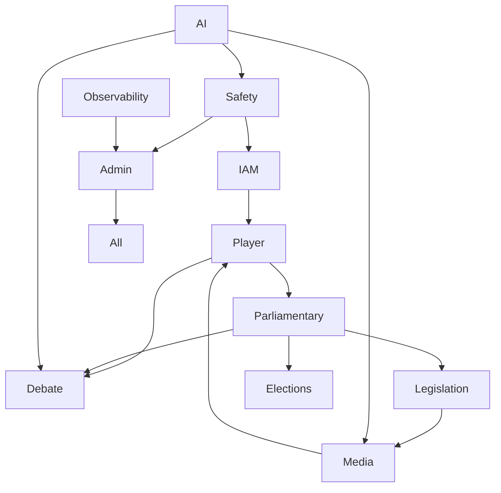

# Domain-Driven Design Map

> **Bounded contexts, ownership, and integration contracts for Political Sphere’s modular monolith**

<div align="center">

| Classification | Version | Last Updated |      Owner       | Review Cycle |  Status   |
| :------------: | :-----: | :----------: | :--------------: | :----------: | :-------: |
|  🔒 Internal   | `0.2.0` |  2025-10-30  | Platform Council |  Quarterly   | **Draft** |

</div>

---

## 🧭 Domain Overview

Political Sphere uses domain-driven design to preserve autonomy inside the modular monolith. Contexts align to user value streams and regulatory responsibilities. Each context owns its data, exposes clear APIs, and participates in the shared event bus (NATS).

| Context                        | Description                                               | Primary Personas               | Data Ownership                     | Integration Patterns                                   |
| ------------------------------ | --------------------------------------------------------- | ------------------------------ | ---------------------------------- | ------------------------------------------------------ |
| **Identity & Access (IAM)**    | Authentication, sessions, MFA, tenants, RBAC/ABAC         | Admin, DevOps                  | Users, credentials, session tokens | REST (admin), GraphQL auth directives, events: `iam.*` |
| **Player & Profiles**          | Player metadata, roles (MP, journalist), progression      | Player, Moderator              | PlayerProfile, achievements        | GraphQL, events: `player.*`                            |
| **Parliamentary Core**         | Commons & Lords schedules, motions, amendments, divisions | Player, Moderator, AI NPC      | Calendar, Motion, Division, Vote   | GraphQL, events: `parliament.*`, realtime              |
| **Legislation & Policy**       | Bill lifecycle, readings, regulatory outcomes             | Player, Educator               | Bill, CommitteeAssignment          | GraphQL, events: `legislation.*`                       |
| **Elections & Constituencies** | Constituency maps, party formation, election results      | Player, Moderator              | Constituency, Election, Candidate  | GraphQL, REST admin tools, events: `election.*`        |
| **Debate & Chambers**          | Debate rooms, speaking queue, Hansard transcript          | Player, Moderator              | Debate, Speech, Transcript         | Realtime events, GraphQL subscriptions                 |
| **Media & Narrative**          | Articles, leaks, sentiment feed                           | Player, AI NPC, Media partners | MediaItem, Sentiment               | GraphQL, REST webhooks, events: `media.*`              |
| **AI Simulation**              | NPC behaviours, moderation assist, automation             | AI Agents, Moderator           | AgentConfig, SimulationState       | REST (ops), internal gRPC/IPC (future), events: `ai.*` |
| **Safety & Moderation**        | Reports, case queue, appeals, evidence bundles            | Moderator, Admin               | Report, Action, TransparencyLog    | REST, GraphQL (restricted), events: `safety.*`         |
| **Economy & Rewards**          | XP, achievements, cosmetics (post-MVP)                    | Player                         | TokenLedger, Reward                | GraphQL (feature-gated), events: `economy.*`           |
| **Observability & Audit**      | Audit log, telemetry correlation, compliance traces       | Admin, DevOps, Compliance      | AuditEvent, TraceMeta              | Append-only store, REST exports                        |
| **Admin & Config**             | Feature flags, world config, taxonomy                     | Admin, DevOps                  | FeatureFlag, WorldConfig           | REST admin APIs, Git-backed config                     |

---

## 🔄 Context Relationships



**Interaction Notes**

- IAM acts as enforcing layer—no cross-context call without validated tenant/session.
- Domain events (`{context}.{event}.v1`) used for asynchronous propagation (e.g., `parliament.divisionRecorded.v1` triggers AI analysis and media briefings).
- Debate & Chambers rely on realtime bus but read authoritative state from Parliamentary Core.
- Safety context can lock or redact data across other contexts via governance-approved workflows.

---

## 🧱 Module Allocation (Nx Workspace)

```
apps/
  api-gateway            # GraphQL/REST entrypoint
  realtime-gateway       # WebSocket transport
  admin-console          # Moderator/Admin UI
  ai-simulation          # Agent orchestration services
  jobs-election          # Schedulers and async jobs

libs/
  domain/iam             # IAM aggregates, policies
  domain/player
  domain/parliament
  domain/legislation
  domain/elections
  domain/debate
  domain/media
  domain/safety
  services/ai            # AI orchestration helpers
  services/moderation
  infra/prisma           # ORM schema per context
  infra/events           # NATS adapters, event contracts
  instrumentation        # Telemetry utilities
  ui/design-system       # Accessible component library
```

Each `domain/*` library exposes:

- Aggregate roots and entity schema (Prisma models)
- Domain services and policies
- Event contracts and projections
- GraphQL resolvers or REST handlers

---

## ✅ Context Contract Checklist

- **Ownership:** Single team accountable for backlog, schema, and operational runbook.
- **APIs:** Every public contract documented (GraphQL schema, OpenAPI spec, realtime event catalog).
- **Data Access:** Other contexts interact via API or domain events—no cross-schema queries.
- **Testing:** Unit tests per aggregate, contract tests for API consumers, event replay tests.
- **Observability:** Context-specific dashboards with SLOs; correlation IDs propagate via events.
- **Compliance:** PII tagging, retention policy, lawful basis documented where relevant.

---

## 🗺️ Future Evolution

- **Service Extraction:** Candidate contexts for early extraction—AI Simulation (compute heavy), Safety & Moderation (sensitive data), Realtime Gateway (latency critical).
- **Shared Kernel Enhancements:** Gradually move `infra/*` libraries toward reusable packages with enforced versioning to prevent diamond dependencies.
- **Context Map Reviews:** Reassess boundaries quarterly or when roadmap introduces new domains (e.g., Lobbying/Ethics, Committee System).

Keep the DDD map current with ADRs and roadmap milestones so teams always know the seams that protect Political Sphere’s complexity.
