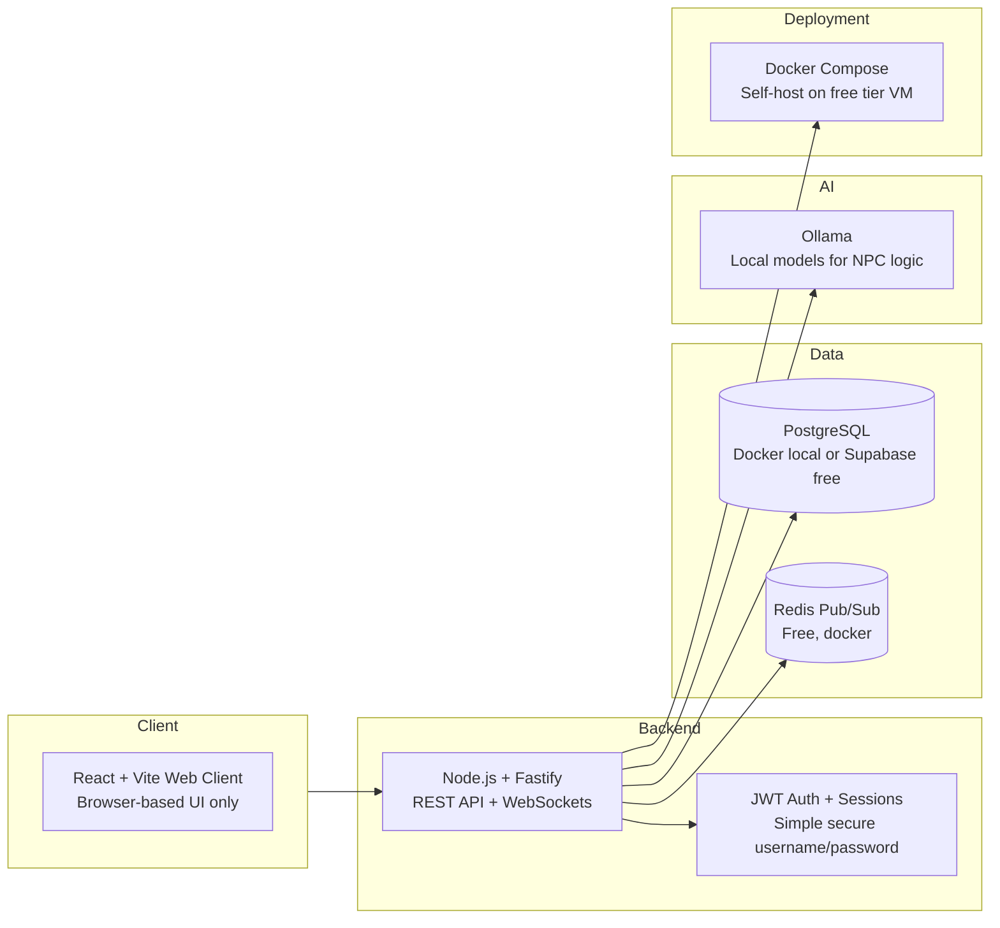

# System Overview

> **End-to-end view of Political Sphere’s platform topology, modules, and deployment pipeline**

| Classification | Version | Last Updated |      Owner       | Review Cycle |
| :------------: | :-----: | :----------: | :--------------: | :----------: |
|  🔒 Internal   | `0.2.0` |  2025-10-30  | Platform Council |   Quarterly  |

---

## 🎯 Purpose

Political Sphere is a persistent political simulation game that models parliamentary processes in a fair, rule-driven, self-contained fictional environment.

The platform is:

A private repo

Running on £0 budget

Built using fully free tooling

Developed iteratively and realistically

No cloud spend, no paid services, no premium infra.

## 🧱 Core Architecture

---

## 🎮 Gameplay System Modules

User & identity

Parliament chamber logic

Debates & speeches (turn-based queue system)

Voting system (divisions)

Parties & whips

Reputation & influence system

Moderation & sanctions

Player audit log & transparency

Keep mechanics server-authoritative.

---

## 🛠️ Technology Stack Snapshot

| Layer | Technologies | Key Policies |
| ----- | ------------ | ------------ |
| **Client** | Web app (React + Vite) | Browser-based UI only (no mobile app for now) |
| **Backend** | Node.js (v22) + Fastify | REST API only, clean endpoint design, modular routing, JSON schema validation (Zod) |
| **Realtime** | WebSockets (ws or socket.io free mode) | Debate events, vote broadcasts, player presence/status updates |
| **Auth** | Simple secure username/password + JWT sessions | No external auth provider |
| **Data** | PostgreSQL (Docker local or Supabase free tier if needed), Prisma OR Kysely | Row-Level Security for separate worlds, Postgres Full-Text Search |
| **Queues & Events** | Redis Pub/Sub (free, docker) | If event bus needed; otherwise keep it simple event handlers in code for now |
| **Storage** | Local filesystem storage during dev | Upgrade to MinIO free-local later only if needed |
| **AI** | Ollama | Local models only, small instruction-tuned models for NPC decision logic |
| **Deployment** | Self-host Docker Compose on free tier VM / NAS / home lab when ready | But not mandatory yet — local dev phase |

---

## 🛡️ Security & Compliance Basics

JWT auth + refresh tokens

Rate limiting per-IP + per-user

Input validation (Zod)

Audit logs on sensitive actions

Manual moderation queue (local DB dashboard)

## 📊 Observability (Free-Friendly)

Server logs → files / console

HTTP access logs

Performance timing middleware

Optional: Jaeger in Docker only if tracing needed

## 🔑 Architecture Principles

Zero-cost only

Local-first development

REST + WebSockets only

Stateless, simple services

Real-time events, deterministic state

Extract complexity later — not now

AI optional, local, constrained

Security + fairness always first

Simulation integrity > feature count

Build small → validate → expand

## 🚧 Early Dev Phase Milestones

Auth + player profiles

Basic parliament simulation

Debate room w/ speaking order queue

Vote casting + result broadcast

Party/whip mechanics (basic)

Moderation dashboard

Persistent world state & logs

Everything else comes after.

## ✨ Summary Chunk for AI Prompts

Political Sphere runs on a zero-budget architecture using REST, WebSockets, Node.js, local PostgreSQL, and local AI models. No paid services, no GraphQL, no cloud spend. Modular monolith, Docker-friendly, simple eventing, secure authentication, deterministic political simulation logic, and responsible AI usage.

---

Keep this system overview synchronized with ADRs, incident learnings, and major roadmap decisions to preserve architectural integrity as Political Sphere grows.
