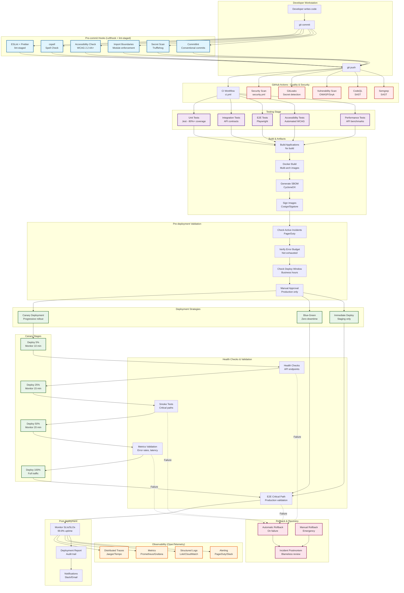

# Political Sphere CI/CD Pipeline - Comprehensive Diagram

| Classification | Version | Last Updated |       Owner        | Review Cycle |   Status   |
| :------------: | :-----: | :----------: | :----------------: | :----------: | :--------: |
|  🔒 Internal   | `0.1.0` |  2025-10-30  | DevOps Team        |  Quarterly   | **Approved** |

---

## Full CI/CD Flow Diagram

## Pipeline Stage Breakdown

### 🔹 Stage 1: Pre-commit Hooks (Local)
**Duration**: ~10-30 seconds  
**Tools**: Lefthook, lint-staged

| Check | Tool | Purpose |
|-------|------|---------|
| Linting & Formatting | ESLint + Prettier | Code quality & consistency |
| Spell Check | cspell | Prevent typos in code/docs |
| Accessibility | a11y-check.sh | WCAG 2.2 AA+ compliance |
| Import Boundaries | check-import-boundaries.js | Module isolation |
| Secret Scanning | Trufflehog | Prevent credential leaks |
| Commit Messages | commitlint | Conventional commits |

**Success Criteria**: All checks pass, files auto-fixed where possible

---

### 🔹 Stage 2: Quality & Security (CI - Parallel)
**Duration**: ~5-10 minutes  
**Workflows**: ci.yml, security.yml, gitleaks.yml, vulnerability-scan.yml, semgrep.yml, codeql.yml

| Check | Purpose | Failure Action |
|-------|---------|----------------|
| Linting | ESLint, Biome | Block merge |
| Type Check | TypeScript | Block merge |
| Import Boundaries | Nx enforce boundaries | Block merge |
| Secret Detection | GitLeaks | Block merge (Critical) |
| Dependency Scan | npm audit, Snyk, OWASP | Block if Critical/High |
| SAST | CodeQL, Semgrep | Block if Critical |
| Container Scan | Trivy | Block if Critical vulnerabilities |
| License Check | License compliance | Block if incompatible |

**Success Criteria**: No critical/high vulnerabilities, all quality checks pass

---

### 🔹 Stage 3: Testing (CI - Parallel)
**Duration**: ~10-15 minutes  
**Workflows**: ci.yml, integration.yml, e2e.yml

| Test Type | Tool | Coverage Target | Failure Action |
|-----------|------|-----------------|----------------|
| Unit Tests | Jest | 80%+ | Block merge |
| Integration Tests | Node.js test runner | API contracts pass | Block merge |
| E2E Tests | Playwright | Critical journeys pass | Block merge |
| Accessibility Tests | axe-core, pa11y | WCAG 2.2 AA+ | Block merge |
| Contract Tests | Pact | Service compatibility | Block merge |
| Performance Tests | Custom benchmarks | P95 < 500ms | Warn, don't block |

**Success Criteria**: All tests pass, coverage meets threshold

---

### 🔹 Stage 4: Build & Artifacts
**Duration**: ~5-10 minutes  
**Workflows**: ci.yml, deploy.yml

**Outputs**:
- 📦 Docker images (amd64 + arm64)
- 📦 SBOM (Software Bill of Materials - CycloneDX format)
- 📦 Test reports (JUnit XML, HTML)
- 📦 Coverage reports (LCOV, HTML)
- 📦 Accessibility audit (JSON)
- 📦 Signed artifacts (Cosign/Sigstore)

**Success Criteria**: Images built, scanned, signed, pushed to registry

---

### 🔹 Stage 5: Pre-deployment Validation
**Duration**: ~2-5 minutes  
**Workflow**: deploy-canary.yml

| Check | Purpose | Action if Failed |
|-------|---------|------------------|
| Active Incidents | PagerDuty check | Block deployment |
| Error Budget | SLO budget remaining | Block if exhausted |
| Deployment Window | Business hours check | Block off-hours (prod) |
| Manual Approval | Human gate (prod only) | Wait for approval |

**Success Criteria**: No blockers, approval granted (if required)

---

### 🔹 Stage 6: Canary Deployment (Progressive Rollout)
**Duration**: ~45-60 minutes  
**Workflow**: deploy-canary.yml

| Phase | Traffic % | Duration | Validation |
|-------|-----------|----------|------------|
| Initial | 5% | 10 min | Health checks + basic metrics |
| Expand | 25% | 15 min | Smoke tests + error rate |
| Majority | 50% | 20 min | Full metrics validation |
| Complete | 100% | - | E2E critical path tests |

**At each phase**:
1. Deploy to subset of pods/instances
2. Wait for stabilization period
3. Run health checks
4. Validate metrics (error rate, latency, saturation)
5. If validation fails → **Automatic rollback**
6. If validation passes → Proceed to next phase

**Success Criteria**: All phases complete, metrics within SLOs

---

### 🔹 Stage 7: Post-deployment Validation
**Duration**: ~10-15 minutes  
**Workflow**: deploy-canary.yml, e2e.yml

| Check | Purpose | Failure Action |
|-------|---------|----------------|
| Smoke Tests | Basic functionality | Rollback |
| Health Checks | Service availability | Rollback |
| E2E Critical Path | User journeys work | Rollback |
| Metrics Validation | Error rates, latency, throughput | Rollback if degraded |

**Success Criteria**: All services healthy, metrics within SLOs

---

### 🔹 Stage 8: Observability & Monitoring (Continuous)
**Duration**: Continuous  
**Workflow**: monitoring.yml

**OpenTelemetry Integration**:
- **Traces**: Distributed tracing (Jaeger/Tempo)
- **Metrics**: Prometheus → Grafana dashboards
- **Logs**: Structured JSON logs (Loki/CloudWatch)
- **Alerts**: PagerDuty, Slack notifications

**SLIs/SLOs**:
- Availability: 99.9%+ uptime
- Latency: P50 < 200ms, P95 < 500ms, P99 < 1s
- Error Rate: < 0.1%
- Saturation: CPU < 70%, Memory < 80%

**Success Criteria**: Metrics within SLOs, no critical alerts

---

### 🔹 Stage 9: Rollback (If Needed)
**Duration**: ~5-10 minutes  

**Automatic Rollback Triggers**:
- Health check failures
- Error rate > 1%
- Latency P95 > 2x baseline
- E2E test failures
- Manual trigger

**Rollback Process**:
1. Stop canary deployment
2. Route 100% traffic to previous version
3. Verify metrics recover
4. Create incident ticket
5. Notify team

**Post-rollback**:
- Conduct blameless postmortem
- Identify root cause
- Create action items
- Update runbooks

---

## Key Metrics & SLAs

| Metric | Target | Measurement |
|--------|--------|-------------|
| **Deployment Frequency** | Multiple per day (staging) | GitHub Actions runs |
| **Lead Time** | < 30 min (commit to staging) | Git commit → deployed |
| **Change Failure Rate** | < 5% | Rollbacks / Total deployments |
| **MTTR** | < 1 hour | Incident detection → resolution |
| **Test Coverage** | 80%+ | Jest coverage reports |
| **Build Time** | < 15 min | CI workflow duration |
| **Deployment Time** | < 60 min (canary) | Deploy workflow duration |

---

## Failure Handling & Escalation

### Critical Issues (Immediate Block)
- Security vulnerabilities (Critical/High severity)
- Failed accessibility tests
- Secret leaks detected
- Critical test failures
- Build failures

**Action**: Block merge/deployment, alert team, require fix

### High Issues (Block within 7 days)
- High-severity vulnerabilities
- Moderate test failures
- Performance degradation

**Action**: Create ticket, schedule fix, monitor

### Medium/Low Issues (Track & Plan)
- Medium/Low vulnerabilities
- Non-critical warnings
- Tech debt items

**Action**: Add to backlog, prioritize in sprint planning

---

## Compliance & Audit Trail

All deployments tracked with:
- ✅ Deployment ID (unique identifier)
- ✅ Git SHA (source code version)
- ✅ Artifact hashes (SBOM, container images)
- ✅ Approval records (who approved, when)
- ✅ Test results (pass/fail, coverage)
- ✅ Security scan results (vulnerabilities found/fixed)
- ✅ Deployment timeline (start, phases, completion)
- ✅ Metrics snapshots (before/after comparison)

**Retention**: 90 days for staging, 1 year for production

---

## Related Documentation

- [CI/CD Architecture](./ci-cd-architecture.md)
- [Deployment Runbook](../09-observability-and-ops/deployment-runbook.md)
- [Canary Deployment Strategy ADR](../04-architecture/decisions/006-canary-deployment-strategy.md)
- [Security Scanning Guide](../06-security-and-risk/security-scanning.md)
- [Incident Response Plan](../../INCIDENT-RESPONSE-PLAN.md)
- [Disaster Recovery Runbook](../../DISASTER-RECOVERY-RUNBOOK.md)

---

## Emergency Contacts

- **DevOps On-call**: PagerDuty escalation
- **Security Team**: security@politicalsphere.com
- **Platform Lead**: platform-lead@politicalsphere.com

---

**Document Control**  
**Version**: 1.0  
**Classification**: Internal  
**Review Date**: 2026-01-29
