# CI/CD Architecture and Flow

> **Owner:** Platform Engineering Team  
> **Last Updated:** 2025-11-05  
> **Status:** Living Document

## Table of Contents

- [Overview](#overview)
- [High-Level Architecture](#high-level-architecture)
- [Workflow Execution Flow](#workflow-execution-flow)
- [Security Scanning Pipeline](#security-scanning-pipeline)
- [Deployment Pipeline](#deployment-pipeline)
- [Developer Workflow](#developer-workflow)
- [Component Descriptions](#component-descriptions)

---

## Overview

This document describes the architecture and data flow of the Political Sphere CI/CD pipeline. Our pipeline is designed for:

- **Security**: Multi-layer scanning and OIDC authentication
- **Speed**: Parallel execution and intelligent caching
- **Reliability**: Error budgets and chaos testing
- **Developer Experience**: Fast feedback and clear error messages

---

## High-Level Architecture

---

## Workflow Execution Flow

```mermaid
sequenceDiagram
    participant Dev as Developer
    participant Hooks as Lefthook
    participant GH as GitHub
    participant CI as GitHub Actions
    participant Sec as Security Scanners
    participant AWS as AWS (OIDC)

    Dev->>Hooks: git commit
    activate Hooks
    Hooks->>Hooks: lint-staged
    Hooks->>Hooks: cspell
    Hooks->>Hooks: a11y check
    Hooks-->>Dev: ✅ Pre-commit passed
    deactivate Hooks

    Dev->>GH: git push
    activate GH
    GH->>CI: Trigger PR workflow
    deactivate GH

    activate CI
    CI->>CI: Pre-flight validation

    par Parallel Execution
        CI->>CI: Lint & Type Check
    and
        CI->>CI: Test Suite (Sharded 1/3)
        CI->>CI: Test Suite (Sharded 2/3)
        CI->>CI: Test Suite (Sharded 3/3)
    and
        CI->>Sec: TruffleHog
        CI->>Sec: Semgrep
        CI->>Sec: npm audit
        CI->>Sec: Snyk
    end

    Sec-->>CI: Security Results
    CI-->>GH: Status Checks
    deactivate CI

    Dev->>GH: Merge PR
    activate GH
    GH->>CI: Trigger Deploy
    deactivate GH

    activate CI
    CI->>CI: Build Artifacts
    CI->>CI: Build Docker Images
    CI->>Sec: Trivy scan images
    Sec-->>CI: Image scan results

    CI->>AWS: Authenticate (OIDC)
    AWS-->>CI: Temporary credentials

    CI->>AWS: Deploy to Staging (Canary)
    CI->>CI: Run smoke tests
    CI->>AWS: Deploy to Production

    CI-->>Dev: Deployment complete
    deactivate CI
```

---

## Security Scanning Pipeline

---

## Deployment Pipeline

---

## Developer Workflow

```mermaid
stateDiagram-v2
    [*] --> LocalDevelopment

    LocalDevelopment --> PreCommitHooks: git commit
    PreCommitHooks --> CommitCreated: ✅ Passed
    PreCommitHooks --> LocalDevelopment: ❌ Failed - Fix Issues

    CommitCreated --> PrePushHooks: git push
    PrePushHooks --> PushedToGitHub: ✅ Passed
    PrePushHooks --> LocalDevelopment: ❌ Failed - Fix Issues

    PushedToGitHub --> CIRunning: PR Created/Updated

    state CIRunning {
        [*] --> PreFlight
        PreFlight --> ParallelChecks

        state ParallelChecks {
            [*] --> Lint
            [*] --> Tests
            [*] --> Security

            Lint --> [*]
            Tests --> [*]
            Security --> [*]
        }

        ParallelChecks --> BuildArtifacts
    }

    CIRunning --> CodeReview: ✅ All Checks Passed
    CIRunning --> LocalDevelopment: ❌ Checks Failed

    CodeReview --> ReadyToMerge: ✅ Approved
    CodeReview --> LocalDevelopment: 🔄 Changes Requested

    ReadyToMerge --> Merged
    Merged --> DeployPipeline

    state DeployPipeline {
        [*] --> BuildStage
        BuildStage --> StagingDeploy
        StagingDeploy --> SmokeTests
        SmokeTests --> ProductionDeploy: ✅ Healthy
        SmokeTests --> Rollback: ❌ Unhealthy
        ProductionDeploy --> [*]
        Rollback --> Alert
    }

    DeployPipeline --> [*]: Deployed
```

---

## Component Descriptions

### Pre-commit Hooks (Lefthook)

**Purpose**: Fast, local quality gates before code reaches CI

**Checks**:

- ESLint, Prettier, Biome (linting & formatting)
- cspell (spelling)
- Accessibility validation (for UI changes)
- Import boundary enforcement
- Secret scanning (TruffleHog)

**Performance**: ~15-30 seconds

**Skip Options**: `SKIP_A11Y=1`, `LEFTHOOK=0`

---

### Pre-flight Checks

**Purpose**: Fast validation to fail early

**Checks**:

- Workflow YAML syntax validation
- Secret scanning (TruffleHog with `--only-verified`)
- Basic repository structure validation

**Performance**: ~2 minutes

**Exit Strategy**: Fail entire workflow if pre-flight fails

---

### Lint & Type Check

**Purpose**: Code quality and type safety

**Tools**:

- ESLint (code linting)
- TypeScript compiler (type checking)
- Import boundary validation (Nx)

**Performance**: ~3 minutes

**Artifacts**: Lint reports, type check logs

---

### Test Suite (Sharded)

**Purpose**: Comprehensive test coverage with fast execution

**Strategy**:

- 3-way sharding for parallel execution
- Coverage collection per shard
- Coverage merge in final step

**Performance**: ~5 minutes per shard (parallel)

**Artifacts**: Coverage reports, test results

---

### Security Scanning

**Purpose**: Multi-layer vulnerability detection

**Tools** (see [ADR-005](../adr/005-multi-layer-security-scanning.md)):

- **TruffleHog**: Secret detection
- **Semgrep**: Static analysis (SAST)
- **npm audit**: Known vulnerabilities
- **Snyk**: Advanced dependency scanning
- **OWASP Dependency Check**: CVE database (weekly)
- **Trivy**: Container image scanning

**Performance**: ~8 minutes total

**Artifacts**: SARIF files uploaded to GitHub Security tab

---

### Build & Deploy

**Authentication**: OIDC (no long-lived credentials)

**Strategy**:

- Canary deployment (10% traffic to staging)
- Smoke tests validation
- Blue/green production deployment
- Automatic rollback on failure

**Performance**: ~15 minutes total

**Artifacts**: Signed container images in ECR

---

## Data Flow Diagram

---

## Error Budget Flow

```mermaid
graph TD
    START[CI Run Starts] --> EXECUTE[Execute Workflow]
    EXECUTE --> RESULT{Success?}

    RESULT -->|Yes| CREDIT[Restore Error Budget]
    RESULT -->|No| DEBIT[Consume Error Budget]

    DEBIT --> CHECK{Budget Remaining?}

    CHECK -->|> 75%| NORMAL[Normal Operation]
    CHECK -->|50-75%| CAUTION[⚠️  Caution Mode]
    CHECK -->|25-50%| WARNING[🟠 Warning Mode]
    CHECK -->|< 25%| EMERGENCY[🔴 Emergency Mode]

    EMERGENCY --> FREEZE[Feature Freeze]
    WARNING --> RESTRICT[Restrict Changes]
    CAUTION --> REVIEW[Review Failures]
    NORMAL --> CONTINUE[Continue Development]

    CREDIT --> MONITOR[Update Metrics]

    style EMERGENCY fill:#ff6b6b
    style WARNING fill:#ffa500
    style CAUTION fill:#ffeb3b
    style NORMAL fill:#90EE90
```

---

## Performance Targets

| Stage              | Target (P50) | Target (P95) | Current |
| ------------------ | ------------ | ------------ | ------- |
| **Pre-commit**     | < 20s        | < 30s        | ~25s    |
| **Pre-push**       | < 1m         | < 2m         | ~90s    |
| **Pre-flight**     | < 1m         | < 2m         | ~1.5m   |
| **Lint & Type**    | < 2m         | < 3m         | ~2.5m   |
| **Tests (shard)**  | < 3m         | < 5m         | ~4m     |
| **Security Scans** | < 5m         | < 8m         | ~6m     |
| **Total CI**       | < 5m         | < 10m        | ~8m     |
| **Deploy**         | < 10m        | < 15m        | ~12m    |

---

## Related Documentation

- [SLO and SLI Definitions](../../.github/SLO.md)
- [ADR-001: GitHub Actions Platform](../adr/001-github-actions-as-ci-platform.md)
- [ADR-004: Lefthook](../adr/004-lefthook-for-git-hooks.md)
- [ADR-005: Security Scanning](../adr/005-multi-layer-security-scanning.md)
- [Threat Model](../security/cicd-threat-model.md)
- [Chaos Testing](../../.github/workflows/chaos-testing.yml)

---

**Document Control**:

- Version: 1.0.0
- Last Updated: 2025-11-05
- Next Review: 2026-02-05
