# Canonical File Structure

**Version:** 2.4.0
**Last Updated:** 2025-11-10
**Status:** Authoritative
**Purpose:** Defines the canonical repository structure for Political Sphere monorepo

---

## Quick Start & Visual Overview

> **This document is the single source of truth for all file placement and structure decisions.**
>
> **Never place code or documentation in the repository root except for standard project files.**
>
> **All new directories must include a README.md and be referenced in `/docs/TODO.md`.**

### Visual Structure (Mermaid)

```mermaid
flowchart TD
    Root((political-sphere/))
    Root --> Apps["apps/ (Applications)"]
    Root --> Libs["libs/ (Libraries)"]
    Root --> Docs["docs/ (Documentation)"]
    Root --> Tools["tools/ (Build Tools)"]
    Root --> Scripts["scripts/ (Automation)"]
    Root --> Config["config/ (Shared Config)"]
    Root --> Reports["reports/ (Audit/Results)"]
    Root --> Assets["assets/ (Static)"]
    Root --> E2E["e2e/ (End-to-End Tests)"]
    Root --> Infrastructure["apps/infrastructure/ (IaC)"]
    Root --> StandardFiles["README.md, package.json, ..."]
    Apps --> Api["api/"]
    Apps --> Web["web/"]
    Apps --> GameServer["game-server/"]
    Apps --> Worker["worker/"]
    Apps --> Shell["shell/"]
    Apps --> FeatureAuth["feature-auth-remote/"]
    Apps --> FeatureDashboard["feature-dashboard-remote/"]
    Apps --> DocsSite["docs-site/"]
    Apps --> LoadTest["load-test/"]
    Libs --> Shared["shared/"]
    Libs --> Platform["platform/"]
    Libs --> UI["ui/"]
    Libs --> GameEngine["game-engine/"]
    Libs --> DomainElection["domain-election/"]
    Libs --> DomainGovernance["domain-governance/"]
    Libs --> DomainLegislation["domain-legislation/"]
    Libs --> DataUser["data-user/"]
    Libs --> DataGameState["data-game-state/"]
    Libs --> FeatureFlags["feature-flags/"]
    Libs --> I18n["i18n/"]
    Libs --> Observability["observability/"]
    Libs --> Testing["testing/"]
```



---

## Table of Contents

- [Quick Start & Visual Overview](#quick-start--visual-overview)
- [Overview](#overview)
- [Design Principles](#design-principles)
- [Key Conventions](#key-conventions)
- [Root Directory Structure](#root-directory-structure)
- [Applications](#applications)
- [Libraries](#libraries)
- [Documentation](#documentation)
- [Tools](#tools)
- [Scripts](#scripts)
- [Configuration](#configuration)
- [Infrastructure](#infrastructure)
- [Reports](#reports)
- [Implementation Plan](#implementation-plan)
- [Maintenance Checklist](#maintenance-checklist)
- [Standards Compliance](#standards-compliance)
- [Version History](#version-history)
- [References](#references)
- [Quick Reference](#quick-reference)

---

## Executive Summary

This document defines the canonical file structure for Political Sphere, a democratic simulation platform built as an Nx monorepo. Key characteristics:

- **Architecture**: Domain-driven design with business capability organization
- **Technology**: Node.js/TypeScript with React, Express, and PostgreSQL
- **Standards**: 12-Factor App, WCAG 2.2 AA, OWASP ASVS compliance
- **Infrastructure**: Docker + Kubernetes with GitOps deployment
- **Governance**: Constitutional framework ensuring democratic integrity

**Target Audience**: Senior developers, architects, and DevOps engineers
**Status**: Authoritative - Single source of truth for all structural decisions

---

## Overview

This document defines the complete, authoritative file structure for the Political Sphere monorepo. It follows industry best practices from Nx, Turborepo, and Microsoft Learn documentation for Node.js + React + API monorepos.

**Latest Updates (v2.4.0):**

- Added Mermaid diagram for visual orientation
- Promoted actionable checklists and maintenance guidance
- Clarified migration status for "TO BE MOVED" directories
- Added explicit cross-references to standards and project docs
- Improved onboarding and navigation for new contributors

...existing code...

### Key Conventions

- **Naming**: `kebab-case` for files/directories, `PascalCase` for classes/components, `camelCase` for functions/variables
- **Depth Limit**: Maximum 4-5 directory levels to avoid deep nesting
- **Single Responsibility**: Each file and directory has one clear purpose
- **Documentation**: Every significant directory includes a README.md
- **Bounded Contexts**: Libraries map to Domain-Driven Design bounded contexts
- **API-First**: OpenAPI specifications define contract-first API development
- **Stateless Processes**: Applications designed as stateless (Twelve-Factor VI. Processes)

---

## Root Directory Structure

```
political-sphere/
├── .github/                    # GitHub configuration (GitHub Actions workflows, issue/PR templates, code owners)
│   ├── workflows/              # CI/CD workflows (YAML files, no subdirectories supported)
│   │   ├── build-and-test.yml  # Main CI workflow (runs on all PRs)
│   │   ├── deploy-staging.yml  # Staging deployment
│   │   ├── deploy-production.yml # Production deployment
│   │   ├── security-scan.yml   # Security scans (Snyk, SAST)
│   │   ├── release.yml         # Release automation
│   │   ├── reusable-build.yml  # Reusable workflow (workflow_call trigger)
│   │   ├── reusable-test.yml   # Reusable test workflow
│   │   └── reusable-deploy.yml # Reusable deployment workflow
│   │                           # **GitHub Actions Best Practices:**
│   │                           # - All workflows directly in .github/workflows/ (no subdirectories)
│   │                           # - Reusable workflows use 'on: workflow_call:' trigger
│   │                           # - Path filters for monorepo: on.push.paths, on.pull_request.paths
│   │                           # - Nx affected integration: npx nx affected:test --base=origin/main
│   │                           # - Caching: actions/cache for node_modules, Nx cache, build outputs
│   │                           # - Matrix strategy for parallel builds across affected apps
│   │                           # - Reference reusable workflows: uses: ./.github/workflows/reusable-build.yml
│   │                           # - Pass inputs with 'with:', secrets with 'secrets:' or 'secrets: inherit'
│   │                           # - Pin actions to SHA for security: uses: actions/checkout@8f4b7f84864484a7bf31766abe9204da3cbe65b3
│   │                           # - Max nesting: 10 levels for reusable workflows
│   ├── actions/                # Composite actions (local reusable actions)
│   │   ├── setup-node-cache/   # Composite action for Node.js setup with caching
│   │   │   └── action.yml      # Action metadata (required: inputs, outputs, runs)
│   │   ├── nx-affected/        # Composite action for Nx affected detection
│   │   │   └── action.yml
│   │   └── deploy-to-k8s/      # Composite action for Kubernetes deployment
│   │       └── action.yml
│   │                           # **Composite Actions Best Practices:**
│   │                           # - action.yml or action.yaml (preferred: action.yml)
│   │                           # - Combine multiple workflow steps into reusable units
│   │                           # - Define inputs, outputs, and runs configuration
│   │                           # - Use for cross-workflow patterns (setup, deployment, validation)
│   ├── ISSUE_TEMPLATE/         # Issue templates
│   │   ├── bug_report.md
│   │   ├── feature_request.md
│   │   └── config.yml
│   ├── PULL_REQUEST_TEMPLATE.md # PR template
│   ├── dependabot.yml          # Dependency update automation
│   ├── CODEOWNERS              # Code ownership rules
│   └── copilot-instructions.md # AI assistant rules
│
├── .vscode/                    # VS Code workspace settings
│   ├── extensions.json         # Recommended extensions
│   ├── settings.json           # Workspace settings
│   ├── tasks.json              # Build/test tasks
│   └── launch.json             # Debug configurations
│
├── .devcontainer/              # Development container configuration
│   ├── devcontainer.json       # Container definition (VS Code Dev Containers)
│   ├── docker-compose.yml      # Multi-container development setup
│   ├── Dockerfile              # Custom dev container image
│   ├── .dockerignore           # Docker build ignore patterns
│   └── secrets/                # Development secrets (gitignored except .example)
│       ├── README.md           # Secret management instructions
│       └── *.example           # Example secret files (actual secrets gitignored)
│
├── apps/                       # 🚀 Applications (see detailed structure below)
├── libs/                       # 📦 Shared libraries (see detailed structure below)
├── docs/                       # 📚 Documentation (see detailed structure below)
├── tools/                      # 🔧 Build tools and utilities (see detailed structure below)
├── scripts/                    # ⚙️  Automation scripts (see detailed structure below)
├── config/                     # ⚙️  Shared configuration files
├── infrastructure/             # 🏗️  Infrastructure as Code (root-level, to be moved)
├── reports/                    # 📊 Generated reports and audit results
├── .temp/                      # Temporary files (gitignored)
├── node_modules/               # Dependencies (gitignored)
├── coverage/                   # Test coverage reports (gitignored)
├── dist/                       # Build outputs (gitignored)
│
├── package.json                # Root package configuration
├── package-lock.json           # Dependency lock file
├── nx.json                     # Nx workspace configuration
├── tsconfig.json               # TypeScript base configuration
├── vitest.config.js            # Vitest test runner configuration
├── biome.json                  # Biome linter/formatter configuration
├── .gitignore                  # Git ignore patterns
├── .editorconfig               # Editor configuration
├── .lefthook.yml               # Git hooks configuration
├── .npmrc                      # NPM configuration
├── .nvmrc                      # Node version specification
├── .yamllint                   # YAML linting rules
├── .owasp-suppressions.xml     # OWASP dependency check suppressions
│
├── README.md                   # Project overview and quick start
├── CHANGELOG.md                # Version history and changes
├── CONTRIBUTING.md             # Contribution guidelines
├── LICENSE                     # License information (all rights reserved)
├── CODE_OF_CONDUCT.md          # Community guidelines
└── SECURITY.md                 # Security policy and reporting
```

---

## Applications (`/apps`)

Applications are deployable units - services, web apps, tools, and infrastructure.

```
apps/
├── README.md                         # Apps directory overview
│
├── **api/**                              # 🌐 REST API Backend Service
│   ├── **src/**
│   │   ├── **server.ts**                 # Main server entry point
│   │   ├── **app.ts**                    # Express app configuration
│   │   ├── config/                   # Configuration management
│   │   │   ├── index.ts
│   │   │   ├── database.config.ts
│   │   │   ├── auth.config.ts
│   │   │   └── cors.config.ts
│   │   ├── controllers/              # HTTP request handlers
│   │   │   ├── auth.controller.ts
│   │   │   ├── users.controller.ts
│   │   │   ├── parties.controller.ts
│   │   │   └── votes.controller.ts
│   │   ├── **middleware/**               # Express middleware
│   │   │   ├── auth.middleware.ts
│   │   │   ├── error.middleware.ts
│   │   │   ├── logging.middleware.ts
│   │   │   └── validation.middleware.ts
│   │   ├── **routes/**                   # Route definitions
│   │   │   ├── index.ts
│   │   │   ├── auth.routes.ts
│   │   │   ├── users.routes.ts
│   │   │   ├── parties.routes.ts
│   │   │   └── votes.routes.ts
│   │   ├── services/                 # Business logic
│   │   │   ├── auth.service.ts
│   │   │   ├── user.service.ts
│   │   │   ├── party.service.ts
│   │   │   └── vote.service.ts
│   │   ├── repositories/             # Data access layer
│   │   │   ├── user.repository.ts
│   │   │   ├── party.repository.ts
│   │   │   └── vote.repository.ts
│   │   ├── validators/               # Request validation schemas
│   │   │   ├── auth.validator.ts
│   │   │   ├── user.validator.ts
│   │   │   └── vote.validator.ts
│   │   ├── utils/                    # Utility functions
│   │   │   ├── logger.ts
│   │   │   ├── crypto.ts
│   │   │   └── jwt.ts
│   │   └── types/                    # TypeScript type definitions
│   │       ├── express.d.ts
│   │       ├── auth.types.ts
│   │       └── api.types.ts
│   ├── openapi/                      # OpenAPI specifications
│   │   ├── api.yaml                  # Main API spec
│   │   ├── schemas/                  # Reusable schemas
│   │   ├── generated/                # Generated types/docs
│   │   ├── openapi-generator-config.json
│   │   └── README.md
│   ├── prisma/                       # Prisma ORM
│   │   ├── schema.prisma             # Database schema
│   │   ├── migrations/               # Database migrations
│   │   └── seed.ts                   # Seed data
│   ├── tests/
│   │   ├── unit/                     # Unit tests
│   │   ├── integration/              # Integration tests
│   │   └── fixtures/                 # Test data
│   ├── .env.example                  # Environment variable template
│   ├── Dockerfile                    # Container definition
│   │                                 # **Docker Best Practices:**
│   │                                 # - Multi-stage build (builder → production)
│   │                                 # - Stage 1: FROM node:20-lts AS builder
│   │                                 # -   WORKDIR /app, COPY package*.json, npm ci
│   │                                 # - Stage 2: FROM node:20-lts-alpine AS production
│   │                                 # -   USER node, COPY --from=builder --chown=node:node
│   │                                 # - Include HEALTHCHECK (curl localhost:3000/health)
│   │                                 # - Pin base image with digest (@sha256:...)
│   ├── .dockerignore                 # Exclude from build context
│   │                                 # node_modules, .git, .env*, dist, coverage
│   │                                 # *.log, *.md, .vscode, .idea, tests
│   ├── project.json                  # Nx project configuration
│   ├── tsconfig.json                 # TypeScript configuration
│   ├── tsconfig.app.json             # App-specific TS config
│   ├── tsconfig.spec.json            # Test TS config
│   └── README.md                     # API documentation
│
├── web/                              # 🖥️  Main Web Application (React + Vite)
│   ├── public/                       # Static assets
│   │   ├── favicon.ico
│   │   ├── robots.txt
│   │   └── manifest.json
│   ├── src/
│   │   ├── main.tsx                  # Application entry point
│   │   ├── App.tsx                   # Root component
│   │   ├── app/                      # App-level components
│   │   │   ├── App.tsx
│   │   │   ├── AppProviders.tsx
│   │   │   └── AppRoutes.tsx
│   │   ├── pages/                    # Page components
│   │   │   ├── Home/
│   │   │   │   ├── Home.tsx
│   │   │   │   ├── Home.test.tsx
│   │   │   │   └── Home.module.css
│   │   │   ├── Dashboard/
│   │   │   ├── Elections/
│   │   │   ├── Parties/
│   │   │   └── Profile/
│   │   ├── components/               # Reusable components
│   │   │   ├── common/               # Common UI components
│   │   │   ├── layout/               # Layout components
│   │   │   └── features/             # Feature-specific components
│   │   ├── hooks/                    # Custom React hooks
│   │   │   ├── useAuth.ts
│   │   │   ├── useApi.ts
│   │   │   └── useLocalStorage.ts
│   │   ├── services/                 # API client services
│   │   │   ├── api.service.ts
│   │   │   ├── auth.service.ts
│   │   │   └── websocket.service.ts
│   │   ├── store/                    # State management (Zustand/Redux)
│   │   │   ├── index.ts
│   │   │   ├── auth.store.ts
│   │   │   └── ui.store.ts
│   │   ├── router/                   # React Router configuration
│   │   │   ├── index.tsx
│   │   │   ├── routes.tsx
│   │   │   └── guards.tsx
│   │   ├── styles/                   # Global styles
│   │   │   ├── global.css
│   │   │   ├── variables.css
│   │   │   └── reset.css
│   │   ├── utils/                    # Utility functions
│   │   │   ├── format.ts
│   │   │   ├── validation.ts
│   │   │   └── constants.ts
│   │   ├── types/                    # TypeScript types
│   │   │   ├── api.types.ts
│   │   │   └── ui.types.ts
│   │   └── assets/                   # Images, fonts, etc.
│   │       ├── images/
│   │       ├── fonts/
│   │       └── icons/
│   ├── tests/
│   │   ├── unit/
│   │   ├── integration/
│   │   └── e2e/
│   ├── .env.example                  # Environment variables template
│   ├── index.html                    # HTML entry point
│   ├── vite.config.ts                # Vite configuration
│   ├── Dockerfile                    # Container definition
│   │                                 # **Docker Best Practices:**
│   │                                 # - Multi-stage build (build → production)
│   │                                 # - Stage 1: FROM node:20-lts AS builder
│   │                                 # -   RUN npm run build (generates /dist)
│   │                                 # - Stage 2: FROM nginx:alpine AS production
│   │                                 # -   COPY --from=builder /app/dist /usr/share/nginx/html
│   │                                 # -   COPY nginx.conf /etc/nginx/nginx.conf
│   │                                 # - No root user needed (nginx runs as nginx user)
│   │                                 # - HEALTHCHECK curl localhost:80/index.html
│   ├── .dockerignore                 # Exclude from build context
│   │                                 # node_modules, .git, .env*, src, public
│   │                                 # *.log, *.md, .vscode, tests, coverage
│   ├── project.json                  # Nx configuration
│   ├── tsconfig.json                 # TypeScript configuration
│   ├── tsconfig.app.json
│   ├── tsconfig.spec.json
│   └── README.md                     # Web app documentation
│
├── game-server/                      # 🎮 Game Simulation Server (WebSocket)
│   ├── src/
│   │   ├── server.ts                 # WebSocket server entry
│   │   ├── engine/                   # Game engine core
│   │   │   ├── GameEngine.ts
│   │   │   ├── SimulationLoop.ts
│   │   │   └── StateManager.ts
│   │   ├── simulation/               # Simulation logic
│   │   │   ├── ElectionSimulator.ts
│   │   │   ├── PolicyEngine.ts
│   │   │   └── EconomyModel.ts
│   │   ├── events/                   # Event system
│   │   │   ├── EventEmitter.ts
│   │   │   ├── EventHandlers.ts
│   │   │   └── EventTypes.ts
│   │   ├── networking/               # WebSocket handling
│   │   │   ├── SocketServer.ts
│   │   │   ├── MessageHandler.ts
│   │   │   └── ConnectionManager.ts
│   │   ├── ai/                       # AI systems
│   │   │   ├── AIAgent.ts
│   │   │   ├── DecisionTree.ts
│   │   │   └── NeutralityMonitor.ts
│   │   └── utils/
│   ├── tests/
│   │   ├── unit/
│   │   └── integration/
│   ├── Dockerfile                    # Container definition
│   │                                 # **Docker Best Practices:**
│   │                                 # - Multi-stage build (builder → production)
│   │                                 # - Stage 1: FROM node:20-lts AS builder (build game engine)
│   │                                 # - Stage 2: FROM node:20-lts-alpine AS production
│   │                                 # - USER node (run as non-root)
│   │                                 # - HEALTHCHECK with WebSocket connection test
│   │                                 # - Minimal dependencies (production-only node_modules)
│   ├── .dockerignore                 # node_modules, .git, tests, *.log, *.md
│   ├── project.json
│   ├── tsconfig.json
│   └── README.md
│
├── worker/                           # ⚙️  Background Job Worker
│   ├── src/
│   │   ├── index.ts                  # Worker entry point
│   │   ├── jobs/                     # Job definitions
│   │   │   ├── EmailJob.ts
│   │   │   ├── DataProcessingJob.ts
│   │   │   └── ReportGenerationJob.ts
│   │   ├── queues/                   # Queue management (Bull/BullMQ)
│   │   │   ├── QueueManager.ts
│   │   │   ├── EmailQueue.ts
│   │   │   └── ProcessingQueue.ts
│   │   └── utils/
│   ├── tests/
│   ├── Dockerfile                    # Container definition
│   │                                 # **Docker Best Practices:**
│   │                                 # - Multi-stage build (builder → production)
│   │                                 # - Stage 1: FROM node:20-lts AS builder
│   │                                 # - Stage 2: FROM node:20-lts-alpine AS production
│   │                                 # - USER node (run as non-root)
│   │                                 # - HEALTHCHECK check Redis connectivity
│   │                                 # - Minimal dependencies (production-only)
│   ├── .dockerignore                 # node_modules, .git, tests, *.log
│   ├── project.json
│   ├── tsconfig.json
│   └── README.md
│
├── shell/                            # 🏠 Module Federation Shell (Host)
│   ├── src/
│   │   ├── main.tsx
│   │   ├── bootstrap.tsx             # Lazy bootstrap for module federation
│   │   ├── App.tsx
│   │   ├── components/
│   │   │   └── RemoteErrorBoundary.tsx
│   │   └── remotes/                  # Remote module configurations
│   │       ├── auth-remote.ts
│   │       └── dashboard-remote.ts
│   ├── module-federation.config.ts   # Module federation configuration
│   ├── Dockerfile
│   ├── project.json
│   ├── tsconfig.json
│   └── README.md
│
├── feature-auth-remote/              # 🔐 Auth Module (Remote)
│   ├── src/
│   │   ├── index.ts                  # Remote entry point
│   │   ├── components/
│   │   │   ├── Login.tsx
│   │   │   ├── Register.tsx
│   │   │   └── PasswordReset.tsx
│   │   └── services/
│   ├── module-federation.config.ts
│   ├── project.json
│   ├── tsconfig.json
│   └── README.md
│
├── feature-dashboard-remote/         # 📊 Dashboard Module (Remote)
│   ├── src/
│   │   ├── index.ts
│   │   ├── components/
│   │   │   ├── DashboardHome.tsx
│   │   │   ├── Statistics.tsx
│   │   │   └── ActivityFeed.tsx
│   │   └── services/
│   ├── module-federation.config.ts
│   ├── project.json
│   ├── tsconfig.json
│   └── README.md
│
├── e2e/                              # 🧪 End-to-End Tests (Playwright)
│   ├── src/
│   │   ├── api/                      # API E2E tests
│   │   ├── web/                      # Web UI E2E tests
│   │   └── smoke/                    # Smoke tests
│   ├── fixtures/                     # Test fixtures
│   ├── playwright.config.ts
│   ├── project.json
│   └── README.md
│
├── load-test/                        # 📈 Performance & Load Testing (k6/Artillery)
│   ├── src/
│   │   ├── scenarios/
│   │   │   ├── api-load.js
│   │   │   ├── websocket-stress.js
│   │   │   └── user-journey.js
│   │   └── utils/
│   ├── project.json
│   └── README.md
│
├── infrastructure/                   # 🏗️ Infrastructure as Code & CI/CD Automation
│   ├── docker/                       # Docker configurations
│   │   ├── base-images/              # Custom base images
│   │   │   ├── node-alpine/
│   │   │   │   └── Dockerfile        # FROM node:20-lts-alpine with security hardening
│   │   │   ├── nginx-alpine/
│   │   │   │   └── Dockerfile
│   │   │   └── python-slim/
│   │   │       └── Dockerfile
│   │   ├── .dockerignore             # Global Docker ignore patterns
│   │   └── docker-compose.yml        # Local development multi-container setup
│   ├── kubernetes/                   # Kubernetes manifests
│   │   ├── base/                     # Base Kustomize manifests
│   │   │   ├── namespace.yaml
│   │   │   ├── deployments/
│   │   │   │   ├── api-deployment.yaml
│   │   │   │   ├── web-deployment.yaml
│   │   │   │   ├── game-server-deployment.yaml
│   │   │   │   └── worker-deployment.yaml
│   │   │   ├── services/
│   │   │   │   ├── api-service.yaml
│   │   │   │   ├── web-service.yaml
│   │   │   │   └── game-server-service.yaml
│   │   │   ├── configmaps/
│   │   │   │   └── app-config.yaml
│   │   │   ├── secrets/              # Sealed secrets or external-secrets references
│   │   │   │   └── app-secrets.yaml  # Use SealedSecrets or ExternalSecrets Operator
│   │   │   ├── ingress.yaml
│   │   │   ├── rbac.yaml             # RBAC policies
│   │   │   ├── network-policies.yaml # Network segmentation
│   │   │   ├── hpa.yaml              # Horizontal Pod Autoscaler
│   │   │   ├── pdb.yaml              # Pod Disruption Budget
│   │   │   └── kustomization.yaml
│   │   ├── overlays/                 # Environment-specific Kustomize overlays
│   │   │   ├── dev/
│   │   │   │   ├── kustomization.yaml
│   │   │   │   ├── replicas.yaml     # Low replicas for dev
│   │   │   │   └── resources.yaml    # Minimal resource limits
│   │   │   ├── staging/
│   │   │   │   ├── kustomization.yaml
│   │   │   │   ├── replicas.yaml     # Moderate replicas
│   │   │   │   └── resources.yaml
│   │   │   └── production/
│   │   │       ├── kustomization.yaml
│   │   │       ├── replicas.yaml     # High availability replicas
│   │   │       ├── resources.yaml    # Production resource limits
│   │   │       └── ingress-tls.yaml  # TLS termination
│   │   └── monitoring/               # Monitoring stack (Prometheus, Grafana)
│   │       ├── prometheus/
│   │       │   ├── prometheus.yaml
│   │       │   └── servicemonitor.yaml
│   │       └── grafana/
│   │           ├── grafana.yaml
│   │           └── dashboards/
│   ├── helm/                         # Helm charts
│   │   └── political-sphere/         # Main application chart
│   │       ├── Chart.yaml
│   │       ├── values.yaml           # Default values
│   │       ├── values-dev.yaml       # Development overrides
│   │       ├── values-staging.yaml   # Staging overrides
│   │       ├── values-production.yaml # Production overrides
│   │       ├── templates/
│   │       │   ├── deployment.yaml
│   │       │   ├── service.yaml
│   │       │   ├── ingress.yaml
│   │       │   ├── configmap.yaml
│   │       │   ├── secret.yaml
│   │       │   └── _helpers.tpl
│   │       └── charts/               # Subcharts
│   │           └── monitoring/
│   ├── terraform/                    # Terraform modules
│   │   ├── modules/                  # Reusable modules
│   │   │   ├── eks/                  # AWS EKS cluster
│   │   │   │   ├── main.tf
│   │   │   │   ├── variables.tf
│   │   │   │   ├── outputs.tf
│   │   │   │   └── README.md
│   │   │   ├── vpc/                  # VPC networking
│   │   │   │   ├── main.tf
│   │   │   │   ├── variables.tf
│   │   │   │   └── outputs.tf
│   │   │   ├── rds/                  # RDS database
│   │   │   │   ├── main.tf
│   │   │   │   ├── variables.tf
│   │   │   │   └── outputs.tf
│   │   │   ├── s3/                   # S3 storage
│   │   │   │   ├── main.tf
│   │   │   │   ├── variables.tf
│   │   │   │   └── outputs.tf
│   │   │   └── ecr/                  # Container registry
│   │   │       ├── main.tf
│   │   │       ├── variables.tf
│   │   │       └── outputs.tf
│   │   ├── environments/             # Environment configurations
│   │   │   ├── dev/
│   │   │   │   ├── main.tf
│   │   │   │   ├── terraform.tfvars
│   │   │   │   └── backend.tf        # Remote state configuration
│   │   │   ├── staging/
│   │   │   │   ├── main.tf
│   │   │   │   ├── terraform.tfvars
│   │   │   │   └── backend.tf
│   │   │   └── production/
│   │   │       ├── main.tf
│   │   │       ├── terraform.tfvars
│   │   │       └── backend.tf
│   │   └── global/                   # Global resources (shared across environments)
│   │       ├── route53.tf            # DNS
│   │       ├── acm.tf                # SSL certificates
│   │       └── iam.tf                # IAM roles and policies
│   ├── argocd/                       # ArgoCD GitOps configurations
│   │   ├── applications/             # Application CRDs
│   │   │   ├── api-application.yaml
│   │   │   ├── web-application.yaml
│   │   │   ├── game-server-application.yaml
│   │   │   └── worker-application.yaml
│   │   ├── projects/                 # AppProject CRDs
│   │   │   ├── dev-project.yaml
│   │   │   ├── staging-project.yaml
│   │   │   └── production-project.yaml
│   │   ├── app-of-apps/              # App-of-apps pattern (parent application)
│   │   │   └── political-sphere.yaml
│   │   ├── secrets/                  # Repository and cluster secrets
│   │   │   ├── repo-credentials.yaml # Git repository credentials (sealed)
│   │   │   └── cluster-credentials.yaml # Kubernetes cluster credentials (sealed)
│   │   └── sync-waves/               # Sync wave annotations for deployment ordering
│   │       └── README.md             # Explains sync wave strategy (0=infra, 1=db, 2=apps)
│   ├── ci/                           # CI/CD automation
│   │   ├── github-actions/           # GitHub Actions workflow templates and documentation
│   │   │   ├── README.md             # Overview of workflow organization
│   │   │   ├── workflow-templates/   # Reusable workflow patterns
│   │   │   │   ├── build-template.yml
│   │   │   │   ├── test-template.yml
│   │   │   │   └── deploy-template.yml
│   │   │   ├── composite-actions/    # Composite action examples
│   │   │   │   └── README.md         # Guide to creating composite actions
│   │   │   └── monorepo-patterns.md  # Monorepo-specific CI/CD patterns
│   │   │                             # **Monorepo CI/CD Best Practices:**
│   │   │                             # - Path filters: Trigger workflows only on affected changes
│   │   │                             #   on.push.paths: ['apps/api/**', 'libs/platform/**']
│   │   │                             # - Nx affected integration: npx nx affected:build --base=origin/main --head=HEAD
│   │   │                             # - Caching strategies: actions/cache for node_modules, Nx cache (.nx/cache)
│   │   │                             # - Matrix strategy: Build multiple affected apps in parallel
│   │   │                             #   strategy.matrix.app: ${{ needs.detect-affected.outputs.apps }}
│   │   │                             # - Conditional jobs: Skip unchanged packages
│   │   │                             #   if: contains(needs.detect-affected.outputs.apps, 'api')
│   │   │                             # - Workflow outputs: Pass affected package list between jobs
│   │   │                             # - Reusable workflows: Share build/test/deploy logic across apps
│   │   │                             # - Secrets management: Use environment-specific secrets with 'inherit'
│   │   └── scripts/                  # CI/CD helper scripts
│   │       ├── build-docker-images.sh
│   │       ├── push-to-registry.sh
│   │       ├── deploy-k8s.sh
│   │       ├── run-migrations.sh
│   │       └── health-check.sh
│   ├── scripts/                      # Operational scripts
│   │   ├── backup/
│   │   │   ├── backup-database.sh
│   │   │   └── restore-database.sh
│   │   ├── monitoring/
│   │   │   ├── setup-prometheus.sh
│   │   │   └── configure-alerts.sh
│   │   └── maintenance/
│   │       ├── scale-deployments.sh
│   │       └── rolling-restart.sh
│   ├── docs/                         # Infrastructure documentation
│   │   ├── runbooks/                 # Operational runbooks
│   │   │   ├── incident-response.md
│   │   │   ├── deployment.md
│   │   │   └── disaster-recovery.md
│   │   ├── architecture/
│   │   │   ├── network-topology.md
│   │   │   └── cloud-architecture.md
│   │   └── procedures/
│   │       ├── onboarding.md
│   │       └── offboarding.md
│   ├── project.json                  # Nx project configuration
│   └── README.md                     # Infrastructure overview
│
└── docs-site/                        # 📖 Documentation Site (Docusaurus/VitePress)
    ├── docs/
    │   ├── getting-started/
    │   ├── architecture/
    │   ├── api/
    │   └── guides/
    ├── src/
    ├── static/
    ├── docusaurus.config.js
    ├── project.json
    └── README.md
```

---

## Libraries (`/libs`)

Shared, reusable code organized by domain and function.

```
libs/
├── README.md                         # Libraries overview
│
├── shared/                           # 🔧 Shared Utilities & Common Code
│   ├── utils/                        # Pure utility functions
│   │   ├── src/
│   │   │   ├── index.ts
│   │   │   ├── array.utils.ts
│   │   │   ├── string.utils.ts
│   │   │   ├── date.utils.ts
│   │   │   └── validation.utils.ts
│   │   ├── tests/
│   │   ├── project.json
│   │   ├── tsconfig.json
│   │   └── README.md
│   │
│   ├── types/                        # Shared TypeScript types
│   │   ├── src/
│   │   │   ├── index.ts
│   │   │   ├── api.types.ts
│   │   │   ├── domain.types.ts
│   │   │   └── common.types.ts
│   │   ├── project.json
│   │   └── README.md
│   │
│   ├── constants/                    # Application constants
│   │   ├── src/
│   │   │   ├── index.ts
│   │   │   ├── api.constants.ts
│   │   │   ├── ui.constants.ts
│   │   │   └── game.constants.ts
│   │   ├── project.json
│   │   └── README.md
│   │
│   └── config/                       # Configuration management
│       ├── src/
│       │   ├── index.ts
│       │   ├── env.config.ts
│       │   └── feature-flags.config.ts
│       ├── project.json
│       └── README.md
│
├── platform/                         # 🏗️  Platform Services
│   ├── auth/                         # Authentication services
│   │   ├── src/
│   │   │   ├── index.ts
│   │   │   ├── AuthProvider.tsx
│   │   │   ├── useAuth.ts
│   │   │   ├── auth.service.ts
│   │   │   └── jwt.utils.ts
│   │   ├── tests/
│   │   ├── project.json
│   │   └── README.md
│   │
│   ├── api-client/                   # API client library
│   │   ├── src/
│   │   │   ├── index.ts
│   │   │   ├── ApiClient.ts
│   │   │   ├── HttpClient.ts
│   │   │   └── interceptors/
│   │   ├── tests/
│   │   ├── project.json
│   │   └── README.md
│   │
│   ├── state/                        # State management
│   │   ├── src/
│   │   │   ├── index.ts
│   │   │   ├── store.ts
│   │   │   └── slices/
│   │   ├── tests/
│   │   ├── project.json
│   │   └── README.md
│   │
│   └── routing/                      # Routing utilities
│       ├── src/
│       │   ├── index.ts
│       │   ├── routes.ts
│       │   └── guards.ts
│       ├── project.json
│       └── README.md
│
├── ui/                               # 🎨 UI Components & Design System
│   ├── components/                   # Reusable React components
│   │   ├── src/
│   │   │   ├── index.ts
│   │   │   ├── Button/
│   │   │   │   ├── Button.tsx
│   │   │   │   ├── Button.test.tsx
│   │   │   │   ├── Button.module.css
│   │   │   │   └── Button.stories.tsx
│   │   │   ├── Input/
│   │   │   ├── Card/
│   │   │   └── Modal/
│   │   ├── tests/
│   │   ├── project.json
│   │   └── README.md
│   │
│   ├── design-system/                # Design tokens & patterns
│   │   ├── src/
│   │   │   ├── index.ts
│   │   │   ├── tokens/               # Design tokens (colors, spacing, etc.)
│   │   │   │   ├── colors.ts
│   │   │   │   ├── typography.ts
│   │   │   │   └── spacing.ts
│   │   │   └── themes/               # Theme definitions
│   │   │       ├── light.ts
│   │   │       └── dark.ts
│   │   ├── project.json
│   │   └── README.md
│   │
│   └── accessibility/                # Accessibility utilities
│       ├── src/
│       │   ├── index.ts
│       │   ├── a11y.utils.ts
│       │   ├── aria.utils.ts
│       │   └── keyboard-navigation.ts
│       ├── tests/
│       ├── project.json
│       └── README.md
│
├── game-engine/                      # 🎮 Game Engine Core
│   ├── core/                         # Core game logic
│   │   ├── src/
│   │   │   ├── index.ts
│   │   │   ├── Engine.ts
│   │   │   └── GameState.ts
│   │   ├── tests/
│   │   ├── project.json
│   │   └── README.md
│   │
│   ├── simulation/                   # Simulation algorithms
│   │   ├── src/
│   │   │   ├── index.ts
│   │   │   ├── ElectionSimulator.ts
│   │   │   └── PolicyEngine.ts
│   │   ├── tests/
│   │   ├── project.json
│   │   └── README.md
│   │
│   └── events/                       # Event system
│       ├── src/
│       │   ├── index.ts
│       │   ├── EventBus.ts
│       │   └── EventHandlers.ts
│       ├── tests/
│       ├── project.json
│       └── README.md
│
├── domain-election/                  # 🗳️  Election Domain Logic
│   ├── src/
│   │   ├── index.ts
│   │   ├── entities/                 # Domain entities
│   │   │   ├── Election.entity.ts
│   │   │   ├── Candidate.entity.ts
│   │   │   └── Vote.entity.ts
│   │   ├── use-cases/                # Business use cases
│   │   │   ├── CreateElection.ts
│   │   │   ├── CastVote.ts
│   │   │   └── TallyResults.ts
│   │   ├── repositories/             # Data repositories
│   │   │   ├── Election.repository.ts
│   │   │   └── Vote.repository.ts
│   │   └── value-objects/            # Value objects
│   │       ├── VoteChoice.vo.ts
│   │       └── ElectionDate.vo.ts
│   ├── tests/
│   ├── project.json
│   └── README.md
│
├── domain-governance/                # ⚖️  Governance Domain Logic
│   ├── src/
│   │   ├── index.ts
│   │   ├── entities/
│   │   ├── use-cases/
│   │   └── repositories/
│   ├── tests/
│   ├── project.json
│   └── README.md
│
├── domain-legislation/               # 📜 Legislation Domain Logic
│   ├── src/
│   │   ├── index.ts
│   │   ├── entities/
│   │   ├── use-cases/
│   │   └── repositories/
│   ├── tests/
│   ├── project.json
│   └── README.md
│
├── data-user/                        # 👤 User Data Layer
│   ├── src/
│   │   ├── index.ts
│   │   ├── entities/
│   │   ├── repositories/
│   │   └── migrations/
│   ├── tests/
│   ├── project.json
│   └── README.md
│
├── data-game-state/                  # 🎮 Game State Data Layer
│   ├── src/
│   │   ├── index.ts
│   │   ├── entities/
│   │   └── repositories/
│   ├── tests/
│   ├── project.json
│   └── README.md
│
├── feature-flags/                    # 🚩 Feature Flag Management
│   ├── src/
│   │   ├── index.ts
│   │   ├── FeatureFlagProvider.tsx
│   │   ├── useFeatureFlag.ts
│   │   └── flags.config.ts
│   ├── tests/
│   ├── project.json
│   └── README.md
│
├── i18n/                             # 🌍 Internationalization
│   ├── src/
│   │   ├── index.ts
│   │   ├── I18nProvider.tsx
│   │   ├── useTranslation.ts
│   │   └── locales/
│   │       ├── en.json
│   │       ├── fr.json
│   │       └── es.json
│   ├── tests/
│   ├── project.json
│   └── README.md
│
├── observability/                    # 📊 Observability (Logging, Metrics, Tracing)
│   ├── src/
│   │   ├── index.ts
│   │   ├── logger.ts
│   │   ├── metrics.ts
│   │   ├── tracer.ts
│   │   └── structured-logging.ts
│   ├── tests/
│   ├── project.json
│   └── README.md
│
└── testing/                          # 🧪 Testing Utilities
    ├── src/
    │   ├── index.ts
    │   ├── test-utils.ts
    │   ├── mocks/
    │   │   ├── api.mocks.ts
    │   │   └── data.mocks.ts
    │   └── factories/
    │       ├── user.factory.ts
    │       └── election.factory.ts
    ├── project.json
    └── README.md
```

---

## Documentation (`/docs`)

Comprehensive project documentation organized by domain.

```
docs/
├── README.md                         # Documentation index
├── TODO.md                           # Current work items (single source of truth)
├── quick-ref.md                      # Quick reference guide
├── STRUCTURE.md                      # Documentation structure guide
│
├── 00-foundation/                    # 🏛️  Foundation & Principles
│   ├── business/
│   │   ├── business-model-overview.md
│   │   ├── market-brief.md
│   │   ├── revenue-streams.md
│   │   └── competitive-analysis.md
│   ├── product/
│   │   ├── product-principles.md
│   │   ├── personas-and-use-cases.md
│   │   ├── stakeholder-map.md
│   │   └── user-journeys.md
│   ├── standards/
│   │   ├── standards-overview.md     # Master standards reference
│   │   ├── wcag-compliance.md
│   │   ├── owasp-asvs.md
│   │   └── nist-guidelines.md
│   ├── organization.md               # Project structure & organization
│   └── README.md
│
├── 01-strategy/                      # 🎯 Strategy & Roadmap
│   ├── roadmap.md
│   ├── vision-statement.md
│   ├── strategic-objectives.md
│   ├── okrs.md
│   └── README.md
│
├── 02-governance/                    # ⚖️  Governance Framework
│   ├── constitutional-framework.md
│   ├── governance-policies.md
│   ├── decision-making-process.md
│   ├── stakeholder-roles.md
│   └── README.md
│
├── 03-legal-and-compliance/          # ⚖️  Legal & Compliance
│   ├── DPIAs/                        # Data Protection Impact Assessments
│   │   ├── user-profile-dpia.md
│   │   ├── ai-recommendation-dpia.md
│   │   └── index.md
│   ├── ROPAs/                        # Records of Processing Activities
│   │   ├── user-data-ropa.md
│   │   ├── analytics-ropa.md
│   │   └── index.md
│   ├── accessibility/
│   │   ├── wcag-compliance-report.md
│   │   ├── accessibility-statement.md
│   │   └── remediation-plan.md
│   ├── contracts/
│   │   ├── data-processing-agreement-template.md
│   │   ├── vendor-agreements.md
│   │   └── sla-templates.md
│   ├── compliance.md
│   ├── privacy-policy.md
│   ├── terms-of-service.md
│   ├── cookie-policy.md
│   ├── data-retention-maps.md
│   ├── regulatory-register.md
│   └── README.md
│
├── 04-architecture/                  # 🏗️  Architecture
│   ├── api-architecture/
│   │   ├── rest-api-design.md
│   │   ├── graphql-schema.md
│   │   ├── websocket-protocol.md
│   │   └── api-versioning.md
│   ├── data-architecture/
│   │   ├── database-design.md
│   │   ├── data-models.md
│   │   ├── caching-strategy.md
│   │   └── event-sourcing.md
│   ├── frontend-architecture/
│   │   ├── component-architecture.md
│   │   ├── state-management.md
│   │   ├── routing-strategy.md
│   │   └── module-federation.md
│   ├── infrastructure-architecture/
│   │   ├── cloud-architecture.md
│   │   ├── container-strategy.md
│   │   ├── kubernetes-design.md
│   │   └── networking.md
│   ├── decisions/                    # Architecture Decision Records (ADRs)
│   │   ├── 0000-use-adr-format.md    # Meta ADR about using ADRs
│   │   ├── 0001-use-react-for-frontend.md
│   │   ├── 0002-adopt-module-federation.md
│   │   ├── 0003-choose-postgresql.md
│   │   ├── 0004-implement-cqrs.md
│   │   ├── template.md               # ADR template with Y-statement format
│   │   └── README.md                 # ADR process and guidelines
│   # ADR Naming: 4-digit number + descriptive title
│   # Format: Y-statement - "In the context of [use case], facing [concern],
│   #   we decided for [option] to achieve [quality], accepting [downside]"
│   # ADRs are immutable once published; supersede with new ADR if needed
│   ├── file-structure.md             # THIS DOCUMENT - Canonical structure
│   ├── system-overview.md
│   ├── c4-diagrams.md
│   ├── sequence-diagrams.md
│   └── README.md
│
├── 05-engineering-and-devops/        # 🔧 Engineering & DevOps
│   ├── development/
│   │   ├── developer-setup.md
│   │   ├── coding-standards.md
│   │   ├── git-workflow.md
│   │   ├── pr-guidelines.md
│   │   ├── testing.md
│   │   ├── quality.md
│   │   └── backend.md
│   ├── languages/
│   │   ├── typescript.md
│   │   ├── react.md
│   │   ├── javascript.md
│   │   └── sql.md
│   ├── ui/
│   │   ├── ux-accessibility.md
│   │   ├── design-system.md
│   │   └── component-library.md
│   ├── ci-cd/
│   │   ├── pipeline-overview.md
│   │   ├── github-actions.md
│   │   ├── deployment-process.md
│   │   └── rollback-procedures.md
│   ├── infrastructure/
│   │   ├── terraform-guide.md
│   │   ├── kubernetes-guide.md
│   │   ├── docker-guide.md
│   │   └── networking.md
│   └── README.md
│
├── 06-security-and-risk/             # 🔒 Security & Risk
│   ├── audits/                       # Audit reports
│   │   ├── END-TO-END-AUDIT-2025-10-29.md
│   │   └── security-audit-2025-11.md
│   ├── threat-models/
│   │   ├── api-threat-model.md
│   │   ├── web-threat-model.md
│   │   └── data-threat-model.md
│   ├── security.md                   # Security policy
│   ├── risk-register.md              # Risk management
│   ├── incident-response-plan.md
│   ├── disaster-recovery-plan.md
│   ├── secrets-management.md
│   ├── vulnerability-disclosure.md
│   └── README.md
│
├── 07-ai-and-simulation/             # 🤖 AI & Simulation
│   ├── ai-governance.md
│   ├── bias-monitoring.md
│   ├── model-documentation/
│   │   ├── election-simulator.md
│   │   ├── policy-recommender.md
│   │   └── sentiment-analyzer.md
│   ├── simulation-design.md
│   ├── neutrality-framework.md
│   └── README.md
│
├── 08-game-design-and-mechanics/     # 🎮 Game Design
│   ├── core-mechanics.md
│   ├── progression-system.md
│   ├── voting-mechanics.md
│   ├── party-system.md
│   ├── economy-model.md
│   └── README.md
│
├── 09-observability-and-ops/         # 📊 Observability & Operations
│   ├── monitoring/
│   │   ├── monitoring-strategy.md
│   │   ├── metrics-catalog.md
│   │   ├── dashboards.md
│   │   └── alerts.md
│   ├── logging/
│   │   ├── logging-standards.md
│   │   ├── log-aggregation.md
│   │   └── log-retention.md
│   ├── tracing/
│   │   ├── distributed-tracing.md
│   │   └── trace-analysis.md
│   ├── runbooks/
│   │   ├── api-restart.md
│   │   ├── database-failover.md
│   │   └── incident-checklist.md
│   ├── operations.md
│   ├── sre-practices.md
│   └── README.md
│
├── 10-user-experience/               # 🎨 User Experience
│   ├── ux-research/
│   │   ├── user-research-findings.md
│   │   ├── usability-testing.md
│   │   └── analytics-insights.md
│   ├── ui-patterns/
│   │   ├── navigation-patterns.md
│   │   ├── form-patterns.md
│   │   └── feedback-patterns.md
│   ├── accessibility-guide.md
│   ├── responsive-design.md
│   └── README.md
│
├── 11-communications-and-brand/      # 📢 Communications & Brand
│   ├── brand-guidelines.md
│   ├── tone-of-voice.md
│   ├── marketing-strategy.md
│   └── README.md
│
├── audit-trail/                      # 📋 Audit Logs
│   ├── governance-decisions.md
│   ├── architecture-changes.md
│   └── compliance-records.md
│
├── document-control/                 # 📝 Document Control
│   ├── templates/
│   │   ├── adr-template.md
│   │   ├── rfc-template.md
│   │   └── meeting-notes-template.md
│   ├── review-process.md
│   └── version-control.md
│
└── archive/                          # 📦 Archived Documentation
    └── deprecated/
```

---

## Tools (`/tools`)

Build tools, utilities, and development helpers.

```
tools/
├── README.md                         # Tools overview
│
├── scripts/                          # Utility scripts
│   ├── ai/                           # AI development scripts
│   │   ├── build-context.sh
│   │   ├── build-context-bundles.js
│   │   ├── guard-change-budget.mjs
│   │   └── update-ai-index.mjs
│   ├── ci/                           # CI/CD scripts
│   │   ├── check-file-placement.mjs
│   │   ├── validate-structure.sh
│   │   └── audit-runner.sh
│   ├── db/                           # Database scripts
│   │   ├── migrate.sh
│   │   ├── seed.sh
│   │   └── backup.sh
│   ├── docker/                       # Docker scripts
│   │   ├── build-images.sh
│   │   └── clean-containers.sh
│   └── utilities/                    # General utilities
│       ├── generate-changelog.mjs
│       └── update-dependencies.mjs
│
├── config/                           # Tool configurations
│   ├── eslint/
│   │   └── base.config.js
│   ├── prettier/
│   │   └── .prettierrc.js
│   ├── typescript/
│   │   └── tsconfig.base.json
│   └── vitest/
│       └── vitest.config.base.ts
│
├── mcp-servers/                      # Model Context Protocol servers
│   ├── political-sphere/
│   │   ├── index.mjs
│   │   ├── package.json
│   │   └── README.md
│   └── README.md
│
├── generators/                       # Code generators (Nx generators)
│   ├── app/
│   │   ├── schema.json
│   │   ├── index.ts
│   │   └── files/
│   ├── lib/
│   │   ├── schema.json
│   │   ├── index.ts
│   │   └── files/
│   └── README.md
│
├── docker/                           # Docker utilities
│   ├── base-images/
│   │   ├── node.Dockerfile
│   │   └── nginx.Dockerfile
│   ├── docker-compose.dev.yml
│   ├── docker-compose.test.yml
│   └── README.md
│
└── module-federation/                # Module Federation tooling
    ├── webpack-config/
    │   ├── base.config.js
    │   ├── host.config.js
    │   └── remote.config.js
    └── README.md
```

---

## Scripts (`/scripts`)

High-level automation scripts for common workflows.

```
scripts/
├── README.md                         # Scripts overview
│
├── setup/                            # Setup scripts
│   ├── setup-dev-environment.sh
│   ├── install-dependencies.sh
│   └── configure-git-hooks.sh
│
├── ci/                               # CI/CD automation
│   ├── preflight-checks.sh
│   ├── run-linters.sh
│   ├── run-tests.sh
│   └── generate-reports.sh
│
├── deployment/                       # Deployment scripts
│   ├── deploy-staging.sh
│   ├── deploy-production.sh
│   └── rollback.sh
│
├── database/                         # Database management
│   ├── migrations/
│   │   └── run-migrations.sh
│   ├── seeds/
│   │   └── seed-database.sh
│   └── backup-restore.sh
│
└── maintenance/                      # Maintenance scripts
    ├── clean-artifacts.sh
    ├── update-dependencies.sh
    └── generate-audit-reports.sh
```

---

## Configuration (`/config`)

Shared configuration files for tools and services.

```
config/
├── README.md                         # Configuration overview
│
├── docker/                           # Docker configurations
│   ├── .dockerignore
│   └── docker-compose.yml
│
├── env/                              # Environment templates (12-Factor III: Config)
│   ├── .env.example                  # Template for all environments
│   ├── .env.development.example      # Development-specific variables
│   ├── .env.staging.example          # Staging-specific variables
│   ├── .env.production.example       # Production-specific variables
│   ├── .env.test.example             # Test-specific variables
│   └── README.md                     # Environment variable documentation
│   # Format: SCREAMING_SNAKE_CASE (e.g., DATABASE_URL, JWT_SECRET)
│   # Never commit actual .env files (always gitignored)
│   # Use service-specific prefixes (e.g., API_, WEB_, WORKER_)
│
├── eslint/                           # ESLint configurations
│   ├── .eslintrc.base.json
│   └── .eslintignore
│
├── typescript/                       # TypeScript configurations
│   ├── tsconfig.base.json
│   ├── tsconfig.lib.json
│   └── tsconfig.spec.json
│
├── vitest/                           # Vitest configurations
│   └── vitest.config.base.ts
│
└── backstage/                        # Backstage catalog templates
    ├── catalog-info.template.yaml    # Component template
    ├── api-entity.template.yaml      # API entity template
    └── README.md                     # Catalog documentation
```

---

## Infrastructure (`/infrastructure`) ⚠️ TO BE MOVED

**Current State**: Root-level directory  
**Target**: Move to `/apps/infrastructure` as a proper Nx application
**Reason**: Infrastructure as Code should be treated as a deployable app with proper versioning and dependencies

```
infrastructure/                       # ⚠️  TO MOVE to /apps/infrastructure
├── terraform/                        # Terraform IaC
│   ├── modules/                      # Reusable infrastructure modules
│   │   ├── vpc/
│   │   │   ├── main.tf
│   │   │   ├── variables.tf
│   │   │   ├── outputs.tf
│   │   │   └── README.md
│   │   ├── eks/
│   │   ├── rds/
│   │   └── s3/
│   ├── environments/                 # Environment-specific configurations
│   │   ├── dev/
│   │   │   ├── main.tf
│   │   │   ├── variables.tf
│   │   │   └── terraform.tfvars
│   │   ├── staging/
│   │   └── production/
│   ├── main.tf
│   ├── variables.tf
│   ├── outputs.tf
│   ├── backend.tf                    # Remote state configuration
│   └── README.md
│
├── kubernetes/                       # Kubernetes manifests (Kustomize-compatible)
│   ├── base/                         # Base manifests (environment-agnostic)
│   │   ├── api/
│   │   │   ├── deployment.yaml
│   │   │   ├── service.yaml
│   │   │   ├── configmap.yaml
│   │   │   └── kustomization.yaml
│   │   ├── web/
│   │   ├── game-server/
│   │   └── worker/
│   ├── overlays/                     # Environment-specific overlays
│   │   ├── dev/
│   │   │   ├── kustomization.yaml
│   │   │   ├── namespace.yaml
│   │   │   └── patches/
│   │   ├── staging/
│   │   └── production/
│   └── README.md
│
├── helm/                             # Helm charts (following helm.sh standards)
│   ├── political-sphere/             # Main application umbrella chart
│   │   ├── Chart.yaml                # Chart metadata (apiVersion, name, version, dependencies)
│   │   ├── values.yaml               # Default configuration values
│   │   ├── values-dev.yaml           # Development environment overrides
│   │   ├── values-staging.yaml       # Staging environment overrides
│   │   ├── values-production.yaml    # Production environment overrides
│   │   ├── templates/                # Kubernetes manifest templates
│   │   │   ├── NOTES.txt             # Post-install instructions (displayed after helm install)
│   │   │   ├── _helpers.tpl          # Template helpers and partials
│   │   │   ├── deployment.yaml
│   │   │   ├── service.yaml
│   │   │   ├── ingress.yaml
│   │   │   ├── configmap.yaml
│   │   │   ├── secret.yaml
│   │   │   ├── hpa.yaml              # Horizontal Pod Autoscaler
│   │   │   └── serviceaccount.yaml
│   │   ├── charts/                   # Dependency charts (bundled)
│   │   │   └── postgresql/           # Packaged sub-chart dependencies
│   │   ├── crds/                     # Custom Resource Definitions
│   │   │   └── elections-crd.yaml    # Custom resources for game mechanics
│   │   ├── .helmignore               # Files to ignore during packaging
│   │   ├── LICENSE
│   │   └── README.md                 # Chart documentation
│   ├── api/                          # API service chart (component chart)
│   │   ├── Chart.yaml
│   │   ├── values.yaml
│   │   ├── templates/
│   │   └── README.md
│   ├── web/                          # Web app chart
│   └── README.md                     # Helm charts overview
│
├── docker/                           # Docker configurations
│   ├── Dockerfile.api
│   ├── Dockerfile.web
│   ├── Dockerfile.worker
│   ├── Dockerfile.game-server
│   └── README.md
│
├── ansible/                          # Ansible playbooks (optional)
│   ├── playbooks/
│   ├── roles/
│   └── inventory/
│
├── vault/                            # HashiCorp Vault configs
│   ├── policies/
│   │   ├── api-policy.hcl
│   │   └── admin-policy.hcl
│   └── README.md
│
├── catalog-info.yaml                 # Backstage service catalog entry for infrastructure
├── project.json                      # Nx project configuration (once moved to /apps/)
└── README.md                         # Infrastructure overview and runbooks
```

---

## Reports & Audit Results (`/reports`)

Generated reports and audit outputs.

```
reports/
├── README.md                         # Reports overview
│
├── security/                         # Security scan results
│   ├── dependency-audit/
│   │   └── 2025-11-10-audit.json
│   ├── sast/                         # Static Application Security Testing
│   │   └── semgrep-results.json
│   └── dast/                         # Dynamic Application Security Testing
│       └── zap-scan-results.json
│
├── coverage/                         # Test coverage reports
│   ├── unit/
│   ├── integration/
│   └── e2e/
│
├── performance/                      # Performance test results
│   ├── load-tests/
│   └── benchmarks/
│
├── accessibility/                    # Accessibility audit results
│   ├── axe-core-results.json
│   └── lighthouse-accessibility.json
│
├── compliance/                       # Compliance reports
│   ├── gdpr-compliance-check.md
│   └── wcag-audit-report.md
│
└── app-audit/                        # ⚠️  DEPRECATED - Move to /reports/apps
    └── (app-specific audit results)
```

---

## Root-Level Audit Directories ⚠️ TO BE REORGANIZED

These directories are currently at the root level but should be moved to `/reports`:

- **`ai-index/`** → Move to `/reports/ai-index` or `/tools/ai-index`
- **`app-audit/`** → Move to `/reports/apps`
- **`devcontainer-audit/`** → Move to `/reports/devcontainer`
- **`github-audit/`** → Move to `/reports/github`
- **`openapi-audit/`** → Move to `/reports/openapi`

---

## Data Directory (`/data`) ⚠️ TO BE REORGANIZED

**Current State**: Root-level directory with database files and fixtures  
**Recommendation**: Split into appropriate locations

```
data/                                 # ⚠️  TO REORGANIZE
├── fixtures/                         # → Move to /tests/fixtures or /apps/*/tests/fixtures
├── seeds/                            # → Move to /apps/api/prisma/seeds
├── *.db files                        # → Gitignored, keep for local dev only
└── README.md                         # → Keep documentation
```

**Proposed Changes**:

- Test fixtures → Move to relevant app/lib test directories
- Database files → Already gitignored, keep for local development
- Seed data → Move to `/apps/api/prisma/seeds/`

---

## Dev Directory (`/dev`) ⚠️ TO BE MOVED

**Current State**: Root-level directory  
**Target**: Already exists as `/apps/dev` - remove duplicate  
**Action**: Consolidate into `/apps/dev`

---

## Schemas Directory (`/schemas`)

**Current State**: Root-level directory  
**Recommendation**: Move to `/libs/shared/schemas` or relevant domain library

```
schemas/                              # ⚠️  TO MOVE to /libs/shared/schemas
├── json-schema/                      # JSON Schema definitions
│   ├── user.schema.json
│   ├── election.schema.json
│   └── vote.schema.json
└── README.md
```

---

## Files to Remove or Reorganize

### Files to Keep (Standard Project Files)

✅ **Root-level standard files** (allowed):

- `README.md`, `CHANGELOG.md`, `CONTRIBUTING.md`, `LICENSE`, `CODE_OF_CONDUCT.md`, `SECURITY.md`
- `package.json`, `package-lock.json`, `nx.json`, `tsconfig.json`, `vitest.config.js`
- `biome.json`, `.gitignore`, `.editorconfig`, `.lefthook.yml`, `.npmrc`, `.nvmrc`
- `.github/`, `.vscode/`, `.devcontainer/`

### Files to Move

⚠️ **To be reorganized**:

- `graph.json` → Move to `/reports/dependency-graph.json` or gitignore
- `openapitools.json` → Move to `/apps/api/openapi/`
- `Tiltfile` → Move to `/tools/tilt/` or `/infrastructure/`
- `MVP-QUICKSTART.md`, `PHASE-1-COMPLETE.md` → Move to `/docs/archive/milestones/`

### Directories to Move/Merge

⚠️ **Root-level directories to reorganize**:

1. **`infrastructure/`** → Merge into `/apps/infrastructure` (if it doesn't exist) or restructure as a dedicated app
2. **`ai-index/`** → Move to `/reports/ai-index` or `/tools/ai-index`
3. **`app-audit/`** → Move to `/reports/apps`
4. **`devcontainer-audit/`** → Move to `/reports/devcontainer`
5. **`github-audit/`** → Move to `/reports/github`
6. **`openapi-audit/`** → Move to `/reports/openapi`
7. **`dev/`** → Merge into existing `/apps/dev`
8. **`data/`** → Split: fixtures to test dirs, seeds to `/apps/api/prisma/seeds`
9. **`schemas/`** → Move to `/libs/shared/schemas`
10. **`config/`** → Keep but document purpose clearly, or merge into `/tools/config`

### Gitignored Directories (Keep)

✅ **Build/runtime directories** (already gitignored):

- `node_modules/`, `dist/`, `coverage/`, `.nx/`, `.temp/`, `.vitest/`
- `logs/`, `test-results/`

---

## Missing Recommended Files/Directories

Based on best practices, these should be added:

### Documentation

- [ ] `CODE_OF_CONDUCT.md` (root) - Community guidelines
- [ ] `SECURITY.md` (root) - Security policy and reporting
- [ ] `/docs/10-user-experience/` - UX research and patterns
- [ ] `/docs/11-communications-and-brand/` - Brand guidelines

### Applications

- [ ] `/apps/docs-site/` - Documentation website (Docusaurus/VitePress)
- [ ] `/apps/load-test/` - Performance and load testing (k6/Artillery)
- [ ] `/apps/e2e/` - End-to-end tests (Playwright)

### Libraries

- [ ] `/libs/shared/schemas/` - JSON Schema definitions
- [ ] `/libs/observability/` - Logging, metrics, tracing
- [ ] `/libs/feature-flags/` - Feature flag management
- [ ] `/libs/i18n/` - Internationalization

### Infrastructure

- [ ] `/apps/infrastructure/` or consolidate existing `/infrastructure/`
- [ ] Kubernetes manifests for each service
- [ ] Terraform modules for cloud resources

### CI/CD

- [ ] `.github/workflows/deploy-production.yml`
- [ ] `.github/workflows/security-scan.yml`
- [ ] `.github/workflows/accessibility-audit.yml`

---

## Maintenance Checklist

> **All changes to structure must be reflected in `/docs/TODO.md` and validated by CI.**

### Adding New Files/Directories

- Use `kebab-case` for files/directories.
- Add a `README.md` to every significant directory.
- Never place files in root except standard project files.
- Update this document (`file-structure.md`) and `/docs/TODO.md`.
- Add `catalog-info.yaml` for new apps/services (Backstage).

### Deprecating Files/Directories

- Mark as deprecated (`*.deprecated.*` or `/archive/`).
- Add deprecation notice in README.
- Set removal date (e.g., 90 days).
- Remove all active references.
- Archive in `/docs/archive/` before deletion.

### Regular Audits

- **Monthly:** Structure audit for compliance.
- **Quarterly:** Remove deprecated/unused files.
- **Annual:** Review structure for project evolution.

### Structure Validation (CI)

- Run `scripts/ci/check-file-placement.mjs` on every PR.
- Block merges on structure violations.
- Validate with: `npm run lint`, `npm run type-check`, `npm test`, `docker-compose build`, `kubectl apply --dry-run`, `npx nx graph`.

---

## Standards Compliance

This structure aligns with industry best practices and authoritative sources:

### Core Architecture Standards

- ✅ **Nx Workspace Best Practices** - Clear separation of apps and libs, proper project.json usage
  - Apps: Deployable applications with clear entry points
  - Libs: Shared code organized by domain (shared, platform, domain-_, data-_, ui)
  - Project size optimization: Split for caching/visualization, consolidate for code proximity
  - Source: [nx.dev/concepts/more-concepts/applications-and-libraries](https://nx.dev/concepts/more-concepts/applications-and-libraries)

- ✅ **12-Factor App Methodology** - Configuration, deployment, and operational excellence
  - III. Config: Store config in environment variables (see `/config/env/*.example`)
  - V. Build/Release/Run: Strict separation via Docker multi-stage builds and CI/CD
  - X. Dev/Prod Parity: Minimal gaps between environments
  - XI. Logs: Treat as event streams (structured logging via `/libs/observability`)
  - Source: [12factor.net](https://12factor.net)

- ✅ **Turborepo Conventions** - Monorepo organization and build optimization
  - Apps vs packages separation, exports configuration
  - Caching and dependency graph optimization

- ✅ **Microsoft Learn Node.js Guidelines** - Backend service structure
  - Express.js patterns: routes/, controllers/, middleware/, services/
  - Azure Functions compatibility: host.json, local.settings.json patterns
  - Environment configuration: .env files with clear variable naming
  - Source: [Microsoft Learn Node.js Documentation](https://learn.microsoft.com/en-us/azure/developer/javascript/)

### Frontend & UI Standards

- ✅ **React Best Practices** - Component organization and state management
  - Component co-location: Component, tests, styles, stories in same directory
  - Hooks-based architecture with custom hooks in dedicated directories
  - Module Federation for microfrontend architecture
  - Source: [react.dev](https://react.dev)

- ✅ **Vite Build Tool** - Modern frontend tooling
  - Fast dev server, optimized production builds
  - Configuration in vite.config.ts per application
  - Source: [vitejs.dev](https://vitejs.dev)

### Infrastructure & DevOps Standards

- ✅ **Docker Best Practices** - Containerization patterns
  - Multi-stage builds for minimal final images (builder → production stages)
  - Use minimal base images (node:lts-alpine < 40MB, nginx:alpine < 6MB)
  - .dockerignore for build context optimization (exclude node_modules, .git, tests)
  - Per-app Dockerfiles with shared base images in `/tools/docker/base-images/`
  - Run as non-root user (USER node instruction)
  - Pin base images with SHA256 digests for supply chain integrity
  - Layer caching optimization (order from least to most frequently changing)
  - HEALTHCHECK instruction for container health monitoring
  - Combine RUN apt-get update && install, clean package cache
  - COPY preferred over ADD (use ADD only for remote HTTPS/Git with checksums)
  - Use WORKDIR with absolute paths
  - Source: [Docker Dockerfile Best Practices](https://docs.docker.com/develop/develop-images/dockerfile_best-practices/)

- ✅ **Kubernetes Manifest Organization** - Cloud-native deployment
  - Base manifests with Kustomize overlays for environment-specific patches
  - Resources organized by component (api/, web/, database/, monitoring/)
  - ConfigMaps for configuration, Secrets for credentials (use Sealed Secrets for GitOps)
  - RBAC for least-privilege access control
  - Network policies for pod-to-pod segmentation
  - Horizontal Pod Autoscaler (HPA) for scalability
  - Pod Disruption Budgets (PDB) for high availability
  - Resource limits and requests defined for all containers
  - Source: [Kubernetes Documentation](https://kubernetes.io/docs/home/)

- ✅ **GitOps with ArgoCD** - Declarative continuous deployment
  - Application CRD for declarative app definitions (spec.source, spec.destination)
  - App-of-apps pattern for managing multiple applications declaratively
  - AppProject for logical grouping with sourceRepos, destinations, RBAC roles
  - Repository secrets (Git HTTPS/SSH/GitHub App, Helm, OCI registries)
  - Cluster secrets with cloud provider authentication (EKS IRSA, GKE Workload Identity, AKS Azure Workload Identity)
  - Environment separation through multiple Application resources
  - Sync waves for deployment ordering (namespaces → CRDs → infrastructure → apps)
  - Resource exclusion/inclusion patterns for controlling managed resources
  - Automated sync with health checks and notifications (Slack, email)
  - Source: [ArgoCD Declarative Setup](https://argo-cd.readthedocs.io/en/stable/operator-manual/declarative-setup/)
  - Source: [docs.docker.com](https://docs.docker.com)

- ✅ **GitHub Actions CI/CD** - Continuous integration and deployment automation
  - **Workflow Organization** - Location and structure
    - All workflows directly in `.github/workflows/` (no subdirectories supported by GitHub)
    - Separate workflows for logical concerns (build-and-test.yml, deploy-staging.yml, security-scan.yml)
    - Reusable workflows use `on: workflow_call:` trigger for shared logic
    - Reference reusable workflows: `uses: ./.github/workflows/reusable-build.yml` (local) or `{owner}/{repo}/.github/workflows/{filename}@{ref}` (external)
    - Maximum 10 levels of reusable workflow nesting
  - **Composite Actions** - Reusable action units
    - Located in `.github/actions/{action-name}/action.yml`
    - Combine multiple workflow steps into single reusable units
    - Define inputs, outputs, and runs configuration in action.yml metadata
    - Use for cross-workflow patterns (Node.js setup with caching, Kubernetes deployment, Nx affected detection)
    - Prefer action.yml over action.yaml
    - Source: [GitHub Actions: Creating Custom Actions](https://docs.github.com/en/actions/creating-actions/about-custom-actions)
  - **Monorepo Optimization Patterns** - Efficient CI/CD for monorepos
    - **Path filters**: Trigger workflows only on affected changes
      ```yaml
      on:
        push:
          paths:
            - "apps/api/**"
            - "libs/platform/**"
            - "libs/shared/**"
        pull_request:
          paths:
            - "apps/api/**"
            - "libs/platform/**"
      ```
    - **Nx affected integration**: Build/test only changed packages
      ```bash
      npx nx affected:build --base=origin/main --head=HEAD
      npx nx affected:test --base=origin/main --head=HEAD
      npx nx affected:lint --base=origin/main --head=HEAD
      ```
    - **Caching strategies**: Speed up builds with multi-level caching
      - Package manager cache: `actions/cache` with hash of package-lock.json/pnpm-lock.yaml
      - Nx computation cache: Cache `.nx/cache` directory
      - Build outputs: Cache `dist/`, `node_modules/.cache/`
      - Docker layer caching: Use `docker/build-push-action` with cache-from/cache-to
    - **Matrix strategy**: Build multiple affected apps in parallel
      ```yaml
      jobs:
        detect-affected:
          outputs:
            apps: ${{ steps.nx-affected.outputs.apps }}
        build:
          needs: detect-affected
          strategy:
            matrix:
              app: ${{ fromJson(needs.detect-affected.outputs.apps) }}
          steps:
            - run: npx nx build ${{ matrix.app }}
      ```
    - **Conditional jobs**: Skip unchanged packages to save CI time
      ```yaml
      jobs:
        build-api:
          if: contains(needs.detect-affected.outputs.apps, 'api')
      ```
    - **Workflow outputs**: Pass affected package lists between jobs
      ```yaml
      outputs:
        affected-apps: ${{ steps.nx-affected.outputs.apps }}
      ```
  - **Reusable Workflow Patterns** - Shared build/test/deploy logic
    - **Inputs**: Define typed inputs (boolean/number/string) in `on.workflow_call.inputs`
    - **Secrets**: Define required secrets in `on.workflow_call.secrets`, pass with `secrets: inherit` or explicit mapping
    - **Outputs**: Map step outputs → job outputs → workflow outputs for chaining
    - **Calling syntax**:
      - Same repository: `uses: ./.github/workflows/reusable-build.yml`
      - External repository: `uses: owner/repo/.github/workflows/reusable-build.yml@v1.0.0`
    - **Reference by SHA** (safest for security), release tag, or branch name
    - Pass inputs with `with:` keyword, secrets with `secrets:` keyword
  - **Security Best Practices** - Secure workflow execution
    - Pin actions to full commit SHA for supply chain integrity: `uses: actions/checkout@8f4b7f8463e...`
    - Use GITHUB_TOKEN with minimal required permissions
    - Store sensitive values in repository/environment secrets
    - Use environment protection rules for production deployments
    - Enable branch protection and require status checks
  - **CI/CD Automation Scripts** - Helper scripts located in `/apps/infrastructure/ci/scripts/`
    - Build/push Docker images to container registry
    - Deploy to Kubernetes clusters (kubectl/helm apply)
    - Run database migrations with health checks
    - Perform application health checks and smoke tests
  - Source: [GitHub Actions: Workflows](https://docs.github.com/en/actions/using-workflows/about-workflows)
  - Source: [GitHub Actions: Reusing Workflows](https://docs.github.com/en/actions/using-workflows/reusing-workflows)
  - Source: [GitHub Actions: Workflow Syntax](https://docs.github.com/en/actions/using-workflows/workflow-syntax-for-github-actions)

- ✅ **Kubernetes Standards** - Container orchestration
  - Base + overlays pattern (Kustomize-compatible)
  - Namespace isolation per environment
  - ConfigMaps and Secrets for configuration
  - Source: [kubernetes.io](https://kubernetes.io)

- ✅ **Helm Charts** - Kubernetes package management
  - Standard chart structure: Chart.yaml, values.yaml, templates/, crds/
  - Dependency management via charts/ directory
  - Post-install instructions in templates/NOTES.txt
  - Located in `/apps/infrastructure/helm/`
  - Source: [helm.sh/docs/topics/charts](https://helm.sh/docs/topics/charts/)

- ✅ **Terraform IaC** - Infrastructure as Code
  - Modules for reusable infrastructure components
  - Environment-specific configurations
  - State management and remote backends
  - Located in `/apps/infrastructure/terraform/`

### Documentation Standards

- ✅ **Architecture Decision Records (ADR)** - Decision documentation
  - Y-statement format: "In the context of [use case/user story], facing [concern], we decided for [option] to achieve [quality], accepting [downside]"
  - Numbered sequentially: 0001-title.md, 0002-title.md
  - Immutable once published (create new ADR to supersede)
  - Located in `/docs/04-architecture/decisions/`
  - Template available in `/docs/document-control/templates/adr-template.md`
  - Source: [adr.github.io](https://adr.github.io)

- ✅ **Diataxis Framework** - Documentation organization
  - Tutorials: Learning-oriented, getting started guides
  - How-to guides: Problem-oriented, step-by-step instructions
  - Reference: Information-oriented, technical descriptions
  - Explanation: Understanding-oriented, clarification and discussion
  - Applied across `/docs/` with clear section purposes
  - Source: [diataxis.fr](https://diataxis.fr)

- ✅ **Markdown Best Practices** - Documentation formatting
  - Consistent heading hierarchy
  - Code blocks with language specification
  - Tables for structured data
  - Source: [markdownguide.org](https://markdownguide.org)

### Quality & Security Standards

- ✅ **TypeScript Strict Mode** - Type safety and code quality
  - Proper tsconfig.json hierarchy (base, app, lib, spec)
  - No implicit any, strict null checks
  - Path mapping for clean imports

- ✅ **WCAG 2.2 AA Compliance** - Accessibility requirements
  - Accessibility utilities in `/libs/ui/accessibility/`
  - Automated testing structure in `/apps/e2e/`
  - ARIA patterns and semantic HTML enforcement
  - Source: [W3C WCAG 2.2](https://www.w3.org/WAI/WCAG22/quickref/)

- ✅ **OWASP ASVS** - Application security verification
  - Security-first architecture with threat models in `/docs/06-security-and-risk/threat-models/`
  - Input validation, output encoding
  - Authentication and session management patterns
  - Source: [OWASP ASVS](https://owasp.org/www-project-application-security-verification-standard/)

- ✅ **NIST Guidelines** - Security and compliance frameworks
  - Audit trails in `/docs/audit-trail/`
  - Compliance documentation in `/docs/03-legal-and-compliance/`
  - Incident response planning
  - Source: [NIST Cybersecurity Framework](https://www.nist.gov/cyberframework)

### Software Catalog Standards

- ✅ **Backstage Software Catalog** - Service discovery and metadata
  - catalog-info.yaml files for each service/component
  - Entity descriptors: Component, API, System, Domain, Resource
  - Metadata: name, description, labels, annotations, links
  - Spec: type, lifecycle, owner, system, dependencies
  - Located alongside project.json in each app/lib
  - Source: [backstage.io/docs/features/software-catalog](https://backstage.io/docs/features/software-catalog/descriptor-format)

### Testing Standards

- ✅ **Test Pyramid Pattern** - Balanced test coverage
  - Unit tests: Fast, isolated, 70% of test suite
  - Integration tests: Component interactions, 20% of suite
  - E2E tests: Critical user journeys, 10% of suite
  - Located in tests/ directories per app/lib

- ✅ **Vitest Configuration** - Modern testing framework
  - ESM-native test runner
  - Shared config in `/config/vitest/`
  - Per-project overrides in project.json

---

## Version History

| Version | Date       | Author   | Changes                                                                                                                                                                                                                                                                                                                                                                                                                                                                                                                                                                                                                                                                                                                                                                                                                                                                                                                                            |
| ------- | ---------- | -------- | -------------------------------------------------------------------------------------------------------------------------------------------------------------------------------------------------------------------------------------------------------------------------------------------------------------------------------------------------------------------------------------------------------------------------------------------------------------------------------------------------------------------------------------------------------------------------------------------------------------------------------------------------------------------------------------------------------------------------------------------------------------------------------------------------------------------------------------------------------------------------------------------------------------------------------------------------- |
| 2.3.0   | 2025-11-15 | AI Agent | Major structural improvements: Moved `/infrastructure/` to `/apps/infrastructure/` as proper Nx application with project.json, tests, and deployment configuration; reorganized root-level audit directories (`ai-index/`, `app-audit/`, `devcontainer-audit/`, `github-audit/`, `openapi-audit/`) into `/reports/` subdirectories; added missing applications (`/apps/docs-site/`, `/apps/load-test/`); enhanced library ecosystem (`/libs/observability/`, `/libs/feature-flags/`, `/libs/i18n/`, `/libs/shared/schemas/`); added documentation sections (`/docs/10-user-experience/`, `/docs/11-communications-and-brand/`); implemented standards (Backstage catalog examples, ADR templates, comprehensive environment configuration, concrete infrastructure examples); updated design principles with authoritative sources (Nx.dev, Twelve-Factor App, Microservices, C4 Model, Node.js); added compliance summary and references section. |
| 2.2.0   | 2025-11-10 | AI Agent | Enhanced with GitHub Actions CI/CD, monorepo optimization patterns, infrastructure CI/CD automation, and comprehensive GitHub Actions section covering workflow organization, composite actions, path filters, Nx affected integration, caching strategies, matrix builds, conditional jobs, reusable workflows, and security best practices.                                                                                                                                                                                                                                                                                                                                                                                                                                                                                                                                                                                                      |
| 2.1.0   | 2025-11-10 | AI Agent | Enhanced with infrastructure and containerization best practices: Added comprehensive `/apps/infrastructure/` structure with Docker (base images, app-specific Dockerfiles, .dockerignore, multi-stage builds), Kubernetes (base manifests, Kustomize overlays for dev/staging/production, RBAC, network policies, monitoring stack), Helm charts (main app chart with environment-specific values, monitoring subchart), Terraform (modules for EKS/VPC/RDS/S3/ECR, environment-specific configs, global resources), ArgoCD GitOps (Application/AppProject CRDs, app-of-apps pattern, repository/cluster secrets, sync waves, notifications), CI/CD scripts, infrastructure documentation; Added Docker best practices to each app section (api, web, game-server, worker) with multi-stage build patterns, .dockerignore examples, HEALTHCHECK instructions, USER non-root security                                                              |
| 1.1.0   | 2025-11-10 | AI Agent | Enhanced with authoritative source validation: Added 12-Factor App compliance (config in environment), ADR Y-statement format and numbering, Helm chart structure (Chart.yaml, values.yaml, templates/, crds/, NOTES.txt), Backstage catalog-info.yaml patterns (Component and API entities), Diataxis framework documentation organization, expanded environment variable guidance, improved infrastructure/kubernetes/helm organization, comprehensive standards compliance section with source citations                                                                                                                                                                                                                                                                                                                                                                                                                                        |
| 1.0.0   | 2025-11-10 | AI Agent | Initial comprehensive file structure document based on Nx, Turborepo, and Microsoft Learn research                                                                                                                                                                                                                                                                                                                                                                                                                                                                                                                                                                                                                                                                                                                                                                                                                                                 |

---

**END OF DOCUMENT**

This document is the single source of truth for Political Sphere repository structure.  
All file placement and organization decisions must reference this document.
