# Document Control

> **Comprehensive framework for managing Political Sphere's documentation lifecycle**

<div align="center">

| Classification | Version | Last Updated |       Owner        | Review Cycle |    Status    |
| :------------: | :-----: | :----------: | :----------------: | :----------: | :----------: |
|  🔒 Internal   | `1.0.0` |  2025-10-29  | Documentation Team |  Quarterly   | **Approved** |

</div>

---

## 🎯 Purpose

The Document Control system provides a structured framework for creating, managing, reviewing, approving, and archiving all documentation within the Political Sphere project. This ensures consistency, compliance, security, and quality across all project artifacts while supporting our mission of delivering a robust political simulation and engagement platform.

### 💡 Business Value

<table>
<tr>
<td width="20%"><b>🔒 Security</b></td>
<td>Prevents unauthorized access to sensitive information</td>
</tr>
<tr>
<td><b>⚖️ Compliance</b></td>
<td>Ensures adherence to GDPR, EU AI Act, and other regulations</td>
</tr>
<tr>
<td><b>📈 Quality</b></td>
<td>Standardized processes reduce errors and improve consistency</td>
</tr>
<tr>
<td><b>🚀 Efficiency</b></td>
<td>Streamlined workflows accelerate document creation and approval</td>
</tr>
<tr>
<td><b>🔍 Auditability</b></td>
<td>Complete trail of changes and approvals for regulatory scrutiny</td>
</tr>
</table>

---

## 📋 Scope

### In Scope

- All project documentation (technical, operational, legal, compliance)
- Templates and standardized formats
- Version control and change management
- Review and approval workflows
- Retention and archiving procedures
- Document classification and access controls

### Out of Scope

- Source code (managed via Git/version control)
- Third-party documentation
- Personal communications (emails, chats)
- Temporary working documents (< 90 days lifecycle)

---

## 🏗️ Architecture

### Core Components

```mermaid
graph TB
    A[📝 Creation] --> B[🏷️ Classification]
    B --> C[✅ Review & Approval]
    C --> D[🔢 Versioning]
    D --> E[📚 Storage & Access]
    E --> F[🗂️ Retention & Archiving]
    F --> G[🗑️ Disposal]

    H[🔧 Templates] -.-> A
    I[📊 Metrics] -.-> C
    J[🔐 Security] -.-> B
    K[📋 Policies] -.-> D
```



### Key Policies

| Policy                                                           | Purpose                               | Frequency        |
| ---------------------------------------------------------------- | ------------------------------------- | ---------------- |
| **[Classification](./document-classification-policy.md)**        | Defines security levels and handling  | Annual review    |
| **[Versioning](./versioning-policy.md)**                         | Manages document versions and changes | As needed        |
| **[Review & Approval](./review-and-approval-workflow.md)**       | Governs approval processes            | Quarterly review |
| **[Retention & Archiving](./retention-and-archiving-policy.md)** | Defines storage and disposal          | Annual review    |

---

## 🔄 Document Lifecycle

### 1. Planning & Creation

- Identify document type and classification
- Select appropriate template from [Templates Index](./templates-index.md)
- Gather required information and stakeholders

### 2. Drafting & Review

- Create initial draft using template
- Conduct peer review and technical validation
- Incorporate feedback and iterate

### 3. Approval & Publication

- Obtain required approvals based on classification
- Publish to appropriate location with metadata
- Notify stakeholders of availability

### 4. Maintenance & Updates

- Monitor for changes requiring updates
- Follow change management process
- Maintain version history

### 5. Archival & Disposal

- Move to archive when no longer active
- Retain per retention policy requirements
- Dispose securely when retention period expires

---

## 👥 Roles & Responsibilities

### Documentation Team

- **Maintain** templates and policies
- **Provide** guidance and training
- **Monitor** compliance and effectiveness
- **Facilitate** reviews and approvals

### Document Owners

- **Create** and maintain their documents
- **Ensure** accuracy and currency
- **Coordinate** reviews and approvals
- **Comply** with all policies

### Reviewers & Approvers

- **Review** documents for accuracy and compliance
- **Provide** constructive feedback
- **Approve** within defined timelines
- **Escalate** issues as needed

### Security & Compliance Team

- **Classify** documents appropriately
- **Audit** compliance with policies
- **Investigate** security incidents
- **Provide** guidance on sensitive content

---

## 📊 Metrics & Monitoring

### Key Performance Indicators

**Quality Metrics:**

- Document approval time (target: < 5 business days)
- Template adoption rate (target: > 95%)
- Compliance audit findings (target: 0 critical)

**Efficiency Metrics:**

- Time to create new documents (target: < 50% of manual)
- Review cycle completion rate (target: > 90%)
- Template usage satisfaction (target: > 4.5/5.0)

**Compliance Metrics:**

- Classification accuracy rate (target: > 99%)
- Retention compliance rate (target: 100%)
- Security incident response time (target: < 24 hours)

### Monitoring Dashboard

Live metrics available at: `https://metrics.politicalsphere.com/docs-control`  
Updated: Daily  
Access: Documentation Team + Management

---

## 🛠️ Tools & Automation

### Core Tools

**Version Control:**

- Git repository for all documentation
- Automated versioning via semantic versioning
- Change tracking with detailed commit messages

**Review & Approval:**

- GitHub/GitLab pull requests for reviews
- Automated approval workflows
- Digital signatures for formal approvals

**Classification & Security:**

- Automated classification based on content analysis
- Access controls via repository permissions
- Encryption for sensitive documents

**Templates & Generation:**

- Standardized templates in Markdown
- CLI tools for document generation
- IDE extensions for template assistance

### Automation Features

```bash
# Generate new document from template
npm run generate:doc -- --template=adr --title="Implement AI Ethics Framework"

# Validate document compliance
npm run validate:doc -- docs/path/to/document.md

# Check classification and access
npm run classify:doc -- docs/path/to/document.md

# Archive expired documents
npm run archive:docs -- --older-than=7years
```

---

## 📚 Related Documentation

<table>
<tr>
<td>📋 <a href="./templates-index.md"><b>Templates Index</b></a></td>
<td>Central registry of standardized document templates</td>
</tr>
<tr>
<td>🏷️ <a href="./document-classification-policy.md"><b>Document Classification Policy</b></a></td>
<td>Security classifications and handling procedures</td>
</tr>
<tr>
<td>🔢 <a href="./versioning-policy.md"><b>Versioning Policy</b></a></td>
<td>Version management for documents and templates</td>
</tr>
<tr>
<td>✅ <a href="./review-and-approval-workflow.md"><b>Review and Approval Workflow</b></a></td>
<td>Review and approval processes</td>
</tr>
<tr>
<td>📝 <a href="./change-log.md"><b>Change Log</b></a></td>
<td>History of document and template changes</td>
</tr>
<tr>
<td>🗂️ <a href="./retention-and-archiving-policy.md"><b>Retention and Archiving Policy</b></a></td>
<td>Document retention and archiving procedures</td>
</tr>
</table>

---

## 📞 Contact & Support

<table>
<tr>
<td width="50%">

### 👥 Documentation Team

- 📧 **Email:** docs@politicalsphere.com
- 💬 **Slack:** `#documentation`
- 🕒 **Office Hours:** Tuesdays 2-3 PM UTC
- 📺 **Zoom:** [Join Office Hours](https://zoom.us/docs-office-hours)

</td>
<td width="50%">

### 🚨 Issues & Escalations

- 🐛 **Technical Issues:** `#docs-tech-support`
- 🔐 **Security Concerns:** `#security-incidents`
- ⚖️ **Compliance Questions:** `#legal-compliance`
- 🚨 **Urgent:** Contact Documentation Team Lead directly

</td>
</tr>
</table>

---

## ❓ Frequently Asked Questions

### Q: When do I need to create a document vs. update existing one?

**A:** Create new when introducing new concepts, processes, or requirements. Update existing when clarifying, expanding, or correcting current information. When in doubt, consult the Documentation Team.

### Q: How do I handle documents with sensitive information?

**A:** Classify appropriately (see [Classification Policy](./document-classification-policy.md)), use encryption if needed, limit access to authorized personnel, and follow retention guidelines. For highly sensitive content, consult Security Team.

### Q: What if I need to deviate from a template?

**A:** Document the deviation reason in the document preamble, ensure all mandatory sections are still covered, and get approval from Documentation Team. Consider proposing template improvements for future use.

### Q: How long do documents need to be retained?

**A:** Varies by document type and classification (see [Retention Policy](./retention-and-archiving-policy.md)). Legal and compliance documents typically 7+ years; operational docs 3-5 years; working docs 1 year minimum.

---

<div align="center">

### 📋 Document Control

|         Field         |          Value          |
| :-------------------: | :---------------------: |
| 🏷️ **Classification** |        Internal         |
|    🔢 **Version**     |         `1.0.0`         |
|  📅 **Last Review**   |       2025-10-29        |
|  🔄 **Next Review**   |       2026-01-29        |
|    ✍️ **Approver**    | Documentation Team Lead |

---

**Made with ❤️ by the Political Sphere Documentation Team**

</div>
