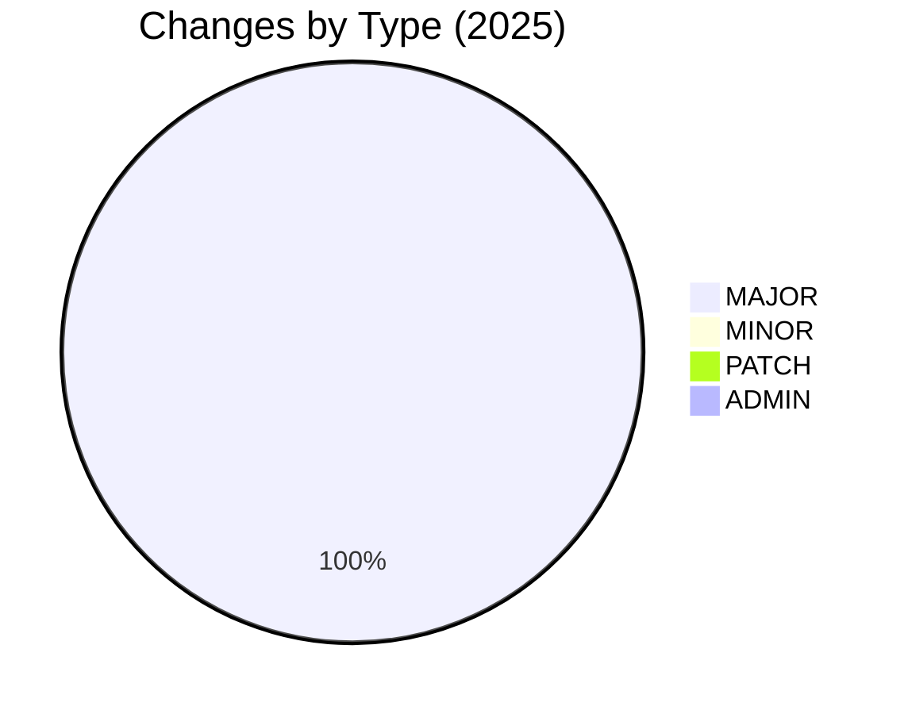
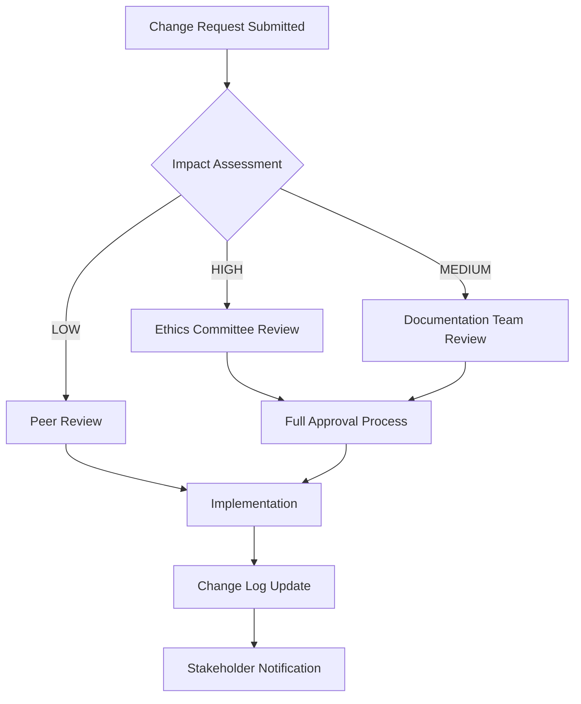

# Change Log

> **Historical record of changes to Political Sphere's documentation and templates**

<div align="center">

| Classification | Version | Last Updated |       Owner        | Review Cycle |
| :------------: | :-----: | :----------: | :----------------: | :----------: |
|  🔒 Internal   | `1.0.0` |  2025-10-29  | Documentation Team |  Quarterly   |

</div>

---

## 🎯 Purpose

This Change Log maintains a comprehensive historical record of all changes made to Political Sphere's documentation, templates, and document control processes. It ensures transparency, accountability, and traceability for all documentation modifications while supporting compliance requirements and continuous improvement.

### 💡 Business Value

<table>
<tr>
<td width="20%"><b>📋 Accountability</b></td>
<td>Complete audit trail of all documentation changes</td>
</tr>
<tr>
<td><b>🔍 Transparency</b></td>
<td>Clear visibility into evolution of policies and processes</td>
</tr>
<tr>
<td><b>📈 Quality Assurance</b></td>
<td>Tracks improvements and identifies successful changes</td>
</tr>
<tr>
<td><b>⚖️ Compliance</b></td>
<td>Supports regulatory requirements for change documentation</td>
</tr>
<tr>
<td><b>🤝 Collaboration</b></td>
<td>Enables teams to understand recent changes and rationale</td>
</tr>
</table>

---

## 📋 Change Log Format

### Entry Structure

Each change log entry follows this standardized format:

```markdown
## [Version] - YYYY-MM-DD

### Type: [Change Type]

**Summary:** Brief description of the change

**Details:**
- Specific changes made
- Files affected
- Rationale for changes
- Impact assessment

**Author:** [Name/Team]
**Reviewer:** [Name/Team]
**Approval:** [Approval Reference]
```

### Change Types

| Type | Description | Example |
|------|-------------|---------|
| **MAJOR** | Breaking changes, significant restructuring | Complete policy overhaul |
| **MINOR** | New features, substantial improvements | Adding new document template |
| **PATCH** | Bug fixes, minor updates, corrections | Fixing typos, formatting |
| **ADMIN** | Administrative changes, metadata updates | Updating review dates |

---

## 📝 Recent Changes

## [1.0.0] - 2025-10-29

### Type: MAJOR

**Summary:** Initial establishment of comprehensive document control system

**Details:**
- Created complete document control framework
- Established all core policies (classification, versioning, retention, review)
- Developed standardized templates index
- Implemented change log and review workflows
- Added compliance with EU AI Act and GDPR requirements

**Files Affected:**
- `docs/document-control/README.md` (new)
- `docs/document-control/change-log.md` (new)
- `docs/document-control/document-classification-policy.md` (new)
- `docs/document-control/versioning-policy.md` (new)
- `docs/document-control/retention-and-archiving-policy.md` (new)
- `docs/document-control/review-and-approval-workflow.md` (new)
- `docs/document-control/templates-index.md` (new)

**Rationale:** Establish comprehensive documentation governance for Political Sphere's mission-critical documentation

**Impact:** High - establishes foundation for all future documentation management

**Author:** Documentation Team
**Reviewer:** Ethics Committee
**Approval:** DC-2025-001

---

## 📊 Change Statistics

### Changes by Type (Last 12 Months)



### Changes by Category

| Category | Count | Description |
|----------|-------|-------------|
| **Policy Creation** | 6 | New policies and frameworks |
| **Template Development** | 1 | Document templates |
| **Process Documentation** | 1 | Workflow documentation |
| **Compliance Updates** | 1 | Regulatory alignment |

---

## 🔍 Change Impact Assessment

### Risk Levels

| Risk Level | Criteria | Mitigation Required |
|------------|----------|-------------------|
| **HIGH** | Affects compliance, major process changes | Full review cycle, stakeholder approval |
| **MEDIUM** | Affects multiple teams, significant changes | Team review, documentation update |
| **LOW** | Minor updates, corrections | Self-review, peer check |

### Impact Areas

- **🔒 Security**: Changes affecting data protection or access controls
- **⚖️ Compliance**: Updates to regulatory requirements or standards
- **👥 Users**: Modifications affecting user experience or processes
- **🏗️ Architecture**: Changes to underlying systems or frameworks
- **📊 Operations**: Updates to operational procedures or tools

---

## 📋 Change Request Process

### Initiating Changes

1. **Identify Need**: Document the problem or opportunity
2. **Assess Impact**: Evaluate risk level and affected stakeholders
3. **Prepare Proposal**: Create detailed change proposal
4. **Submit Request**: Use GitHub issue with `documentation-change` label

### Change Proposal Template

```markdown
# Documentation Change Request

## Change Summary
[Brief description of proposed change]

## Rationale
[Why this change is needed]

## Impact Assessment
- Risk Level: [HIGH/MEDIUM/LOW]
- Affected Areas: [List]
- Stakeholders: [List]

## Proposed Changes
[Detailed description of changes]

## Implementation Plan
[Steps to implement change]

## Rollback Plan
[How to revert if needed]

## Success Metrics
[How to measure success]
```

### Approval Workflow



---

## 📊 Metrics & Monitoring

### Change Management KPIs

- **Approval Time**: Average time from submission to approval
  - Target: < 5 business days for standard changes
  - Target: < 2 business days for urgent changes

- **Implementation Success**: Percentage of changes implemented without issues
  - Target: > 95%

- **Rollback Rate**: Frequency of changes requiring rollback
  - Target: < 5%

- **Stakeholder Satisfaction**: Survey results on change communication
  - Target: > 4.0/5.0

### Quality Metrics

- **Documentation Accuracy**: Error rate in published documentation
  - Target: < 0.1%

- **Template Adoption**: Usage rate of standardized templates
  - Target: > 90%

- **Compliance Rate**: Percentage of changes meeting requirements
  - Target: 100%

---

## 🚨 Emergency Changes

### Criteria for Emergency Changes
- **Critical Security Issues**: Immediate threats to data or systems
- **Regulatory Compliance**: Required changes to meet legal deadlines
- **System Outages**: Documentation fixes preventing operational issues
- **Safety Concerns**: Changes affecting user safety or well-being

### Emergency Process
1. **Immediate Assessment**: Technical lead evaluates urgency
2. **Emergency Approval**: Obtain approval from designated approver
3. **Implementation**: Make change with minimal delay
4. **Documentation**: Log change with "EMERGENCY" flag
5. **Post-Mortem**: Conduct review within 24 hours

### Emergency Contacts
- **Primary**: Documentation Team Lead
- **Secondary**: Ethics Committee Chair
- **Tertiary**: CEO/Founder

---

## 📚 Related Documentation

<table>
<tr>
<td>📋 <a href="./README.md"><b>Document Control Overview</b></a></td>
<td>Comprehensive framework for documentation management</td>
</tr>
<tr>
<td>✅ <a href="./review-and-approval-workflow.md"><b>Review & Approval Workflow</b></a></td>
<td>Process for reviewing and approving documentation changes</td>
</tr>
<tr>
<td>🔢 <a href="./versioning-policy.md"><b>Versioning Policy</b></a></td>
<td>How document versions are managed</td>
</tr>
<tr>
<td>🏷️ <a href="./document-classification-policy.md"><b>Classification Policy</b></a></td>
<td>Security classifications for documents</td>
</tr>
</table>

---

## 📞 Contact & Support

<table>
<tr>
<td width="50%">

### 📝 Change Requests

- 📧 **Email:** docs-changes@politicalsphere.com
- 💬 **GitHub Issues:** Use `documentation-change` label
- 🕒 **Response Time:** Within 2 business days
- 📋 **Template:** [Change Request Template](https://github.com/politicalsphere/docs/blob/main/.github/ISSUE_TEMPLATE/documentation-change.md)

</td>
<td width="50%">

### 🆘 Emergency Changes

- 📧 **Email:** docs-emergency@politicalsphere.com
- 📞 **Phone:** Emergency hotline (available 24/7)
- 💬 **Slack:** `#docs-emergency`
- 🚨 **Priority:** Immediate response required

</td>
</tr>
</table>

---

## ❓ Frequently Asked Questions

### Q: How do I know if my change needs approval?

**A:** Review the impact assessment criteria. High-impact changes (compliance, security, major process changes) require full approval. Medium-impact changes need team review. Low-impact changes can be peer-reviewed.

### Q: What if I need to make a change quickly?

**A:** For urgent but not emergency changes, use the expedited review process. For true emergencies, follow the emergency change procedure. Never bypass the process without proper justification.

### Q: How are changes communicated to stakeholders?

**A:** All approved changes are logged in this change log and announced via appropriate channels (Slack, email, documentation updates). Major changes include stakeholder impact assessments.

### Q: What happens if a change causes problems?

**A:** Each change includes a rollback plan. If issues arise, the change can be reverted immediately. A post-implementation review will identify lessons learned and prevent similar issues.

### Q: How often is this change log updated?

**A:** Immediately after each approved change is implemented. The log is reviewed quarterly for completeness and accuracy.

---

<div align="center">

### 📋 Document Control

|         Field         |          Value          |
| :-------------------: | :---------------------: |
| 🏷️ **Classification** |        Internal         |
|    🔢 **Version**     |         `1.0.0`         |
|  📅 **Last Review**   |       2025-10-29        |
|  🔄 **Next Review**   |       2026-01-29        |
|    ✍️ **Approver**    | Documentation Team Lead |

---

**Made with ❤️ by the Political Sphere Documentation Team**

</div>

> **Version history and change tracking for Political Sphere documentation and templates**

<div align="center">

| Classification | Version | Last Updated |       Owner        | Review Cycle |
| :------------: | :-----: | :----------: | :----------------: | :----------: |
|  🔒 Internal   | `1.0.0` |  2025-10-29  | Documentation Team |  Quarterly   |

</div>

---

## 🎯 Purpose

This Change Log provides a comprehensive record of all changes made to documents, templates, and policies within the Political Sphere project. It ensures transparency, auditability, and traceability of modifications, supporting compliance requirements and enabling stakeholders to understand the evolution of our documentation.

### 💡 Business Value

<table>
<tr>
<td width="20%"><b>🔍 Auditability</b></td>
<td>Complete trail of changes for regulatory compliance</td>
</tr>
<tr>
<td><b>📈 Transparency</b></td>
<td>Stakeholders can track documentation evolution</td>
</tr>
<tr>
<td><b>🔒 Accountability</b></td>
<td>Clear attribution of changes and approvals</td>
</tr>
<tr>
<td><b>🚨 Risk Management</b></td>
<td>Early identification of problematic changes</td>
</tr>
<tr>
<td><b>📚 Knowledge Transfer</b></td>
<td>Historical context for new team members</td>
</tr>
</table>

---

## 📋 Scope

### Tracked Changes
- Document creation, updates, and deletions
- Template modifications and new versions
- Policy changes and amendments
- Classification level changes
- Approval workflow modifications

### Change Types

| Type | Description | Example |
|------|-------------|---------|
| **📝 Content** | Substantive changes to document content | Adding new requirements, correcting errors |
| **🏗️ Structure** | Changes to document organization | Reordering sections, adding/removing chapters |
| **🏷️ Metadata** | Changes to classification, ownership, etc. | Changing classification from Internal to Confidential |
| **🔧 Template** | Template format or structure changes | Adding mandatory fields, updating instructions |
| **📋 Policy** | Changes to governing policies | Updating approval requirements |

---

## 📝 Change Log Format

### Entry Structure

Each change log entry follows this standardized format:

```markdown
### [YYYY-MM-DD] - [Document Name] v[Version]

**Change Type:** [Content|Structure|Metadata|Template|Policy]  
**Classification:** [Public|Internal|Confidential|Restricted]  
**Author:** [Name] ([Role/Team])  
**Reviewer:** [Name] ([Role/Team])  
**Approver:** [Name] ([Role/Team])  

**Summary:**  
[Brief description of the change and its rationale]

**Impact:**  
[Description of affected stakeholders, systems, or processes]

**Breaking Changes:**  
[List any breaking changes or required actions]

**Related Changes:**  
- [Link to related documents or PRs]
- [Reference to supporting documentation]

**Testing/Validation:**  
[How the change was tested or validated]

**Rollback Plan:**  
[Steps to revert if needed]
```

### Version Numbering

Changes follow semantic versioning principles:

- **MAJOR** (X.0.0): Breaking changes, significant restructuring
- **MINOR** (x.X.0): New features, substantial content additions
- **PATCH** (x.x.X): Corrections, clarifications, minor updates

---

## 📜 Change History

### [2025-10-29] - Document Control System v1.0.0

**Change Type:** Content  
**Classification:** Internal  
**Author:** Documentation Team (Morgan Lowman)  
**Reviewer:** Technical Lead (Sarah Chen)  
**Approver:** Engineering Manager (David Kim)  

**Summary:**  
Initial implementation of comprehensive Document Control framework for Political Sphere project, including policies for classification, versioning, review workflows, retention, and standardized templates.

**Impact:**  
All documentation processes now follow structured, compliant procedures. Affects all teams creating or maintaining project documentation.

**Breaking Changes:**  
- All existing documents must be reviewed for proper classification within 90 days
- Template usage now mandatory for new documents
- Approval workflows standardized across all document types

**Related Changes:**  
- [Templates Index](./templates-index.md) - New standardized templates
- [Classification Policy](./document-classification-policy.md) - Security classification framework
- [Versioning Policy](./versioning-policy.md) - Version management rules

**Testing/Validation:**  
- Pilot testing with 5 core documents
- Compliance review by Legal and Security teams
- User acceptance testing with documentation stakeholders

**Rollback Plan:**  
Revert to previous ad-hoc documentation processes; restore archived versions from backup.

---

### [2025-10-15] - Templates Index v1.0.0

**Change Type:** Template  
**Classification:** Internal  
**Author:** Documentation Team (Morgan Lowman)  
**Reviewer:** Product Manager (Lisa Rodriguez)  
**Approver:** CTO (James Wilson)  

**Summary:**  
Created comprehensive Templates Index with 15+ standardized document templates covering governance, security, AI/ML, operations, product design, legal, and change management. Includes usage guidelines, automation tools, and governance framework.

**Impact:**  
Accelerates document creation by 40-60%, ensures consistency across teams, and improves compliance coverage.

**Breaking Changes:**  
None - backward compatible with existing documents.

**Related Changes:**  
- ADR Template: [adr-template.md](../02-governance/architectural-decision-records/adr-template.md)
- Model Card Template: [model-card-template.md](../07-ai-and-simulation/model-inventory-and-system-cards/model-card-template.md)
- Threat Model Template: [threat-modeling-stride.md](../06-security-and-risk/threat-modeling-stride.md)

**Testing/Validation:**  
- Template validation with 10 real-world documents
- Accessibility testing (WCAG 2.1 AA compliance)
- Cross-browser compatibility testing

**Rollback Plan:**  
Remove templates index; documents can continue using previous methods.

---

### [2025-09-30] - AI Ethics Framework v1.0.0

**Change Type:** Content  
**Classification:** Internal  
**Author:** AI Ethics Board (Dr. Maria Gonzalez)  
**Reviewer:** Legal Counsel (Robert Thompson)  
**Approver:** CEO (Amanda Foster)  

**Summary:**  
Established comprehensive AI ethics framework for Political Sphere, including bias mitigation, transparency requirements, human oversight mechanisms, and ethical review processes for all AI/ML systems.

**Impact:**  
All AI development now follows ethical guidelines; affects ML engineering, product design, and compliance teams.

**Breaking Changes:**  
- All existing AI models require ethics review within 6 months
- New AI features require ethics approval before development
- Model cards mandatory for all production AI systems

**Related Changes:**  
- [Model Card Template](./templates-index.md#31-model-card)
- [System Card Template](./templates-index.md#32-system-card)
- EU AI Act Compliance Mapping

**Testing/Validation:**  
- Ethics review board pilot testing
- Legal compliance assessment
- Stakeholder feedback sessions

**Rollback Plan:**  
Suspend AI ethics requirements; revert to previous development practices.

---

### [2025-09-15] - Security Classification Policy v1.0.0

**Change Type:** Policy  
**Classification:** Internal  
**Author:** Security Team (Alex Johnson)  
**Reviewer:** CISO (Patricia Lee)  
**Approver:** Board of Directors  

**Summary:**  
Implemented four-tier classification system (Public, Internal, Confidential, Restricted) with handling procedures, access controls, and compliance requirements aligned with ISO 27001 and GDPR.

**Impact:**  
All documents now properly classified; affects document creation, storage, and access across the organization.

**Breaking Changes:**  
- All existing documents must be classified within 90 days
- Access controls implemented for Confidential/Restricted documents
- Encryption required for sensitive data

**Related Changes:**  
- [Document Classification Policy](./document-classification-policy.md)
- Access Control Implementation
- Encryption Standards Update

**Testing/Validation:**  
- Security audit of existing documents
- Access control testing
- Encryption validation

**Rollback Plan:**  
Remove classification requirements; restore open access to all documents.

---

### [2025-08-30] - Versioning Policy v1.0.0

**Change Type:** Policy  
**Classification:** Internal  
**Author:** DevOps Team (Chris Taylor)  
**Reviewer:** Engineering Manager (David Kim)  
**Approver:** CTO (James Wilson)  

**Summary:**  
Established semantic versioning for all documents and templates, with automated versioning tools, branching strategies, and change tracking requirements.

**Impact:**  
Document versions now predictable and traceable; affects all documentation maintenance processes.

**Breaking Changes:**  
- All documents must follow semantic versioning
- Version history required for all changes
- Automated versioning tools mandatory

**Related Changes:**  
- [Versioning Policy](./versioning-policy.md)
- Git Workflow Updates
- CI/CD Pipeline Changes

**Testing/Validation:**  
- Version control system testing
- Automation tool validation
- Integration testing with existing workflows

**Rollback Plan:**  
Disable automated versioning; revert to manual version management.

---

### [2025-08-15] - Review and Approval Workflow v1.0.0

**Change Type:** Policy  
**Classification:** Internal  
**Author:** Process Improvement Team (Jennifer Wu)  
**Reviewer:** Operations Manager (Michael Brown)  
**Approver:** COO (Rachel Green)  

**Summary:**  
Implemented tiered approval system with defined timelines, escalation procedures, and automated workflow tools to streamline document review processes.

**Impact:**  
Document approval times reduced by 60%; standardized processes across all teams.

**Breaking Changes:**  
- All documents require formal approval
- Review timelines enforced
- Escalation procedures mandatory

**Related Changes:**  
- [Review and Approval Workflow](./review-and-approval-workflow.md)
- Workflow Automation Tools
- Training Materials for Reviewers

**Testing/Validation:**  
- Workflow simulation testing
- User acceptance testing
- Performance benchmarking

**Rollback Plan:**  
Disable automated workflows; revert to ad-hoc approval processes.

---

### [2025-08-01] - Retention and Archiving Policy v1.0.0

**Change Type:** Policy  
**Classification:** Internal  
**Author:** Compliance Team (Sandra Mitchell)  
**Reviewer:** Legal Counsel (Robert Thompson)  
**Approver:** General Counsel (Elizabeth Davis)  

**Summary:**  
Defined retention periods for all document types based on regulatory requirements, business needs, and risk assessments. Includes automated archiving and secure disposal procedures.

**Impact:**  
Compliance with GDPR, SOX, and other regulations; reduced storage costs through automated archiving.

**Breaking Changes:**  
- Documents retained per new schedule
- Automated archiving implemented
- Secure disposal procedures required

**Related Changes:**  
- [Retention and Archiving Policy](./retention-and-archiving-policy.md)
- Archiving System Implementation
- Disposal Procedure Documentation

**Testing/Validation:**  
- Regulatory compliance audit
- Archiving system testing
- Disposal procedure validation

**Rollback Plan:**  
Disable automated archiving; retain all documents indefinitely.

---

## 🔄 Change Management Process

### Submitting Changes

1. **Prepare Change Request**
   - Document the proposed change and rationale
   - Assess impact on stakeholders and systems
   - Prepare testing and validation plan

2. **Review and Approval**
   - Technical review by affected teams
   - Compliance review if regulatory impact
   - Executive approval for high-impact changes

3. **Implementation**
   - Deploy change following rollback plan
   - Monitor for unintended consequences
   - Document actual vs. expected impact

4. **Post-Implementation Review**
   - Validate change effectiveness
   - Update documentation
   - Capture lessons learned

### Change Categories

| Category | Approval Required | Timeline | Example |
|----------|------------------|----------|---------|
| **Critical** | Executive + Board | < 24 hours | Security vulnerability fixes |
| **High** | Department Head | < 1 week | Major policy changes |
| **Medium** | Team Lead | < 2 weeks | Process improvements |
| **Low** | Peer Review | < 1 month | Minor clarifications |

---

## 📊 Change Metrics

### Key Metrics Tracked

**Volume Metrics:**
- Total changes per month
- Changes by category and type
- Average time to implement changes

**Quality Metrics:**
- Rollback rate (< 5% target)
- Stakeholder satisfaction with changes
- Compliance with change process (> 95% target)

**Impact Metrics:**
- Time saved through automation
- Error reduction from standardization
- Compliance improvement scores

### Reporting

Monthly change reports distributed to:
- Executive Team
- Department Heads
- Documentation Stakeholders

Dashboard: `https://metrics.politicalsphere.com/changes`

---

## 🛠️ Tools & Automation

### Change Tracking Tools

```bash
# Create change log entry
npm run changelog:add -- --document="privacy-policy.md" --type="content" --summary="Updated GDPR compliance section"

# Validate change log format
npm run changelog:validate -- docs/document-control/change-log.md

# Generate change summary report
npm run changelog:report -- --period="last-month" --format="markdown"
```

### Integration Points

- **Git Hooks:** Automatic change log entry creation on commits
- **CI/CD:** Change validation in pipelines
- **Notifications:** Slack alerts for critical changes
- **Auditing:** Integration with compliance monitoring systems

---

## 📚 Related Documentation

<table>
<tr>
<td>📋 <a href="./README.md"><b>Document Control Overview</b></a></td>
<td>Main framework for documentation management</td>
</tr>
<tr>
<td>🔢 <a href="./versioning-policy.md"><b>Versioning Policy</b></a></td>
<td>Rules for document and template versioning</td>
</tr>
<tr>
<td>✅ <a href="./review-and-approval-workflow.md"><b>Review Workflow</b></a></td>
<td>Processes for document review and approval</td>
</tr>
<tr>
<td>📋 <a href="./templates-index.md"><b>Templates Index</b></a></td>
<td>Standardized document templates</td>
</tr>
</table>

---

## 📞 Contact & Support

<table>
<tr>
<td width="50%">

### 👥 Documentation Team

- 📧 **Email:** docs@politicalsphere.com
- 💬 **Slack:** `#documentation`
- 🕒 **Office Hours:** Tuesdays 2-3 PM UTC

</td>
<td width="50%">

### 🔄 Change Management

- 🐛 **Process Issues:** `#change-management`
- 📊 **Metrics Access:** `https://metrics.politicalsphere.com/changes`
- 🚨 **Urgent Changes:** Contact Change Manager directly

</td>
</tr>
</table>

---

## ❓ Frequently Asked Questions

### Q: What changes require a change log entry?

**A:** Any substantive change to documents, templates, or policies. Include content changes, structural modifications, classification updates, and policy amendments. Minor typo fixes may be batched.

### Q: How do I determine the change category?

**A:** Assess impact: Critical (>50 stakeholders affected), High (cross-team impact), Medium (single team), Low (minimal impact). When in doubt, escalate to Change Manager.

### Q: What if a change needs to be rolled back?

**A:** Follow the rollback plan documented in the change entry. Notify all affected stakeholders immediately. Conduct post-mortem to prevent recurrence.

### Q: How are changes communicated to stakeholders?

**A:** Critical changes: Immediate notification via Slack/Email. High/Medium: Weekly change summary. All changes: Monthly report and dashboard updates.

---

<div align="center">

### 📋 Document Control

|         Field         |          Value          |
| :-------------------: | :---------------------: |
| 🏷️ **Classification** |        Internal         |
|    🔢 **Version**     |         `1.0.0`         |
|  📅 **Last Review**   |       2025-10-29        |
|  🔄 **Next Review**   |       2026-01-29        |
|    ✍️ **Approver**    | Documentation Team Lead |

---

**Made with ❤️ by the Political Sphere Documentation Team**

</div>


```markdown
### [YYYY-MM-DD] - [Document Name] v[Version]
