# Document Classification Policy

> **Security classification framework for Political Sphere's documentation and data**

<div align="center">

| Classification | Version | Last Updated |     Owner     | Review Cycle |    Status    |
| :------------: | :-----: | :----------: | :-----------: | :----------: | :----------: |
|  🔒 Internal   | `1.0.0` |  2025-10-29  | Security Team |  Quarterly   | **Approved** |

</div>

---

## 🎯 Purpose

This Document Classification Policy establishes a standardized framework for classifying Political Sphere's documentation and data based on sensitivity, regulatory requirements, and business impact. The policy ensures appropriate protection, handling, and access controls while supporting compliance with GDPR, EU AI Act, and other regulatory frameworks.

### 💡 Business Value

<table>
<tr>
<td width="20%"><b>🔒 Security</b></td>
<td>Prevents unauthorized access to sensitive information</td>
</tr>
<tr>
<td><b>⚖️ Compliance</b></td>
<td>Ensures adherence to data protection regulations</td>
</tr>
<tr>
<td><b>📋 Accountability</b></td>
<td>Clear responsibilities for document handling</td>
</tr>
<tr>
<td><b>🚀 Efficiency</b></td>
<td>Streamlined processes based on classification levels</td>
</tr>
<tr>
<td><b>🔍 Transparency</b></td>
<td>Visible classification supports appropriate usage</td>
</tr>
</table>

---

## 📋 Classification Levels

### 1. Public (🌐)

**Definition:** Information that can be freely disclosed to the public without restriction.

**Examples:**

- Marketing materials and brochures
- Public announcements and press releases
- General product documentation
- Open source code repositories
- Public API documentation

**Handling Requirements:**

- No access restrictions
- Can be shared via public websites, social media, etc.
- No encryption required for storage or transmission
- No special disposal procedures

**Marking:** Documents should include "Public" classification in header/footer

---

### 2. Internal (🏢)

**Definition:** Information intended for internal use within Political Sphere. Not sensitive but should not be disclosed externally without approval.

**Examples:**

- Internal procedures and policies
- Employee handbooks and guidelines
- Non-sensitive project documentation
- Internal meeting notes and agendas
- General operational procedures

**Handling Requirements:**

- Access limited to Political Sphere personnel
- Encryption recommended for external transmission
- Standard disposal procedures
- May be shared with approved partners under NDA

**Marking:** Documents should include "Internal" classification in header/footer

---

### 3. Confidential (🔒)

**Definition:** Information that could cause harm to Political Sphere or individuals if disclosed. Requires strict access controls.

**Examples:**

- User personal data and profiles
- Financial information and budgets
- Strategic business plans
- AI model training data (non-sensitive)
- Partnership agreements
- Security incident reports

**Handling Requirements:**

- Access restricted to authorized personnel only
- Must be encrypted at rest and in transit
- Two-person rule for highly sensitive confidential documents
- Secure disposal required (shredding, secure deletion)
- Access logging and monitoring required

**Marking:** Documents should include "Confidential" classification with clear warnings

---

### 4. Restricted (🚫)

**Definition:** Highly sensitive information that could cause severe harm if disclosed. Access is severely limited and heavily audited.

**Examples:**

- AI model architectures with proprietary algorithms
- User data containing sensitive personal information (health, political beliefs)
- Encryption keys and security credentials
- Legal settlements and privileged communications
- Critical infrastructure access information
- EU AI Act compliance documentation

**Handling Requirements:**

- Access limited to specific named individuals
- Must use highest encryption standards (AES-256 minimum)
- Physical security requirements for printed documents
- Immediate reporting of suspected breaches
- Regular access reviews and justification required
- Secure air-gapped storage for most sensitive data

**Marking:** Documents should include "Restricted" classification with severe consequence warnings

---

## 🔄 Classification Process

### Automatic Classification


### Classification Triggers

**Automatic Classification Based on:**

- Document type and template used
- Content analysis (keywords, patterns)
- Author role and department
- Storage location and system

**Manual Review Required For:**

- Documents containing personal data
- Legal or compliance-related content
- Strategic or financial information
- AI/ML model documentation
- International data transfers

### Classification Changes

Documents can be reclassified if circumstances change:

- **Up-classification**: Requires approval from Security Team
- **Down-classification**: Can be approved by document owner with Security Team consultation
- All changes must be documented in the change log

---

## 👥 Roles & Responsibilities

### Document Owners

- **Classify** documents at creation time
- **Review** classifications annually or when circumstances change
- **Ensure** appropriate handling based on classification
- **Report** suspected misclassifications immediately

### Security Team

- **Maintain** classification framework and guidelines
- **Review** automatic classifications and exceptions
- **Conduct** regular audits and training
- **Investigate** classification-related incidents

### All Personnel

- **Understand** classification levels and requirements
- **Follow** handling procedures for each level
- **Report** suspicious activity or potential breaches
- **Complete** annual security awareness training

> **Security classification framework for Political Sphere documents and data**

<div align="center">

| Classification | Version | Last Updated |     Owner     | Review Cycle |
| :------------: | :-----: | :----------: | :-----------: | :----------: |
|  🔒 Internal   | `1.0.0` |  2025-10-29  | Security Team |    Annual    |

</div>

---

## 🎯 Purpose

This Document Classification Policy establishes a standardized framework for classifying documents and data based on their sensitivity, regulatory requirements, and business impact. The policy ensures appropriate protection, handling, and access controls for all information assets within the Political Sphere project, supporting compliance with GDPR, EU AI Act, ISO 27001, and other regulatory requirements.

### 💡 Business Value

<table>
<tr>
<td width="20%"><b>🔒 Security</b></td>
<td>Prevents unauthorized access to sensitive information</td>
</tr>
<tr>
<td><b>⚖️ Compliance</b></td>
<td>Ensures adherence to data protection regulations</td>
</tr>
<tr>
<td><b>📊 Risk Management</b></td>
<td>Reduces risk of data breaches and regulatory fines</td>
</tr>
<tr>
<td><b>🚀 Operational Efficiency</b></td>
<td>Clear guidelines for handling different information types</td>
</tr>
<tr>
<td><b>🔍 Auditability</b></td>
<td>Demonstrates compliance during regulatory audits</td>
</tr>
</table>

---

## 📋 Scope

### In Scope

- All digital and physical documents created or maintained by Political Sphere
- Source code, configuration files, and technical documentation
- User data, AI models, and simulation data
- Third-party information processed or stored
- Communication records and meeting materials

### Out of Scope

- Publicly available information (already public)
- Personal communications not related to business (emails, chats)
- Temporary working files (< 30 days lifecycle)
- Open-source code repositories (follow separate policies)

---

## 🏷️ Classification Levels

### 1️⃣ Public

**Definition:** Information that can be freely disclosed to the public without restriction.

**Examples:**

- Marketing materials and press releases
- Public API documentation
- Open-source code repositories
- General product information
- Published research papers

**Handling Requirements:**

- ✅ No access restrictions
- ✅ No encryption required
- ✅ Can be shared externally
- ✅ No retention restrictions beyond business needs

**Marking:** `[PUBLIC]` in document header

---

### 2️⃣ Internal

**Definition:** Information intended for internal use only, not sensitive but should not be disclosed externally.

**Examples:**

- Internal procedures and policies
- Employee handbooks
- Project documentation
- Non-sensitive meeting notes
- General operational data

**Handling Requirements:**

- 🔒 Access limited to Political Sphere personnel
- ⚠️ Watermarking recommended for external sharing
- 📧 Email encryption for external transmission
- 🗂️ Standard retention periods apply

**Marking:** `[INTERNAL]` in document header

---

### 3️⃣ Confidential

**Definition:** Information that could cause damage to Political Sphere or individuals if disclosed, requiring strict access controls.

**Examples:**

- User personal data and PII
- Financial information and contracts
- AI model training data
- Security incident reports
- Strategic business plans
- Political simulation scenarios with real data

**Handling Requirements:**

- 🔐 Encryption at rest and in transit
- 👥 Need-to-know access only
- 📝 Access logging and monitoring
- 🚫 No external sharing without approval
- 🗂️ Extended retention for compliance
- 🛡️ Regular security reviews

**Marking:** `[CONFIDENTIAL]` in document header

---

### 4️⃣ Restricted

**Definition:** Highly sensitive information that could cause severe damage if compromised, requiring maximum protection.

**Examples:**

- Encryption keys and credentials
- AI model weights and proprietary algorithms
- Classified political intelligence data
- Legal settlements and NDAs
- Critical infrastructure access codes
- EU AI Act high-risk system details

**Handling Requirements:**

- 🔐 Military-grade encryption (AES-256 minimum)
- 👤 Individual approval for access
- 📊 Real-time access monitoring and alerting
- 🚫 No external sharing ever
- 🗂️ Maximum retention periods
- 🛡️ Annual security audits
- 📞 Immediate breach notification required

**Marking:** `[RESTRICTED]` in document header

---

## 🔄 Classification Process

### Determining Classification Level

```mermaid
graph TD
    A[📄 New Document/Data] --> B{Contains PII?}
    B -->|Yes| C[CONFIDENTIAL minimum]
    B -->|No| D{Regulatory Impact?}
    D -->|High| E[CONFIDENTIAL minimum]
    D -->|Medium| F[INTERNAL minimum]
    D -->|Low| G{Public Interest?}
    G -->|Yes| H[PUBLIC]
    G -->|No| I[INTERNAL]

    C --> J[Apply Handling Rules]
    E --> J
    F --> J
    H --> J
    I --> J
```



### Classification Decision Factors

| Factor                | Public | Internal   | Confidential | Restricted |
| --------------------- | ------ | ---------- | ------------ | ---------- |
| **Business Impact**   | None   | Low        | Medium-High  | Critical   |
| **Regulatory Risk**   | None   | Low        | Medium       | High       |
| **Reputational Risk** | None   | Low        | Medium       | High       |
| **Financial Impact**  | <$10K  | $10K-$100K | $100K-$1M    | >$1M       |
| **Data Sensitivity**  | None   | Internal   | Personal     | Secret     |

### Classification Workflow

1. **Auto-Classification** (where possible)
   - AI-powered content analysis
   - Keyword and pattern matching
   - Metadata-based rules

2. **Manual Review** (for uncertain cases)
   - Document owner assessment
   - Security team consultation
   - Legal review for regulatory content

3. **Approval & Documentation**
   - Classification recorded in document metadata
   - Access controls applied automatically
   - Classification logged for audit trail

---

## 🔐 Access Control Requirements

### By Classification Level

| Control            | Public         | Internal    | Confidential     | Restricted               |
| ------------------ | -------------- | ----------- | ---------------- | ------------------------ |
| **Authentication** | None           | Required    | Multi-factor     | Multi-factor + Biometric |
| **Authorization**  | None           | Role-based  | Need-to-know     | Individual approval      |
| **Encryption**     | None           | Transport   | Rest + Transport | End-to-end               |
| **Logging**        | None           | Basic       | Detailed         | Real-time                |
| **Retention**      | Business needs | 7 years     | 10 years         | 20+ years                |
| **Destruction**    | Standard       | Secure wipe | Cryptographic    | Physical destruction     |

### Role-Based Access

**Document Creator/Owner:**

- Can set initial classification
- Can request reclassification
- Responsible for accuracy

**Security Team:**

- Can override classifications
- Conducts periodic reviews
- Manages access controls

**Legal/Compliance:**

- Reviews regulatory classifications
- Approves Restricted classifications
- Conducts compliance audits

**System Administrators:**

- Implements technical controls
- Monitors access patterns
- Responds to security incidents

---

## 🛠️ Technical Implementation

### Document Metadata

All classified documents must include:

```yaml
---
classification: 'CONFIDENTIAL'
version: '1.0.0'
owner: 'Security Team'
created: '2025-10-29'
reviewed: '2025-10-29'
expires: '2035-10-29'
access_list: ['security-team', 'compliance']
---
```

### Automated Controls

**GitHub/GitLab Integration:**

```bash
# Automatic classification on commit
npm run classify:doc -- --file=path/to/document.md

# Access control validation
npm run access-check -- --user=username --file=path/to/document.md
```

**File System Controls:**

- Encrypted storage for Confidential/Restricted
- Access Control Lists (ACLs) by classification
- Automatic watermarking for shared documents

**Network Controls:**

- VPN required for remote access to sensitive data
- DLP (Data Loss Prevention) for email and file transfers
- Endpoint encryption for mobile devices

---

## 📋 Handling Procedures

### Sharing Classified Information

| Scenario            | Public     | Internal        | Confidential  | Restricted    |
| ------------------- | ---------- | --------------- | ------------- | ------------- |
| **Internal Email**  | ✅ Allowed | ✅ Allowed      | ⚠️ Encrypted  | 🚫 Prohibited |
| **External Email**  | ✅ Allowed | ⚠️ Encrypted    | 🚫 Prohibited | 🚫 Prohibited |
| **Cloud Storage**   | ✅ Allowed | ✅ Allowed      | ⚠️ Encrypted  | 🚫 Prohibited |
| **Physical Copies** | ✅ Allowed | ✅ Allowed      | ⚠️ Tracked    | 🚫 Prohibited |
| **Third Parties**   | ✅ Allowed | ⚠️ NDA Required | 🚫 Prohibited | 🚫 Prohibited |

### Incident Response

**Data Breach Procedure:**

1. **Immediate Containment** - Isolate affected systems
2. **Assessment** - Determine classification and impact
3. **Notification** - Report based on classification level
4. **Investigation** - Security team leads forensic analysis
5. **Remediation** - Implement fixes and preventive measures
6. **Reporting** - Regulatory notifications as required

**Notification Requirements:**

| Classification   | Internal Notification | External Notification | Regulatory Reporting |
| ---------------- | --------------------- | --------------------- | -------------------- |
| **Public**       | Within 24h            | N/A                   | N/A                  |
| **Internal**     | Within 24h            | N/A                   | N/A                  |
| **Confidential** | Within 4h             | Within 72h            | GDPR within 72h      |
| **Restricted**   | Immediate             | Within 24h            | Immediate + ICO      |

---

## 📊 Monitoring & Auditing

### Key Metrics

**Classification Coverage:**

- % of documents properly classified (target: >98%)
- Classification accuracy rate (target: >95%)
- Auto-classification success rate (target: >80%)

**Access Control Effectiveness:**

- Unauthorized access attempts blocked (target: 100%)
- Access review completion rate (target: >95%)
- Incident response time (target: <4h for high-risk)

**Compliance Metrics:**

- Audit findings related to classification (target: 0)
- Retention compliance rate (target: 100%)
- Data breach incidents (target: 0)

### Audit Requirements

**Annual Security Audit:**

- Classification accuracy assessment
- Access control effectiveness review
- Incident response capability testing

**Regulatory Audits:**

- GDPR compliance verification
- ISO 27001 certification maintenance
- EU AI Act adherence confirmation

---

## 📚 Training & Awareness

### Required Training

**All Personnel:**

- Classification basics (annual)
- Handling procedures (annual)
- Incident reporting (annual)

**Document Owners:**

- Classification determination (initial + annual)
- Access control management (annual)
- Retention requirements (annual)

**Security Team:**

- Advanced classification techniques (quarterly)
- Threat analysis (monthly)
- Incident response (quarterly)

### Training Materials

- **Online Courses:** Available on Political Sphere Learning Platform
- **Quick Reference:** Classification decision tree
- **Scenario Training:** Simulated classification exercises
- **Certification:** Required for handling Restricted documents

---

## 📞 Contact & Support

<table>
<tr>
<td width="50%">

### 🔐 Security Team

- 📧 **Email:** security@politicalsphere.com
- 💬 **Slack:** `#security`
- 🕒 **Office Hours:** Mon-Fri 9AM-5PM UTC
- 📞 **Emergency:** +1-555-SECURITY

</td>
<td width="50%">

### ⚖️ Compliance Team

- 📧 **Email:** compliance@politicalsphere.com
- 💬 **Slack:** `#compliance`
- 🕒 **Office Hours:** Tue-Thu 10AM-4PM UTC
- 📞 **Hotline:** 1-800-COMPLY

</td>
</tr>
</table>

---

## ❓ Frequently Asked Questions

### Q: How do I know what classification level to assign?

**A:** Use the decision tree in the Classification Process section. If uncertain, default to the higher classification level and consult Security Team. Remember: it's easier to downgrade than to recover from a breach.

### Q: Can I change a document's classification?

**A:** Yes, but requires approval. Submit a reclassification request to Security Team with justification. Downgrades need additional approval from Legal for regulatory content.

### Q: What happens if I accidentally share classified information?

**A:** Immediately report to Security Team. Do not attempt to "fix" it yourself. Early reporting minimizes impact and demonstrates good faith.

### Q: Are there exceptions to classification rules?

**A:** Very limited. Emergency situations may require temporary waivers, but these must be documented and approved by Security Team Lead. All waivers are reviewed post-incident.

### Q: How does classification affect AI/ML models?

**A:** AI models containing training data are Confidential minimum. Model weights and algorithms may be Restricted. All AI systems require ethics review and model cards per EU AI Act.

---

<div align="center">

### 📋 Document Control

|         Field         |       Value        |
| :-------------------: | :----------------: |
| 🏷️ **Classification** |      Internal      |
|    🔢 **Version**     |      `1.0.0`       |
|  📅 **Last Review**   |     2025-10-29     |
|  🔄 **Next Review**   |     2026-10-29     |
|    ✍️ **Approver**    | Security Team Lead |

---

**Made with ❤️ by the Political Sphere Security Team**

</div>
