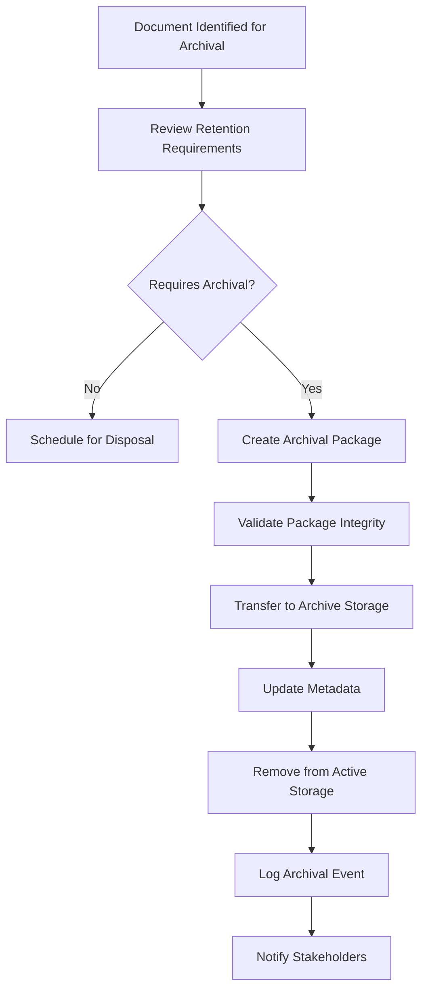
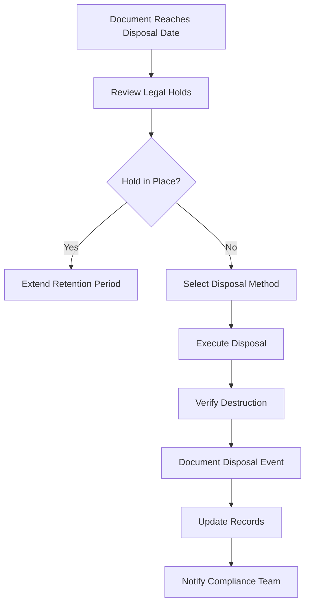
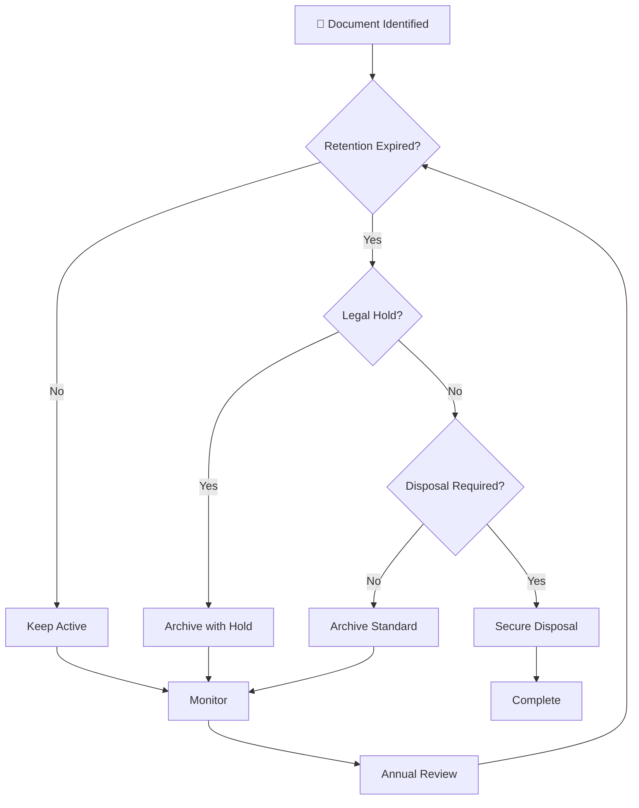

# Retention and Archiving Policy

> **Document lifecycle management and archival procedures for Political Sphere**

<div align="center">

| Classification | Version | Last Updated |      Owner      | Review Cycle |    Status    |
| :------------: | :-----: | :----------: | :-------------: | :----------: | :----------: |
|  🔒 Internal   | `1.0.0` |  2025-10-29  | Compliance Team |    Annual    | **Approved** |

</div>

---

## 🎯 Purpose

This Retention and Archiving Policy establishes standardized procedures for managing the lifecycle of Political Sphere's documentation, from creation through archival and eventual disposal. The policy ensures compliance with legal, regulatory, and business requirements while optimizing storage costs and maintaining accessibility of critical information.

### 💡 Business Value

<table>
<tr>
<td width="20%"><b>⚖️ Compliance</b></td>
<td>Ensures adherence to GDPR, tax laws, and industry regulations</td>
</tr>
<tr>
<td><b>💰 Cost Optimization</b></td>
<td>Reduces storage costs through timely disposal of obsolete documents</td>
</tr>
<tr>
<td><b>🔍 Accessibility</b></td>
<td>Maintains availability of critical information when needed</td>
</tr>
<tr>
<td><b>🔒 Security</b></td>
<td>Ensures secure disposal of sensitive information</td>
</tr>
<tr>
<td><b>📊 Risk Management</b></td>
<td>Minimizes legal and operational risks from document mismanagement</td>
</tr>
</table>

---

## 📋 Retention Periods

### Legal and Regulatory Requirements

| Document Type                 | Retention Period        | Legal Basis          | Examples                                    |
| ----------------------------- | ----------------------- | -------------------- | ------------------------------------------- |
| **GDPR Records**              | 7 years                 | GDPR Article 30      | Data processing records, DPIAs              |
| **Financial Records**         | 7 years                 | Tax laws             | Invoices, financial statements, tax returns |
| **Employment Records**        | 7 years                 | Employment laws      | Contracts, payroll, performance reviews     |
| **Legal Agreements**          | 7 years + contract term | Contract law         | NDAs, partnerships, vendor agreements       |
| **EU AI Act Documentation**   | 10 years                | EU AI Act            | AI system documentation, risk assessments   |
| **Security Incident Reports** | 7 years                 | Data protection laws | Breach reports, investigations              |

### Business Requirements

| Document Type             | Retention Period | Business Reason        | Examples                            |
| ------------------------- | ---------------- | ---------------------- | ----------------------------------- |
| **Strategic Plans**       | 10 years         | Historical context     | Business plans, roadmap documents   |
| **Project Documentation** | 7 years          | Knowledge preservation | Requirements, designs, test results |
| **Training Materials**    | 5 years          | Compliance tracking    | Training records, certifications    |
| **Audit Reports**         | 7 years          | Regulatory compliance  | Internal/external audit reports     |
| **Change Logs**           | Indefinite       | Historical record      | Document change history             |
| **Archived Code**         | 7 years          | Intellectual property  | Deprecated code repositories        |

### Operational Requirements

| Document Type            | Retention Period                       | Operational Reason          | Examples                              |
| ------------------------ | -------------------------------------- | --------------------------- | ------------------------------------- |
| **Meeting Notes**        | 3 years                                | Reference purposes          | Internal meetings, stakeholder calls  |
| **Email Correspondence** | 7 years (legal), 3 years (operational) | Legal/communication records | Business emails, support tickets      |
| **System Logs**          | 3 years                                | Troubleshooting             | Application logs, error reports       |
| **Backup Files**         | 1 year                                 | Recovery purposes           | Database backups, configuration files |
| **Temporary Documents**  | 1 year                                 | Working documents           | Drafts, working papers                |

---

## 🗂️ Archival Process

### Archival Triggers

Documents are moved to archival storage when:

- **Age-based**: Document reaches end of active retention period
- **Usage-based**: Document hasn't been accessed for 2+ years
- **Project completion**: Project ends and documentation is no longer actively used
- **System migration**: Documents from retired systems require preservation

### Archival Procedures



### Archival Storage

**Primary Archive:**

- **Location**: AWS S3 Glacier Deep Archive (EU region for GDPR compliance)
- **Encryption**: AES-256 with key rotation
- **Access**: REST API with authentication
- **Retention**: Configurable per document type

**Secondary Archive:**

- **Location**: On-premises tape library (for critical legal documents)
- **Encryption**: Hardware-based encryption
- **Access**: Physical media with dual custody
- **Retention**: Long-term (20+ years) for legal documents

### Archival Metadata

Each archived document includes:

- Original classification and retention period
- Archival date and authorizing personnel
- Storage location and retrieval procedures
- Integrity checksums (SHA-256)
- Chain of custody information

---

## 📋 Disposal Process

### Disposal Triggers

Documents are disposed when:

- **Retention period expires**: Standard disposal after retention requirements met
- **Legal hold released**: Documents under legal hold are disposed after hold expiration
- **Classification change**: Documents down-classified may have reduced retention
- **Business decision**: Obsolete documents approved for early disposal

### Disposal Methods

| Classification   | Method                                       | Verification             | Documentation            |
| ---------------- | -------------------------------------------- | ------------------------ | ------------------------ |
| **Public**       | Standard deletion                            | File system confirmation | Disposal log entry       |
| **Internal**     | Secure deletion (DoD 5220.22-M)              | Overwrite verification   | Disposal certificate     |
| **Confidential** | Cryptographic erasure + physical destruction | Multi-pass verification  | Chain of custody log     |
| **Restricted**   | Physical shredding + cryptographic erasure   | Witnessed destruction    | Legal disposal affidavit |

### Disposal Procedures



### Disposal Verification

**Technical Verification:**

- File system deletion confirmation
- Overwrite pattern verification
- Cryptographic key destruction confirmation

**Physical Verification:**

- Chain of custody documentation
- Witness signatures for high-value disposal
- Photographic evidence for critical documents

**Audit Verification:**

- Regular sampling of disposed documents
- Third-party audit of disposal processes
- Compliance reporting to regulators

---

## ⚖️ Legal Holds

### Legal Hold Process

When a legal hold is initiated:

1. **Notification**: All relevant personnel notified immediately
2. **Scope Definition**: Clear definition of documents under hold
3. **Preservation**: All identified documents preserved in original form
4. **Documentation**: Hold notice distributed and acknowledged
5. **Monitoring**: Regular verification of hold compliance

### Hold Types

| Hold Type           | Trigger                 | Duration                     | Examples                               |
| ------------------- | ----------------------- | ---------------------------- | -------------------------------------- |
| **Litigation Hold** | Lawsuit filed           | Until case resolution        | Contract disputes, employment claims   |
| **Regulatory Hold** | Investigation initiated | Until investigation complete | GDPR complaints, AI Act reviews        |
| **Internal Hold**   | Internal investigation  | Until investigation complete | Security incidents, compliance reviews |

### Hold Release

Holds are released when:

- **Legal resolution**: Case dismissed or settled
- **Regulatory closure**: Investigation completed
- **Internal completion**: Investigation findings documented
- **Time-based**: Maximum hold period reached (7 years for most holds)

---

## 📊 Monitoring & Auditing

### Key Metrics

- **Retention Compliance**: Percentage of documents retained per policy
  - Target: > 99%

- **Disposal Accuracy**: Percentage of documents disposed on schedule
  - Target: > 95%

- **Archival Integrity**: Percentage of archived documents retrievable
  - Target: 100%

- **Legal Hold Compliance**: Percentage of holds executed without violations
  - Target: 100%

### Audit Activities

**Monthly Monitoring:**

- Retention schedule compliance review
- Archival queue processing
- Disposal schedule execution

**Quarterly Audits:**

- Random sampling of retained documents
- Archival storage integrity checks
- Disposal method verification

**Annual Audits:**

- Comprehensive retention schedule review
- Legal requirement alignment assessment
- Process effectiveness evaluation

---

## 🚨 Exception Handling

### Retention Extensions

**Approved Extensions:**

- **Legal requirements**: Court orders, regulatory mandates
- **Business value**: Documents with ongoing reference value
- **Research purposes**: Academic or historical research value

**Extension Process:**

1. Business justification documented
2. Legal review if applicable
3. Compliance Team approval
4. Retention period updated in system

### Early Disposal

**Approved Early Disposal:**

- **Obsolete information**: No longer relevant or accurate
- **Storage constraints**: Cost-benefit analysis favors disposal
- **Privacy requirements**: Personal data minimization

**Early Disposal Process:**

1. Risk assessment completed
2. Stakeholder consultation
3. Compliance Team approval
4. Secure disposal executed

---

## 🛠️ Technical Implementation

### Document Lifecycle Management System

**Core Features:**

- Automated retention scheduling
- Classification-based lifecycle rules
- Archival workflow automation
- Disposal tracking and verification
- Audit trail maintenance

**Integration Points:**

- Document management systems
- Email archiving solutions
- Database retention policies
- Cloud storage lifecycle rules

### Automation Rules

```yaml
# Example retention rule configuration
retention_rules:
  - document_type: 'financial_records'
    retention_period: '7_years'
    archival_trigger: '6_years'
    disposal_method: 'secure_delete'
    legal_basis: 'tax_laws'

  - document_type: 'gdpr_records'
    retention_period: '7_years'
    archival_trigger: '5_years'
    disposal_method: 'cryptographic_erasure'
    legal_basis: 'gdpr_article_30'
```

---

## 📚 Related Documentation

<table>
<tr>
<td>🏷️ <a href="./document-classification-policy.md"><b>Document Classification Policy</b></a></td>
<td>Security classifications and handling procedures</td>
</tr>
<tr>
<td>📋 <a href="./README.md"><b>Document Control Overview</b></a></td>
<td>Overall document management framework</td>
</tr>
<tr>
<td>🔢 <a href="./versioning-policy.md"><b>Versioning Policy</b></a></td>
<td>Document versioning and change management</td>
</tr>
<tr>
<td>⚖️ <a href="../compliance/gdpr-compliance.md"><b>GDPR Compliance</b></a></td>
<td>Data protection and privacy requirements</td>
</tr>
</table>

---

## 📞 Contact & Support

<table>
<tr>
<td width="50%">

### ⚖️ Compliance Team

- 📧 **Email:** compliance@politicalsphere.com
- 💬 **Slack:** `#compliance`
- 🕒 **Office Hours:** Tue-Thu 10AM-4PM UTC
- 📋 **Legal Hold Hotline:** legal-hold@politicalsphere.com

</td>
<td width="50%">

### 🗂️ Records Management

- 📧 **Email:** records@politicalsphere.com
- 💬 **GitHub Issues:** Use `records-management` label
- 🕒 **Response Time:** Within 48 hours
- 📖 **Training:** [Records Management Portal](https://training.politicalsphere.com/records)

</td>
</tr>
</table>

---

## ❓ Frequently Asked Questions

### Q: How do I know when a document should be archived?

**A:** Documents are automatically flagged for archival based on their retention schedule. You'll receive notifications 90 days before archival. For manual archival requests, consult the Records Management team.

### Q: Can retention periods be extended?

**A:** Yes, with proper justification and approval. Legal requirements take precedence, but business needs can extend retention for operational documents. Submit extension requests through the Compliance Team.

### Q: What happens if I need to access an archived document?

**A:** Submit a retrieval request through the Records Management portal. Most documents are available within 24 hours. Critical documents may require additional approval.

### Q: How are documents securely disposed?

**A:** Disposal methods vary by classification. Public documents are deleted, confidential documents are cryptographically erased, and restricted documents are physically shredded. All disposal is verified and documented.

### Q: What if a document is under legal hold?

**A:** Legal holds supersede normal retention schedules. You'll be notified if any of your documents are placed on hold, and they cannot be disposed until the hold is released.

### Q: How does this policy apply to email?

**A:** Email is treated as documents and subject to the same retention rules. Business email is retained for 7 years, operational email for 3 years. Personal email is not retained unless it contains business records.

---

<div align="center">

### 📋 Document Control

|         Field         |        Value         |
| :-------------------: | :------------------: |
| 🏷️ **Classification** |       Internal       |
|    🔢 **Version**     |       `1.0.0`        |
|  📅 **Last Review**   |      2025-10-29      |
|  🔄 **Next Review**   |      2026-10-29      |
|    ✍️ **Approver**    | Compliance Team Lead |

---

**Made with ❤️ by the Political Sphere Compliance Team**

</div>

> **Framework for document retention, archiving, and secure disposal in Political Sphere**

<div align="center">

| Classification | Version | Last Updated |      Owner      | Review Cycle |
| :------------: | :-----: | :----------: | :-------------: | :----------: |
|  🔒 Internal   | `1.0.0` |  2025-10-29  | Compliance Team |    Annual    |

</div>

---

## 🎯 Purpose

This Retention and Archiving Policy establishes standardized procedures for retaining, archiving, and disposing of documents and data within the Political Sphere project. The policy ensures compliance with regulatory requirements (GDPR, EU AI Act, SOX), supports legal discovery needs, optimizes storage costs, and maintains data integrity throughout the document lifecycle.

### 💡 Business Value

<table>
<tr>
<td width="20%"><b>⚖️ Compliance</b></td>
<td>Ensures adherence to legal retention requirements</td>
</tr>
<tr>
<td><b>🔍 Legal Protection</b></td>
<td>Preserves evidence for litigation and audits</td>
</tr>
<tr>
<td><b>💰 Cost Optimization</b></td>
<td>Reduces storage costs through timely disposal</td>
</tr>
<tr>
<td><b>🔒 Data Security</b></td>
<td>Prevents unauthorized access to obsolete data</td>
</tr>
<tr>
<td><b>📊 Risk Management</b></td>
<td>Minimizes exposure from data breaches</td>
</tr>
</table>

---

## 📋 Scope

### In Scope

- All digital documents and records
- Physical documents and media
- Database records and backups
- Email communications and attachments
- AI/ML model artifacts and training data
- Audit logs and system records

### Out of Scope

- Source code (managed via Git/version control)
- Temporary files (< 30 days)
- Public marketing materials (no retention limit)
- Personal employee communications

---

## ⏰ Retention Periods

### By Document Classification

| Classification   | Minimum Retention | Maximum Retention | Rationale               |
| ---------------- | ----------------- | ----------------- | ----------------------- |
| **Public**       | Business need     | No limit          | Public availability     |
| **Internal**     | 7 years           | 10 years          | Operational records     |
| **Confidential** | 10 years          | 20 years          | Regulatory compliance   |
| **Restricted**   | 20 years          | Indefinite        | Critical security/legal |

### By Document Type

#### 📋 Governance & Legal

| Document Type                 | Retention Period         | Legal Basis             | Disposal Method   |
| ----------------------------- | ------------------------ | ----------------------- | ----------------- |
| **Articles of Incorporation** | Permanent                | Business continuity     | Secure archive    |
| **Board Meeting Minutes**     | 7 years                  | Corporate governance    | Secure shredding  |
| **Contracts & Agreements**    | 7 years post-termination | Contract law            | Secure deletion   |
| **Regulatory Filings**        | 7 years                  | Regulatory requirements | Encrypted archive |
| **Legal Correspondence**      | 7 years                  | Legal discovery         | Secure disposal   |

#### 💰 Financial & Accounting

| Document Type            | Retention Period | Legal Basis           | Disposal Method    |
| ------------------------ | ---------------- | --------------------- | ------------------ |
| **Financial Statements** | 7 years          | SOX compliance        | Secure archive     |
| **Tax Records**          | 7 years          | Tax law               | Encrypted disposal |
| **Payroll Records**      | 7 years          | Employment law        | Secure shredding   |
| **Expense Reports**      | 5 years          | Audit requirements    | Secure deletion    |
| **Bank Statements**      | 7 years          | Financial regulations | Encrypted archive  |

#### 🔐 Security & Compliance

| Document Type                 | Retention Period | Legal Basis            | Disposal Method    |
| ----------------------------- | ---------------- | ---------------------- | ------------------ |
| **Security Incident Reports** | 7 years          | ISO 27001              | Encrypted archive  |
| **Access Control Logs**       | 3 years          | GDPR Article 30        | Secure deletion    |
| **Data Breach Notifications** | 10 years         | GDPR                   | Encrypted archive  |
| **Compliance Audit Reports**  | 7 years          | Regulatory             | Secure disposal    |
| **Penetration Test Reports**  | 5 years          | Security best practice | Encrypted deletion |

#### 🤖 AI & Machine Learning

| Document Type               | Retention Period | Legal Basis           | Disposal Method    |
| --------------------------- | ---------------- | --------------------- | ------------------ |
| **Model Cards**             | 10 years         | EU AI Act             | Encrypted archive  |
| **Training Data**           | 10 years         | GDPR                  | Secure deletion    |
| **Model Performance Logs**  | 5 years          | Audit trail           | Encrypted disposal |
| **Ethics Review Records**   | 10 years         | EU AI Act             | Encrypted archive  |
| **Bias Assessment Reports** | 7 years          | Fairness requirements | Secure deletion    |

#### 📊 Operational & Technical

| Document Type                   | Retention Period | Legal Basis              | Disposal Method    |
| ------------------------------- | ---------------- | ------------------------ | ------------------ |
| **System Architecture Docs**    | 7 years          | Operational continuity   | Secure archive     |
| **Change Management Records**   | 5 years          | Audit requirements       | Secure deletion    |
| **Incident Response Plans**     | 5 years          | Business continuity      | Encrypted disposal |
| **Backup Recovery Tests**       | 3 years          | Operational requirements | Secure deletion    |
| **Performance Monitoring Data** | 2 years          | Operational analysis     | Automated deletion |

#### 👥 Human Resources

| Document Type            | Retention Period         | Legal Basis             | Disposal Method    |
| ------------------------ | ------------------------ | ----------------------- | ------------------ |
| **Employee Contracts**   | 7 years post-termination | Employment law          | Secure shredding   |
| **Performance Reviews**  | 5 years                  | Employment records      | Secure deletion    |
| **Training Records**     | 5 years                  | Compliance requirements | Encrypted disposal |
| **Disciplinary Actions** | 7 years                  | Legal protection        | Secure archive     |
| **Termination Records**  | 7 years                  | Employment law          | Encrypted deletion |

---

## 🗂️ Archiving Procedures

### Archival Triggers

Documents are archived when:

- ✅ Retention period expires but legal hold applies
- ✅ Document no longer actively used
- ✅ Storage optimization required
- ✅ Classification level changes to lower tier
- ✅ Business unit restructuring occurs

### Archival Process



### Archival Media & Formats

#### Primary Archive Formats

- **Digital Documents:** PDF/A (archival PDF) with embedded metadata
- **Databases:** Encrypted SQL dumps with schema documentation
- **Logs:** Compressed, encrypted text files with indexing
- **Media Files:** Lossless formats with integrity checksums

#### Storage Media

- **Tier 1 (Active Archive):** SSD storage with RAID protection
- **Tier 2 (Long-term):** Tape libraries with offsite replication
- **Tier 3 (Permanent):** WORM (Write Once Read Many) optical media

### Archive Integrity

**Integrity Checks:**

- SHA-256 checksums for all archived files
- Annual integrity verification (100% coverage)
- Automated corruption detection and repair
- Chain of custody documentation

**Access Controls:**

- Archive access requires dual authorization
- All access attempts logged and monitored
- Read-only access for archived content
- No modification allowed post-archival

---

## 🗑️ Disposal Procedures

### Disposal Methods by Classification

| Classification   | Disposal Method                 | Verification               | Witness Required |
| ---------------- | ------------------------------- | -------------------------- | ---------------- |
| **Public**       | Standard deletion               | File system check          | No               |
| **Internal**     | Secure deletion (DoD 5220.22-M) | Overwrite verification     | No               |
| **Confidential** | Cryptographic erasure           | Certificate of destruction | Yes              |
| **Restricted**   | Physical destruction            | Chain of custody           | Yes              |

### Secure Deletion Standards

**Digital Files:**

1. **Gutmann Method:** 35-pass overwrite (for highly sensitive data)
2. **DoD 5220.22-M:** 3-pass overwrite (standard for classified)
3. **Cryptographic:** AES encryption followed by key destruction

**Physical Media:**

1. **Shredding:** Cross-cut shredding to <2mm particles
2. **Incineration:** Professional document destruction service
3. **Degaussing:** For magnetic media followed by physical destruction

### Disposal Verification

**Certificate of Destruction:**

- Date and time of disposal
- Method used
- Personnel involved
- Witness signatures (for high-classification)
- Chain of custody documentation

**Audit Trail:**

- Disposal logged in central system
- Cross-referenced with retention schedule
- Annual disposal reports generated

---

## ⚖️ Legal Holds & Exceptions

### Legal Hold Process

When litigation or regulatory investigation is anticipated:

1. **Hold Notice Received**
   - Legal team issues formal hold notice
   - Affected documents identified and tagged
   - Automatic suspension of disposal processes

2. **Hold Implementation**
   - Documents moved to legal hold archive
   - Access restricted to authorized personnel
   - Metadata updated with hold information

3. **Hold Management**
   - Regular status updates to legal team
   - Scope reviews every 90 days
   - Secure storage with integrity protection

4. **Hold Release**
   - Legal approval for hold release
   - Gradual resumption of normal retention
   - Documentation of hold duration and rationale

### Hold Scope Determination

**Custodian Identification:**

- Document owners and creators
- System administrators with access
- Key personnel with relevant knowledge

**Data Scope:**

- Documents containing relevant keywords
- Communications with involved parties
- Backup tapes and archived data
- Related metadata and logs

---

## 🔄 Retention Schedule Management

### Schedule Updates

**Annual Review Process:**

1. **Regulatory Changes Assessment** - Review new laws and regulations
2. **Business Process Changes** - Update for new systems/processes
3. **Risk Assessment** - Evaluate retention vs. risk trade-offs
4. **Cost-Benefit Analysis** - Balance storage costs vs. legal risk
5. **Stakeholder Approval** - Legal, compliance, and business approval

**Change Triggers:**

- New regulatory requirements
- Significant business changes
- Technology platform updates
- Legal precedents or court rulings
- Audit findings or recommendations

### Schedule Implementation

**Automated Enforcement:**

```bash
# Check retention compliance
npm run retention:audit -- --period=2025-Q4

# Identify documents ready for disposal
npm run retention:identify -- --action=dispose --older-than=7years

# Apply legal hold
npm run legal-hold -- --case-id=LEGAL-2025-001 --scope="contracts/*"
```

**Manual Oversight:**

- Quarterly compliance reports
- Exception approval workflow
- Annual certification by legal counsel

---

## 📊 Monitoring & Compliance

### Key Metrics

**Retention Compliance:**

- Documents disposed on schedule (target: >99%)
- Legal holds properly implemented (target: 100%)
- Archive integrity maintained (target: 100%)
- Disposal verification complete (target: 100%)

**Storage Optimization:**

- Archive storage costs (target: <5% of total storage)
- Data growth rate managed (target: <10% YoY)
- Retrieval success rate (target: >99%)

**Audit Performance:**

- Audit response time (target: <30 days)
- Findings resolution rate (target: >95%)
- Preventive control effectiveness (target: >90%)

### Audit Requirements

**Internal Audits:**

- Quarterly retention schedule compliance
- Annual archive integrity verification
- Random sampling of disposed documents

**External Audits:**

- Regulatory compliance examinations
- Third-party security assessments
- Legal discovery readiness reviews

---

## 🛠️ Technical Implementation

### Archive System Architecture

**Storage Tiers:**

```
Active Documents → Archive Tier 1 (SSD) → Archive Tier 2 (Tape) → Archive Tier 3 (Optical WORM)
     ↓                ↓                        ↓                        ↓
  30 days          7 years                 20 years               Permanent
```

**Access Patterns:**

- **Hot Access:** Frequently accessed archives (immediate retrieval)
- **Warm Access:** Occasionally accessed (hours to retrieve)
- **Cold Access:** Rarely accessed (days to retrieve)
- **Glacier:** Long-term storage (weeks to retrieve)

### Automation Features

**Intelligent Archiving:**

- ML-based prediction of access patterns
- Automated tier migration
- Smart deduplication and compression
- Predictive storage provisioning

**Compliance Automation:**

- Automated retention schedule application
- Legal hold enforcement
- Disposal workflow orchestration
- Audit trail generation

---

## 📚 Training & Awareness

### Required Training

**All Personnel:**

- Retention basics and responsibilities (annual)
- Legal hold procedures (annual)
- Data disposal awareness (annual)

**Document Owners:**

- Retention schedule application (initial + annual)
- Archive request procedures (annual)
- Disposal approval processes (annual)

**Compliance Team:**

- Advanced retention management (quarterly)
- Legal hold coordination (monthly)
- Audit preparation (quarterly)

### Training Materials

- **Retention Schedule Quick Reference**
- **Legal Hold Decision Tree**
- **Archive Request Workflow Guide**
- **Disposal Method Selection Guide**

---

## 📞 Contact & Support

<table>
<tr>
<td width="50%">

### ⚖️ Compliance Team

- 📧 **Email:** compliance@politicalsphere.com
- 💬 **Slack:** `#compliance`
- 🕒 **Office Hours:** Tue-Thu 10AM-4PM UTC
- 📞 **Hotline:** 1-800-COMPLY

</td>
<td width="50%">

### 🗂️ Records Management

- 📧 **Email:** records@politicalsphere.com
- 💬 **Slack:** `#records-management`
- 🕒 **Office Hours:** Mon-Wed 9AM-3PM UTC
- 📞 **Support:** Ext. 1234

</td>
</tr>
</table>

---

## ❓ Frequently Asked Questions

### Q: How do I know when a document should be archived vs. disposed?

**A:** Check the retention schedule for your document type. If the retention period has expired and no legal hold applies, dispose securely. If retention has expired but the document has historical or audit value, archive it.

### Q: What happens during a legal hold?

**A:** All disposal and deletion activities stop for affected documents. They remain accessible but are moved to secure hold storage. Normal processes resume only after legal approval.

### Q: Can retention periods be extended?

**A:** Yes, with proper justification. Submit a retention extension request to Compliance Team. Extensions require legal review for regulatory content.

### Q: How are AI/ML artifacts handled?

**A:** Model cards and ethics reviews retained for 10 years per EU AI Act. Training data retained for 10 years if containing personal data. Model weights and algorithms may have extended retention based on business value.

### Q: What if I need to access archived documents?

**A:** Submit an archive retrieval request through the document management system. Retrieval time depends on storage tier (immediate to weeks). All retrievals are logged for audit purposes.

---

<div align="center">

### 📋 Document Control

|         Field         |        Value         |
| :-------------------: | :------------------: |
| 🏷️ **Classification** |       Internal       |
|    🔢 **Version**     |       `1.0.0`        |
|  📅 **Last Review**   |      2025-10-29      |
|  🔄 **Next Review**   |      2026-10-29      |
|    ✍️ **Approver**    | Compliance Team Lead |

---

**Made with ❤️ by the Political Sphere Compliance Team**

</div>
