# Review and Approval Workflow

> **Structured process for reviewing and approving Political Sphere's documentation**

<div align="center">

| Classification | Version | Last Updated |       Owner        | Review Cycle |
| :------------: | :-----: | :----------: | :----------------: | :----------: |
|  🔒 Internal   | `1.0.0` |  2025-10-29  | Documentation Team |  Quarterly   |

</div>

---

## 🎯 Purpose


> **Structured processes for document review, approval, and quality assurance in Political Sphere**

<div align="center">

| Classification | Version | Last Updated |       Owner        | Review Cycle |
| :------------: | :-----: | :----------: | :----------------: | :----------: |
|  🔒 Internal   | `1.0.0` |  2025-10-29  | Process Team       |  Quarterly   |

</div>

---

## 🎯 Purpose

This Review and Approval Workflow establishes standardized processes for reviewing, approving, and maintaining quality assurance for all documents within the Political Sphere project. The workflow ensures documents meet quality standards, comply with regulatory requirements, and receive appropriate stakeholder validation before publication.

### 💡 Business Value

<table>
<tr>
<td width="20%"><b>✅ Quality Assurance</b></td>
<td>Consistent review processes ensure document quality</td>
</tr>
<tr>
<td><b>⚖️ Compliance</b></td>
<td>Regulatory and legal requirements are validated</td>
</tr>
<tr>
<td><b>🚀 Efficiency</b></td>
<td>Streamlined workflows reduce approval cycle times</td>
</tr>
<tr>
<td><b>🔍 Risk Mitigation</b></td>
<td>Multiple review layers catch errors and issues</td>
</tr>
<tr>
<td><b>📈 Accountability</b></td>
<td>Clear ownership and approval trails</td>
</tr>
</table>

---

## 📋 Scope

### In Scope
- All project documentation requiring formal approval
- Template-based documents
- Policy and procedure changes
- Technical specifications and architecture decisions
- Regulatory and compliance documents
- Marketing and external communications

### Out of Scope
- Personal notes and working drafts
- Internal emails and instant messages
- Temporary documents (< 30 days lifecycle)
- Open-source code documentation (follows separate processes)

---

## 👥 Approval Tiers

### Tier 1: Basic Review (Low Risk)

**Suitable for:** Internal procedures, minor updates, informational documents

**Review Requirements:**
- ✅ Peer review by team member
- ✅ Technical accuracy check
- ✅ Compliance with templates

**Timeline:** 2-3 business days

**Approvers:** Document owner + 1 peer reviewer

---

### Tier 2: Standard Approval (Medium Risk)

**Suitable for:** Technical specifications, process changes, departmental policies

**Review Requirements:**
- ✅ Peer review by subject matter expert
- ✅ Technical lead approval
- ✅ Compliance review (if applicable)
- ✅ Legal review (if regulatory impact)

**Timeline:** 5-7 business days

**Approvers:** Document owner + Technical lead + Department head

---

### Tier 3: Executive Approval (High Risk)

**Suitable for:** Company policies, regulatory filings, strategic documents, AI ethics decisions

**Review Requirements:**
- ✅ Multi-disciplinary review team
- ✅ Security and compliance review
- ✅ Legal counsel review
- ✅ Executive approval
- ✅ Board approval (for critical policies)

**Timeline:** 10-15 business days

**Approvers:** Document owner + Review committee + Executive sponsor + Legal

---

### Tier 4: Regulatory Approval (Critical Risk)

**Suitable for:** Privacy policies, terms of service, data processing agreements, EU AI Act compliance

**Review Requirements:**
- ✅ Cross-functional review board
- ✅ External legal counsel
- ✅ Regulatory expert review
- ✅ Data Protection Officer (DPO) approval
- ✅ Executive and board approval
- ✅ Public notification (where required)

**Timeline:** 15-30 business days

**Approvers:** Document owner + Legal counsel + DPO + Executive team + Board

---

## 🔄 Review Workflow

### Phase 1: Preparation

```mermaid
graph TD
    A[📝 Document Created] --> B[🏷️ Classification Applied]
    B --> C[📋 Template Validation]
    C --> D[👥 Reviewers Assigned]
    D --> E[⏰ Timeline Set]
    E --> F[📤 Review Request Submitted]
```



**Preparation Checklist:**
- [ ] Document follows approved template
- [ ] Classification level determined
- [ ] Required reviewers identified
- [ ] Timeline established
- [ ] Supporting documentation attached
- [ ] Review request submitted via workflow tool

---

### Phase 2: Review Cycle

```mermaid
graph TD
    A[📤 Review Request] --> B[👁️ Initial Review]
    B --> C{Feedback Provided?}
    C -->|Yes| D[✍️ Revisions Made]
    C -->|No| E[✅ Approval Granted]
    D --> F{Major Changes?}
    F -->|Yes| G[🔄 Additional Review]
    F -->|No| H[✅ Final Approval]
    G --> B
    H --> I[📋 Quality Check]
    I --> J[🗂️ Archive & Publish]
```



**Review Process:**
1. **Automated Checks** - Template compliance, formatting, links
2. **Peer Review** - Technical accuracy, clarity, completeness
3. **Stakeholder Review** - Business alignment, requirements coverage
4. **Compliance Review** - Legal, regulatory, security requirements
5. **Executive Review** - Strategic alignment, risk assessment

---

### Phase 3: Approval & Publication

**Approval Criteria:**
- ✅ All mandatory reviewers have approved
- ✅ Critical feedback addressed
- ✅ Compliance requirements met
- ✅ No outstanding objections
- ✅ Executive approval obtained (for high-risk documents)

**Publication Process:**
1. **Final Quality Check** - Automated validation
2. **Metadata Update** - Approval dates, version numbers
3. **Access Controls** - Based on classification
4. **Stakeholder Notification** - Publication announcement
5. **Archive Storage** - Version control and backup

---

## ⏰ Timeline Management

### Standard Timelines by Tier

| Tier | Preparation | Review Cycle | Approval | Total Timeline |
|------|-------------|--------------|----------|----------------|
| **1** | 1 day | 2-3 days | 1 day | 4-5 days |
| **2** | 2 days | 5-7 days | 2 days | 9-11 days |
| **3** | 3 days | 10-15 days | 3 days | 16-21 days |
| **4** | 5 days | 15-30 days | 5 days | 25-40 days |

### Escalation Triggers

**Automatic Escalation:**
- ⏰ Review exceeds 75% of allocated time
- 🚫 Reviewer unresponsive for 3+ business days
- ⚠️ Critical feedback requires immediate attention

**Manual Escalation:**
- 🛑 Blocking dependencies identified
- 🔄 Scope changes requiring timeline adjustment
- 🚨 Regulatory deadlines approaching

### Timeline Extensions

**Extension Process:**
1. **Justification Required** - Document reason for delay
2. **Impact Assessment** - Evaluate downstream effects
3. **Approval Needed** - From process owner or executive
4. **Communication** - Notify all stakeholders of changes

---

## 👥 Reviewer Roles & Responsibilities

### Document Owner/Author
- **Create** initial document draft
- **Address** reviewer feedback
- **Coordinate** review process
- **Ensure** timeline compliance
- **Maintain** document quality

### Peer Reviewer
- **Review** technical accuracy
- **Check** completeness and clarity
- **Validate** requirements coverage
- **Provide** constructive feedback
- **Approve** or request revisions

### Subject Matter Expert (SME)
- **Validate** technical correctness
- **Assess** implementation feasibility
- **Identify** potential issues
- **Recommend** improvements
- **Sign-off** on technical aspects

### Compliance Reviewer
- **Check** regulatory compliance
- **Validate** legal requirements
- **Assess** risk implications
- **Ensure** policy adherence
- **Approve** compliance aspects

### Executive Approver
- **Review** strategic alignment
- **Assess** business impact
- **Evaluate** risk exposure
- **Provide** final approval
- **Authorize** publication

---

## 🛠️ Workflow Tools & Automation

### Primary Tools

**GitHub/GitLab Integration:**
```bash
# Submit document for review
npm run review:submit -- --document=path/to/doc.md --tier=2 --reviewers="alice,bob,charlie"

# Check review status
npm run review:status -- --document=path/to/doc.md

# Approve document
npm run review:approve -- --document=path/to/doc.md --comments="Approved with minor suggestions"
```

**Automated Checks:**
- ✅ Template compliance validation
- ✅ Link and reference checking
- ✅ Accessibility and readability scores
- ✅ Classification consistency
- ✅ Mandatory field completion
- ✅ AI-assisted submissions must pass `npm run guard:blackbox` before review

### Workflow States

| State | Description | Actions Available |
|-------|-------------|-------------------|
| **Draft** | Document being created | Edit, submit for review |
| **Review** | Under peer review | Provide feedback, request changes |
| **Revision** | Addressing feedback | Edit, resubmit |
| **Approval** | Awaiting final approval | Approve, reject, escalate |
| **Approved** | Ready for publication | Publish, archive |
| **Published** | Live document | Update, archive |
| **Archived** | No longer active | Reference only |

---

## 📊 Metrics & Monitoring

### Key Performance Indicators

**Quality Metrics:**
- First-pass approval rate (target: >80%)
- Revision cycle count (target: <2 cycles)
- Template compliance rate (target: >95%)
- Stakeholder satisfaction (target: >4.0/5.0)

**Efficiency Metrics:**
- Average approval time by tier (see timeline targets)
- Reviewer response time (target: <2 days)
- Escalation rate (target: <10%)
- Automation adoption rate (target: >70%)

**Compliance Metrics:**
- Regulatory review completion (target: 100%)
- Legal approval rate (target: >95%)
- Audit finding rate (target: 0 critical)

### Dashboard & Reporting

**Real-time Dashboard:**
- Active reviews by tier and status
- Average cycle times and bottlenecks
- Reviewer workload and response times
- Quality metrics and trends

**Monthly Reports:**
- Process efficiency analysis
- Quality improvement recommendations
- Compliance status updates
- Stakeholder feedback summary

---

## 🚨 Exception Handling

### Standard Exceptions

**Urgent Documents:**
- **Trigger:** Regulatory deadline, critical business need
- **Process:** Fast-track approval with executive override
- **Requirements:** Document urgency justification
- **Oversight:** Retrospective review within 30 days

**Emergency Changes:**
- **Trigger:** Security incident, compliance violation
- **Process:** Immediate approval with minimal review
- **Requirements:** Incident documentation and executive approval
- **Oversight:** Full review conducted post-implementation

### Exception Approval Process

1. **Exception Request** - Document need and justification
2. **Impact Assessment** - Evaluate risks and alternatives
3. **Approval Routing** - Based on exception severity
4. **Implementation** - Execute with monitoring
5. **Post-Mortem** - Review effectiveness and lessons learned

---

## 📚 Training & Support

### Required Training

**All Personnel:**
- Basic review process (annual)
- Tool usage and automation (annual)
- Quality standards and expectations (annual)

**Reviewers:**
- Advanced review techniques (quarterly)
- Domain-specific requirements (as needed)
- Tool updates and best practices (quarterly)

**Document Owners:**
- Document creation standards (initial + annual)
- Review management skills (annual)
- Stakeholder communication (annual)

### Support Resources

- **Process Guide:** Comprehensive workflow documentation
- **Template Library:** Pre-configured document templates
- **Training Videos:** Step-by-step process walkthroughs
- **Office Hours:** Weekly Q&A sessions
- **Help Desk:** 24/7 support for urgent issues

---

## 📞 Contact & Support

<table>
<tr>
<td width="50%">

### 📋 Process Improvement Team

- 📧 **Email:** process@politicalsphere.com
- 💬 **Slack:** `#process-improvement`
- 🕒 **Office Hours:** Wed-Fri 1PM-4PM UTC
- 📺 **Zoom:** [Process Office Hours](https://zoom.us/process-office-hours)

</td>
<td width="50%">

### 🛠️ Technical Support

- 📧 **Email:** docs-support@politicalsphere.com
- 💬 **Slack:** `#docs-tech-support`
- 🕒 **Help Desk:** 24/7 availability
- 📞 **Emergency:** +1-555-DOCS

</td>
</tr>
</table>

---

## ❓ Frequently Asked Questions

### Q: How do I determine which approval tier my document needs?

**A:** Use the risk assessment matrix. Consider regulatory impact, business criticality, stakeholder scope, and potential consequences of errors. When in doubt, select a higher tier.

### Q: What if a reviewer is unresponsive?

**A:** Wait 3 business days, then escalate to their manager. Document the delay and any impact on timeline. For urgent documents, request reviewer substitution.

### Q: Can I make changes during the review process?

**A:** Yes, but notify all reviewers of changes. Major revisions may require restarting the review cycle. Always document changes for audit trail.

### Q: What happens if there's disagreement among reviewers?

**A:** Escalate to the next approval level. For technical disputes, involve architecture review board. For business disputes, involve product management.

### Q: How are AI/ML documents reviewed?

**A:** All AI documents require ethics review and model validation. High-risk AI systems need additional regulatory approval per EU AI Act. Include AI Ethics Board in review team.

### Q: What if I need to publish before full approval?

**A:** Only for emergency situations. Requires executive override with documented justification. Full approval process completed retrospectively.

---

<div align="center">

### 📋 Document Control

|         Field         |          Value          |
| :-------------------: | :---------------------: |
| 🏷️ **Classification** |        Internal         |
|    🔢 **Version**     |         `1.0.0`         |
|  📅 **Last Review**   |       2025-10-29        |
|  🔄 **Next Review**   |       2026-01-29        |
|    ✍️ **Approver**    |  Process Team Lead      |

---

**Made with ❤️ by the Political Sphere Process Improvement Team**

</div>
