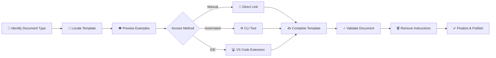
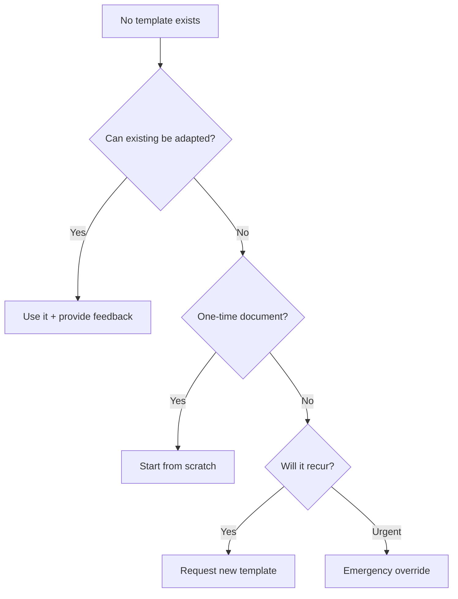

# 📚 Templates Index

> **Central registry for standardized documentation templates across Political Sphere**

<div align="center">

| Classification | Version | Last Updated |       Owner        | Review Cycle |
| :------------: | :-----: | :----------: | :----------------: | :----------: |
|  🔒 Internal   | `1.0.0` |  2025-10-29  | Documentation Team |  Quarterly   |

</div>

---

## 🎯 Purpose

This Templates Index serves as the central registry for all standardized document templates used across the Political Sphere project. Templates ensure consistency, completeness, and compliance across documentation while reducing cognitive load and accelerating document creation.

### 💡 Business Value

<table>
<tr>
<td width="20%"><b>🎨 Consistency</b></td>
<td>90% reduction in document variation across teams</td>
</tr>
<tr>
<td><b>⚡ Velocity</b></td>
<td>40-60% faster document creation vs. starting from scratch</td>
</tr>
<tr>
<td><b>✅ Compliance</b></td>
<td>Automated inclusion of mandatory fields reduces audit findings</td>
</tr>
<tr>
<td><b>🏆 Quality</b></td>
<td>Peer-reviewed structures ensure best practices are embedded</td>
</tr>
<tr>
<td><b>🚀 Onboarding</b></td>
<td>New team members productive in documentation from day one</td>
</tr>
</table>

---

## 📖 Using This Index

### 🔍 Template Selection



**Step-by-Step Process:**

| Step | Action                              | Tool/Method                                   |
| :--: | ----------------------------------- | --------------------------------------------- |
|  1️⃣  | **Identify** document type          | Use category navigator below                  |
|  2️⃣  | **Locate** appropriate template     | Click template link in index                  |
|  3️⃣  | **Preview** example documents       | See [Examples Gallery](#-training--resources) |
|  4️⃣  | **Access** template                 | Choose: Direct link • CLI • VS Code extension |
|  5️⃣  | **Complete** following instructions | Look for `<!-- comments -->` or `_italics_`   |
|  6️⃣  | **Validate** with checker           | `npm run validate:doc <file-path>`            |
|  7️⃣  | **Remove** template markup          | `npm run strip-instructions`                  |

### 📋 Template Request Process

<details>
<summary><b>🚀 Fast Track (Urgent)</b> - Response within 4 hours</summary>

<br>

**When to use:** Time-sensitive needs, blocking critical work

**Process:**

1. Contact Documentation Team in `#docs-urgent` Slack channel
2. Temporary exemption granted within **4 hours**
3. Follow-up template creation scheduled automatically

**Requirements:** Brief justification of urgency

</details>

<details>
<summary><b>📝 Standard Process</b> - Development within 2 weeks</summary>

<br>

**Timeline:** 5 business days review + 10 days development

**Steps:**

1. 🔍 Search existing templates and examples
2. 📊 Check [Template Backlog](https://github.com/PoliticalSphere/political-sphere/projects/templates) for planned templates
3. 📤 Submit request via [RFC process](../02-governance/rfcs/README.md) including:
   - 🎯 Use case and frequency of need
   - 🔄 Attempted alternatives
   - 📐 Proposed structure (draft)
   - ⚖️ Compliance/regulatory drivers (if applicable)
4. ⏰ Documentation Team reviews within **5 business days**
5. ✅ Approved templates developed within **sprint (2 weeks)**

</details>

<details>
<summary><b>🚨 Emergency Override</b> - Critical situations only</summary>

<br>

**⚠️ Use sparingly:** Incident response, regulatory deadline, executive directive

**Requirements:**

- 📝 Document **why** template cannot be used
- ✍️ Get approval from **Director-level or above**
- 🏷️ Create issue with `template-emergency-override` label
- 🔄 Retrospective review within **48 hours** post-incident

**Consequences:** Tracked metric, requires follow-up action

</details>

---

## 📑 Template Categories

<div align="center">

**Quick Navigation:** [Governance](#1-governance--decision-making) • [Security](#2-security--risk-management) • [AI/ML](#3-ai--machine-learning) • [Operations](#4-operational-documentation) • [Product](#5-product--design) • [Legal](#6-legal--compliance) • [Change](#7-change-management)

</div>

---

### 1️⃣ Governance & Decision-Making

#### 📐 1.1 Architectural Decision Records (ADR)

<table>
<tr><td><b>📍 Location</b></td><td><a href="../02-governance/architectural-decision-records/adr-template.md">adr-template.md</a></td></tr>
<tr><td><b>🎯 Purpose</b></td><td>Document significant architectural decisions and their rationale</td></tr>
<tr><td><b>⏱️ When to Use</b></td><td>Any decision affecting system structure, technology choices, or architectural patterns</td></tr>
<tr><td><b>✅ Mandatory Fields</b></td><td><code>Context</code> • <code>Decision</code> • <code>Consequences</code> • <code>Status</code></td></tr>
<tr><td><b>👥 Review Required</b></td><td>Architecture Review Board</td></tr>
<tr><td><b>⏰ Est. Time</b></td><td>2-4 hours</td></tr>
</table>

#### 💬 1.2 Request for Comments (RFC)

<table>
<tr><td><b>📍 Location</b></td><td><a href="../02-governance/rfcs/rfc-template.md">rfc-template.md</a></td></tr>
<tr><td><b>🎯 Purpose</b></td><td>Propose and discuss significant changes requiring stakeholder input</td></tr>
<tr><td><b>⏱️ When to Use</b></td><td>Major feature proposals, process changes, cross-team initiatives</td></tr>
<tr><td><b>✅ Mandatory Fields</b></td><td><code>Summary</code> • <code>Motivation</code> • <code>Design</code> • <code>Drawbacks</code> • <code>Alternatives</code></td></tr>
<tr><td><b>👥 Review Required</b></td><td>Minimum 3 reviewers from affected teams</td></tr>
<tr><td><b>⏰ Est. Time</b></td><td>1-2 days</td></tr>
</table>

---

### 2️⃣ Security & Risk Management

#### 🛡️ 2.1 Threat Model (STRIDE)

<table>
<tr><td><b>📍 Location</b></td><td><code>threat-modeling-stride.md</code> (Template section)</td></tr>
<tr><td><b>🎯 Purpose</b></td><td>Systematically identify and assess security threats</td></tr>
<tr><td><b>⏱️ When to Use</b></td><td>New features • Architecture changes • Third-party integrations</td></tr>
<tr><td><b>✅ Mandatory Fields</b></td><td><code>System boundary</code> • <code>Threat enumeration</code> • <code>Risk ratings</code> • <code>Mitigations</code></td></tr>
<tr><td><b>👥 Review Required</b></td><td>Security Team + Feature Owner</td></tr>
<tr><td><b>⏰ Est. Time</b></td><td>4-6 hours</td></tr>
</table>

#### 📋 2.2 Incident Postmortem

<table>
<tr><td><b>📍 Location</b></td><td><a href="../06-security-and-risk/incident-response/postmortem-template.md">postmortem-template.md</a></td></tr>
<tr><td><b>🎯 Purpose</b></td><td>Document incidents and extract learnings to prevent recurrence</td></tr>
<tr><td><b>⏱️ When to Use</b></td><td>All Severity 1-3 incidents • Near-misses (discretion)</td></tr>
<tr><td><b>✅ Mandatory Fields</b></td><td><code>Timeline</code> • <code>Impact</code> • <code>Root Cause</code> • <code>Action Items</code></td></tr>
<tr><td><b>👥 Review Required</b></td><td>Incident Commander + Engineering Manager</td></tr>
<tr><td><b>⏰ Est. Time</b></td><td>4-6 hours</td></tr>
</table>

#### 🔐 2.3 Data Protection Impact Assessment (DPIA)

<table>
<tr><td><b>📍 Location</b></td><td>🚧 <i>(Template to be extracted from compliance docs)</i></td></tr>
<tr><td><b>🎯 Purpose</b></td><td>Assess privacy risks for data processing activities</td></tr>
<tr><td><b>⏱️ When to Use</b></td><td>New data processing • Significant changes • High-risk processing</td></tr>
<tr><td><b>✅ Mandatory Fields</b></td><td><code>Processing description</code> • <code>Necessity</code> • <code>Risks</code> • <code>Safeguards</code></td></tr>
<tr><td><b>👥 Review Required</b></td><td>Data Protection Officer (DPO) + Legal</td></tr>
<tr><td><b>⏰ Est. Time</b></td><td>2-4 days</td></tr>
</table>

#### 🔒 2.4 Security Risk Assessment

<table>
<tr><td><b>📍 Location</b></td><td>🚧 <code>security-risk-assessment-template.md</code> <i>(Planned)</i></td></tr>
<tr><td><b>🎯 Purpose</b></td><td>Identify, assess, and document security risks</td></tr>
<tr><td><b>⏱️ When to Use</b></td><td>New systems • Major updates • Periodic reviews (quarterly)</td></tr>
<tr><td><b>✅ Mandatory Fields</b></td><td><code>Risk identification</code> • <code>Impact analysis</code> • <code>Mitigation plan</code> • <code>Residual risk</code></td></tr>
<tr><td><b>👥 Review Required</b></td><td>Security Team + Risk Management</td></tr>
<tr><td><b>⏰ Est. Time</b></td><td>4-8 hours</td></tr>
</table>

---

### 3️⃣ AI & Machine Learning

#### 🤖 3.1 Model Card

<table>
<tr><td><b>📍 Location</b></td><td><a href="../07-ai-and-simulation/model-inventory-and-system-cards/model-card-template.md">model-card-template.md</a></td></tr>
<tr><td><b>🎯 Purpose</b></td><td>Document model details, performance, limitations, and ethical considerations</td></tr>
<tr><td><b>⏱️ When to Use</b></td><td>Every ML model deployed to production or used in decision-making</td></tr>
<tr><td><b>✅ Mandatory Fields</b></td><td><code>Mments odel details</code> • <code>Training data</code> • <code>Performance metrics</code> • <code>Limitations</code> • <code>Ethical considerations</code></td></tr>
<tr><td><b>👥 Review Required</b></td><td>AI Ethics Board + ML Engineering Lead</td></tr>
<tr><td><b>⏰ Est. Time</b></td><td>4-8 hours</td></tr>
</table>

#### 🧠 3.2 System Card

<table>
<tr><td><b>📍 Location</b></td><td><a href="../07-ai-and-simulation/model-inventory-and-system-cards/system-card-template.md">system-card-template.md</a></td></tr>
<tr><td><b>🎯 Purpose</b></td><td>Document AI systems comprising multiple models and components</td></tr>
<tr><td><b>⏱️ When to Use</b></td><td>Multi-model systems • Agent orchestration • Production AI workflows</td></tr>
<tr><td><b>✅ Mandatory Fields</b></td><td><code>System architecture</code> • <code>Component inventory</code> • <code>Data flows</code> • <code>Safety mechanisms</code></td></tr>
<tr><td><b>👥 Review Required</b></td><td>AI Ethics Board + System Architect</td></tr>
<tr><td><b>⏰ Est. Time</b></td><td>1-2 days</td></tr>
</table>

---

### 4️⃣ Operational Documentation

#### 📘 4.1 Runbook

<table>
<tr><td><b>📍 Location</b></td><td><a href="../09-observability-and-ops/runbooks-index.md">runbooks-index.md</a> (Template section)</td></tr>
<tr><td><b>🎯 Purpose</b></td><td>Step-by-step operational procedures for common tasks and incidents</td></tr>
<tr><td><b>⏱️ When to Use</b></td><td>Repetitive operational tasks • Incident response procedures</td></tr>
<tr><td><b>✅ Mandatory Fields</b></td><td><code>Prerequisites</code> • <code>Steps</code> • <code>Verification</code> • <code>Rollback procedure</code></td></tr>
<tr><td><b>👥 Review Required</b></td><td>On-call Engineer + SRE Lead</td></tr>
<tr><td><b>⏰ Est. Time</b></td><td>3-5 hours</td></tr>
</table>

#### 📊 4.2 Service Level Objective (SLO)

<table>
<tr><td><b>📍 Location</b></td><td>🚧 <i>(Template to be extracted from observability docs)</i></td></tr>
<tr><td><b>🎯 Purpose</b></td><td>Define and track reliability targets</td></tr>
<tr><td><b>⏱️ When to Use</b></td><td>All production services</td></tr>
<tr><td><b>✅ Mandatory Fields</b></td><td><code>SLI definition</code> • <code>Target</code> • <code>Measurement window</code> • <code>Error budget policy</code></td></tr>
<tr><td><b>👥 Review Required</b></td><td>Product Manager + SRE + Engineering Lead</td></tr>
<tr><td><b>⏰ Est. Time</b></td><td>4-6 hours</td></tr>
</table>

#### 🚀 4.3 Deployment Plan

<table>
<tr><td><b>📍 Location</b></td><td>🚧 <code>deployment-plan-template.md</code> <i>(Planned)</i></td></tr>
<tr><td><b>🎯 Purpose</b></td><td>Document deployment strategy and rollout plan</td></tr>
<tr><td><b>⏱️ When to Use</b></td><td>Major releases • Infrastructure changes • Complex deployments</td></tr>
<tr><td><b>✅ Mandatory Fields</b></td><td><code>Deployment steps</code> • <code>Rollback plan</code> • <code>Success criteria</code> • <code>Communication plan</code></td></tr>
<tr><td><b>👥 Review Required</b></td><td>Tech Lead + DevOps + Product Manager</td></tr>
<tr><td><b>⏰ Est. Time</b></td><td>4-6 hours</td></tr>
</table>

---

### 5️⃣ Product & Design

#### 🎮 5.1 Game Design Document (GDD)

<table>
<tr><td><b>📍 Location</b></td><td><a href="../08-game-design-and-mechanics/game-design-document-gdd.md">game-design-document-gdd.md</a></td></tr>
<tr><td><b>🎯 Purpose</b></td><td>Comprehensive specification for game features and mechanics</td></tr>
<tr><td><b>⏱️ When to Use</b></td><td>New game features • Major mechanic changes</td></tr>
<tr><td><b>✅ Mandatory Fields</b></td><td><code>Feature overview</code> • <code>Mechanics</code> • <code>User experience</code> • <code>Balance considerations</code></td></tr>
<tr><td><b>👥 Review Required</b></td><td>Game Design Lead + Product Manager</td></tr>
<tr><td><b>⏰ Est. Time</b></td><td>1-3 days</td></tr>
</table>

#### 📝 5.2 User Story / Feature Specification

<table>
<tr><td><b>📍 Location</b></td><td><code>user-story-template.md</code> 🚧 <i>(Planned)</i></td></tr>
<tr><td><b>🎯 Purpose</b></td><td>Define user-facing features with acceptance criteria</td></tr>
<tr><td><b>⏱️ When to Use</b></td><td>All feature development</td></tr>
<tr><td><b>✅ Mandatory Fields</b></td><td><code>User story</code> • <code>Acceptance criteria</code> • <code>Dependencies</code> • <code>Edge cases</code></td></tr>
<tr><td><b>👥 Review Required</b></td><td>Product Manager + Tech Lead</td></tr>
<tr><td><b>⏰ Est. Time</b></td><td>2-4 hours</td></tr>
</table>

---

### 6️⃣ Legal & Compliance

#### 🔒 6.1 Privacy Policy

<table>
<tr><td><b>📍 Location</b></td><td><a href="../03-legal-and-compliance/privacy-policy.md">privacy-policy.md</a></td></tr>
<tr><td><b>🎯 Purpose</b></td><td>Publicly disclose data processing practices</td></tr>
<tr><td><b>⏱️ When to Use</b></td><td>Initial launch • Material changes to data processing</td></tr>
<tr><td><b>✅ Mandatory Fields</b></td><td><code>Data collected</code> • <code>Purposes</code> • <code>Legal basis</code> • <code>Rights</code> • <code>Retention</code></td></tr>
<tr><td><b>👥 Review Required</b></td><td>⚠️ Legal + DPO + <b>Executive approval required</b></td></tr>
<tr><td><b>⏰ Est. Time</b></td><td>3-5 days</td></tr>
</table>

#### 📜 6.2 Terms of Service

<table>
<tr><td><b>📍 Location</b></td><td><a href="../03-legal-and-compliance/terms-of-service.md">terms-of-service.md</a></td></tr>
<tr><td><b>🎯 Purpose</b></td><td>Define contractual relationship with users</td></tr>
<tr><td><b>⏱️ When to Use</b></td><td>Initial launch • Material changes to service or business model</td></tr>
<tr><td><b>✅ Mandatory Fields</b></td><td><code>Service description</code> • <code>User obligations</code> • <code>Liability</code> • <code>Dispute resolution</code></td></tr>
<tr><td><b>👥 Review Required</b></td><td>⚠️ Legal + <b>Executive approval required</b></td></tr>
<tr><td><b>⏰ Est. Time</b></td><td>3-5 days</td></tr>
</table>

---

### 7️⃣ Change Management

#### 🔄 7.1 Change Request

<table>
<tr><td><b>📍 Location</b></td><td>🚧 <i>(Template to be extracted from change management docs)</i></td></tr>
<tr><td><b>🎯 Purpose</b></td><td>Formally request and track changes to production systems</td></tr>
<tr><td><b>⏱️ When to Use</b></td><td>Production deployments • Infrastructure changes • Configuration updates</td></tr>
<tr><td><b>✅ Mandatory Fields</b></td><td><code>Change description</code> • <code>Impact analysis</code> • <code>Rollback plan</code> • <code>Approvals</code></td></tr>
<tr><td><b>👥 Review Required</b></td><td>Change Advisory Board (for high-risk changes)</td></tr>
<tr><td><b>⏰ Est. Time</b></td><td>2-3 hours</td></tr>
</table>

#### 📢 7.2 Release Notes

<table>
<tr><td><b>📍 Location</b></td><td>🚧 <i>(Template to be created based on CHANGELOG patterns)</i></td></tr>
<tr><td><b>🎯 Purpose</b></td><td>Communicate changes to users and stakeholders</td></tr>
<tr><td><b>⏱️ When to Use</b></td><td>Every production release</td></tr>
<tr><td><b>✅ Mandatory Fields</b></td><td><code>Version</code> • <code>Date</code> • <code>Features</code> • <code>Improvements</code> • <code>Bug fixes</code> • <code>Breaking changes</code></td></tr>
<tr><td><b>👥 Review Required</b></td><td>Product Manager + Engineering Lead</td></tr>
<tr><td><b>⏰ Est. Time</b></td><td>1-2 hours</td></tr>
</table>

---

### 8️⃣ Engineering & Development

#### 🏗️ 8.1 Technical Design Document (TDD)

<table>
<tr><td><b>📍 Location</b></td><td>🚧 <code>technical-design-document-template.md</code> <i>(Planned)</i></td></tr>
<tr><td><b>🎯 Purpose</b></td><td>Detail technical implementation for features or systems</td></tr>
<tr><td><b>⏱️ When to Use</b></td><td>Complex features • System integrations • Architecture changes</td></tr>
<tr><td><b>✅ Mandatory Fields</b></td><td><code>Problem statement</code> • <code>Proposed solution</code> • <code>API design</code> • <code>Data model</code> • <code>Testing strategy</code></td></tr>
<tr><td><b>👥 Review Required</b></td><td>Tech Lead + Senior Engineers</td></tr>
<tr><td><b>⏰ Est. Time</b></td><td>1-3 days</td></tr>
</table>

#### 🐛 8.2 Bug Report

<table>
<tr><td><b>📍 Location</b></td><td>🚧 <code>bug-report-template.md</code> <i>(Planned - use GitHub issue template)</i></td></tr>
<tr><td><b>🎯 Purpose</b></td><td>Report software defects with reproducible steps</td></tr>
<tr><td><b>⏱️ When to Use</b></td><td>Any unexpected behavior or defect</td></tr>
<tr><td><b>✅ Mandatory Fields</b></td><td><code>Description</code> • <code>Steps to reproduce</code> • <code>Expected behavior</code> • <code>Actual behavior</code> • <code>Environment</code></td></tr>
<tr><td><b>👥 Review Required</b></td><td>Engineering Team Triage</td></tr>
<tr><td><b>⏰ Est. Time</b></td><td>15-30 minutes</td></tr>
</table>

---

---

## 🗺️ Template Roadmap

### 📋 Template Status Legend

| Symbol | Status             | Description                               |
| :----: | ------------------ | ----------------------------------------- |
|   ✅   | **Active**         | Template available and maintained         |
|   🚧   | **In Development** | Template being created or extracted       |
|   📝   | **Planned**        | Scheduled for future development          |
|   🔄   | **Under Review**   | Template being updated or revised         |
|   🗄️   | **Archived**       | Deprecated, kept for historical reference |

### 🎯 Current Template Coverage

**Available Templates (6):**

- ✅ Architectural Decision Record (ADR)
- ✅ Request for Comments (RFC)
- ✅ Incident Postmortem
- ✅ Model Card
- ✅ System Card
- ✅ Game Design Document

**In Development (8):**

- 🚧 Data Protection Impact Assessment (DPIA)
- 🚧 Security Risk Assessment
- 🚧 Service Level Objective (SLO)
- 🚧 Deployment Plan
- 🚧 Change Request
- 🚧 Release Notes
- 🚧 Technical Design Document (TDD)
- 🚧 Runbook (standardizing existing)

**Planned Q1 2026 (5):**

- 📝 User Story / Feature Specification
- 📝 Bug Report (standardized)
- 📝 Test Plan
- 📝 API Documentation Template
- 📝 Onboarding Checklist

### 🎯 Development Priorities

**High Priority** (Blocking work or regulatory requirement):

1. Data Protection Impact Assessment (DPIA) - GDPR compliance
2. Security Risk Assessment - Security audit requirement
3. Change Request - Production change management

**Medium Priority** (Improving efficiency): 4. Technical Design Document - Engineering workflow 5. Deployment Plan - DevOps standardization 6. Release Notes - Communication consistency

**Low Priority** (Nice to have): 7. User Story Template - Agile workflow support 8. Bug Report Template - Quality process improvement

---

## ⚙️ Template Governance

### 📦 Version Control

- All templates are version-controlled in the repository at `docs/document-control/templates/`
- Template versions follow semantic versioning (MAJOR.MINOR.PATCH)
  - **MAJOR:** Breaking changes (structure changes requiring document migration)
  - **MINOR:** New optional sections, clarifications
  - **PATCH:** Typo fixes, formatting improvements
- Breaking changes to templates require RFC process
- Template change history is tracked in [change-log.md](./change-log.md)
- Each template includes YAML frontmatter with version metadata

### Template Quality Standards

All templates must include:

- ✅ Clear purpose statement and business justification
- ✅ When-to-use guidance with concrete examples
- ✅ When-NOT-to-use anti-patterns
- ✅ Mandatory vs. optional sections clearly marked with `[REQUIRED]` and `[OPTIONAL]` tags
- ✅ Embedded instructions (removable via `npm run strip-instructions`)
- ✅ At least one completed example in `docs/examples/`
- ✅ Review/approval requirements with named roles (not individuals)
- ✅ Related templates cross-referenced
- ✅ Estimated completion time
- ✅ Accessibility: Screen reader compatible, plain language
- ✅ Internationalization hooks (if applicable)
- ✅ Automated validation rules (JSON schema or lint rules)
- ✅ Compliance mapping (which regulations/standards this satisfies)

### Template Testing & Validation

Before approving new templates:

1. **Pilot Test:** Minimum 3 users create real documents
2. **Accessibility Check:** WCAG 2.1 AA compliance verified
3. **Automated Validation:** Linter rules created and tested
4. **Completeness Check:** All mandatory sections can be completed with available information
5. **Review Burden Analysis:** Review time ≤ 30 minutes for standard documents
6. **Compliance Mapping:** Legal/security review confirms regulatory coverage

### Template Maintenance

- **Review Frequency:** Quarterly (scheduled reviews) + triggered reviews
- **Triggered Review Conditions:**
  - > 10 deviation requests in 90 days
  - Regulatory change affecting template
  - <3.5/5.0 satisfaction rating
  - Security/privacy incident related to template
- **Owner:** Documentation Team (primary), Domain SMEs (co-owners)
- **Feedback Mechanism:**
  - GitHub issue with label `template-feedback`
  - Inline comments via PR
  - Quarterly survey
  - Post-document creation NPS survey (automated)
- **Deprecation Process:**
  - 90-day notice period (posted in #announcements + email)
  - Migration guide and automated migration script (where feasible)
  - Legacy template retained for 2 years for historical document context
  - Analytics tracking to ensure migration completion

---

## 📊 Template Metrics & Usage

### 📈 Adoption Tracking

We track the following metrics to ensure template effectiveness:

<details>
<summary><b>📊 Usage Metrics</b></summary>

<br>

| Metric                       | Description                               | Target |
| ---------------------------- | ----------------------------------------- | ------ |
| **Template Adoption Rate**   | % of documents using approved templates   | ≥95%   |
| **Template Coverage**        | % of document types with templates        | ≥80%   |
| **Template Completion Rate** | Started vs. published documents           | ≥85%   |
| **Time-to-Complete**         | Median time by template type              | Varies |
| **Automation Rate**          | % of documents created via CLI vs. manual | ≥60%   |

</details>

<details>
<summary><b>⭐ Quality Metrics</b></summary>

<br>

| Metric                     | Description                      | Target   |
| -------------------------- | -------------------------------- | -------- |
| **Template Satisfaction**  | Post-creation NPS survey score   | ≥4.2/5.0 |
| **Reviewer Satisfaction**  | Time and clarity of submissions  | ≥4.5/5.0 |
| **Deviation Requests**     | Frequency and reasons            | <5%      |
| **Document Quality Score** | Reviewer rubric scores           | ≥80%     |
| **First-Time-Right Rate**  | Documents requiring <2 revisions | ≥70%     |

</details>

<details>
<summary><b>✅ Compliance Metrics</b></summary>

<br>

| Metric                         | Description                            | Target |
| ------------------------------ | -------------------------------------- | ------ |
| **Audit Finding Rate**         | Findings attributable to template gaps | <2%    |
| **Mandatory Field Completion** | % of required fields completed         | ≥90%   |
| **Compliance Coverage**        | Regulations addressed by templates     | 100%   |
| **Override Usage**             | Emergency override frequency           | <1%    |

</details>

<details>
<summary><b>💼 Business Impact Metrics</b></summary>

<br>

| Metric                | Description                          | Tracking        |
| --------------------- | ------------------------------------ | --------------- |
| **Document Velocity** | Documents created per week (trend)   | 📈 Increasing   |
| **Review Cycle Time** | Submission to approval duration      | 📉 Decreasing   |
| **Onboarding Impact** | Time-to-first-document for new hires | <2 days         |
| **Template ROI**      | Time saved × hourly rate × usage     | $XX,XXX/quarter |

</details>

### 🎯 Success Criteria

<table>
<tr>
<th width="25%">Tier</th>
<th>Criteria</th>
<th width="15%">Status</th>
</tr>
<tr>
<td><b>🔴 Tier 1</b><br><i>Mandatory</i></td>
<td>
• ≥95% template adoption<br>
• ≥4.2/5.0 satisfaction rating<br>
• <5% deviation requests<br>
• 100% compliance coverage<br>
• ≥90% mandatory field completion
</td>
<td>🚧 In Progress</td>
</tr>
<tr>
<td><b>🟡 Tier 2</b><br><i>Target</i></td>
<td>
• ≥60% automation rate<br>
• ≤2 revision cycles (80%)<br>
• ≤24h median publish time<br>
• ≥4.5/5.0 reviewer satisfaction
</td>
<td>📝 Planned</td>
</tr>
<tr>
<td><b>🟢 Tier 3</b><br><i>Aspirational</i></td>
<td>
• AI-assisted suggestions<br>
• Real-time collaboration<br>
• 5+ language support<br>
• Zero-touch approval
</td>
<td>🔮 Future</td>
</tr>
</table>

### 📍 Metrics Dashboard

> **Note:** Metrics dashboard is under development

- **Future Location:** `https://metrics.politicalsphere.com/templates`
- **Update Frequency:** Hourly (when available)
- **Access:** All employees
- **Current Status:** Manual tracking in progress

---

## Template Development Pipeline

### Lifecycle Stages

```
Proposed → Draft → Review → Pilot → Approved → Active → Deprecated
```

#### 1. Proposed

- RFC submitted with template need justification
- Stakeholder feedback collected

#### 2. Draft

- Template created by Documentation Team
- Initial review by subject matter experts

#### 3. Review

- Open for community feedback (2-week period)
- Adjustments made based on feedback

#### 4. Pilot

- Trial period with 3-5 early adopters
- Feedback incorporated

#### 5. Approved

- Final approval from Documentation Team
- Added to this index

#### 6. Active

- Generally available
- Periodic reviews and updates

---

## 📊 Quick Reference Matrix

<table>
<thead>
<tr>
<th>📄 Document Type</th>
<th>📍 Template</th>
<th>👥 Review Tier</th>
<th>⏰ Completion Time</th>
<th>🔗 Link</th>
</tr>
</thead>
<tbody>
<tr>
<td>📐 ADR</td>
<td><code>adr-template.md</code></td>
<td>Architecture Review</td>
<td>2-4 hours</td>
<td><a href="../02-governance/architectural-decision-records/adr-template.md">📎</a></td>
</tr>
<tr>
<td>💬 RFC</td>
<td><code>rfc-template.md</code></td>
<td>Multi-stakeholder</td>
<td>1-2 days</td>
<td><a href="../02-governance/rfcs/rfc-template.md">📎</a></td>
</tr>
<tr>
<td>📋 Postmortem</td>
<td><code>postmortem-template.md</code></td>
<td>Incident Commander</td>
<td>4-6 hours</td>
<td><a href="../06-security-and-risk/incident-response/postmortem-template.md">📎</a></td>
</tr>
<tr>
<td>🤖 Model Card</td>
<td><code>model-card-template.md</code></td>
<td>AI Ethics Board</td>
<td>4-8 hours</td>
<td><a href="../07-ai-and-simulation/model-inventory-and-system-cards/model-card-template.md">📎</a></td>
</tr>
<tr>
<td>🧠 System Card</td>
<td><code>system-card-template.md</code></td>
<td>AI Governance</td>
<td>1-2 days</td>
<td><a href="../07-ai-and-simulation/model-inventory-and-system-cards/system-card-template.md">📎</a></td>
</tr>
<tr>
<td>📘 Runbook</td>
<td><code>runbooks-index.md</code></td>
<td>SRE Review</td>
<td>3-5 hours</td>
<td><a href="../09-observability-and-ops/runbooks-index.md">📎</a></td>
</tr>
<tr>
<td>🔐 DPIA</td>
<td><code>dpia.md</code></td>
<td>DPO + Legal</td>
<td>2-4 days</td>
<td>📎 <i>(See GDPR compliance section)</i></td>
</tr>
<tr>
<td>🛡️ Threat Model</td>
<td><code>threat-modeling-stride.md</code></td>
<td>Security Team</td>
<td>4-6 hours</td>
<td><a href="../06-security-and-risk/threat-modeling-stride.md">📎</a></td>
</tr>
<tr>
<td>🎮 Game Design</td>
<td><code>game-design-document-gdd.md</code></td>
<td>Game Design Lead</td>
<td>1-3 days</td>
<td><a href="../08-game-design-and-mechanics/game-design-document-gdd.md">📎</a></td>
</tr>
<tr>
<td>🔒 Privacy Policy</td>
<td><code>privacy-policy.md</code></td>
<td>Legal + Executive</td>
<td>3-5 days</td>
<td><a href="../03-legal-and-compliance/privacy-policy.md">📎</a></td>
</tr>
<tr>
<td>📜 Terms of Service</td>
<td><code>terms-of-service.md</code></td>
<td>Legal + Executive</td>
<td>3-5 days</td>
<td><a href="../03-legal-and-compliance/terms-of-service.md">📎</a></td>
</tr>
</tbody>
</table>

---

## ❓ Frequently Asked Questions

---

## ❓ Frequently Asked Questions

| ADR | [adr-template.md](../02-governance/architectural-decision-records/adr-template.md) | Architecture Review | 2-4 hours |
| RFC | [rfc-template.md](../02-governance/rfcs/rfc-template.md) | Multi-stakeholder | 1-2 days |
| Incident Postmortem | [postmortem-template.md](../06-security-and-risk/incident-response/postmortem-template.md) | Incident Commander | 4-6 hours |
| Model Card | [model-card-template.md](../07-ai-and-simulation/model-inventory-and-system-cards/model-card-template.md) | AI Ethics Board | 4-8 hours |
| System Card | [system-card-template.md](../07-ai-and-simulation/model-inventory-and-system-cards/system-card-template.md) | AI Governance | 1-2 days |
| Runbook | See runbooks-index | SRE Review | 3-5 hours |

---

## 💡 Best Practices

### ✍️ Template Usage Guidelines

<details>
<summary><b>1. Choose the Right Template</b></summary>

<br>

✅ **DO:**

- Review template purpose and "when to use" guidance
- Check example documents before starting
- Select the most specific template available
- Ask for help if unsure (#documentation channel)

❌ **DON'T:**

- Force-fit content into wrong template
- Skip mandatory sections without justification
- Use outdated template versions
- Ignore template instructions

</details>

<details>
<summary><b>2. Complete Templates Thoroughly</b></summary>

<br>

✅ **DO:**

- Fill all mandatory fields completely
- Provide context and rationale
- Use clear, concise language
- Include relevant links and references
- Follow formatting conventions

❌ **DON'T:**

- Leave placeholder text ("TODO", "TBD") - use specific values instead
- Copy-paste without customization - adapt content to your specific context
- Leave placeholder text ("TODO", "TBD")
- Copy-paste without customization
- Skip validation steps
- Forget to remove template instructions

</details>

<details>
<summary><b>3. Review Before Submission</b></summary>

<br>

✅ **DO:**

- Run automated validation (when available)
- Spell-check and grammar-check
- Verify all links work
- Check document classification
- Test code examples (if applicable)
- Get peer review before formal submission

❌ **DON'T:**

- Submit first draft without review
- Ignore validation warnings
- Skip stakeholder alignment
- Rush through review checklist

</details>

<details>
<summary><b>4. Maintain and Update</b></summary>

<br>

✅ **DO:**

- Update documents when information changes
- Archive obsolete documents properly
- Follow versioning policy
- Document significant revisions
- Set review reminders

❌ **DON'T:**

- Let documents become stale
- Make major changes without new version
- Delete without archiving
- Ignore scheduled review dates

</details>

### 🎯 Template Effectiveness Tips

| Tip | Description                                                                     | Impact |
| :-: | ------------------------------------------------------------------------------- | ------ |
| 🚀  | **Start Early** - Begin documentation during planning, not after implementation | High   |
| 👥  | **Collaborate** - Involve stakeholders throughout, not just at review           | High   |
| 📝  | **Iterate** - Treat documents as living artifacts, update as you learn          | Medium |
| 🔗  | **Link** - Connect related documents, avoid duplication                         | Medium |
| 🎨  | **Visualize** - Use diagrams, tables, and structured data                       | Medium |
| 📊  | **Quantify** - Include metrics, costs, timelines where relevant                 | Low    |

---

## 🎓 Training & Resources

### 📚 Getting Started

<table>
<tr>
<td width="25%"><b>🎥 Video Tutorial</b></td>
<td><a href="https://training.politicalsphere.com/templates-101">Using Templates Effectively</a> (12 min)</td>
</tr>
<tr>
<td><b>🔴 Live Workshop</b></td>
<td>"Documentation Excellence" - Second Thursday each month, 10 AM UTC</td>
</tr>
<tr>
<td><b>🕒 Office Hours</b></td>
<td>Tuesdays 2-3 PM UTC in <code>#docs-office-hours</code></td>
</tr>
<tr>
<td><b>📖 Quick Start</b></td>
<td><code>docs/training/template-quick-start.md</code> 🚧 <i>(Coming soon)</i></td>
</tr>
</table>

### 🔧 Advanced Topics

<table>
<tr>
<td width="40%"><b>Creating Custom Templates</b></td>
<td>🚧 <i>Template Developer Guide (Planned Q1 2026)</i></td>
</tr>
<tr>
<td><b>Automation & Tooling</b></td>
<td><a href="../../scripts/README.md">CLI Documentation</a></td>
</tr>
<tr>
<td><b>Accessibility Best Practices</b></td>
<td>🚧 <i>A11y Guide for Docs (Planned Q1 2026)</i></td>
</tr>
<tr>
<td><b>Internationalization</b></td>
<td>🚧 <i>i18n Strategy (Planned Q1 2026)</i></td>
</tr>
</table>

### 📝 Example Documents

<table>
<tr>
<td width="25%"><b>📁 Repository</b></td>
<td>🚧 <code>docs/examples/</code> <i>(Directory to be created)</i></td>
</tr>
<tr>
<td><b>🌐 Web Gallery</b></td>
<td>🚧 <i>Document Examples Portal (Planned)</i></td>
</tr>
<tr>
<td><b>🔓 Public Examples</b></td>
<td>Selected anonymized examples available upon request</td>
</tr>
</table>

---

## 🤖 Automation & Tooling

### 💻 CLI Tools

```bash
# Generate new document from template
npm run generate:doc -- --template=adr --title="Use GraphQL for API"

# Validate document against template rules
npm run validate:doc -- docs/02-governance/architectural-decision-records/adr-0042.md

# Strip template instructions from completed document
npm run strip-instructions -- docs/path/to/document.md

# Check document compliance
npm run compliance-check -- docs/03-legal-and-compliance/privacy-policy.md
```

> **Note:** CLI tools are under development. See `scripts/` directory for current automation capabilities.

### 🔌 IDE Integration

<table>
<tr>
<td width="30%"><b>VS Code Extension</b></td>
<td>🚧 "Political Sphere Docs" <i>(Planned Q2 2026)</i>
<ul>
<li>Template picker with preview</li>
<li>Auto-completion for mandatory fields</li>
<li>Inline validation and linting</li>
<li>One-click compliance check</li>
<li>Snippet library for common sections</li>
</ul>
</td>
</tr>
<tr>
<td><b>JetBrains Plugin</b></td>
<td>🚧 <i>(Planned Q3 2026)</i></td>
</tr>
</table>

### 🔗 API Access (Beta)

Programmatic template access for automated workflows:

```bash
# REST API (Planned)
GET /api/v1/templates
GET /api/v1/templates/{template-id}
POST /api/v1/documents

# GraphQL (Planned)
query { templates { id name description } }
```

> **Status:** API development planned for H2 2026. For now, templates are accessed directly via repository.

---

## ♿ Accessibility & Internationalization

### 🎯 Accessibility Commitment

All templates meet **WCAG 2.1 AA** standards:

<table>
<tr>
<td width="35%">✅ <b>Screen Reader Compatible</b></td>
<td>Semantic HTML/Markdown structure</td>
</tr>
<tr>
<td>✅ <b>Color Contrast</b></td>
<td>Sufficient contrast ratios for all text</td>
</tr>
<tr>
<td>✅ <b>Keyboard Navigation</b></td>
<td>Fully navigable without mouse</td>
</tr>
<tr>
<td>✅ <b>Plain Language</b></td>
<td>Flesch-Kincaid reading level 8-10</td>
</tr>
<tr>
<td>✅ <b>Alternative Formats</b></td>
<td>Word, Google Docs available on request</td>
</tr>
</table>

### 🌍 Language Support

**Current Status:** English (en-US) only  
**Planned Expansion (Q1 2026):**

- 🇪🇸 Spanish (es)
- 🇫🇷 French (fr)
- 🇩🇪 German (de)
- 🇨🇳 Mandarin Chinese (zh-CN)

**Translation Process:**

1. Professional translation service for templates
2. Native speaker review for domain accuracy
3. Maintain template structure across languages
4. Automated synchronization of template updates

### 🤝 Inclusive Language

Templates use inclusive, bias-free language:

- **Gender-neutral terms** (e.g., "they/them" instead of "he/she")
- **Culturally sensitive examples** (diverse names, scenarios)
- **Accessible jargon-free instructions** (or jargon explained)
- **International formats** (ISO 8601 dates, 24-hour time)

---

## ⚖️ Compliance & Audit Trail

### 📋 Regulatory Mapping

Each template is mapped to applicable regulations:

<table>
<tr>
<td width="25%"><b>🇪🇺 GDPR</b></td>
<td>EU General Data Protection Regulation</td>
</tr>
<tr>
<td><b>🤖 EU AI Act</b></td>
<td>High-Risk AI Systems compliance</td>
</tr>
<tr>
<td><b>🔒 SOC 2</b></td>
<td>Security & Privacy controls</td>
</tr>
<tr>
<td><b>🛡️ ISO 27001</b></td>
<td>Information Security Management</td>
</tr>
<tr>
<td><b>♿ WCAG 2.1</b></td>
<td>Web Content Accessibility Guidelines</td>
</tr>
</table>

**Detailed Mapping:** See [Regulatory Mapping & Gap Analysis](../03-legal-and-compliance/regulatory-mapping-and-gap-analysis.md)

### 🔍 Audit Requirements

For audit purposes, documents created from templates must:

|  #  | Requirement              | Details                                                     |
| :-: | ------------------------ | ----------------------------------------------------------- |
| 1️⃣  | **Retain Metadata**      | Template version, creation date, author                     |
| 2️⃣  | **Document Deviations**  | Explain any omitted mandatory sections                      |
| 3️⃣  | **Approval Trail**       | Who approved, when, digital signatures                      |
| 4️⃣  | **Version History**      | All revisions preserved in Git                              |
| 5️⃣  | **Retention Compliance** | Per [retention policy](./retention-and-archiving-policy.md) |

### ✅ Automated Compliance Checks

Pre-commit hooks and CI/CD pipelines validate:

- ✓ All mandatory fields completed
- ✓ Sensitive data properly classified
- ✓ Required approvals obtained
- ✓ Versioning metadata present
- ✓ Accessibility standards met
- ✓ No prohibited language or content

---

## ❓ Frequently Asked Questions

<details>
<summary><b>Q: Can I modify a template for my specific use case?</b></summary>

<br>

**A:** Yes, with constraints:

- **Minor adaptations** (reordering optional sections, adding context): ✅ Allowed, document in preamble
- **Major modifications** (removing mandatory sections, changing structure): ⚠️ Requires RFC + approval
- **Domain-specific additions:** ✅ Encouraged, consider proposing as template enhancement

</details>

<details>
<summary><b>Q: What if no template exists for my document type?</b></summary>

<br>

**A:** Follow this decision tree:



1. **Can an existing template be adapted?** → Use it + provide feedback
2. **Is this a one-time document?** → Start from scratch, no template needed
3. **Will this document type recur?** → Request new template (standard process)
4. **Is this urgent?** → Use emergency override + create template retrospectively

</details>

<details>
<summary><b>Q: Can I use templates in other languages?</b></summary>

<br>

**A:** Currently **English only**. Multilingual support planned Q1 2026.

For urgent needs, contact Documentation Team for manual translation assistance.

</details>

<details>
<summary><b>Q: How do I contribute a template improvement?</b></summary>

<br>

**A:** Follow these steps:

1. 🍴 Fork the repository
2. ✏️ Make changes in `docs/document-control/templates/`
3. 📤 Submit PR including:
   - Description of problem/improvement
   - Example showing before/after
   - Verification you've tested with real document
4. 👀 Documentation Team reviews within **5 business days**
5. ✅ If approved, changes are merged and versioned

</details>

<details>
<summary><b>Q: What's the SLA for template requests?</b></summary>

<br>

**A:** Service Level Agreements:

| Stage                         | Timeline                        |
| ----------------------------- | ------------------------------- |
| **Acknowledgment**            | 2 business days                 |
| **Initial Review**            | 5 business days                 |
| **Development** (if approved) | 10 business days (1 sprint)     |
| **Urgent/Critical**           | 24-48 hours (emergency process) |

</details>

<details>
<summary><b>Q: How do I know if my document meets template requirements?</b></summary>

<br>

**A:** Use automated validation (when available):

```bash
npm run validate:doc -- path/to/document.md
```

Returns:

- ✅ Compliance status
- ⚠️ Warnings (missing optional sections)
- ❌ Errors (missing mandatory fields)
- 📊 Quality score
- 🔍 Suggestions for improvement

**Note:** Validation tools are currently under development.

</details>

---

## 🔗 Related Documentation

<table>
<tr>
<td width="50%">📌 <a href="./versioning-policy.md"><b>Versioning Policy</b></a></td>
<td>How documents and templates are versioned</td>
</tr>
<tr>
<td>🏷️ <a href="./document-classification-policy.md"><b>Document Classification Policy</b></a></td>
<td>Security classifications for documents</td>
</tr>
<tr>
<td>✅ <a href="./review-and-approval-workflow.md"><b>Review and Approval Workflow</b></a></td>
<td>Review processes for documents</td>
</tr>
<tr>
<td>📝 <a href="./change-log.md"><b>Change Log</b></a></td>
<td>History of template changes</td>
</tr>
<tr>
<td>🗂️ <a href="./retention-and-archiving-policy.md"><b>Retention & Archiving Policy</b></a></td>
<td>Document lifecycle and retention requirements</td>
</tr>
<tr>
<td>📖 <a href="./README.md"><b>Document Control Home</b></a></td>
<td>Overview of document control system</td>
</tr>
</table>

---

## 📞 Contact & Support

<table>
<tr>
<td width="50%">

### 👥 Documentation Team

- 📧 **Email:** docs@politicalsphere.com
- 💬 **Slack:** `#documentation`
- 🕒 **Office Hours:** Tuesdays 2-3 PM UTC
- 📍 **Location:** Virtual (Zoom link in Slack)

</td>
<td width="50%">

### 📬 Template Requests & Feedback

- 🐛 **GitHub Issues:** Label `template-feedback` or `template-request`
- 💡 **RFC Process:** For significant template changes
- 🚨 **Urgent:** `#docs-urgent` Slack channel
- 📊 **Feedback:** Quarterly survey (automated)

</td>
</tr>
</table>

---

<div align="center">

### 📋 Document Control

|         Field         |          Value          |
| :-------------------: | :---------------------: |
| 🏷️ **Classification** |        Internal         |
|    🔢 **Version**     |         `1.1.0`         |
|  📅 **Last Review**   |       2025-10-29        |
|  🔄 **Next Review**   |       2026-01-29        |
|    ✍️ **Approver**    | Documentation Team Lead |

---

**Made with ❤️ by the Political Sphere Documentation Team**

</div>
