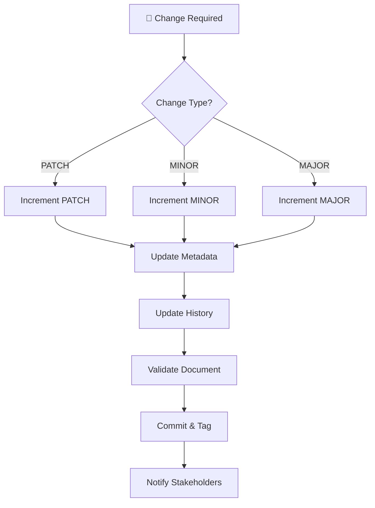

# Versioning Policy

> **Semantic versioning framework for Political Sphere's documentation and templates**

<div align="center">

| Classification | Version | Last Updated |       Owner        | Review Cycle |    Status    |
| :------------: | :-----: | :----------: | :----------------: | :----------: | :----------: |
|  🔒 Internal   | `1.0.0` |  2025-10-29  | Documentation Team |  Quarterly   | **Approved** |

</div>

---

## 🎯 Purpose

This Versioning Policy establishes standardized rules for versioning Political Sphere's documentation, templates, and related artifacts. The policy ensures clear version identification, change tracking, backward compatibility, and stakeholder communication while supporting compliance and audit requirements.

### 💡 Business Value

<table>
<tr>
<td width="20%"><b>🔢 Clarity</b></td>
<td>Clear version identification prevents confusion and errors</td>
</tr>
<tr>
<td><b>📋 Accountability</b></td>
<td>Complete audit trail of changes and approvals</td>
</tr>
<tr>
<td><b>🔄 Compatibility</b></td>
<td>Predictable impact of version changes on dependent processes</td>
</tr>
<tr>
<td><b>🚀 Efficiency</b></td>
<td>Automated versioning reduces manual overhead</td>
</tr>
<tr>
<td><b>📈 Quality</b></td>
<td>Structured approach ensures consistent versioning practices</td>
</tr>
</table>

---

## 📋 Semantic Versioning (SemVer)

### Version Format

All documents and templates use Semantic Versioning 2.0.0:

```
MAJOR.MINOR.PATCH[-PRERELEASE][+BUILD]
```

**Components:**

- **MAJOR**: Breaking changes, significant restructuring
- **MINOR**: New features, substantial improvements, backward-compatible
- **PATCH**: Bug fixes, corrections, minor updates
- **PRERELEASE**: Alpha, beta, release candidate identifiers
- **BUILD**: Build metadata (timestamps, commit hashes)

### Examples

| Version          | Change Type     | Example                 |
| ---------------- | --------------- | ----------------------- |
| `1.0.0`          | Initial release | First published version |
| `1.1.0`          | Minor update    | Added new section       |
| `1.1.1`          | Patch           | Fixed typo              |
| `2.0.0`          | Major change    | Complete restructure    |
| `1.2.0-alpha.1`  | Prerelease      | Draft for review        |
| `1.2.0+20231029` | Build metadata  | Timestamped build       |

---

## 🔄 Version Increment Rules

### MAJOR Version (X.y.z)

Increment MAJOR version when:

- **Breaking Changes**: Changes that break existing processes or expectations
- **Significant Restructure**: Complete document reorganization
- **Scope Changes**: Major expansion or contraction of document scope
- **Regulatory Changes**: Updates required by new laws or regulations
- **Deprecated**: Document no longer supported (version becomes final)

**Examples:**

- Changing approval workflow from 3 tiers to 4 tiers
- Reorganizing entire policy structure
- Adding mandatory compliance requirements

### MINOR Version (x.Y.z)

Increment MINOR version when:

- **New Features**: Addition of new sections or capabilities

> **Semantic versioning framework for Political Sphere documents and templates**

<div align="center">

| Classification | Version | Last Updated |    Owner    | Review Cycle |
| :------------: | :-----: | :----------: | :---------: | :----------: |
|  🔒 Internal   | `1.0.0` |  2025-10-29  | DevOps Team |    Annual    |

</div>

---

## 🎯 Purpose

This Versioning Policy establishes standardized rules for versioning documents, templates, and policies within the Political Sphere project. The policy ensures predictable version management, clear communication of changes, and compatibility tracking across all documentation artifacts.

### 💡 Business Value

<table>
<tr>
<td width="20%"><b>🔢 Predictability</b></td>
<td>Clear version numbering enables reliable change tracking</td>
</tr>
<tr>
<td><b>🔗 Compatibility</b></td>
<td>Semantic versioning indicates breaking vs. compatible changes</td>
</tr>
<tr>
<td><b>📈 Traceability</b></td>
<td>Complete audit trail of document evolution</td>
</tr>
<tr>
<td><b>🚀 Automation</b></td>
<td>Automated versioning reduces manual errors</td>
</tr>
<tr>
<td><b>🔍 Compliance</b></td>
<td>Version history supports regulatory requirements</td>
</tr>
</table>

---

## 📋 Scope

### In Scope

- All project documentation (policies, procedures, guides)
- Document templates and standardized formats
- Version-controlled files in Git repositories
- API documentation and specifications
- Configuration files and deployment manifests

### Out of Scope

- Source code (follows separate versioning in CI/CD)
- Binary artifacts and build outputs
- Personal notes and temporary documents
- External third-party documentation

---

## 🔢 Semantic Versioning Scheme

### Version Format

All documents follow semantic versioning: **MAJOR.MINOR.PATCH**

```
MAJOR.MINOR.PATCH
  │     │     │
  │     │     └─ PATCH: Bug fixes, corrections, formatting
  │     └─────── MINOR: New features, clarifications, additions
  └───────────── MAJOR: Breaking changes, restructuring
```

**Examples:**

- `1.0.0` - Initial release
- `1.1.0` - Added new section on AI ethics
- `1.1.1` - Fixed typo in compliance section
- `2.0.0` - Complete restructure for GDPR compliance

---

### When to Increment Versions

#### PATCH Version (x.x.🔼)

Increment for backward-compatible fixes:

- ✅ Typo corrections and grammar fixes
- ✅ Formatting improvements
- ✅ Link updates and reference corrections
- ✅ Minor clarifications that don't change meaning
- ✅ Metadata updates (dates, approvers)
- ✅ Non-substantive editorial changes

#### MINOR Version (x.🔼.0)

Increment for backward-compatible additions:

- ✅ New sections or subsections
- ✅ Additional examples or use cases
- ✅ Expanded explanations or details
- ✅ New cross-references or related links
- ✅ Enhanced templates with optional fields
- ✅ Additional compliance mappings

#### MAJOR Version (🔼.0.0)

Increment for breaking changes:

- ❌ Removal of mandatory sections
- ❌ Significant restructuring requiring migration
- ❌ Changes to approval requirements
- ❌ Modifications to core policies
- ❌ Breaking template format changes
- ❌ Changes affecting regulatory compliance

---

## 📝 Version Metadata

### Required Metadata

All versioned documents must include:

```yaml
---
version: '1.2.3'
last_updated: '2025-10-29'
author: 'Documentation Team'
reviewer: 'Technical Lead'
approver: 'Compliance Officer'
change_summary: 'Added AI ethics section and updated GDPR references'
breaking_changes: false
related_versions:
  - template: 'adr-template.md@2.1.0'
  - policy: 'classification-policy.md@1.0.0'
---
```

### Version History Table

Include in document header:

| Version | Date       | Author     | Change Summary                | Breaking |
| ------- | ---------- | ---------- | ----------------------------- | -------- |
| 1.2.3   | 2025-10-29 | Doc Team   | Added AI ethics section       | No       |
| 1.2.2   | 2025-09-15 | Compliance | Updated GDPR references       | No       |
| 1.2.1   | 2025-08-01 | Legal      | Fixed privacy policy link     | No       |
| 1.2.0   | 2025-07-15 | Security   | Added encryption requirements | No       |
| 1.1.0   | 2025-06-01 | DevOps     | New template features         | No       |
| 1.0.0   | 2025-05-01 | Doc Team   | Initial release               | N/A      |

---

## 🔄 Version Management Process

### Creating New Versions



### Version Control Workflow

1. **Change Identification**
   - Determine change type (PATCH/MINOR/MAJOR)
   - Assess impact on stakeholders
   - Check for breaking changes

2. **Version Increment**
   - Update version number in document metadata
   - Add entry to version history table
   - Update change summary and breaking changes flag

3. **Validation & Testing**
   - Automated validation of version format
   - Link checking and reference validation
   - Template compliance verification

4. **Publication**
   - Commit to repository with descriptive message
   - Create Git tag for major/minor versions
   - Update cross-references in dependent documents

---

## 🏷️ Branching and Release Strategy

### Branch Naming Convention

```
docs/[document-type]/[document-name]/v[MAJOR].[MINOR]
```

**Examples:**

- `docs/policy/privacy-policy/v1.2`
- `docs/template/adr-template/v2.1`
- `docs/guide/api-documentation/v1.0`

### Release Branches

**Main Branch:** `main` or `master`

- Always contains latest stable versions
- Protected branch requiring PR approval
- Automated validation on commits

**Development Branch:** `develop`

- Integration branch for new features
- May contain unreleased changes
- Regular merges from feature branches

**Feature Branches:** `feature/[document-name]-[change-description]`

- Short-lived branches for specific changes
- Merged via pull request with review
- Automatic cleanup after merge

### Tagging Strategy

**Version Tags:**

- `v[MAJOR].[MINOR].[PATCH]` for releases
- `v[MAJOR].[MINOR].[PATCH]-rc.[N]` for release candidates
- Annotated tags with change summaries

**Example Tags:**

- `v1.2.3` - Stable release
- `v2.0.0-rc.1` - First release candidate for v2.0.0
- `v1.1.0-alpha.1` - Alpha release for v1.1.0

---

## 🔗 Dependency Management

### Template Dependencies

Documents may depend on specific template versions:

```yaml
template_dependencies:
  - name: 'adr-template.md'
    version: '>=2.1.0'
    required: true
  - name: 'model-card-template.md'
    version: '>=1.0.0'
    required: false
```

### Cross-Document References

When referencing other documents, specify versions:

```markdown
See [Classification Policy](./document-classification-policy.md) v1.0.0 for details.
```

### Compatibility Matrix

| Document          | Compatible Template Versions | Notes                         |
| ----------------- | ---------------------------- | ----------------------------- |
| Privacy Policy    | adr-template.md >=2.0.0      | Requires legal review section |
| API Docs          | api-template.md >=1.1.0      | Supports OpenAPI 3.0+         |
| Security Policies | security-template.md >=1.0.0 | ISO 27001 compliant           |

---

## 🛠️ Automation & Tools

### Version Management Tools

**CLI Commands:**

```bash
# Increment version automatically
npm run version:bump -- --document=path/to/doc.md --type=minor --summary="Added new section"

# Validate version format
npm run version:validate -- --document=path/to/doc.md

# Generate changelog
npm run version:changelog -- --document=path/to/doc.md --format=markdown

# Check dependencies
npm run version:deps -- --document=path/to/doc.md
```

### Git Integration

**Pre-commit Hooks:**

- Version format validation
- Metadata completeness check
- Dependency version compatibility
- Breaking change flag verification

**CI/CD Integration:**

- Automated version bumping on approved changes
- Tag creation for releases
- Cross-document reference validation
- Dependency impact analysis

### IDE Extensions

**VS Code Extension Features:**

- Version increment suggestions
- Metadata auto-completion
- Dependency validation
- Change type detection
- Breaking change warnings

---

## 📊 Version Metrics & Monitoring

### Key Metrics

**Version Health:**

- Average time between versions (target: <30 days for active docs)
- Version increment distribution (PATCH:MINOR:MAJOR ratio)
- Breaking change frequency (target: <10% of releases)
- Template adoption rate (target: >95%)

**Quality Metrics:**

- Version format compliance (target: 100%)
- Metadata completeness (target: 100%)
- Dependency resolution success (target: >99%)
- Automated validation pass rate (target: >95%)

**Usage Metrics:**

- Document version access patterns
- Template version popularity
- Cross-reference validity rate
- Stakeholder version awareness

### Monitoring Dashboard

Live metrics available at: `https://metrics.politicalsphere.com/versions`

**Real-time Indicators:**

- Version compliance status
- Breaking change alerts
- Dependency conflicts
- Release pipeline status

---

## 🚨 Breaking Changes Policy

### Breaking Change Process

1. **Impact Assessment**
   - Identify affected documents and stakeholders
   - Evaluate migration effort and timeline
   - Assess business and compliance impact

2. **Communication Plan**
   - Notify affected teams 30 days in advance
   - Provide migration guide and timeline
   - Schedule training and support sessions

3. **Migration Support**
   - Automated migration scripts where possible
   - Dedicated support team during transition
   - Rollback procedures documented

4. **Post-Migration Review**
   - Validate successful migration
   - Gather stakeholder feedback
   - Update processes based on lessons learned

### Breaking Change Categories

| Category                | Notice Period | Migration Support   | Rollback Window |
| ----------------------- | ------------- | ------------------- | --------------- |
| **Template Format**     | 60 days       | Full automation     | 30 days         |
| **Policy Requirements** | 90 days       | Guided migration    | 60 days         |
| **Regulatory Changes**  | 30 days       | Priority support    | 14 days         |
| **Security Updates**    | 7 days        | Emergency migration | 24 hours        |

---

## 📚 Training & Awareness

### Required Training

**All Personnel:**

- Versioning basics (annual)
- Semantic versioning principles (annual)
- Tool usage and automation (annual)

**Document Owners:**

- Version management workflow (initial + annual)
- Breaking change procedures (annual)
- Dependency management (quarterly)

**Developers/DevOps:**

- Automation tools and scripts (quarterly)
- CI/CD integration (quarterly)
- Advanced versioning techniques (biannual)

### Training Materials

- **Versioning Quick Reference Guide**
- **Breaking Change Decision Tree**
- **Automation Tool Documentation**
- **Video Tutorials:** Version management workflows
- **Interactive Scenarios:** Version increment practice

---

## 📞 Contact & Support

<table>
<tr>
<td width="50%">

### 🛠️ DevOps Team

- 📧 **Email:** devops@politicalsphere.com
- 💬 **Slack:** `#devops`
- 🕒 **Office Hours:** Mon-Fri 10AM-12PM UTC
- 📺 **Zoom:** [DevOps Office Hours](https://zoom.us/devops-office-hours)

</td>
<td width="50%">

### 📋 Documentation Team

- 📧 **Email:** docs@politicalsphere.com
- 💬 **Slack:** `#documentation`
- 🕒 **Office Hours:** Tuesdays 2-3 PM UTC
- 📞 **Support:** Ext. 1234

</td>
</tr>
</table>

---

## ❓ Frequently Asked Questions

### Q: How do I know if a change requires a MAJOR version bump?

**A:** Ask: "Will this break existing processes or require manual migration?" If yes, it's MAJOR. Examples: removing required sections, changing approval workflows, breaking template compatibility.

### Q: Can I have multiple versions of the same document active?

**A:** Yes, but only for transitional periods. Use version branches and clearly communicate which is the active version. Avoid confusion by limiting to 2 concurrent versions maximum.

### Q: What if I need to make an emergency change?

**A:** For critical security or compliance issues, you can bypass normal versioning. Document the emergency justification and complete full versioning process retrospectively within 24 hours.

### Q: How are template versions managed differently?

**A:** Templates follow the same semantic versioning but have additional constraints: MAJOR changes require migration guides, MINOR changes must be backward compatible, PATCH changes are purely corrective.

### Q: What happens when a dependent template is updated?

**A:** The system checks compatibility automatically. If incompatible, you'll receive a notification to update your document or accept the compatibility risk with documentation.

### Q: How do I handle version conflicts in cross-references?

**A:** Use version ranges in references (e.g., "v1.2.x") or pin to specific versions. The validation tools will flag conflicts and suggest resolutions.

---

<div align="center">

### 📋 Document Control

|         Field         |      Value       |
| :-------------------: | :--------------: |
| 🏷️ **Classification** |     Internal     |
|    🔢 **Version**     |     `1.0.0`      |
|  📅 **Last Review**   |    2025-10-29    |
|  🔄 **Next Review**   |    2026-10-29    |
|    ✍️ **Approver**    | DevOps Team Lead |

---

**Made with ❤️ by the Political Sphere DevOps Team**

</div>
