# Political Sphere - File Structure

> **Clean, readable hierarchy with industry-standard organization**

## 📋 Quick Navigation

- [Project Overview](#project-overview)
- [Root Configuration](#root-configuration)
- [Development Environment](#development-environment)
- [GitHub & CI/CD](#github--cicd)
- [Applications](#applications)
- [Libraries](#libraries)
- [Documentation](#documentation)
- [Infrastructure](#infrastructure)
- [Scripts & Tools](#scripts--tools)
- [AI Assets](#ai-assets)

---

## � Project Overview

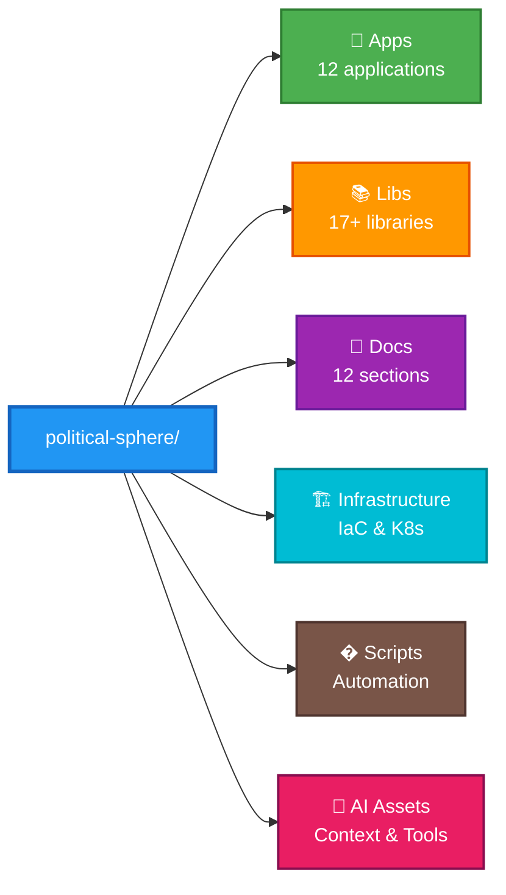

---

## 📦 Root Configuration

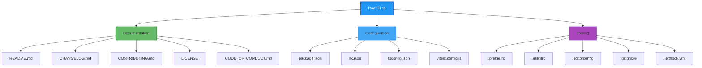

---

## 🔧 Development Environment

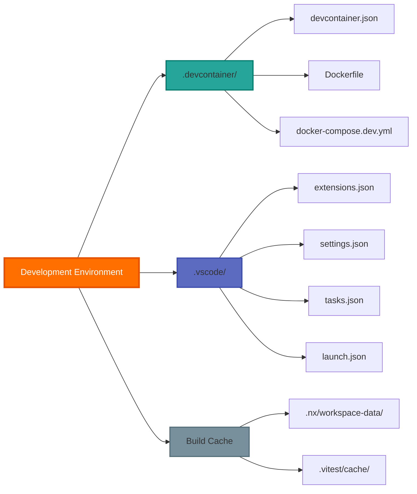

---

## 🤖 GitHub & CI/CD

### Workflows

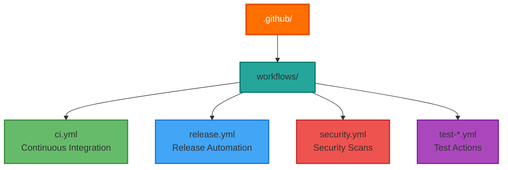

### Reusable Actions

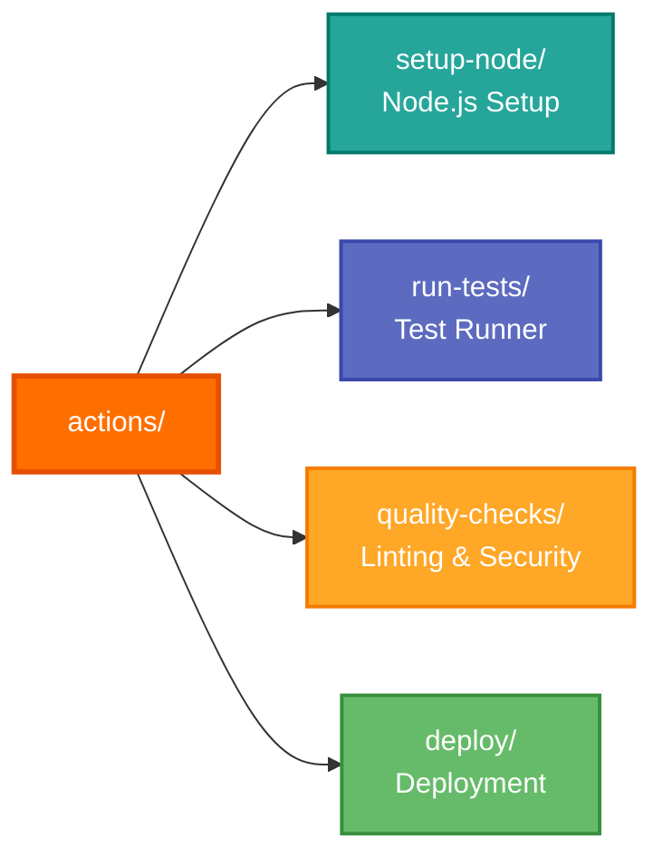

### Templates & Policies

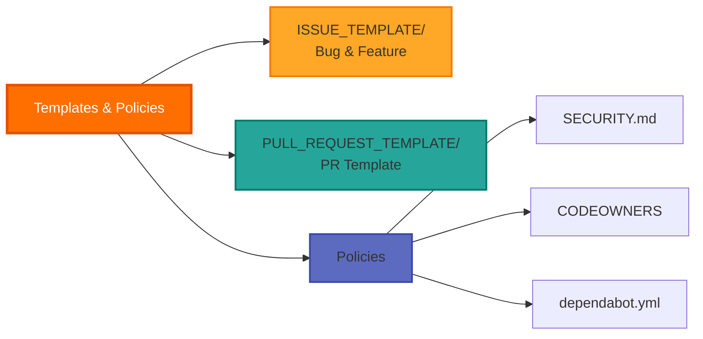

---

## 📱 Applications

### Core Services

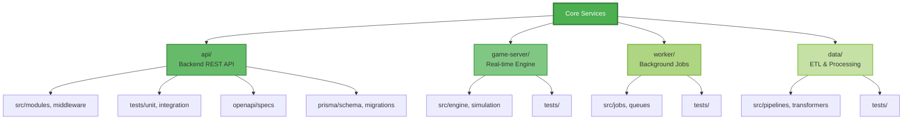

### Frontend Applications

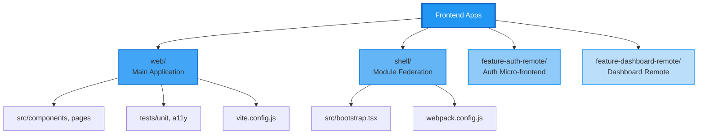

### Support Applications

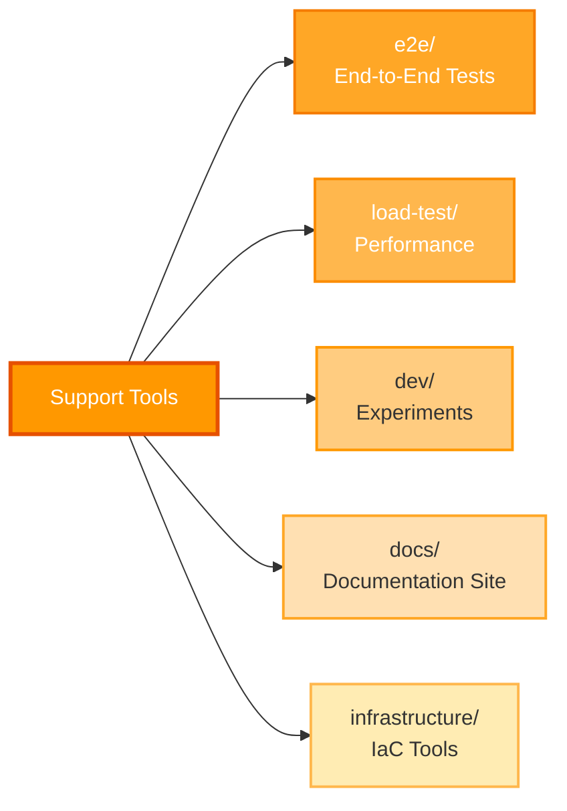

---

## 📚 Libraries

### Shared Utilities

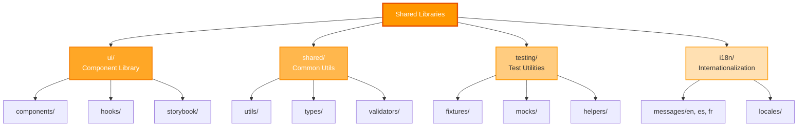

### Platform Services

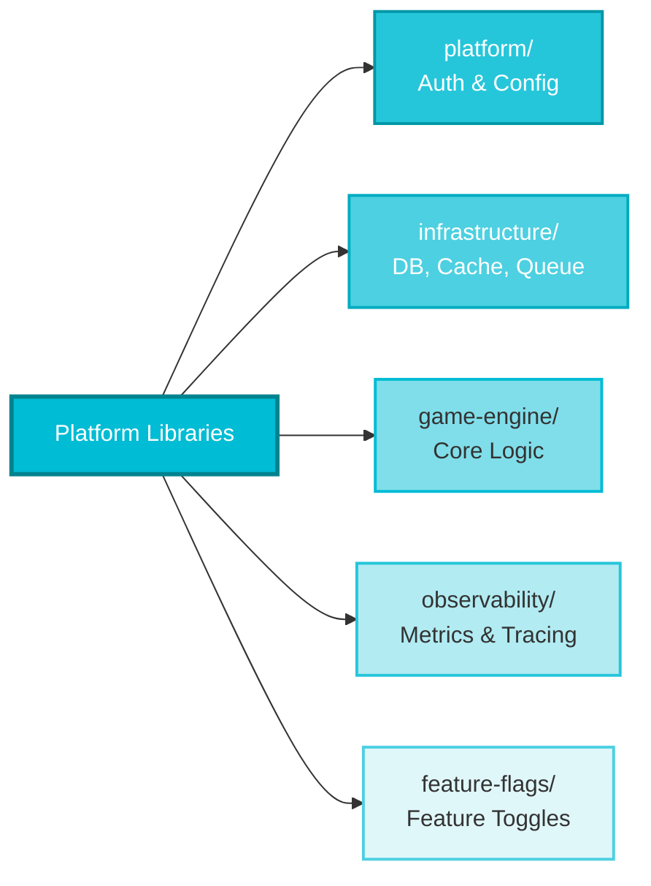

### Domain Logic

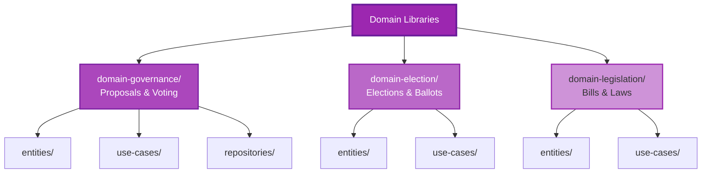

### Data Layer

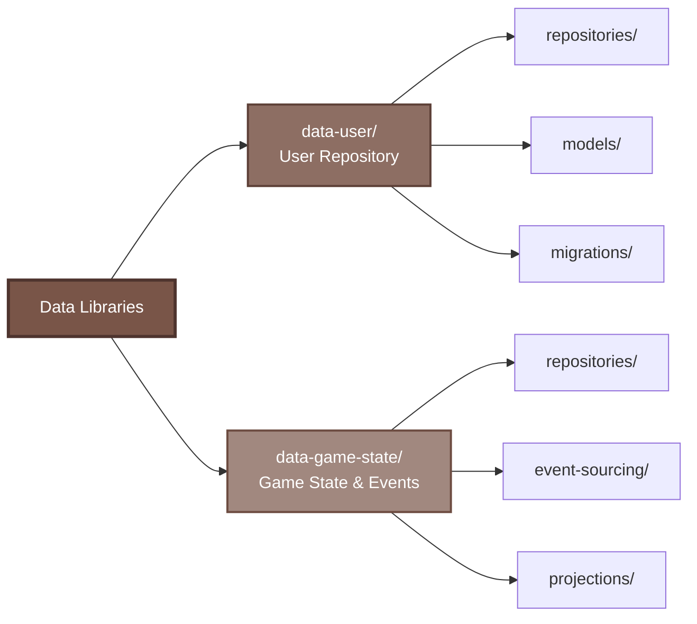

---

## 📖 Documentation

### Foundation & Strategy

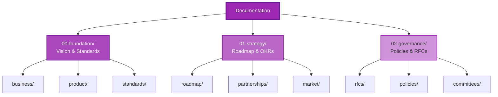

### Legal & Compliance

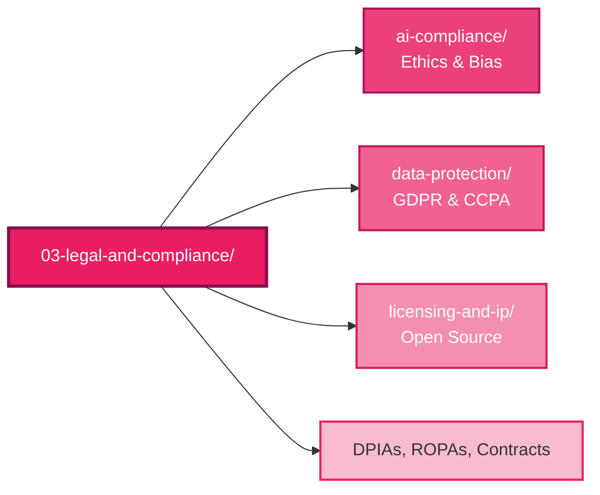

### Technical Documentation

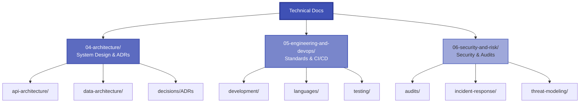

### Product & Operations

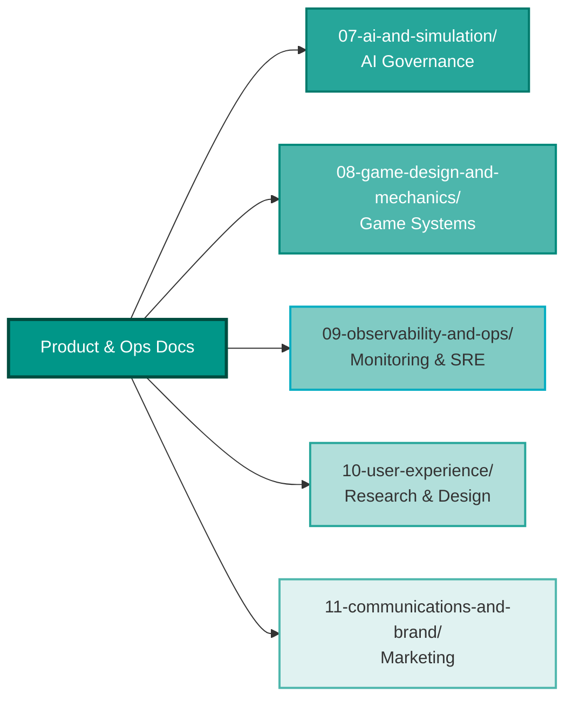

---

## 🏗️ Infrastructure

### Cloud Resources

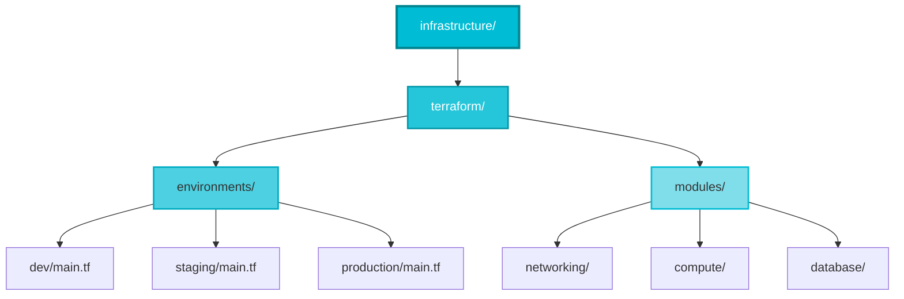

### Container Orchestration

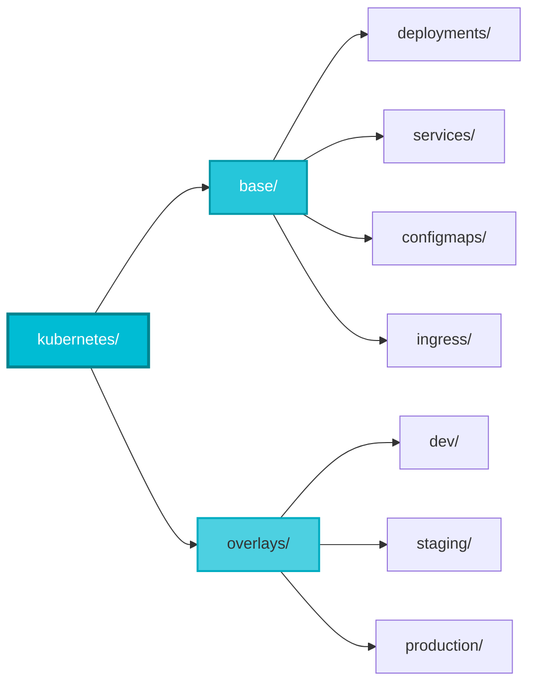

### Secrets & Config

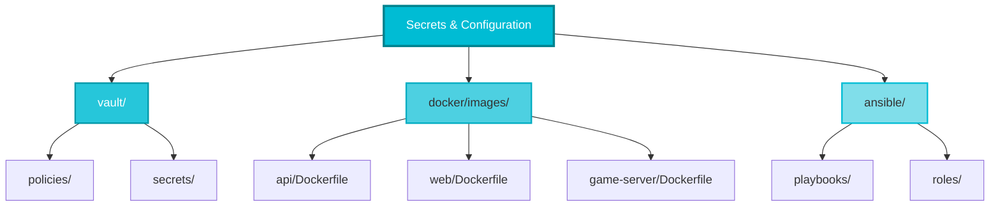

---

## 🔨 Scripts & Tools

### Automation Scripts

```mermaid
graph LR
    Scripts[scripts/]

    Scripts --> CI[ci/<br/>CI/CD Automation]
    Scripts --> DB[db/<br/>Database Ops]
    Scripts --> Dev[dev/<br/>Dev Tools]
    Scripts --> Test[testing/<br/>Test Runners]
    Scripts --> Deploy[deployment/<br/>Deploy & Rollback]
    Scripts --> Chaos[chaos/<br/>Chaos Engineering]

    style Scripts fill:#795548,stroke:#4E342E,stroke-width:3px,color:#fff
    style CI fill:#8D6E63,stroke:#5D4037,stroke-width:2px,color:#fff
    style DB fill:#A1887F,stroke:#6D4C41,stroke-width:2px,color:#fff
    style Dev fill:#BCAAA4,stroke:#795548,stroke-width:2px
    style Test fill:#D7CCC8,stroke:#8D6E63,stroke-width:2px
    style Deploy fill:#8D6E63,stroke:#5D4037,stroke-width:2px,color:#fff
    style Chaos fill:#A1887F,stroke:#6D4C41,stroke-width:2px,color:#fff
```

### Development Tools

```mermaid
graph TB
    Tools[tools/]

    Tools --> Gen[generators/<br/>Code Generation]
    Gen --> appgen[app-generator/]
    Gen --> libgen[lib-generator/]
    Gen --> compgen[component-generator/]

    Tools --> Exec[executors/<br/>Custom Executors]
    Exec --> deployexec[deploy-executor/]
    Exec --> e2eexec[e2e-executor/]

    Tools --> Demo[demo/<br/>Sample Data]

    style Tools fill:#607D8B,stroke:#37474F,stroke-width:3px,color:#fff
    style Gen fill:#78909C,stroke:#455A64,stroke-width:2px,color:#fff
    style Exec fill:#90A4AE,stroke:#546E7A,stroke-width:2px
    style Demo fill:#B0BEC5,stroke:#607D8B,stroke-width:2px
```

---

## 🤖 AI Assets

### AI Context & Knowledge

```mermaid
graph TB
    AI[ai/]

    AI --> Cache[cache/<br/>Context & Response]
    AI --> Index[index/<br/>Codebase Vectors]
    AI --> Knowledge[knowledge/<br/>Architecture Guides]
    AI --> Metrics[metrics/<br/>Performance Tracking]

    style AI fill:#E91E63,stroke:#880E4F,stroke-width:3px,color:#fff
    style Cache fill:#EC407A,stroke:#AD1457,stroke-width:2px,color:#fff
    style Index fill:#F06292,stroke:#C2185B,stroke-width:2px,color:#fff
    style Knowledge fill:#F48FB1,stroke:#D81B60,stroke-width:2px,color:#fff
    style Metrics fill:#F8BBD0,stroke:#E91E63,stroke-width:2px
```

### AI Tools & Prompts

```mermaid
graph LR
    AITools[AI Tools & Prompts]

    AITools --> Bundles[context-bundles/<br/>Service Contexts]
    AITools --> Prompts[prompts/<br/>Templates]
    AITools --> Patterns[patterns/<br/>Code Patterns]
    AITools --> Policies[policies/<br/>Safety Guidelines]
    AITools --> Evals[evals/<br/>Regression Tests]

    style AITools fill:#E91E63,stroke:#880E4F,stroke-width:3px,color:#fff
    style Bundles fill:#EC407A,stroke:#AD1457,stroke-width:2px,color:#fff
    style Prompts fill:#F06292,stroke:#C2185B,stroke-width:2px,color:#fff
    style Patterns fill:#F48FB1,stroke:#D81B60,stroke-width:2px,color:#fff
    style Policies fill:#F8BBD0,stroke:#E91E63,stroke-width:2px
    style Evals fill:#EC407A,stroke:#AD1457,stroke-width:2px,color:#fff
```

---

## 💾 Data & Configuration

### Runtime Data

```mermaid
graph LR
    Data[data/]

    Data --> Seeds[seeds/<br/>Seed Data]
    Data --> Fixtures[fixtures/<br/>Test Fixtures]
    Data --> DB[*.db<br/>SQLite Databases]

    style Data fill:#607D8B,stroke:#37474F,stroke-width:3px,color:#fff
    style Seeds fill:#78909C,stroke:#455A64,stroke-width:2px,color:#fff
    style Fixtures fill:#90A4AE,stroke:#546E7A,stroke-width:2px
    style DB fill:#B0BEC5,stroke:#607D8B,stroke-width:2px
```

### Configuration Files

```mermaid
graph TB
    Config[config/]

    Config --> Env[env/<br/>.env files]
    Config --> TS[typescript/<br/>tsconfig files]
    Config --> ESLint[eslint/<br/>.eslintrc files]
    Config --> Vitest[vitest/<br/>vitest configs]
    Config --> Docker[docker/<br/>docker-compose files]

    style Config fill:#3F51B5,stroke:#283593,stroke-width:3px,color:#fff
    style Env fill:#5C6BC0,stroke:#3949AB,stroke-width:2px,color:#fff
    style TS fill:#7986CB,stroke:#3F51B5,stroke-width:2px,color:#fff
    style ESLint fill:#9FA8DA,stroke:#5C6BC0,stroke-width:2px
    style Vitest fill:#C5CAE9,stroke:#7986CB,stroke-width:2px
    style Docker fill:#5C6BC0,stroke:#3949AB,stroke-width:2px,color:#fff
```

### Reports & Output

```mermaid
graph LR
    Reports[reports/]

    Reports --> Coverage[coverage/<br/>Test Coverage]
    Reports --> Results[test-results/<br/>Test Reports]
    Reports --> Security[security/<br/>Security Scans]
    Reports --> SBOM[sbom/<br/>Bill of Materials]
    Reports --> AIPerf[ai/<br/>Agent Performance]

    style Reports fill:#FF6F00,stroke:#E65100,stroke-width:3px,color:#fff
    style Coverage fill:#FF8F00,stroke:#EF6C00,stroke-width:2px,color:#fff
    style Results fill:#FFA000,stroke:#F57C00,stroke-width:2px,color:#fff
    style Security fill:#FFB300,stroke:#FB8C00,stroke-width:2px
    style SBOM fill:#FFC107,stroke:#FF9800,stroke-width:2px
    style AIPerf fill:#FFCA28,stroke:#FFA000,stroke-width:2px
```

---

## 📊 Quick Reference

### Directory Counts

- **Applications**: 12 (api, web, game-server, worker, data, shell, 2 remotes, e2e, load-test, dev, docs, infrastructure)
- **Libraries**: 17+ (shared, ui, platform, infrastructure, game-engine, testing, observability, feature-flags, i18n, 3 domains, 2 data layers)
- **Documentation**: 12 sections (foundation through brand/communications)
- **Infrastructure**: 5 tools (Terraform, Kubernetes, Docker, Vault, Ansible)

### Common Patterns

**App Structure**:

```
app-name/
├── src/          # Source code
├── tests/        # Test files
├── project.json  # Nx config
├── tsconfig.json # TypeScript
└── README.md     # Docs
```

**Library Structure**:

```
lib-name/
├── src/          # Source code
├── tests/        # Test files
├── project.json  # Nx config
└── README.md     # Docs
```

### Color Legend

- 🔵 **Blue**: Core services, configuration
- 🟢 **Green**: Applications, frontend
- 🟠 **Orange**: Libraries, shared code
- 🟣 **Purple**: Documentation, governance
- 🔷 **Cyan**: Infrastructure, DevOps
- 🟤 **Brown**: Scripts, automation, data
- 🔴 **Pink/Red**: AI assets, security
  setupnode --> snaction[action.yml]
  setupnode --> snsh[setup-node.sh]
  setupnode --> snreadme[README.md]

  actions --> runtests[run-tests/]
  runtests --> rtaction[action.yml]
  runtests --> rtsh[run-tests.sh]
  runtests --> parse[parse-results.mjs]
  runtests --> upload[upload-artifacts.sh]
  runtests --> covconfig[coverage.config.json]
  runtests --> rtreadme[README.md]

  actions --> setupdeps[setup-node-deps/]
  actions --> quality[quality-checks/]

  actions --> deploy[deploy/]
  deploy --> depaction[action.yml]
  deploy --> rundeploy[run-deploy.sh]
  deploy --> buildpush[build-and-push.sh]
  deploy --> helm[helm-deploy.sh]
  deploy --> kubectl[kubectl-apply.sh]
  deploy --> argocd[argocd-sync.sh]
  deploy --> rollback[rollback.sh]
  deploy --> validate[validate-manifests.sh]
  deploy --> depreadme[README.md]

  %% Templates
  GitHub --> issuetemp[ISSUE_TEMPLATE/]
  issuetemp --> bugreport[bug_report.yml]
  issuetemp --> featurereq[feature_request.yml]
  issuetemp --> secreport[security_report.yml]

  GitHub --> prtemp[PULL_REQUEST_TEMPLATE/]
  prtemp --> prmd[PULL_REQUEST.md]

  %% Other files
  GitHub --> ghsecurity[SECURITY.md]
  GitHub --> support[SUPPORT.md]
  GitHub --> codeowners[CODEOWNERS]
  GitHub --> funding[FUNDING.yml]
  GitHub --> dependabot[dependabot.yml]
  GitHub --> copilot[copilot-instructions.md]
  GitHub --> ghreadme[README.md]

  style GitHub fill:#e8f5e9,stroke:#1b5e20,stroke-width:3px
  style workflows fill:#c8e6c9
  style actions fill:#a5d6a7
  style issuetemp fill:#81c784
  style prtemp fill:#66bb6a

````

---

## 📱 Applications (apps/)

```mermaid
graph TB
    Apps[apps/]

    %% API Service
    Apps --> api[api/]
    api --> apisrc[src/]
    apisrc --> modules[modules/]
    apisrc --> middleware[middleware/]
    apisrc --> utils[utils/]
    apisrc --> server[server.ts]

    api --> apitests[tests/]
    apitests --> apiunit[unit/]
    apitests --> apiint[integration/]
    apitests --> apifixtures[fixtures/]

    api --> openapi[openapi/]
    openapi --> apiyaml[api.yaml]
    openapi --> schemas[schemas/]
    openapi --> generated[generated/]

    api --> prisma[prisma/]
    prisma --> schema[schema.prisma]
    prisma --> migrations[migrations/]
    prisma --> seeds[seeds/]

    api --> apiproject[project.json]
    api --> apitsconfig[tsconfig.json]
    api --> apienv[.env.example]
    api --> apireadme[README.md]

    %% Web Application
    Apps --> web[web/]
    web --> websrc[src/]
    websrc --> components[components/]
    websrc --> pages[pages/]
    websrc --> hooks[hooks/]
    websrc --> webutils[utils/]
    websrc --> styles[styles/]
    websrc --> assets[assets/]
    websrc --> main[main.tsx]

    web --> webtests[tests/]
    webtests --> webunit[unit/]
    webtests --> webint[integration/]
    webtests --> a11y[accessibility/]

    web --> public[public/]
    web --> webproject[project.json]
    web --> viteconfig[vite.config.js]
    web --> webenv[.env.example]
    web --> webreadme[README.md]

    %% Game Server
    Apps --> gameserver[game-server/]
    gameserver --> gamesrc[src/]
    gamesrc --> engine[engine/]
    gamesrc --> simulation[simulation/]
    gamesrc --> websocket[websocket/]
    gamesrc --> gameserv[server.ts]

    gameserver --> gametests[tests/]
    gameserver --> gameproject[project.json]
    gameserver --> gametsconfig[tsconfig.json]
    gameserver --> gamereadme[README.md]

    %% Worker
    Apps --> worker[worker/]
    worker --> workersrc[src/]
    workersrc --> jobs[jobs/]
    workersrc --> queues[queues/]
    workersrc --> workerfile[worker.ts]

    worker --> workertests[tests/]
    worker --> workerproject[project.json]
    worker --> workertsconfig[tsconfig.json]
    worker --> workerreadme[README.md]

    %% Data Service
    Apps --> data[data/]
    data --> datasrc[src/]
    datasrc --> pipelines[pipelines/]
    pipelines --> userpipe[user-data-pipeline.ts]
    pipelines --> analytics[analytics-pipeline.ts]
    pipelines --> gamesync[game-state-sync.ts]

    datasrc --> transformers[transformers/]
    transformers --> normalize[normalize-user-data.ts]
    transformers --> aggregate[aggregate-metrics.ts]
    transformers --> sanitize[sanitize-inputs.ts]

    datasrc --> connectors[connectors/]
    connectors --> dbconn[database-connector.ts]
    connectors --> apiconn[api-connector.ts]
    connectors --> external[external-sources.ts]

    datasrc --> datajobs[jobs/]
    datajobs --> scheduled[scheduled-imports.ts]
    datajobs --> cleanup[data-cleanup.ts]
    datajobs --> exports[export-reports.ts]

    datasrc --> dataserver[server.ts]

    data --> datatests[tests/]
    datatests --> dataunit[unit/]
    datatests --> dataint[integration/]
    datatests --> datafixtures[fixtures/]

    data --> dataconfig[config/]
    dataconfig --> pipeconfig[pipeline.config.json]
    dataconfig --> sources[sources.config.json]

    data --> dataproject[project.json]
    data --> datatsconfig[tsconfig.json]
    data --> dataenv[.env.example]
    data --> datareadme[README.md]

    style Apps fill:#e8f5e9,stroke:#1b5e20,stroke-width:3px
    style api fill:#c8e6c9
    style web fill:#a5d6a7
    style gameserver fill:#81c784
    style worker fill:#66bb6a
    style data fill:#4caf50
````

---

## 📱 Applications (continued)

```mermaid
graph TB
    Apps2[apps/]

    %% Module Federation
    Apps2 --> shell[shell/]
    shell --> shellsrc[src/]
    shellsrc --> bootstrap[bootstrap.tsx]
    shellsrc --> remotes[remotes/]

    shell --> shellproject[project.json]
    shell --> webpack[webpack.config.js]
    shell --> shellreadme[README.md]

    Apps2 --> authremote[feature-auth-remote/]
    authremote --> authsrc[src/]
    authsrc --> authcomp[components/]
    authsrc --> authindex[index.tsx]

    authremote --> authproject[project.json]
    authremote --> authwebpack[webpack.config.js]
    authremote --> authreadme[README.md]

    Apps2 --> dashremote[feature-dashboard-remote/]
    dashremote --> dashsrc[src/]
    dashremote --> dashproject[project.json]
    dashremote --> dashreadme[README.md]

    %% Testing Apps
    Apps2 --> e2e[e2e/]
    e2e --> e2eweb[web/]
    e2eweb --> home[home.spec.ts]
    e2eweb --> login[login.spec.ts]
    e2eweb --> gameplay[gameplay.spec.ts]
    e2eweb --> admin[admin.spec.ts]

    e2e --> e2eapi[api/]
    e2eapi --> health[health.spec.ts]
    e2eapi --> auth[auth.spec.ts]
    e2eapi --> gameactions[game-actions.spec.ts]

    e2e --> e2efixtures[fixtures/]
    e2e --> playwright[playwright.config.ts]
    e2e --> e2eproject[project.json]
    e2e --> e2ereadme[README.md]

    Apps2 --> loadtest[load-test/]
    loadtest --> scenarios[scenarios/]
    scenarios --> apiload[api-load.js]
    scenarios --> gamesim[game-simulation.js]
    scenarios --> wsstress[websocket-stress.js]
    scenarios --> concurrent[concurrent-users.js]

    loadtest --> k6config[k6.config.js]
    loadtest --> artillery[artillery.yml]
    loadtest --> loadproject[project.json]
    loadtest --> loadreadme[README.md]

    %% Development Tools
    Apps2 --> dev[dev/]
    dev --> devsrc[src/]
    devsrc --> experiments[experiments/]
    experiments --> prototypes[feature-prototypes/]
    experiments --> aiplay[ai-playground/]
    experiments --> perftests[performance-tests/]

    devsrc --> tools[tools/]
    tools --> generators[data-generators/]
    tools --> mocks[mock-servers/]
    tools --> harnesses[test-harnesses/]

    devsrc --> sandbox[sandbox/]
    sandbox --> demos[component-demos/]
    sandbox --> apiexplore[api-exploration/]
    sandbox --> inttests[integration-tests/]

    devsrc --> devmain[main.ts]

    dev --> devscripts[scripts/]
    devscripts --> seed[seed-dev-data.ts]
    devscripts --> reset[reset-environment.ts]
    devscripts --> benchmark[benchmark-features.ts]

    dev --> devproject[project.json]
    dev --> devtsconfig[tsconfig.json]
    dev --> devreadme[README.md]

    %% Documentation Site
    Apps2 --> docs[docs/]
    docs --> docsdocs[docs/]
    docsdocs --> gettingstarted[getting-started/]
    gettingstarted --> intro[introduction.md]
    gettingstarted --> install[installation.md]
    gettingstarted --> quickstart[quick-start.md]

    docsdocs --> guides[guides/]
    guides --> arch[architecture.md]
    guides --> development[development.md]
    guides --> deployment[deployment.md]
    guides --> testing[testing.md]

    docsdocs --> apidocs[api/]
    apidocs --> rest[rest-api.md]
    apidocs --> ws[websocket-api.md]
    apidocs --> graphql[graphql-schema.md]

    docsdocs --> gamedocs[game/]
    gamedocs --> mechanics[mechanics.md]
    gamedocs --> gameplay[gameplay.md]
    gamedocs --> rules[rules.md]

    docsdocs --> contributing[contributing/]
    contributing --> codestyle[code-style.md]
    contributing --> prs[pull-requests.md]
    contributing --> security[security.md]

    docs --> docssrc[src/]
    docssrc --> docscomp[components/]
    docssrc --> docspages[pages/]
    docssrc --> css[css/]

    docs --> static[static/]
    static --> img[img/]
    static --> files[files/]

    docs --> docusaurus[docusaurus.config.js]
    docs --> sidebars[sidebars.js]
    docs --> docsproject[project.json]
    docs --> docspackage[package.json]
    docs --> docsreadme[README.md]

    %% Infrastructure App
    Apps2 --> infra[infrastructure/]
    infra --> infrasrc[src/]
    infrasrc --> provisioning[provisioning/]
    provisioning --> aws[aws-setup.ts]
    provisioning --> k8s[kubernetes-bootstrap.ts]
    provisioning --> dbinit[database-init.ts]
    provisioning --> network[network-config.ts]

    infrasrc --> infradeployment[deployment/]
    infradeployment --> staging[deploy-staging.ts]
    infradeployment --> production[deploy-production.ts]
    infradeployment --> infrarollback[rollback.ts]
    infradeployment --> bluegreen[blue-green-switch.ts]

    infrasrc --> monitoring[monitoring/]
    monitoring --> setupmetrics[setup-metrics.ts]
    monitoring --> alerts[configure-alerts.ts]
    monitoring --> dashboard[dashboard-builder.ts]

    infrasrc --> cli[cli/]
    cli --> commands[commands/]
    cli --> prompts[prompts/]
    cli --> cliindex[index.ts]

    infrasrc --> infrautils[utils/]
    infrautils --> awsclient[aws-client.ts]
    infrautils --> kubectlwrap[kubectl-wrapper.ts]
    infrautils --> terraform[terraform-runner.ts]

    infra --> infratests[tests/]
    infratests --> infraunit[unit/]
    infratests --> infraint[integration/]

    infra --> infrascripts[scripts/]
    infrascripts --> validateconfig[validate-config.sh]
    infrascripts --> smoketests[smoke-tests.sh]
    infrascripts --> disaster[disaster-recovery.sh]

    infra --> infraproject[project.json]
    infra --> infratsconfig[tsconfig.json]
    infra --> infraenv[.env.example]
    infra --> infrareadme[README.md]

    Apps2 --> appsreadme[README.md]

    style Apps2 fill:#e8f5e9,stroke:#1b5e20,stroke-width:3px
    style shell fill:#c8e6c9
    style e2e fill:#a5d6a7
    style loadtest fill:#81c784
    style dev fill:#66bb6a
    style docs fill:#4caf50
    style infra fill:#43a047
```

---

## 📚 Libraries (libs/)

```mermaid
graph TB
    Libs[libs/]

    %% Shared Libraries
    Libs --> shared[shared/]
    shared --> sharedsrc[src/]
    sharedsrc --> sharedutils[utils/]
    sharedsrc --> constants[constants/]
    sharedsrc --> types[types/]
    sharedsrc --> validators[validators/]

    shared --> sharedtests[tests/]
    shared --> sharedproject[project.json]
    shared --> sharedtsconfig[tsconfig.json]
    shared --> sharedreadme[README.md]

    %% UI Library
    Libs --> ui[ui/]
    ui --> uisrc[src/]
    uisrc --> uicomponents[components/]
    uisrc --> uihooks[hooks/]
    uisrc --> uistyles[styles/]
    uisrc --> uiindex[index.ts]

    ui --> uitests[tests/]
    ui --> storybook[storybook/]
    ui --> uiproject[project.json]
    ui --> uireadme[README.md]

    %% Platform Library
    Libs --> platform[platform/]
    platform --> platformsrc[src/]
    platformsrc --> authlib[auth/]
    platformsrc --> storage[storage/]
    platformsrc --> config[config/]

    platform --> platformtests[tests/]
    platform --> platformproject[project.json]
    platform --> platformreadme[README.md]

    %% Infrastructure Library
    Libs --> infralib[infrastructure/]
    infralib --> infralibsrc[src/]
    infralibsrc --> database[database/]
    infralibsrc --> cache[cache/]
    infralibsrc --> messaging[messaging/]

    infralib --> infralibtests[tests/]
    infralib --> infralibproject[project.json]
    infralib --> infralibreadme[README.md]

    %% Game Engine Library
    Libs --> gameengine[game-engine/]
    gameengine --> gamesrc[src/]
    gamesrc --> core[core/]
    gamesrc --> gamemechanics[mechanics/]
    gamesrc --> ai[ai/]
    gamesrc --> gamesimulation[simulation/]

    gameengine --> gametests[tests/]
    gameengine --> gameproject[project.json]
    gameengine --> gamereadme[README.md]

    %% Testing Library
    Libs --> testing[testing/]
    testing --> testingsrc[src/]
    testingsrc --> fixtures[fixtures/]
    fixtures --> userfixtures[user-fixtures.ts]
    fixtures --> gamestatefixtures[game-state-fixtures.ts]
    fixtures --> apiresponse[api-response-fixtures.ts]
    fixtures --> dbfixtures[database-fixtures.ts]

    testingsrc --> testmocks[mocks/]
    testmocks --> apimocks[api-mocks.ts]
    testmocks --> servicemocks[service-mocks.ts]
    testmocks --> wsmocks[websocket-mocks.ts]
    testmocks --> storagemocks[storage-mocks.ts]

    testingsrc --> helpers[helpers/]
    helpers --> testenv[test-environment.ts]
    helpers --> asynchelpers[async-helpers.ts]
    helpers --> domhelpers[dom-helpers.ts]
    helpers --> asserthelpers[assertion-helpers.ts]

    testingsrc --> factories[factories/]
    factories --> userfactory[user-factory.ts]
    factories --> gamefactory[game-factory.ts]
    factories --> eventfactory[event-factory.ts]
    factories --> entityfactory[entity-factory.ts]

    testingsrc --> testingindex[index.ts]

    testing --> testingtests[tests/]
    testing --> testingproject[project.json]
    testing --> testingtsconfig[tsconfig.json]
    testing --> testingreadme[README.md]

    %% Observability Library
    Libs --> observability[observability/]
    observability --> obssrc[src/]
    obssrc --> tracing[tracing/]
    tracing --> tracer[tracer.ts]
    tracing --> spanproc[span-processor.ts]
    tracing --> context[context-propagation.ts]
    tracing --> instrumentation[instrumentation.ts]

    obssrc --> metrics[metrics/]
    metrics --> meter[meter.ts]
    metrics --> counters[counters.ts]
    metrics --> gauges[gauges.ts]
    metrics --> histograms[histograms.ts]
    metrics --> custommetrics[custom-metrics.ts]

    obssrc --> logging[logging/]
    logging --> logger[structured-logger.ts]
    logging --> formatter[log-formatter.ts]
    logging --> levels[log-levels.ts]
    logging --> correlation[correlation.ts]

    obssrc --> exporters[exporters/]
    exporters --> jaeger[jaeger-exporter.ts]
    exporters --> prometheus[prometheus-exporter.ts]
    exporters --> console[console-exporter.ts]
    exporters --> otlp[otlp-exporter.ts]

    obssrc --> obsindex[index.ts]

    observability --> obstests[tests/]
    observability --> obsproject[project.json]
    observability --> obstsconfig[tsconfig.json]
    observability --> obsreadme[README.md]

    style Libs fill:#fff3e0,stroke:#e65100,stroke-width:3px
    style shared fill:#ffe0b2
    style ui fill:#ffcc80
    style platform fill:#ffb74d
    style infralib fill:#ffa726
    style gameengine fill:#ff9800
    style testing fill:#fb8c00
    style observability fill:#f57c00
```

---

## 📚 Libraries (continued)

```mermaid
graph TB
    Libs2[libs/]

    %% Feature Flags
    Libs2 --> flags[feature-flags/]
    flags --> flagssrc[src/]
    flagssrc --> flagconfig[config/]
    flagconfig --> flagdefs[flag-definitions.ts]
    flagconfig --> environments[environments.ts]
    flagconfig --> defaultflags[default-flags.json]

    flagssrc --> providers[providers/]
    providers --> local[local-provider.ts]
    providers --> remote[remote-provider.ts]
    providers --> launchdarkly[launchdarkly-provider.ts]
    providers --> split[split-provider.ts]

    flagssrc --> flaghooks[hooks/]
    flaghooks --> usefeature[use-feature-flag.ts]
    flaghooks --> useflagvalue[use-flag-value.ts]
    flaghooks --> usevariation[use-variation.ts]

    flagssrc --> client[client/]
    client --> flagclient[flag-client.ts]
    client --> flagcache[cache.ts]
    client --> evaluator[evaluator.ts]

    flagssrc --> flagindex[index.ts]

    flags --> flagtests[tests/]
    flags --> flagproject[project.json]
    flags --> flagtsconfig[tsconfig.json]
    flags --> flagreadme[README.md]

    %% i18n Library
    Libs2 --> i18n[i18n/]
    i18n --> i18nsrc[src/]
    i18nsrc --> messages[messages/]
    messages --> en[en/]
    en --> commonjson[common.json]
    en --> gamejson[game.json]
    en --> authjson[auth.json]
    en --> errorsjson[errors.json]

    messages --> es[es/]
    messages --> fr[fr/]
    messages --> de[de/]

    i18nsrc --> locales[locales/]
    locales --> localeconfig[locale-config.ts]
    locales --> dateformats[date-formats.ts]
    locales --> numberformats[number-formats.ts]
    locales --> currencyformats[currency-formats.ts]

    i18nsrc --> extraction[extraction/]
    extraction --> extract[extract-messages.ts]
    extraction --> compile[compile-messages.ts]
    extraction --> validatetrans[validate-translations.ts]

    i18nsrc --> i18nhooks[hooks/]
    i18nhooks --> usetranslation[use-translation.ts]
    i18nhooks --> uselocale[use-locale.ts]
    i18nhooks --> useformat[use-format.ts]

    i18nsrc --> i18nindex[index.ts]

    i18n --> i18ntests[tests/]
    i18n --> i18nproject[project.json]
    i18n --> i18ntsconfig[tsconfig.json]
    i18n --> i18nreadme[README.md]

    %% Domain Libraries
    Libs2 --> governance[domain-governance/]
    governance --> govsrc[src/]
    govsrc --> entities[entities/]
    entities --> proposal[proposal.entity.ts]
    entities --> vote[vote.entity.ts]
    entities --> committee[committee.entity.ts]
    entities --> motion[motion.entity.ts]

    govsrc --> usecases[use-cases/]
    usecases --> createproposal[create-proposal.use-case.ts]
    usecases --> castvote[cast-vote.use-case.ts]
    usecases --> tallyvotes[tally-votes.use-case.ts]
    usecases --> amend[amend-proposal.use-case.ts]

    govsrc --> repositories[repositories/]
    repositories --> proposalrepo[proposal.repository.ts]
    repositories --> voterepo[vote.repository.ts]
    repositories --> committeerepo[committee.repository.ts]

    govsrc --> valueobjects[value-objects/]
    valueobjects --> votecount[vote-count.vo.ts]
    valueobjects --> quorum[quorum.vo.ts]
    valueobjects --> votingperiod[voting-period.vo.ts]

    govsrc --> govindex[index.ts]

    governance --> govtests[tests/]
    govtests --> govunit[unit/]
    govtests --> govint[integration/]

    governance --> govproject[project.json]
    governance --> govtsconfig[tsconfig.json]
    governance --> govreadme[README.md]

    Libs2 --> election[domain-election/]
    election --> electsrc[src/]
    electsrc --> electentities[entities/]
    electentities --> electionent[election.entity.ts]
    electentities --> candidate[candidate.entity.ts]
    electentities --> ballot[ballot.entity.ts]
    electentities --> constituency[constituency.entity.ts]

    electsrc --> electusecases[use-cases/]
    electusecases --> createelection[create-election.use-case.ts]
    electusecases --> registercandidate[register-candidate.use-case.ts]
    electusecases --> castballot[cast-ballot.use-case.ts]
    electusecases --> countballots[count-ballots.use-case.ts]
    electusecases --> certify[certify-results.use-case.ts]

    electsrc --> electrepos[repositories/]
    electrepos --> electionrepo[election.repository.ts]
    electrepos --> candidaterepo[candidate.repository.ts]
    electrepos --> ballotrepo[ballot.repository.ts]

    electsrc --> electvo[value-objects/]
    electvo --> electoral[electoral-system.vo.ts]
    electvo --> voteshare[vote-share.vo.ts]
    electvo --> term[term-length.vo.ts]

    electsrc --> electindex[index.ts]

    election --> electtests[tests/]
    electtests --> electunit[unit/]
    electtests --> electint[integration/]

    election --> electproject[project.json]
    election --> electtsconfig[tsconfig.json]
    election --> electreadme[README.md]

    Libs2 --> legislation[domain-legislation/]
    legislation --> legsrc[src/]
    legsrc --> legentities[entities/]
    legentities --> bill[bill.entity.ts]
    legentities --> law[law.entity.ts]
    legentities --> amendment[amendment.entity.ts]
    legentities --> statute[statute.entity.ts]

    legsrc --> legusecases[use-cases/]
    legusecases --> draftbill[draft-bill.use-case.ts]
    legusecases --> proposeamend[propose-amendment.use-case.ts]
    legusecases --> pass[pass-legislation.use-case.ts]
    legusecases --> repeal[repeal-law.use-case.ts]

    legsrc --> legrepos[repositories/]
    legrepos --> billrepo[bill.repository.ts]
    legrepos --> lawrepo[law.repository.ts]
    legrepos --> amendrepo[amendment.repository.ts]

    legsrc --> legvo[value-objects/]
    legvo --> reading[reading-stage.vo.ts]
    legvo --> legaltext[legal-text.vo.ts]
    legvo --> effective[effective-date.vo.ts]

    legsrc --> legindex[index.ts]

    legislation --> legtests[tests/]
    legtests --> legunit[unit/]
    legtests --> legint[integration/]

    legislation --> legproject[project.json]
    legislation --> legtsconfig[tsconfig.json]
    legislation --> legreadme[README.md]

    %% Data Layer Libraries
    Libs2 --> datauser[data-user/]
    datauser --> dusersrc[src/]
    dusersrc --> duserrepos[repositories/]
    duserrepos --> userrepo[user.repository.ts]
    duserrepos --> profilerepo[profile.repository.ts]
    duserrepos --> prefsrepo[preferences.repository.ts]
    duserrepos --> sessionrepo[session.repository.ts]

    dusersrc --> dusermodels[models/]
    dusermodels --> usermodel[user.model.ts]
    dusermodels --> profilemodel[profile.model.ts]
    dusermodels --> rolemodel[role.model.ts]
    dusermodels --> permmodel[permission.model.ts]

    dusersrc --> dumigrations[migrations/]
    dumigrations --> createusers[001-create-users-table.ts]
    dumigrations --> addroles[002-add-roles.ts]
    dumigrations --> addprofiles[003-add-profiles.ts]
    dumigrations --> migindex[index.ts]

    dusersrc --> duserqueries[queries/]
    duserqueries --> finduser[find-user-by-id.query.ts]
    duserqueries --> searchusers[search-users.query.ts]
    duserqueries --> getstats[get-user-stats.query.ts]

    dusersrc --> duserindex[index.ts]

    datauser --> dusertests[tests/]
    dusertests --> duserunit[unit/]
    dusertests --> duserint[integration/]

    datauser --> duserproject[project.json]
    datauser --> dusertsconfig[tsconfig.json]
    datauser --> duserreadme[README.md]

    Libs2 --> datagame[data-game-state/]
    datagame --> dgamesrc[src/]
    dgamesrc --> dgamerepos[repositories/]
    dgamerepos --> gamestaterepo[game-state.repository.ts]
    dgamerepos --> playerrepo[player-state.repository.ts]
    dgamerepos --> worldrepo[world-state.repository.ts]
    dgamerepos --> eventrepo[event.repository.ts]

    dgamesrc --> dgamemodels[models/]
    dgamemodels --> gamestatemodel[game-state.model.ts]
    dgamemodels --> playerstatemodel[player-state.model.ts]
    dgamemodels --> worldstatemodel[world-state.model.ts]
    dgamemodels --> snapshotmodel[snapshot.model.ts]

    dgamesrc --> eventsourcing[event-sourcing/]
    eventsourcing --> eventstore[event-store.ts]

    eventsourcing --> eventhandlers[event-handlers/]
    eventhandlers --> playeraction[player-action.handler.ts]
    eventhandlers --> worldevent[world-event.handler.ts]
    eventhandlers --> systemevent[system-event.handler.ts]

    eventsourcing --> projections[projections/]
    projections --> gameprojection[game-state.projection.ts]
    projections --> playerstats[player-stats.projection.ts]
    projections --> worldsummary[world-summary.projection.ts]

    eventsourcing --> snapshots[snapshots/]
    snapshots --> snapshotmgr[snapshot-manager.ts]
    snapshots --> snapshotstrat[snapshot-strategy.ts]

    eventsourcing --> esindex[index.ts]

    dgamesrc --> dgamequeries[queries/]
    dgamequeries --> getgamestate[get-game-state.query.ts]
    dgamequeries --> replay[replay-events.query.ts]
    dgamequeries --> aggregatestats[aggregate-stats.query.ts]

    dgamesrc --> dgameindex[index.ts]

    datagame --> dgametests[tests/]
    dgametests --> dgameunit[unit/]
    dgametests --> dgameint[integration/]

    datagame --> dgameproject[project.json]
    datagame --> dgametsconfig[tsconfig.json]
    datagame --> dgamereadme[README.md]

    Libs2 --> libsreadme[README.md]

    style Libs2 fill:#fff3e0,stroke:#e65100,stroke-width:3px
    style flags fill:#ffe0b2
    style i18n fill:#ffcc80
    style governance fill:#ffb74d
    style election fill:#ffa726
    style legislation fill:#ff9800
    style datauser fill:#fb8c00
    style datagame fill:#f57c00
```

---

## 📖 Documentation (docs/)

```mermaid
graph TB
    Docs[docs/]

    Docs --> foundation[00-foundation/]
    foundation --> business[business/]
    business --> businessmodel[business-model-overview.md]
    business --> market[market-brief.md]
    business --> revenue[revenue-streams.md]
    business --> competitive[competitive-analysis.md]

    foundation --> product[product/]
    product --> principles[product-principles.md]
    product --> personas[personas-and-use-cases.md]
    product --> stakeholders[stakeholder-map.md]
    product --> journeys[user-journeys.md]
    product --> value[value-proposition.md]

    foundation --> standards[standards/]
    standards --> stdoverview[standards-overview.md]
    standards --> glossary[glossary-domain-concepts.md]
    standards --> coding[coding-standards.md]
    standards --> a11y[accessibility-standards.md]
    standards --> secstd[security-standards.md]

    foundation --> vision[vision-mission.md]
    foundation --> values[core-values-ethics.md]
    foundation --> success[success-metrics-north-star.md]
    foundation --> foundreadme[README.md]

    Docs --> strategy[01-strategy/]
    strategy --> roadmap[roadmap/]
    roadmap --> strategic[strategic-roadmap-03-12-36-months.md]
    roadmap --> risked[risked-assumptions-and-bets.md]
    roadmap --> featurepri[feature-prioritization.md]
    roadmap --> techdebt[technical-debt-strategy.md]
    roadmap --> innovation[innovation-backlog.md]

    strategy --> partnerships[partnerships/]
    partnerships --> partnerstrat[partnerships-and-education-strategy.md]
    partnerships --> intl[internationalization-localization-strategy.md]
    partnerships --> vendor[vendor-management.md]
    partnerships --> ecosystem[ecosystem-development.md]

    strategy --> marketstrat[market/]
    marketstrat --> gtm[go-to-market-strategy.md]
    marketstrat --> acquisition[user-acquisition.md]
    marketstrat --> growth[growth-strategy.md]

    strategy --> productstrat[product-strategy.md]
    strategy --> okrs[objectives-and-key-results-okrs.md]
    strategy --> aistrat[ai-strategy-and-differentiation.md]
    strategy --> stratreadme[README.md]

    Docs --> governance[02-governance/]
    governance --> rfcs[rfcs/]
    rfcs --> rfctemplate[template.md]
    rfcs --> rfc001[001-feature-flags.md]
    rfcs --> rfcindex[index.md]

    governance --> policies[policies/]
    policies --> codereview[code-review-policy.md]
    policies --> change[change-management-policy.md]
    policies --> incident[incident-response-policy.md]
    policies --> datagov[data-governance-policy.md]

    governance --> committees[committees/]
    committees --> tgc[technical-governance-committee.md]
    committees --> seccouncil[security-council.md]
    committees --> arb[architecture-review-board.md]

    governance --> processes[processes/]
    processes --> decisionmaking[decision-making-process.md]
    processes --> escalation[escalation-procedures.md]
    processes --> approvals[approval-workflows.md]

    governance --> charter[governance-charter.md]
    governance --> decisionrights[decision-rights-matrix.md]
    governance --> raci[roles-and-responsibilities-raci.md]
    governance --> govreadme[README.md]

    Docs --> legal[03-legal-and-compliance/]
    legal --> aicompliance[ai-compliance/]
    aicompliance --> aiethics[ai-ethics-framework.md]
    aicompliance --> algotrns[algorithmic-transparency.md]
    aicompliance --> bias[bias-mitigation.md]
    aicompliance --> aiaudit[ai-audit-requirements.md]

    legal --> dataprotection[data-protection/]
    dataprotection --> gdpr[gdpr-compliance.md]
    dataprotection --> ccpa[ccpa-compliance.md]
    dataprotection --> privacydesign[privacy-by-design.md]
    dataprotection --> datamin[data-minimization.md]
    dataprotection --> consent[consent-management.md]
    dataprotection --> crossborder[cross-border-transfers.md]

    legal --> licensing[licensing-and-ip/]
    licensing --> opensource[open-source-licenses.md]
    licensing --> attributions[third-party-attributions.md]
    licensing --> patent[patent-strategy.md]
    licensing --> trademark[trademark-guidelines.md]

    legal --> dpias[DPIAs/]
    dpias --> dpiatemplate[template.md]
    dpias --> userprofile[user-profile-dpia.md]
    dpias --> airecommend[ai-recommendation-dpia.md]
    dpias --> dpiaindex[index.md]

    legal --> ropas[ROPAs/]
    ropas --> userropa[user-data-ropa.md]
    ropas --> analyticsropa[analytics-ropa.md]
    ropas --> ropaindex[index.md]

    legal --> accessibility[accessibility/]
    accessibility --> wcag[wcag-compliance-report.md]
    accessibility --> a11ystatement[accessibility-statement.md]
    accessibility --> remediation[remediation-plan.md]

    legal --> contracts[contracts/]
    contracts --> dpa[data-processing-agreement-template.md]
    contracts --> vendoragree[vendor-agreements.md]
    contracts --> sla[sla-templates.md]

    legal --> compliance[compliance.md]
    legal --> privacy[privacy-policy.md]
    legal --> terms[terms-of-service.md]
    legal --> cookie[cookie-policy.md]
    legal --> retention[data-retention-maps.md]
    legal --> regulatory[regulatory-register.md]
    legal --> legalreadme[README.md]

    style Docs fill:#fce4ec,stroke:#880e4f,stroke-width:3px
    style foundation fill:#f8bbd0
    style strategy fill:#f48fb1
    style governance fill:#f06292
    style legal fill:#ec407a
```

---

## 📖 Documentation (continued - Architecture, Engineering, Security)

```mermaid
graph TB
    Docs2[docs/]

    Docs2 --> architecture[04-architecture/]
    architecture --> apiarch[api-architecture/]
    apiarch --> rest[rest-api-design.md]
    apiarch --> graphqlschema[graphql-schema.md]
    apiarch --> wsprotocol[websocket-protocol.md]
    apiarch --> versioning[api-versioning.md]
    apiarch --> ratelimit[rate-limiting.md]
    apiarch --> authflows[authentication-flows.md]

    architecture --> dataarch[data-architecture/]
    dataarch --> dbschema[database-schema.md]
    dataarch --> datamodels[data-models.md]
    dataarch --> cachingstrat[caching-strategy.md]
    dataarch --> migration[data-migration-strategy.md]
    dataarch --> es[event-sourcing.md]

    architecture --> decisions[decisions/]
    decisions --> adrtemplate[template.md]
    decisions --> adr001[001-monorepo-structure.md]
    decisions --> adr002[002-module-federation.md]
    decisions --> adr003[003-testing-strategy.md]
    decisions --> adrindex[index.md]

    architecture --> frontendarch[frontend-architecture/]
    frontendarch --> componentarch[component-architecture.md]
    frontendarch --> statemgmt[state-management.md]
    frontendarch --> routing[routing-strategy.md]
    frontendarch --> modfed[module-federation.md]

    architecture --> backendarch[backend-architecture/]
    backendarch --> microservices[microservices-overview.md]
    backendarch --> boundaries[service-boundaries.md]
    backendarch --> messageq[message-queues.md]
    backendarch --> bgjobs[background-jobs.md]

    architecture --> infraarch[infrastructure-architecture/]
    infraarch --> cloudarch[cloud-architecture.md]
    infraarch --> networking[networking.md]
    infraarch --> containerization[containerization.md]
    infraarch --> orchestration[orchestration.md]

    architecture --> integration[integration-architecture/]
    integration --> thirdparty[third-party-integrations.md]
    integration --> webhooks[webhook-handlers.md]
    integration --> externalapis[external-apis.md]

    architecture --> archmd[architecture.md]
    architecture --> systemoverview[system-overview.md]
    architecture --> dddmap[domain-driven-design-map.md]
    architecture --> c4[c4-model-diagrams.md]
    architecture --> archreadme[README.md]

    Docs2 --> engineering[05-engineering-and-devops/]
    engineering --> devguides[development/]
    devguides --> backend[backend.md]
    devguides --> testingmd[testing.md]
    devguides --> quality[quality.md]
    devguides --> codereviewguide[code-review-guidelines.md]
    devguides --> gitworkflow[git-workflow.md]
    devguides --> branching[branching-strategy.md]
    devguides --> debugging[debugging-guide.md]

    engineering --> languages[languages/]
    languages --> typescript[typescript.md]
    languages --> react[react.md]
    languages --> node[node.md]
    languages --> sql[sql.md]

    engineering --> uxguides[ui/]
    uxguides --> uxa11y[ux-accessibility.md]
    uxguides --> designsys[design-system.md]
    uxguides --> componentlib[component-library.md]
    uxguides --> responsive[responsive-design.md]

    engineering --> cicd[ci-cd/]
    cicd --> pipeline[pipeline-overview.md]
    cicd --> ci[continuous-integration.md]
    cicd --> cd[continuous-deployment.md]
    cicd --> releasemd[release-management.md]
    cicd --> artifacts[artifact-management.md]
    cicd --> cicdreadme[README.md]

    engineering --> iac[infrastructure-as-code/]
    iac --> terraformstd[terraform-standards.md]
    iac --> k8spatterns[kubernetes-patterns.md]
    iac --> dockerbp[docker-best-practices.md]
    iac --> configmgmt[configuration-management.md]

    engineering --> testingguides[testing/]
    testingguides --> unit[unit-testing.md]
    testingguides --> integration[integration-testing.md]
    testingguides --> e2etesting[e2e-testing.md]
    testingguides --> performance[performance-testing.md]
    testingguides --> sectesting[security-testing.md]
    testingguides --> a11ytesting[accessibility-testing.md]
    testingguides --> testdata[test-data-management.md]

    engineering --> toolsguides[tools/]
    toolsguides --> nxguide[nx-monorepo-guide.md]
    toolsguides --> viteconfig[vite-configuration.md]
    toolsguides --> vitestsetup[vitest-setup.md]
    toolsguides --> devenv[development-environment.md]

    engineering --> perfguides[performance/]
    perfguides --> optimization[optimization-strategies.md]
    perfguides --> budgets[performance-budgets.md]
    perfguides --> monitoringperf[monitoring.md]
    perfguides --> profiling[profiling.md]

    engineering --> monorepo[monorepo-standards-nx.md]
    engineering --> archaudit[architectural-alignment-audit.md]
    engineering --> engreadme[README.md]

    Docs2 --> securitydocs[06-security-and-risk/]
    securitydocs --> audits[audits/]
    audits --> e2eaudit[END-TO-END-AUDIT-2025-10-29.md]
    audits --> secaudittemplate[security-audit-template.md]
    audits --> pentest[penetration-test-reports/]
    audits --> vulnassess[vulnerability-assessments/]

    securitydocs --> incidentresponse[incident-response/]
    incidentresponse --> irplan[incident-response-plan.md]

    incidentresponse --> runbooks[runbooks/]
    runbooks --> databreach[data-breach-runbook.md]
    runbooks --> ddos[ddos-runbook.md]
    runbooks --> unauth[unauthorized-access-runbook.md]

    incidentresponse --> postmortems[post-mortems/]
    incidentresponse --> escalationmatrix[escalation-matrix.md]

    securitydocs --> threatmodel[threat-modeling/]
    threatmodel --> stride[threat-modeling-stride.md]
    threatmodel --> attacktrees[attack-trees.md]
    threatmodel --> scenarios[threat-scenarios.md]
    threatmodel --> mitigations[mitigation-strategies.md]

    securitydocs --> controls[security-controls/]
    controls --> authn[authentication.md]
    controls --> authz[authorization.md]
    controls --> encryption[encryption.md]
    controls --> secrets[secrets-management.md]
    controls --> netsec[network-security.md]
    controls --> appsec[application-security.md]

    securitydocs --> frameworks[compliance-frameworks/]
    frameworks --> asvs[owasp-asvs.md]
    frameworks --> nist[nist-800-53.md]
    frameworks --> iso[iso-27001.md]
    frameworks --> soc2[soc2.md]

    securitydocs --> vulnmgmt[vulnerability-management/]
    vulnmgmt --> disclosure[vulnerability-disclosure-policy.md]
    vulnmgmt --> patch[patch-management.md]
    vulnmgmt --> depscan[dependency-scanning.md]
    vulnmgmt --> remtrack[remediation-tracking.md]

    securitydocs --> secmd[security.md]
    securitydocs --> riskregister[risk-register.md]
    securitydocs --> secpolicies[security-policies.md]
    securitydocs --> aup[acceptable-use-policy.md]
    securitydocs --> secreadme[README.md]

    style Docs2 fill:#fce4ec,stroke:#880e4f,stroke-width:3px
    style architecture fill:#e91e63
    style engineering fill:#c2185b
    style securitydocs fill:#ad1457
```

---

## 📖 Documentation (final - AI, Game, Ops, UX, Brand)

```mermaid
graph TB
    Docs3[docs/]

    Docs3 --> aidocs[07-ai-and-simulation/]
    aidocs --> modelinv[model-inventory-and-system-cards/]
    modelinv --> recommend[recommendation-model-card.md]
    modelinv --> contentmod[content-moderation-model-card.md]
    modelinv --> npcbehavior[npc-behavior-model-card.md]
    modelinv --> modinvindex[index.md]

    aidocs --> aigovdocs[ai-governance/]
    aigovdocs --> aigovmd[ai-governance.md]
    aigovdocs --> aigovframework[ai-governance-framework.md]
    aigovdocs --> ethical[ethical-guidelines.md]
    aigovdocs --> biasmon[bias-monitoring.md]
    aigovdocs --> oversight[human-oversight.md]

    aidocs --> aidev[ai-development/]
    aidev --> training[model-training.md]
    aidev --> evaluation[model-evaluation.md]
    aidev --> mlops[mlops-pipeline.md]
    aidev --> featureeng[feature-engineering.md]
    aidev --> modelver[model-versioning.md]

    aidocs --> aideploy[ai-deployment/]
    aideploy --> serving[model-serving.md]
    aideploy --> abtest[a-b-testing.md]
    aideploy --> canary[canary-deployments.md]
    aideploy --> airollback[rollback-procedures.md]

    aidocs --> simengine[simulation-engine/]
    simengine --> simarch[simulation-architecture.md]
    simengine --> agentbehaviors[agent-behaviors.md]
    simengine --> economic[economic-modeling.md]
    simengine --> political[political-dynamics.md]

    aidocs --> responsibleai[responsible-ai/]
    responsibleai --> fairness[fairness-metrics.md]
    responsibleai --> transparency[transparency-requirements.md]
    responsibleai --> explainability[explainability.md]
    responsibleai --> privacyml[privacy-preserving-ml.md]

    aidocs --> multiagent[multi-agent-orchestration.md]
    aidocs --> aitesting[ai-testing-validation.md]
    aidocs --> aireadme[README.md]

    Docs3 --> gamedocs[08-game-design-and-mechanics/]
    gamedocs --> gamemechanics[mechanics/]
    gamemechanics --> economy[economy-and-budgets.md]
    gamemechanics --> elections[elections-policy-and-mechanics.md]
    gamemechanics --> lawmaking[lawmaking-and-procedure-engine.md]
    gamemechanics --> media[media-press-and-public-opinion-system.md]
    gamemechanics --> votingsys[voting-systems.md]
    gamemechanics --> coalition[coalition-building.md]
    gamemechanics --> crisis[crisis-management.md]
    gamemechanics --> diplomacy[diplomacy-mechanics.md]

    gamedocs --> systems[systems/]
    systems --> ainpc[ai-npc-behaviours-and-tuning.md]
    systems --> parties[parties-caucuses-and-factions.md]
    systems --> roles[roles-and-progressions.md]
    systems --> world[world-and-institutions-blueprint.md]
    systems --> reputation[reputation-system.md]
    systems --> influence[influence-mechanics.md]
    systems --> events[event-system.md]

    gamedocs --> balance[balance/]
    balance --> philosophy[game-balance-philosophy.md]
    balance --> powerscaling[power-scaling.md]
    balance --> econbalance[economic-balance.md]
    balance --> playtesting[playtesting-feedback.md]

    gamedocs --> progression[progression/]
    progression --> playerprog[player-progression.md]
    progression --> skilltrees[skill-trees.md]
    progression --> achievements[achievements.md]
    progression --> unlocks[unlock-systems.md]

    gamedocs --> narrative[narrative/]
    narrative --> story[story-framework.md]
    narrative --> scenario[scenario-design.md]
    narrative --> character[character-development.md]
    narrative --> lore[world-lore.md]

    gamedocs --> multiplayer[multiplayer/]
    multiplayer --> matchmaking[matchmaking.md]
    multiplayer --> session[session-management.md]
    multiplayer --> playerinteract[player-interaction.md]
    multiplayer --> antigriefing[anti-griefing.md]

    gamedocs --> gdd[game-design-document.md]
    gamedocs --> gamereadme[README.md]

    Docs3 --> opsdocs[09-observability-and-ops/]
    opsdocs --> mon[monitoring/]
    mon --> metricsstrat[metrics-strategy.md]
    mon --> dashboards[dashboard-design.md]
    mon --> alerting[alerting-rules.md]
    mon --> slo[slo-sli-definitions.md]
    mon --> healthchecks[service-health-checks.md]

    opsdocs --> loggingdocs[logging/]
    loggingdocs --> logstrat[logging-strategy.md]
    loggingdocs --> structured[structured-logging.md]
    loggingdocs --> aggregation[log-aggregation.md]
    loggingdocs --> logretention[log-retention.md]
    loggingdocs --> auditlog[audit-logging.md]

    opsdocs --> tracingdocs[tracing/]
    tracingdocs --> distributed[distributed-tracing.md]
    tracingdocs --> otel[opentelemetry-setup.md]
    tracingdocs --> sampling[trace-sampling.md]
    tracingdocs --> perfanalysis[performance-analysis.md]

    opsdocs --> deploymentdocs[deployment/]
    deploymentdocs --> deploystrat[deployment-strategies.md]
    deploymentdocs --> bluegreen[blue-green-deployment.md]
    deploymentdocs --> canaryreleases[canary-releases.md]
    deploymentdocs --> rollbackproc[rollback-procedures.md]
    deploymentdocs --> featureflags[feature-flags.md]

    opsdocs --> dr[disaster-recovery/]
    dr --> backupstrat[backup-strategy.md]
    dr --> recovery[recovery-procedures.md]
    dr --> bcp[business-continuity-plan.md]
    dr --> failover[failover-testing.md]

    opsdocs --> capacity[capacity-planning/]
    capacity --> resourceplan[resource-planning.md]
    capacity --> scalingstrat[scaling-strategy.md]
    capacity --> costopt[cost-optimization.md]
    capacity --> forecast[performance-forecasting.md]

    opsdocs --> sre[sre/]
    sre --> oncall[on-call-procedures.md]
    sre --> incidentmgmt[incident-management.md]
    sre --> postmortemtemplate[post-mortem-template.md]
    sre --> errorbudgets[error-budgets.md]

    opsdocs --> operations[operations.md]
    opsdocs --> runbooktemplate[runbook-template.md]
    opsdocs --> opsreadme[README.md]

    Docs3 --> uxdocs[10-user-experience/]
    uxdocs --> research[research/]
    research --> userresearch[user-research-findings.md]
    research --> usability[usability-testing.md]
    research --> interviews[user-interviews.md]
    research --> analyticsinsights[analytics-insights.md]

    uxdocs --> design[design/]
    design --> designprin[design-principles.md]
    design --> visuallang[visual-language.md]
    design --> iconography[iconography.md]
    design --> typography[typography.md]

    uxdocs --> interact[interaction/]
    interact --> patterns[interaction-patterns.md]
    interact --> micro[micro-interactions.md]
    interact --> animations[animations.md]
    interact --> feedback[feedback-mechanisms.md]

    uxdocs --> a11ydocs[accessibility/]
    a11ydocs --> guidelines[accessibility-guidelines.md]
    a11ydocs --> screenreader[screen-reader-support.md]
    a11ydocs --> keyboard[keyboard-navigation.md]
    a11ydocs --> contrast[color-contrast.md]

    uxdocs --> uxreadme[README.md]

    Docs3 --> comms[11-communications-and-brand/]
    comms --> brand[brand/]
    brand --> brandguide[brand-guidelines.md]
    brand --> voice[voice-and-tone.md]
    brand --> visualid[visual-identity.md]
    brand --> messaging[messaging-framework.md]

    comms --> content[content/]
    content --> contentstrat[content-strategy.md]
    content --> writing[writing-guidelines.md]
    content --> localization[localization.md]
    content --> seo[seo-strategy.md]

    comms --> community[community/]
    community --> communitymgmt[community-management.md]
    community --> moderation[moderation-guidelines.md]
    community --> engagement[user-engagement.md]
    community --> social[social-media-strategy.md]

    comms --> marketing[marketing/]
    marketing --> marketingstrat[marketing-strategy.md]
    marketing --> campaigns[campaign-planning.md]
    marketing --> useracq[user-acquisition.md]
    marketing --> analyticstracking[analytics-tracking.md]

    comms --> commsreadme[README.md]

    Docs3 --> archive[archive/]
    archive --> deprecated[deprecated/]
    archive --> legacy[legacy-designs/]
    archive --> historical[historical-decisions/]

    Docs3 --> templates[templates/]
    templates --> adrtmpl[adr-template.md]
    templates --> rfctmpl[rfc-template.md]
    templates --> dpiatmpl[dpia-template.md]
    templates --> ropatmpl[ropa-template.md]
    templates --> runbooktmpl[runbook-template.md]
    templates --> postmortemtmpl[post-mortem-template.md]
    templates --> tmplreadme[README.md]

    Docs3 --> quickref[quick-ref.md]
    Docs3 --> todo[TODO.md]
    Docs3 --> structure[STRUCTURE.md]
    Docs3 --> docsreadme[README.md]

    style Docs3 fill:#fce4ec,stroke:#880e4f,stroke-width:3px
    style aidocs fill:#880e4f
    style gamedocs fill:#6a1b9a
    style opsdocs fill:#4a148c
    style uxdocs fill:#311b92
    style comms fill:#1a237e
```

---

## 🏗️ Infrastructure & Configuration

```mermaid
graph TB
    InfraConfig[Infrastructure & Config]

    InfraConfig --> infratf[infrastructure/terraform/]
    infratf --> envs[environments/]
    envs --> devenv[dev/]
    devenv --> devmain[main.tf]
    devenv --> devvars[variables.tf]
    devenv --> devoutputs[outputs.tf]

    envs --> stagingenv[staging/]
    stagingenv --> stagingmain[main.tf]
    stagingenv --> stagingvars[variables.tf]
    stagingenv --> stagingoutputs[outputs.tf]

    envs --> prodenv[production/]
    prodenv --> prodmain[main.tf]
    prodenv --> prodvars[variables.tf]
    prodenv --> prodoutputs[outputs.tf]

    infratf --> tfmodules[modules/]
    tfmodules --> networktf[networking/]
    tfmodules --> computetf[compute/]
    tfmodules --> databasetf[database/]
    tfmodules --> storagetf[storage/]

    InfraConfig --> k8s[infrastructure/kubernetes/]
    k8s --> k8sbase[base/]
    k8sbase --> deployments[deployments/]
    k8sbase --> services[services/]
    k8sbase --> configmaps[configmaps/]
    k8sbase --> k8ssecrets[secrets/]
    k8sbase --> ingress[ingress/]

    k8sbase --> sidecars[sidecars/]
    sidecars --> otel[otel-collector.yaml]
    sidecars --> logforward[log-forwarder.yaml]

    k8sbase --> basekustomize[kustomization.yaml]

    k8s --> overlays[overlays/]
    overlays --> devoverlay[dev/kustomization.yaml]
    overlays --> stagingoverlay[staging/kustomization.yaml]
    overlays --> prodoverlay[production/kustomization.yaml]

    InfraConfig --> dockerinfra[infrastructure/docker/images/]
    dockerinfra --> apidocker[api/Dockerfile]
    dockerinfra --> webdocker[web/Dockerfile]
    dockerinfra --> gamedocker[game-server/Dockerfile]
    dockerinfra --> workerdocker[worker/Dockerfile]

    InfraConfig --> vaultinfra[infrastructure/vault/]
    vaultinfra --> vaultpolicies[policies/]
    vaultpolicies --> apipolicy[api-policy.hcl]
    vaultpolicies --> webpolicy[web-policy.hcl]
    vaultpolicies --> adminpolicy[admin-policy.hcl]

    vaultinfra --> vaultsecrets[secrets/.gitkeep]

    InfraConfig --> ansible[infrastructure/ansible/]
    ansible --> playbooks[playbooks/]
    ansible --> ansibleroles[roles/]
    ansible --> inventory[inventory/]

    InfraConfig --> infrareadme[infrastructure/README.md]

    InfraConfig --> configdir[config/]
    configdir --> envconfig[env/]
    envconfig --> envexample[.env.example]
    envconfig --> envapi[.env.api.example]
    envconfig --> envweb[.env.web.example]
    envconfig --> envgame[.env.game-server.example]
    envconfig --> envworker[.env.worker.example]
    envconfig --> envschema[.schema.env]

    configdir --> tsconfig[typescript/]
    tsconfig --> tsconfigbase[tsconfig.base.json]
    tsconfig --> tsconfigapp[tsconfig.app.json]
    tsconfig --> tsconfiglib[tsconfig.lib.json]
    tsconfig --> tsconfigspec[tsconfig.spec.json]

    configdir --> eslintconfig[eslint/]
    eslintconfig --> eslintbase[.eslintrc.base.json]
    eslintconfig --> eslintapps[.eslintrc.apps.json]
    eslintconfig --> eslintlibs[.eslintrc.libs.json]
    eslintconfig --> eslinttests[.eslintrc.tests.json]

    configdir --> vitestconfig[vitest/]
    vitestconfig --> vitestbase[vitest.config.base.js]
    vitestconfig --> vitestunit[vitest.config.unit.js]
    vitestconfig --> vitestint[vitest.config.integration.js]
    vitestconfig --> viteste2e[vitest.config.e2e.js]

    configdir --> dockerconfig[docker/]
    dockerconfig --> composedev[docker-compose.dev.yml]
    dockerconfig --> composetest[docker-compose.test.yml]
    dockerconfig --> composeprod[docker-compose.prod.yml]
    dockerconfig --> dockerfilebase[Dockerfile.base]

    configdir --> configreadme[README.md]

    style InfraConfig fill:#e0f2f1,stroke:#004d40,stroke-width:3px
    style infratf fill:#b2dfdb
    style k8s fill:#80cbc4
    style dockerinfra fill:#4db6ac
    style vaultinfra fill:#26a69a
    style ansible fill:#009688
    style configdir fill:#00897b
```

---

## 🔨 Scripts

```mermaid
graph TB
    Scripts[scripts/]

    Scripts --> scriptci[ci/]
    scriptci --> fileplacement[check-file-placement.mjs]
    scriptci --> naming[enforce-naming.mjs]
    scriptci --> verifygithub[verify-github-config.mjs]
    scriptci --> changebudget[guard-change-budget.mjs]
    scriptci --> sbomgen[generate-sbom.mjs]
    scriptci --> secscans[run-security-scans.sh]
    scriptci --> attestation[build-attestation.sh]

    Scripts --> scriptdb[db/]
    scriptdb --> migrate[migrate.js]
    scriptdb --> seeddb[seed.js]
    scriptdb --> rollbackdb[rollback.js]
    scriptdb --> backupdb[backup.sh]
    scriptdb --> restoredb[restore.sh]

    Scripts --> scriptdev[dev/]
    scriptdev --> setupdev[setup-dev-environment.sh]
    scriptdev --> cleanupproc[cleanup-processes.sh]
    scriptdev --> perfmon[perf-monitor.sh]
    scriptdev --> resetdb[reset-local-db.sh]
    scriptdev --> gentestdata[generate-test-data.js]

    Scripts --> scripttest[testing/]
    scripttest --> runcoverage[run-vitest-coverage.js]
    scripttest --> testperapp[test-per-app.js]
    scripttest --> rune2e[run-e2e-tests.sh]
    scripttest --> genreport[generate-test-report.js]

    Scripts --> chaos[chaos/]
    chaos --> netlatency[network-latency.sh]
    chaos --> podfail[pod-failure.sh]
    chaos --> cpustress[cpu-stress.sh]
    chaos --> memleak[memory-leak.sh]

    Scripts --> scriptdeploy[deployment/]
    scriptdeploy --> deploystaging[deploy-staging.sh]
    scriptdeploy --> deployprod[deploy-production.sh]
    scriptdeploy --> smoketests[smoke-tests.sh]
    scriptdeploy --> rollbackdeploy[rollback.sh]

    Scripts --> scriptsreadme[README.md]

    style Scripts fill:#f1f8e9,stroke:#33691e,stroke-width:3px
    style scriptci fill:#dcedc8
    style scriptdb fill:#c5e1a5
    style scriptdev fill:#aed581
    style scripttest fill:#9ccc65
    style chaos fill:#8bc34a
    style scriptdeploy fill:#7cb342
```

---

## 🤖 AI Assets

```mermaid
graph TB
    AI[ai/]

    AI --> aicache[cache/]
    aicache --> contextcache[context-cache.json]
    aicache --> responsecache[response-cache.json]
    aicache --> workspacestate[workspace-state.json]

    AI --> aiindex[index/]
    aiindex --> codebaseindex[codebase-index.json]
    aiindex --> semanticvectors[semantic-vectors.json]

    AI --> aiknowledge[knowledge/]
    aiknowledge --> archoverviewai[architecture-overview.md]
    aiknowledge --> codepatterns[code-patterns.md]
    aiknowledge --> expertknowledge[expert-knowledge.json]
    aiknowledge --> troubleshooting[troubleshooting-guide.md]

    AI --> aimetrics[metrics/]
    aimetrics --> aimetricsfile[ai-metrics.json]
    aimetrics --> agentperf[agent-performance.json]
    aimetrics --> qualityscores[quality-scores.json]

    AI --> contextbundles[context-bundles/]
    contextbundles --> corecontext[core.md]
    contextbundles --> apiservice[api-service.md]
    contextbundles --> frontendservice[frontend-service.md]
    contextbundles --> projectstruct[project-structure.md]

    AI --> aiprompts[prompts/]
    aiprompts --> codereviewprompt[code-review.md]
    aiprompts --> refactoringprompt[refactoring.md]
    aiprompts --> testingprompt[testing.md]
    aiprompts --> documentationprompt[documentation.md]

    AI --> aipatterns[patterns/]
    aipatterns --> componentpatterns[component-patterns.md]
    aipatterns --> apipatterns[api-patterns.md]
    aipatterns --> testingpatterns[testing-patterns.md]

    AI --> aihistory[history/]
    aihistory --> interactions[interactions/]
    aihistory --> aadecisions[decisions/]

    AI --> aipolicies[policies/]
    aipolicies --> redteam[prompt-red-team-suites/]
    redteam --> injection[injection-tests.md]
    redteam --> biastests[bias-tests.md]
    redteam --> safety[safety-tests.md]

    aipolicies --> safetyguidelines[safety-guidelines.md]

    AI --> aievals[evals/]
    aievals --> regression[regression-tests/]
    regression --> codequality[code-quality.test.js]
    regression --> documentation[documentation.test.js]
    regression --> refactoring[refactoring.test.js]

    aievals --> benchmarks[benchmarks/]
    benchmarks --> accuracy[accuracy-benchmarks.json]
    benchmarks --> perfbench[performance-benchmarks.json]

    AI --> aitools[tools/]
    aitools --> assistant[ai-assistant.cjs]
    aitools --> indexer[semantic-indexer.cjs]
    aitools --> buildcontext[build-context.sh]
    aitools --> refreshknowledge[refresh-knowledge.sh]
    aitools --> aitoolsreadme[README.md]

    AI --> aicontrols[ai-controls.json]
    AI --> aireadme[README.md]

    style AI fill:#fef5e7,stroke:#7d6608,stroke-width:3px
    style aicache fill:#fdebd0
    style aiindex fill:#fadbd8
    style aiknowledge fill:#d6eaf8
    style aimetrics fill:#d5f4e6
    style contextbundles fill:#fcf3cf
    style aiprompts fill:#e8daef
    style aipatterns fill:#d4e6f1
    style aipolicies fill:#f9e79f
    style aievals fill:#aed6f1
    style aitools fill:#c39bd3
```

---

## 💾 Data & Reports

```mermaid
graph TB
    DataReports[Data & Reports]

    DataReports --> dataruntimedir[data/]
    dataruntimedir --> seedsdir[seeds/]
    seedsdir --> usersseed[users.json]
    seedsdir --> partiesseed[parties.json]
    seedsdir --> scenariosseed[scenarios.json]

    dataruntimedir --> fixturesdir[fixtures/]
    fixturesdir --> testusers[test-users.json]
    fixturesdir --> testscenarios[test-scenarios.json]

    dataruntimedir --> dbfiles[*.db files - SQLite databases]
    dataruntimedir --> dbshm[*.db-shm - Shared memory]
    dataruntimedir --> dbwal[*.db-wal - Write-ahead log]
    dataruntimedir --> datareadme[README.md]

    DataReports --> reportsdir[reports/]
    reportsdir --> coveragereport[coverage/]
    reportsdir --> testresults[test-results/]
    reportsdir --> securityreport[security/]
    reportsdir --> sbomreport[sbom/sbom.json]
    reportsdir --> aireport[ai/agent-performance.json]
    reportsdir --> gitkeep[.gitkeep]

    DataReports --> tempdir[.temp/]
    tempdir --> testoutput[test-output/]
    tempdir --> debuglogs[debug-logs/]
    tempdir --> tempgitkeep[.gitkeep]

    style DataReports fill:#e8eaf6,stroke:#1a237e,stroke-width:3px
    style dataruntimedir fill:#c5cae9
    style reportsdir fill:#9fa8da
    style tempdir fill:#7986cb
```

---

## 🛠️ Tools

```mermaid
graph TB
    Tools[tools/]

    Tools --> generators[generators/]
    generators --> appgen[app-generator/]
    generators --> libgen[lib-generator/]
    generators --> compgen[component-generator/]

    Tools --> executors[executors/]
    executors --> deployexec[deploy-executor/]
    executors --> e2eexec[e2e-executor/]

    Tools --> demo[demo/]
    demo --> sampledata[sample-data/]

    Tools --> toolsreadme[README.md]

    style Tools fill:#f3e5f5,stroke:#4a148c,stroke-width:3px
    style generators fill:#e1bee7
    style executors fill:#ce93d8
    style demo fill:#ba68c8
```

---

## 📦 Assets

```mermaid
graph TB
    Assets[assets/]

    Assets --> images[images/]
    images --> uiimages[ui/]
    images --> gameimages[game/]
    images --> marketing[marketing/]

    Assets --> audio[audio/]
    audio --> sfx[sfx/]
    audio --> music[music/]

    Assets --> fonts[fonts/]

    Assets --> assetconfig[config/]
    assetconfig --> gameconfig[game-config.json]
    assetconfig --> featureflagsconfig[feature-flags.json]

    Assets --> manifest[manifest.json]
    Assets --> assetsreadme[README.md]

    style Assets fill:#fff3e0,stroke:#e65100,stroke-width:3px
    style images fill:#ffe0b2
    style audio fill:#ffcc80
    style fonts fill:#ffb74d
    style assetconfig fill:#ffa726
```

---

## 📊 Summary Statistics

### Total Counts

- **Applications**: 12

  - Core Services: api, game-server, worker, data
  - Frontend: web, shell, 2 remotes
  - Support: e2e, load-test, dev, docs, infrastructure

- **Libraries**: 17+

  - Shared: shared, ui, platform, infrastructure, game-engine, testing, observability, feature-flags, i18n
  - Domain: domain-governance, domain-election, domain-legislation
  - Data: data-user, data-game-state

- **Documentation Sections**: 12

  - Foundation, Strategy, Governance, Legal/Compliance
  - Architecture, Engineering/DevOps, Security/Risk, AI/Simulation
  - Game Design, Observability/Ops, UX, Communications/Brand

- **Infrastructure Components**: 5
  - Terraform (IaC), Kubernetes (orchestration), Docker (containers), Vault (secrets), Ansible (config)

### Key Patterns

**Application Structure**:

```
app-name/
├── src/          # Source code
├── tests/        # Test files
├── project.json  # Nx config
├── tsconfig.json # TypeScript config
├── .env.example  # Environment template
└── README.md     # Documentation
```

**Library Structure**:

```
lib-name/
├── src/          # Source code
├── tests/        # Test files
├── project.json  # Nx config
├── tsconfig.json # TypeScript config
└── README.md     # Documentation
```

**Configuration Hierarchy**:

```
Root Config (package.json, nx.json, tsconfig.json)
    ↓
Config Directory (config/)
    ↓
App/Lib Specific (project.json, tsconfig.json)
    ↓
Environment Specific (.env files)
```

---

## 🔍 Navigation Tips

1. **Start at Root**: Review root files (README.md, CHANGELOG.md, CONTRIBUTING.md)
2. **Development Setup**: Check .devcontainer/ and .vscode/ for environment setup
3. **Applications**: Browse apps/ for deployable projects
4. **Shared Code**: Look in libs/ for reusable libraries
5. **Documentation**: Navigate docs/ by topic (00-11 numbered sections)
6. **Infrastructure**: Review infrastructure/ for deployment configs
7. **Automation**: Check scripts/ for common tasks
8. **AI Context**: Explore ai/ for AI assistant knowledge

---

## ⚙️ Configuration Files

```mermaid
graph LR
    Config[Configuration]

    Config --> Root[Root Files]
    Config --> DevEnv[Development Environment]
    Config --> GitHub[GitHub Settings]
    Config --> NxCache[Build Cache]

    Root --> package[package.json<br/>Dependencies & Scripts]
    Root --> nx[nx.json<br/>Nx Workspace Config]
    Root --> ts[tsconfig.json<br/>TypeScript Config]
    Root --> vite[vitest.config.js<br/>Test Config]

    DevEnv --> devcontainer[.devcontainer/<br/>Docker Dev Env]
    DevEnv --> vscode[.vscode/<br/>Editor Settings]

    GitHub --> workflows[workflows/<br/>CI/CD Pipelines]
    GitHub --> actions[actions/<br/>Reusable Actions]
    GitHub --> templates[templates/<br/>Issue/PR Templates]

    NxCache --> nxdata[.nx/<br/>Project Graphs]
    NxCache --> vitest[.vitest/<br/>Test Cache]

    style Config fill:#fff4e6
    style Root fill:#e3f2fd
    style DevEnv fill:#f3e5f5
    style GitHub fill:#e8f5e9
    style NxCache fill:#fff3e0
```

---

## 📱 Applications (apps/)

```mermaid
graph TB
    Apps[Applications]

    Apps --> Core[Core Services]
    Apps --> Frontend[Frontend Apps]
    Apps --> Support[Support Tools]

    Core --> api[api/<br/>Backend API Service]
    Core --> game[game-server/<br/>Real-time Game Engine]
    Core --> worker[worker/<br/>Background Jobs]
    Core --> data[data/<br/>ETL & Data Processing]

    Frontend --> web[web/<br/>Main Web App]
    Frontend --> shell[shell/<br/>Module Federation Shell]
    Frontend --> auth[feature-auth-remote/<br/>Auth Micro-frontend]
    Frontend --> dashboard[feature-dashboard-remote/<br/>Dashboard Remote]

    Support --> e2e[e2e/<br/>End-to-End Tests]
    Support --> load[load-test/<br/>Performance Testing]
    Support --> dev[dev/<br/>Dev Tools & Experiments]
    Support --> docs[docs/<br/>Documentation Site]
    Support --> infra[infrastructure/<br/>IaC & Deployment]

    style Apps fill:#e8f5e9
    style Core fill:#c8e6c9
    style Frontend fill:#b2dfdb
    style Support fill:#ffe0b2
```

---

## 📚 Libraries (libs/)

```mermaid
graph TB
    Libs[Libraries]

    Libs --> Shared[Shared Utilities]
    Libs --> Domain[Domain Logic]
    Libs --> DataLayer[Data Layer]
    Libs --> Platform[Platform Services]

    Shared --> ui[ui/<br/>Component Library]
    Shared --> shared[shared/<br/>Common Utils]
    Shared --> testing[testing/<br/>Test Utilities]
    Shared --> i18n[i18n/<br/>Internationalization]
    Shared --> flags[feature-flags/<br/>Feature Toggles]

    Domain --> gov[domain-governance/<br/>Governance Logic]
    Domain --> election[domain-election/<br/>Election System]
    Domain --> leg[domain-legislation/<br/>Legislative Process]

    DataLayer --> userdata[data-user/<br/>User Repository]
    DataLayer --> gamedata[data-game-state/<br/>Game State & Events]

    Platform --> platform[platform/<br/>Auth, Storage, Config]
    Platform --> infralib[infrastructure/<br/>DB, Cache, Messaging]
    Platform --> gameeng[game-engine/<br/>Core Game Logic]
    Platform --> obs[observability/<br/>Metrics, Tracing, Logs]

    style Libs fill:#fff3e0
    style Shared fill:#ffe0b2
    style Domain fill:#f0f4c3
    style DataLayer fill:#c5e1a5
    style Platform fill:#b2dfdb
```

---

## � Documentation (docs/)

```mermaid
graph TB
    Docs[Documentation]

    Docs --> Found[00-foundation/<br/>Vision & Standards]
    Docs --> Strat[01-strategy/<br/>Roadmap & OKRs]
    Docs --> Gov[02-governance/<br/>Policies & RFCs]
    Docs --> Legal[03-legal-and-compliance/<br/>GDPR, Privacy, Licensing]

    Docs --> Arch[04-architecture/<br/>System Design & ADRs]
    Docs --> Eng[05-engineering-and-devops/<br/>Code Standards & CI/CD]
    Docs --> Sec[06-security-and-risk/<br/>Security & Audits]
    Docs --> AIDocs[07-ai-and-simulation/<br/>AI Governance & Models]

    Docs --> Game[08-game-design-and-mechanics/<br/>Game Rules & Systems]
    Docs --> Ops[09-observability-and-ops/<br/>Monitoring & SRE]
    Docs --> UX[10-user-experience/<br/>Research & Design]
    Docs --> Comms[11-communications-and-brand/<br/>Brand & Marketing]

    style Docs fill:#fce4ec
    style Found fill:#e1bee7
    style Strat fill:#ce93d8
    style Gov fill:#ba68c8
    style Legal fill:#ab47bc
    style Arch fill:#f8bbd0
    style Eng fill:#f48fb1
    style Sec fill:#f06292
    style AIDocs fill:#ec407a
    style Game fill:#e91e63
    style Ops fill:#c2185b
    style UX fill:#ad1457
    style Comms fill:#880e4f
```

---

## 🏗️ Infrastructure (infrastructure/)

```mermaid
graph LR
    Infra[Infrastructure]

    Infra --> Terraform[terraform/<br/>Cloud Resources]
    Infra --> K8s[kubernetes/<br/>Container Orchestration]
    Infra --> Docker[docker/<br/>Container Images]
    Infra --> Vault[vault/<br/>Secrets Management]
    Infra --> Ansible[ansible/<br/>Config Management]

    Terraform --> tfenv[environments/<br/>dev, staging, prod]
    Terraform --> tfmod[modules/<br/>Reusable Resources]

    K8s --> base[base/<br/>Core Manifests]
    K8s --> overlays[overlays/<br/>Environment Configs]

    style Infra fill:#e0f2f1
    style Terraform fill:#b2dfdb
    style K8s fill:#80cbc4
    style Docker fill:#4db6ac
    style Vault fill:#26a69a
    style Ansible fill:#009688
```

---

## 🔨 Scripts (scripts/)

```mermaid
graph LR
    Scripts[Scripts]

    Scripts --> CI[ci/<br/>CI/CD Automation]
    Scripts --> DB[db/<br/>Database Operations]
    Scripts --> Dev[dev/<br/>Development Tools]
    Scripts --> Test[testing/<br/>Test Runners]
    Scripts --> Deploy[deployment/<br/>Deploy & Rollback]
    Scripts --> Chaos[chaos/<br/>Chaos Engineering]

    CI --> budget[guard-change-budget.mjs]
    CI --> sbom[generate-sbom.mjs]
    CI --> scans[run-security-scans.sh]

    DB --> migrate[migrate.js]
    DB --> seed[seed.js]
    DB --> backup[backup.sh]

    style Scripts fill:#f1f8e9
    style CI fill:#dcedc8
    style DB fill:#c5e1a5
    style Dev fill:#aed581
    style Test fill:#9ccc65
    style Deploy fill:#8bc34a
    style Chaos fill:#7cb342
```

---

## 🤖 AI Assets (ai/)

```mermaid
graph TB
    AI[AI Assets]

    AI --> Cache[cache/<br/>Context & Response Cache]
    AI --> Index[index/<br/>Codebase Index]
    AI --> Knowledge[knowledge/<br/>Architecture Guides]
    AI --> Metrics[metrics/<br/>Performance Tracking]
    AI --> Bundles[context-bundles/<br/>Service Contexts]
    AI --> Prompts[prompts/<br/>Prompt Templates]
    AI --> Patterns[patterns/<br/>Code Patterns]
    AI --> Policies[policies/<br/>Safety Guidelines]
    AI --> Evals[evals/<br/>Regression Tests]

    style AI fill:#fef5e7
    style Cache fill:#fdebd0
    style Index fill:#fadbd8
    style Knowledge fill:#d6eaf8
    style Metrics fill:#d5f4e6
    style Bundles fill:#fcf3cf
    style Prompts fill:#e8daef
    style Patterns fill:#d4e6f1
    style Policies fill:#f9e79f
    style Evals fill:#aed6f1
```

---

## 💾 Data & Reports

```mermaid
graph LR
    DataReports[Data & Reports]

    DataReports --> Data[data/<br/>Runtime Data]
    DataReports --> Reports[reports/<br/>Analysis Reports]

    Data --> seeds[seeds/<br/>Seed Data]
    Data --> fixtures[fixtures/<br/>Test Fixtures]
    Data --> db[*.db files<br/>SQLite Databases]

    Reports --> cov[coverage/<br/>Test Coverage]
    Reports --> test[test-results/<br/>Test Reports]
    Reports --> sec[security/<br/>Security Scans]
    Reports --> sbom2[sbom/<br/>Software Bill of Materials]

    style DataReports fill:#e8eaf6
    style Data fill:#c5cae9
    style Reports fill:#9fa8da
```

---

## 🔑 Key Patterns

### Application Structure

Each app follows this pattern:

```
app-name/
├── src/                    # Source code
├── tests/                  # Test files
├── project.json            # Nx project config
├── tsconfig.json           # TypeScript config
├── .env.example            # Environment template
└── README.md               # App documentation
```

### Library Structure

Each library follows this pattern:

```
lib-name/
├── src/                    # Source code
├── tests/                  # Test files
├── project.json            # Nx project config
├── tsconfig.json           # TypeScript config
└── README.md               # Library documentation
```

### Configuration Hierarchy

```
Root Config (tsconfig.json, nx.json)
    ↓
App/Lib Specific (project.json)
    ↓
Feature Specific (.env, feature-flags)
```

---

## 📊 Quick Stats

- **Total Applications**: 12 (api, web, game-server, worker, data, dev, docs, infrastructure, e2e, load-test, shell, 2 remotes)
- **Total Libraries**: 17+ (shared, ui, platform, infrastructure, game-engine, testing, observability, feature-flags, i18n, 3 domain modules, 2 data layers)
- **Documentation Sections**: 12 major areas
- **Infrastructure Tools**: Terraform, Kubernetes, Docker, Vault, Ansible
- **Testing Layers**: Unit, Integration, E2E, Load, Accessibility, Security
  │ │ ├── **setup-node/**
  │ │ │ ├── **action.yml**
  │ │ │ ├── **setup-node.sh** # Basic node setup and validation
  │ │ │ └── **README.md**
  │ │ ├── **run-tests/**
  │ │ │ ├── **action.yml** # Definition and logic
  │ │ │ ├── **run-tests.sh** # Core runner script
  │ │ │ ├── **parse-results.mjs** # parse & summarise test output
  │ │ │ ├── **upload-artifacts.sh** # uploads coverage/test reports
  │ │ │ ├── **coverage.config.json** # Shared coverage thresholds
  │ │ │ └── **README.md**
  │ │ ├── **setup-node-deps/** # Install dependencies (separate composite)
  │ │ ├── **quality-checks/** # Linting/type/security meta action
  │ │ └── **deploy/**
  │ │ ├── **action.yml**
  │ │ ├── **run-deploy.sh** # main, idempotent deploy orchestration script
  │ │ ├── **build-and-push.sh** # build container images & push to registry
  │ │ ├── **helm-deploy.sh** # deploy/upgrade Helm charts
  │ │ ├── **kubectl-apply.sh** # apply k8s manifests / kustomize
  │ │ ├── **argocd-sync.sh** # call ArgoCD API / CLI to sync apps
  │ │ ├── **rollback.sh** # simple rollback helper
  │ │ ├── **validate-manifests.sh** # linting + kubeval + yamllint
  │ │ └── **README.md**
  │ ├── **ISSUE_TEMPLATE/**
  │ │ ├── **bug_report.yml**
  │ │ ├── **feature_request.yml**
  │ │ └── **security_report.yml**
  │ ├── **PULL_REQUEST_TEMPLATE/**
  │ │ └── **PULL_REQUEST.md**
  │ ├── **SECURITY.md** # Security policy ✨ NEW
  │ ├── **SUPPORT.md** # Support guidelines ✨ NEW
  │ ├── **CODEOWNERS** # Code ownership ✨ NEW
  │ ├── **FUNDING.yml** # Sponsorship info ✨ NEW
  │ ├── **dependabot.yml** # Dependency updates ✨ NEW
  │ ├── **copilot-instructions.md**
  │ └── **README.md** # ✨ NEW
  |
  ├── **.nx/** # Nx cache and workspace data
  │ └── **workspace-data/** # Project graphs and dependency analysis
  │ ├── **graphs/** # Project graph files
  │ │ ├── **project-graph.json**
  │ │ └── **project-graph.lock**
  │ ├── **locks/** # Lockfile hash files
  │ │ ├── **lockfile-dependencies.hash**
  │ │ └── **lockfile-nodes.hash**
  │ ├── **maps/** # Mapping files
  │ │ ├── **file-map.json**
  │ │ └── **source-maps.json**
  │ ├── **parsed/** # Parsed lock files
  │ │ ├── **parsed-lock-file.dependencies.json**
  │ │ └── **parsed-lock-file.nodes.json**
  │ ├── **db/** # Database files
  │ │ └── **[UUID].db**
  │ └── **other/** # Miscellaneous files
  │ ├── **nx_files.nxt**
  │ └── **d/**
  │
  ├── **.vitest/** # Vitest cache (generated)
  │ ├── **cache/**
  │ │ └── **vitest/**
  │ │ └── **[hash]/**
  │ │ └── **results.json**
  │ └── **cache-temp/**
  │ └── **vitest/**
  │ └── **[hash]/**
  │ └── **results.json**
  |
  ├── **.vscode/** # VS Code workspace settings
  │ ├── **extensions.json**
  │ ├── **settings.json**
  │ ├── **tasks.json**
  │ └── **launch.json**
  │
  ├── apps/ # Application projects
  │ ├── **api/** # Backend API service
  │ │ ├── **src/**
  │ │ │ ├── **modules/**
  │ │ │ ├── **middleware/**
  │ │ │ ├── **utils/**
  │ │ │ └── **server.ts**
  │ │ ├── **tests/**
  │ │ │ ├── unit/
  │ │ │ ├── integration/
  │ │ │ └── fixtures/
  │ │ ├── **openapi/** # OpenAPI specs ✨ NEW
  │ │ │ ├── api.yaml
  │ │ │ ├── schemas/
  │ │ │ └── generated/
  │ │ ├── **prisma/** # Database schemas ✨ NEW
  │ │ │ ├── schema.prisma
  │ │ │ ├── migrations/
  │ │ │ └── seeds/
  │ │ ├── project.json # With tags ⚡ ENHANCED
  │ │ ├── tsconfig.json
  │ │ ├── .env.example
  │ │ └── README.md
  │ │
  │ ├── **web/** # Main web application ⚡ RENAMED (was frontend)
  │ │ ├── src/
  │ │ │ ├── components/
  │ │ │ ├── pages/
  │ │ │ ├── hooks/
  │ │ │ ├── utils/
  │ │ │ ├── styles/
  │ │ │ ├── assets/
  │ │ │ └── main.tsx
  │ │ ├── tests/
  │ │ │ ├── unit/
  │ │ │ ├── integration/
  │ │ │ └── accessibility/
  │ │ ├── public/
  │ │ ├── project.json # With tags ⚡ ENHANCED
  │ │ ├── vite.config.js
  │ │ ├── .env.example
  │ │ └── README.md
  │ │
  │ ├── **game-server/** # Real-time game simulation
  │ │ ├── src/
  │ │ │ ├── engine/
  │ │ │ ├── simulation/
  │ │ │ ├── websocket/
  │ │ │ └── server.ts
  │ │ ├── tests/
  │ │ ├── project.json # With tags ⚡ ENHANCED
  │ │ ├── tsconfig.json
  │ │ └── README.md
  │ │
  │ ├── **worker/** # Background job processor
  │ │ ├── src/
  │ │ │ ├── jobs/
  │ │ │ ├── queues/
  │ │ │ └── worker.ts
  │ │ ├── tests/
  │ │ ├── project.json # With tags ⚡ ENHANCED
  │ │ ├── tsconfig.json
  │ │ └── README.md
  │ │
  │ ├── **shell/** # Module federation shell ⚡ RENAMED (was host)
  │ │ ├── src/
  │ │ │ ├── bootstrap.tsx
  │ │ │ └── remotes/
  │ │ ├── project.json
  │ │ ├── webpack.config.js
  │ │ └── README.md
  │ │
  │ ├── **feature-auth-remote/** # Auth micro-frontend ⚡ RENAMED (was remote)
  │ │ ├── src/
  │ │ │ ├── components/
  │ │ │ └── index.tsx
  │ │ ├── project.json
  │ │ ├── webpack.config.js
  │ │ └── README.md
  │ │
  │ ├── **feature-dashboard-remote/** # Dashboard micro-frontend ✨ NEW
  │ │ ├── src/
  │ │ ├── project.json
  │ │ └── README.md
  │ │
  │ ├── **e2e/** # End-to-end tests ✨ NEW
  │ │ ├── web/
  │ │ │ ├── home.spec.ts
  │ │ │ ├── login.spec.ts
  │ │ │ ├── gameplay.spec.ts
  │ │ │ └── admin.spec.ts
  │ │ ├── api/
  │ │ │ ├── health.spec.ts
  │ │ │ ├── auth.spec.ts
  │ │ │ └── game-actions.spec.ts
  │ │ ├── fixtures/
  │ │ ├── playwright.config.ts
  │ │ ├── project.json
  │ │ └── README.md
  │ │
  │ ├── **load-test/** # Performance testing ✨ NEW
  │ │ ├── scenarios/
  │ │ │ ├── api-load.js
  │ │ │ ├── game-simulation.js
  │ │ │ ├── websocket-stress.js
  │ │ │ └── concurrent-users.js
  │ │ ├── k6.config.js
  │ │ ├── artillery.yml
  │ │ ├── project.json
  │ │ └── README.md
  │ │
  │ ├── **data/** # Data processing and ETL service
  │ │ ├── src/
  │ │ │ ├── pipelines/
  │ │ │ │ ├── user-data-pipeline.ts
  │ │ │ │ ├── analytics-pipeline.ts
  │ │ │ │ └── game-state-sync.ts
  │ │ │ ├── transformers/
  │ │ │ │ ├── normalize-user-data.ts
  │ │ │ │ ├── aggregate-metrics.ts
  │ │ │ │ └── sanitize-inputs.ts
  │ │ │ ├── connectors/
  │ │ │ │ ├── database-connector.ts
  │ │ │ │ ├── api-connector.ts
  │ │ │ │ └── external-sources.ts
  │ │ │ ├── jobs/
  │ │ │ │ ├── scheduled-imports.ts
  │ │ │ │ ├── data-cleanup.ts
  │ │ │ │ └── export-reports.ts
  │ │ │ └── server.ts
  │ │ ├── tests/
  │ │ │ ├── unit/
  │ │ │ ├── integration/
  │ │ │ └── fixtures/
  │ │ ├── config/
  │ │ │ ├── pipeline.config.json
  │ │ │ └── sources.config.json
  │ │ ├── project.json
  │ │ ├── tsconfig.json
  │ │ ├── .env.example
  │ │ └── README.md
  │ │
  │ ├── **dev/** # Development tools and experimental features
  │ │ ├── src/
  │ │ │ ├── experiments/
  │ │ │ │ ├── feature-prototypes/
  │ │ │ │ ├── ai-playground/
  │ │ │ │ └── performance-tests/
  │ │ │ ├── tools/
  │ │ │ │ ├── data-generators/
  │ │ │ │ ├── mock-servers/
  │ │ │ │ └── test-harnesses/
  │ │ │ ├── sandbox/
  │ │ │ │ ├── component-demos/
  │ │ │ │ ├── api-exploration/
  │ │ │ │ └── integration-tests/
  │ │ │ └── main.ts
  │ │ ├── scripts/
  │ │ │ ├── seed-dev-data.ts
  │ │ │ ├── reset-environment.ts
  │ │ │ └── benchmark-features.ts
  │ │ ├── project.json
  │ │ ├── tsconfig.json
  │ │ └── README.md
  │ │
  │ ├── **docs/** # Documentation site (Docusaurus/VitePress)
  │ │ ├── docs/
  │ │ │ ├── getting-started/
  │ │ │ │ ├── introduction.md
  │ │ │ │ ├── installation.md
  │ │ │ │ └── quick-start.md
  │ │ │ ├── guides/
  │ │ │ │ ├── architecture.md
  │ │ │ │ ├── development.md
  │ │ │ │ ├── deployment.md
  │ │ │ │ └── testing.md
  │ │ │ ├── api/
  │ │ │ │ ├── rest-api.md
  │ │ │ │ ├── websocket-api.md
  │ │ │ │ └── graphql-schema.md
  │ │ │ ├── game/
  │ │ │ │ ├── mechanics.md
  │ │ │ │ ├── gameplay.md
  │ │ │ │ └── rules.md
  │ │ │ └── contributing/
  │ │ │ ├── code-style.md
  │ │ │ ├── pull-requests.md
  │ │ │ └── security.md
  │ │ ├── src/
  │ │ │ ├── components/
  │ │ │ ├── pages/
  │ │ │ └── css/
  │ │ ├── static/
  │ │ │ ├── img/
  │ │ │ └── files/
  │ │ ├── docusaurus.config.js
  │ │ ├── sidebars.js
  │ │ ├── project.json
  │ │ ├── package.json
  │ │ └── README.md
  │ │
  │ ├── **infrastructure/** # Infrastructure provisioning and management
  │ │ ├── src/
  │ │ │ ├── provisioning/
  │ │ │ │ ├── aws-setup.ts
  │ │ │ │ ├── kubernetes-bootstrap.ts
  │ │ │ │ ├── database-init.ts
  │ │ │ │ └── network-config.ts
  │ │ │ ├── deployment/
  │ │ │ │ ├── deploy-staging.ts
  │ │ │ │ ├── deploy-production.ts
  │ │ │ │ ├── rollback.ts
  │ │ │ │ └── blue-green-switch.ts
  │ │ │ ├── monitoring/
  │ │ │ │ ├── setup-metrics.ts
  │ │ │ │ ├── configure-alerts.ts
  │ │ │ │ └── dashboard-builder.ts
  │ │ │ ├── cli/
  │ │ │ │ ├── commands/
  │ │ │ │ ├── prompts/
  │ │ │ │ └── index.ts
  │ │ │ └── utils/
  │ │ │ ├── aws-client.ts
  │ │ │ ├── kubectl-wrapper.ts
  │ │ │ └── terraform-runner.ts
  │ │ ├── tests/
  │ │ │ ├── unit/
  │ │ │ └── integration/
  │ │ ├── scripts/
  │ │ │ ├── validate-config.sh
  │ │ │ ├── smoke-tests.sh
  │ │ │ └── disaster-recovery.sh
  │ │ ├── project.json
  │ │ ├── tsconfig.json
  │ │ ├── .env.example
  │ │ └── README.md
  │ │
  │ └── README.md
  │
  ├── **data/** # Runtime data (databases, seeds, fixtures)
  │ ├── **seeds/**
  │ │ ├── **users.json**
  │ │ ├── **parties.json**
  │ │ └── **scenarios.json**
  │ ├── **fixtures/**
  │ │ ├── **test-users.json**
  │ │ └── **test-scenarios.json**
  │ ├── _ **.db** # SQLite databases (gitignored)
  │ ├── _ **.db-shm** # SQLite shared memory (gitignored)
  │ ├── **.db-wal** # SQLite write-ahead log (gitignored)
  │ └── **README.md**
  │
  ├── libs/ # Shared libraries
  │ ├── shared/ # Common utilities
  │ │ ├── src/
  │ │ │ ├── utils/
  │ │ │ ├── constants/
  │ │ │ ├── types/
  │ │ │ └── validators/
  │ │ ├── tests/
  │ │ ├── project.json # With tags ⚡ ENHANCED
  │ │ ├── tsconfig.json
  │ │ └── README.md
  │ │
  │ ├── ui/ # UI component library
  │ │ ├── src/
  │ │ │ ├── components/
  │ │ │ ├── hooks/
  │ │ │ ├── styles/
  │ │ │ └── index.ts
  │ │ ├── tests/
  │ │ ├── storybook/
  │ │ ├── project.json # With tags ⚡ ENHANCED
  │ │ └── README.md
  │ │
  │ ├── platform/ # Platform services
  │ │ ├── src/
  │ │ │ ├── auth/
  │ │ │ ├── storage/
  │ │ │ └── config/
  │ │ ├── tests/
  │ │ ├── project.json # With tags ⚡ ENHANCED
  │ │ └── README.md
  │ │
  │ ├── infrastructure/ # Infrastructure utilities
  │ │ ├── src/
  │ │ │ ├── database/
  │ │ │ ├── cache/
  │ │ │ └── messaging/
  │ │ ├── project.json # With tags ⚡ ENHANCED
  │ │ └── README.md
  │ │
  │ ├── game-engine/ # Game logic library
  │ │ ├── src/
  │ │ │ ├── core/
  │ │ │ ├── mechanics/
  │ │ │ ├── ai/
  │ │ │ └── simulation/
  │ │ ├── tests/
  │ │ ├── project.json # With tags ⚡ ENHANCED
  │ │ └── README.md
  │ │
  │ ├── testing/ # Shared test utilities
  │ │ ├── src/
  │ │ │ ├── fixtures/
  │ │ │ │ ├── user-fixtures.ts
  │ │ │ │ ├── game-state-fixtures.ts
  │ │ │ │ ├── api-response-fixtures.ts
  │ │ │ │ └── database-fixtures.ts
  │ │ │ ├── mocks/
  │ │ │ │ ├── api-mocks.ts
  │ │ │ │ ├── service-mocks.ts
  │ │ │ │ ├── websocket-mocks.ts
  │ │ │ │ └── storage-mocks.ts
  │ │ │ ├── helpers/
  │ │ │ │ ├── test-environment.ts
  │ │ │ │ ├── async-helpers.ts
  │ │ │ │ ├── dom-helpers.ts
  │ │ │ │ └── assertion-helpers.ts
  │ │ │ ├── factories/
  │ │ │ │ ├── user-factory.ts
  │ │ │ │ ├── game-factory.ts
  │ │ │ │ ├── event-factory.ts
  │ │ │ │ └── entity-factory.ts
  │ │ │ └── index.ts
  │ │ ├── tests/
  │ │ ├── project.json
  │ │ ├── tsconfig.json
  │ │ └── README.md
  │ │
  │ ├── observability/ # OpenTelemetry setup ✨ NEW
  │ │ ├── src/
  │ │ │ ├── tracing/
  │ │ │ │ ├── tracer.ts
  │ │ │ │ ├── span-processor.ts
  │ │ │ │ ├── context-propagation.ts
  │ │ │ │ └── instrumentation.ts
  │ │ │ ├── metrics/
  │ │ │ │ ├── meter.ts
  │ │ │ │ ├── counters.ts
  │ │ │ │ ├── gauges.ts
  │ │ │ │ ├── histograms.ts
  │ │ │ │ └── custom-metrics.ts
  │ │ │ ├── logging/
  │ │ │ │ ├── structured-logger.ts
  │ │ │ │ ├── log-formatter.ts
  │ │ │ │ ├── log-levels.ts
  │ │ │ │ └── correlation.ts
  │ │ │ ├── exporters/
  │ │ │ │ ├── jaeger-exporter.ts
  │ │ │ │ ├── prometheus-exporter.ts
  │ │ │ │ ├── console-exporter.ts
  │ │ │ │ └── otlp-exporter.ts
  │ │ │ └── index.ts
  │ │ ├── tests/
  │ │ ├── project.json
  │ │ ├── tsconfig.json
  │ │ └── README.md
  │ │
  │ ├── feature-flags/ # Feature flag system ✨ NEW
  │ │ ├── src/
  │ │ │ ├── config/
  │ │ │ │ ├── flag-definitions.ts
  │ │ │ │ ├── environments.ts
  │ │ │ │ └── default-flags.json
  │ │ │ ├── providers/
  │ │ │ │ ├── local-provider.ts
  │ │ │ │ ├── remote-provider.ts
  │ │ │ │ ├── launchdarkly-provider.ts
  │ │ │ │ └── split-provider.ts
  │ │ │ ├── hooks/
  │ │ │ │ ├── use-feature-flag.ts
  │ │ │ │ ├── use-flag-value.ts
  │ │ │ │ └── use-variation.ts
  │ │ │ ├── client/
  │ │ │ │ ├── flag-client.ts
  │ │ │ │ ├── cache.ts
  │ │ │ │ └── evaluator.ts
  │ │ │ └── index.ts
  │ │ ├── tests/
  │ │ ├── project.json
  │ │ ├── tsconfig.json
  │ │ └── README.md
  │ │
  │ ├── i18n/ # Internationalization ✨ NEW
  │ │ ├── src/
  │ │ │ ├── messages/
  │ │ │ │ ├── en/
  │ │ │ │ │ ├── common.json
  │ │ │ │ │ ├── game.json
  │ │ │ │ │ ├── auth.json
  │ │ │ │ │ └── errors.json
  │ │ │ │ ├── es/
  │ │ │ │ │ ├── common.json
  │ │ │ │ │ ├── game.json
  │ │ │ │ │ ├── auth.json
  │ │ │ │ │ └── errors.json
  │ │ │ │ ├── fr/
  │ │ │ │ │ ├── common.json
  │ │ │ │ │ ├── game.json
  │ │ │ │ │ ├── auth.json
  │ │ │ │ │ └── errors.json
  │ │ │ │ └── de/
  │ │ │ │ ├── common.json
  │ │ │ │ ├── game.json
  │ │ │ │ ├── auth.json
  │ │ │ │ └── errors.json
  │ │ │ ├── locales/
  │ │ │ │ ├── locale-config.ts
  │ │ │ │ ├── date-formats.ts
  │ │ │ │ ├── number-formats.ts
  │ │ │ │ └── currency-formats.ts
  │ │ │ ├── extraction/
  │ │ │ │ ├── extract-messages.ts
  │ │ │ │ ├── compile-messages.ts
  │ │ │ │ └── validate-translations.ts
  │ │ │ ├── hooks/
  │ │ │ │ ├── use-translation.ts
  │ │ │ │ ├── use-locale.ts
  │ │ │ │ └── use-format.ts
  │ │ │ └── index.ts
  │ │ ├── tests/
  │ │ ├── project.json
  │ │ ├── tsconfig.json
  │ │ └── README.md
  │ │
  │ ├── domain-governance/ # Governance domain ✨ NEW (vertical slice)
  │ │ ├── src/
  │ │ │ ├── entities/
  │ │ │ │ ├── proposal.entity.ts
  │ │ │ │ ├── vote.entity.ts
  │ │ │ │ ├── committee.entity.ts
  │ │ │ │ └── motion.entity.ts
  │ │ │ ├── use-cases/
  │ │ │ │ ├── create-proposal.use-case.ts
  │ │ │ │ ├── cast-vote.use-case.ts
  │ │ │ │ ├── tally-votes.use-case.ts
  │ │ │ │ └── amend-proposal.use-case.ts
  │ │ │ ├── repositories/
  │ │ │ │ ├── proposal.repository.ts
  │ │ │ │ ├── vote.repository.ts
  │ │ │ │ └── committee.repository.ts
  │ │ │ ├── value-objects/
  │ │ │ │ ├── vote-count.vo.ts
  │ │ │ │ ├── quorum.vo.ts
  │ │ │ │ └── voting-period.vo.ts
  │ │ │ └── index.ts
  │ │ ├── tests/
  │ │ │ ├── unit/
  │ │ │ └── integration/
  │ │ ├── project.json
  │ │ ├── tsconfig.json
  │ │ └── README.md
  │ │
  │ ├── domain-election/ # Election domain ✨ NEW (vertical slice)
  │ │ ├── src/
  │ │ │ ├── entities/
  │ │ │ │ ├── election.entity.ts
  │ │ │ │ ├── candidate.entity.ts
  │ │ │ │ ├── ballot.entity.ts
  │ │ │ │ └── constituency.entity.ts
  │ │ │ ├── use-cases/
  │ │ │ │ ├── create-election.use-case.ts
  │ │ │ │ ├── register-candidate.use-case.ts
  │ │ │ │ ├── cast-ballot.use-case.ts
  │ │ │ │ ├── count-ballots.use-case.ts
  │ │ │ │ └── certify-results.use-case.ts
  │ │ │ ├── repositories/
  │ │ │ │ ├── election.repository.ts
  │ │ │ │ ├── candidate.repository.ts
  │ │ │ │ └── ballot.repository.ts
  │ │ │ ├── value-objects/
  │ │ │ │ ├── electoral-system.vo.ts
  │ │ │ │ ├── vote-share.vo.ts
  │ │ │ │ └── term-length.vo.ts
  │ │ │ └── index.ts
  │ │ ├── tests/
  │ │ │ ├── unit/
  │ │ │ └── integration/
  │ │ ├── project.json
  │ │ ├── tsconfig.json
  │ │ └── README.md
  │ │
  │ ├── domain-legislation/ # Legislation domain ✨ NEW (vertical slice)
  │ │ ├── src/
  │ │ │ ├── entities/
  │ │ │ │ ├── bill.entity.ts
  │ │ │ │ ├── law.entity.ts
  │ │ │ │ ├── amendment.entity.ts
  │ │ │ │ └── statute.entity.ts
  │ │ │ ├── use-cases/
  │ │ │ │ ├── draft-bill.use-case.ts
  │ │ │ │ ├── propose-amendment.use-case.ts
  │ │ │ │ ├── pass-legislation.use-case.ts
  │ │ │ │ └── repeal-law.use-case.ts
  │ │ │ ├── repositories/
  │ │ │ │ ├── bill.repository.ts
  │ │ │ │ ├── law.repository.ts
  │ │ │ │ └── amendment.repository.ts
  │ │ │ ├── value-objects/
  │ │ │ │ ├── reading-stage.vo.ts
  │ │ │ │ ├── legal-text.vo.ts
  │ │ │ │ └── effective-date.vo.ts
  │ │ │ └── index.ts
  │ │ ├── tests/
  │ │ │ ├── unit/
  │ │ │ └── integration/
  │ │ ├── project.json
  │ │ ├── tsconfig.json
  │ │ └── README.md
  │ │ ├── tests/
  │ │ ├── project.json
  │ │ └── README.md
  │ │
  │ ├── data-user/ # User data layer ✨ NEW (vertical slice)
  │ │ ├── src/
  │ │ │ ├── repositories/
  │ │ │ │ ├── user.repository.ts
  │ │ │ │ ├── profile.repository.ts
  │ │ │ │ ├── preferences.repository.ts
  │ │ │ │ └── session.repository.ts
  │ │ │ ├── models/
  │ │ │ │ ├── user.model.ts
  │ │ │ │ ├── profile.model.ts
  │ │ │ │ ├── role.model.ts
  │ │ │ │ └── permission.model.ts
  │ │ │ ├── migrations/
  │ │ │ │ ├── 001-create-users-table.ts
  │ │ │ │ ├── 002-add-roles.ts
  │ │ │ │ ├── 003-add-profiles.ts
  │ │ │ │ └── index.ts
  │ │ │ ├── queries/
  │ │ │ │ ├── find-user-by-id.query.ts
  │ │ │ │ ├── search-users.query.ts
  │ │ │ │ └── get-user-stats.query.ts
  │ │ │ └── index.ts
  │ │ ├── tests/
  │ │ │ ├── unit/
  │ │ │ └── integration/
  │ │ ├── project.json
  │ │ ├── tsconfig.json
  │ │ └── README.md
  │ │
  │ ├── data-game-state/ # Game state data ✨ NEW (vertical slice)
  │ │ ├── src/
  │ │ │ ├── repositories/
  │ │ │ │ ├── game-state.repository.ts
  │ │ │ │ ├── player-state.repository.ts
  │ │ │ │ ├── world-state.repository.ts
  │ │ │ │ └── event.repository.ts
  │ │ │ ├── models/
  │ │ │ │ ├── game-state.model.ts
  │ │ │ │ ├── player-state.model.ts
  │ │ │ │ ├── world-state.model.ts
  │ │ │ │ └── snapshot.model.ts
  │ │ │ ├── event-sourcing/
  │ │ │ │ ├── event-store.ts
  │ │ │ │ ├── event-handlers/
  │ │ │ │ │ ├── player-action.handler.ts
  │ │ │ │ │ ├── world-event.handler.ts
  │ │ │ │ │ └── system-event.handler.ts
  │ │ │ │ ├── projections/
  │ │ │ │ │ ├── game-state.projection.ts
  │ │ │ │ │ ├── player-stats.projection.ts
  │ │ │ │ │ └── world-summary.projection.ts
  │ │ │ │ ├── snapshots/
  │ │ │ │ │ ├── snapshot-manager.ts
  │ │ │ │ │ └── snapshot-strategy.ts
  │ │ │ │ └── index.ts
  │ │ │ ├── queries/
  │ │ │ │ ├── get-game-state.query.ts
  │ │ │ │ ├── replay-events.query.ts
  │ │ │ │ └── aggregate-stats.query.ts
  │ │ │ └── index.ts
  │ │ ├── tests/
  │ │ │ ├── unit/
  │ │ │ └── integration/
  │ │ ├── project.json
  │ │ ├── tsconfig.json
  │ │ └── README.md
  │ │
  │ └── README.md
  │
  ├── docs/ # Documentation
  │ ├── 00-foundation/
  │ │ ├── business/
  │ │ │ ├── business-model-overview.md
  │ │ │ ├── market-brief.md
  │ │ │ ├── revenue-streams.md
  │ │ │ └── competitive-analysis.md
  │ │ ├── product/
  │ │ │ ├── product-principles.md
  │ │ │ ├── personas-and-use-cases.md
  │ │ │ ├── stakeholder-map.md
  │ │ │ ├── user-journeys.md
  │ │ │ └── value-proposition.md
  │ │ ├── standards/
  │ │ │ ├── standards-overview.md
  │ │ │ ├── glossary-domain-concepts.md
  │ │ │ ├── coding-standards.md
  │ │ │ ├── accessibility-standards.md
  │ │ │ └── security-standards.md
  │ │ ├── vision-mission.md
  │ │ ├── core-values-ethics.md
  │ │ ├── success-metrics-north-star.md
  │ │ └── README.md
  │ │
  │ ├── 01-strategy/
  │ │ ├── roadmap/
  │ │ │ ├── strategic-roadmap-03-12-36-months.md
  │ │ │ ├── risked-assumptions-and-bets.md
  │ │ │ ├── feature-prioritization.md
  │ │ │ ├── technical-debt-strategy.md
  │ │ │ └── innovation-backlog.md
  │ │ ├── partnerships/
  │ │ │ ├── partnerships-and-education-strategy.md
  │ │ │ ├── internationalization-localization-strategy.md
  │ │ │ ├── vendor-management.md
  │ │ │ └── ecosystem-development.md
  │ │ ├── market/
  │ │ │ ├── go-to-market-strategy.md
  │ │ │ ├── user-acquisition.md
  │ │ │ └── growth-strategy.md
  │ │ ├── product-strategy.md
  │ │ ├── objectives-and-key-results-okrs.md
  │ │ ├── ai-strategy-and-differentiation.md
  │ │ └── README.md
  │ │
  │ ├── 02-governance/
  │ │ ├── rfcs/
  │ │ │ ├── template.md
  │ │ │ ├── 001-feature-flags.md
  │ │ │ └── index.md
  │ │ ├── policies/
  │ │ │ ├── code-review-policy.md
  │ │ │ ├── change-management-policy.md
  │ │ │ ├── incident-response-policy.md
  │ │ │ └── data-governance-policy.md
  │ │ ├── committees/
  │ │ │ ├── technical-governance-committee.md
  │ │ │ ├── security-council.md
  │ │ │ └── architecture-review-board.md
  │ │ ├── processes/
  │ │ │ ├── decision-making-process.md
  │ │ │ ├── escalation-procedures.md
  │ │ │ └── approval-workflows.md
  │ │ ├── governance-charter.md
  │ │ ├── decision-rights-matrix.md
  │ │ ├── roles-and-responsibilities-raci.md
  │ │ └── README.md
  │ │
  │ ├── 03-legal-and-compliance/
  │ │ ├── ai-compliance/
  │ │ │ ├── ai-ethics-framework.md
  │ │ │ ├── algorithmic-transparency.md
  │ │ │ ├── bias-mitigation.md
  │ │ │ └── ai-audit-requirements.md
  │ │ ├── data-protection/
  │ │ │ ├── gdpr-compliance.md
  │ │ │ ├── ccpa-compliance.md
  │ │ │ ├── privacy-by-design.md
  │ │ │ ├── data-minimization.md
  │ │ │ ├── consent-management.md
  │ │ │ └── cross-border-transfers.md
  │ │ ├── licensing-and-ip/
  │ │ │ ├── open-source-licenses.md
  │ │ │ ├── third-party-attributions.md
  │ │ │ ├── patent-strategy.md
  │ │ │ └── trademark-guidelines.md
  │ │ ├── DPIAs/
  │ │ │ ├── template.md
  │ │ │ ├── user-profile-dpia.md
  │ │ │ ├── ai-recommendation-dpia.md
  │ │ │ └── index.md
  │ │ ├── ROPAs/
  │ │ │ ├── user-data-ropa.md
  │ │ │ ├── analytics-ropa.md
  │ │ │ └── index.md
  │ │ ├── accessibility/
  │ │ │ ├── wcag-compliance-report.md
  │ │ │ ├── accessibility-statement.md
  │ │ │ └── remediation-plan.md
  │ │ ├── contracts/
  │ │ │ ├── data-processing-agreement-template.md
  │ │ │ ├── vendor-agreements.md
  │ │ │ └── sla-templates.md
  │ │ ├── compliance.md
  │ │ ├── privacy-policy.md
  │ │ ├── terms-of-service.md
  │ │ ├── cookie-policy.md
  │ │ ├── data-retention-maps.md
  │ │ ├── regulatory-register.md
  │ │ └── README.md
  │ │
  │ ├── 04-architecture/
  │ │ ├── api-architecture/
  │ │ │ ├── rest-api-design.md
  │ │ │ ├── graphql-schema.md
  │ │ │ ├── websocket-protocol.md
  │ │ │ ├── api-versioning.md
  │ │ │ ├── rate-limiting.md
  │ │ │ └── authentication-flows.md
  │ │ ├── data-architecture/
  │ │ │ ├── database-schema.md
  │ │ │ ├── data-models.md
  │ │ │ ├── caching-strategy.md
  │ │ │ ├── data-migration-strategy.md
  │ │ │ └── event-sourcing.md
  │ │ ├── decisions/
  │ │ │ ├── template.md
  │ │ │ ├── 001-monorepo-structure.md
  │ │ │ ├── 002-module-federation.md
  │ │ │ ├── 003-testing-strategy.md
  │ │ │ └── index.md
  │ │ ├── frontend-architecture/
  │ │ │ ├── component-architecture.md
  │ │ │ ├── state-management.md
  │ │ │ ├── routing-strategy.md
  │ │ │ └── module-federation.md
  │ │ ├── backend-architecture/
  │ │ │ ├── microservices-overview.md
  │ │ │ ├── service-boundaries.md
  │ │ │ ├── message-queues.md
  │ │ │ └── background-jobs.md
  │ │ ├── infrastructure-architecture/
  │ │ │ ├── cloud-architecture.md
  │ │ │ ├── networking.md
  │ │ │ ├── containerization.md
  │ │ │ └── orchestration.md
  │ │ ├── integration-architecture/
  │ │ │ ├── third-party-integrations.md
  │ │ │ ├── webhook-handlers.md
  │ │ │ └── external-apis.md
  │ │ ├── architecture.md
  │ │ ├── system-overview.md
  │ │ ├── domain-driven-design-map.md
  │ │ ├── c4-model-diagrams.md
  │ │ └── README.md
  │ │
  │ ├── 05-engineering-and-devops/
  │ │ ├── development/
  │ │ │ ├── backend.md
  │ │ │ ├── testing.md
  │ │ │ ├── quality.md
  │ │ │ ├── code-review-guidelines.md
  │ │ │ ├── git-workflow.md
  │ │ │ ├── branching-strategy.md
  │ │ │ └── debugging-guide.md
  │ │ ├── languages/
  │ │ │ ├── typescript.md
  │ │ │ ├── react.md
  │ │ │ ├── node.md
  │ │ │ └── sql.md
  │ │ ├── ui/
  │ │ │ ├── ux-accessibility.md
  │ │ │ ├── design-system.md
  │ │ │ ├── component-library.md
  │ │ │ └── responsive-design.md
  │ │ ├── ci-cd/
  │ │ │ ├── pipeline-overview.md
  │ │ │ ├── continuous-integration.md
  │ │ │ ├── continuous-deployment.md
  │ │ │ ├── release-management.md
  │ │ │ ├── artifact-management.md
  │ │ │ └── README.md
  │ │ ├── infrastructure-as-code/
  │ │ │ ├── terraform-standards.md
  │ │ │ ├── kubernetes-patterns.md
  │ │ │ ├── docker-best-practices.md
  │ │ │ └── configuration-management.md
  │ │ ├── testing/
  │ │ │ ├── unit-testing.md
  │ │ │ ├── integration-testing.md
  │ │ │ ├── e2e-testing.md
  │ │ │ ├── performance-testing.md
  │ │ │ ├── security-testing.md
  │ │ │ ├── accessibility-testing.md
  │ │ │ └── test-data-management.md
  │ │ ├── tools/
  │ │ │ ├── nx-monorepo-guide.md
  │ │ │ ├── vite-configuration.md
  │ │ │ ├── vitest-setup.md
  │ │ │ └── development-environment.md
  │ │ ├── performance/
  │ │ │ ├── optimization-strategies.md
  │ │ │ ├── performance-budgets.md
  │ │ │ ├── monitoring.md
  │ │ │ └── profiling.md
  │ │ ├── monorepo-standards-nx.md
  │ │ ├── architectural-alignment-audit.md
  │ │ └── README.md
  │ │
  │ ├── 06-security-and-risk/
  │ │ ├── audits/
  │ │ │ ├── END-TO-END-AUDIT-2025-10-29.md
  │ │ │ ├── security-audit-template.md
  │ │ │ ├── penetration-test-reports/
  │ │ │ └── vulnerability-assessments/
  │ │ ├── incident-response/
  │ │ │ ├── incident-response-plan.md
  │ │ │ ├── runbooks/
  │ │ │ │ ├── data-breach-runbook.md
  │ │ │ │ ├── ddos-runbook.md
  │ │ │ │ └── unauthorized-access-runbook.md
  │ │ │ ├── post-mortems/
  │ │ │ └── escalation-matrix.md
  │ │ ├── threat-modeling/
  │ │ │ ├── threat-modeling-stride.md
  │ │ │ ├── attack-trees.md
  │ │ │ ├── threat-scenarios.md
  │ │ │ └── mitigation-strategies.md
  │ │ ├── security-controls/
  │ │ │ ├── authentication.md
  │ │ │ ├── authorization.md
  │ │ │ ├── encryption.md
  │ │ │ ├── secrets-management.md
  │ │ │ ├── network-security.md
  │ │ │ └── application-security.md
  │ │ ├── compliance-frameworks/
  │ │ │ ├── owasp-asvs.md
  │ │ │ ├── nist-800-53.md
  │ │ │ ├── iso-27001.md
  │ │ │ └── soc2.md
  │ │ ├── vulnerability-management/
  │ │ │ ├── vulnerability-disclosure-policy.md
  │ │ │ ├── patch-management.md
  │ │ │ ├── dependency-scanning.md
  │ │ │ └── remediation-tracking.md
  │ │ ├── security.md
  │ │ ├── risk-register.md
  │ │ ├── security-policies.md
  │ │ ├── acceptable-use-policy.md
  │ │ └── README.md
  │ │
  │ ├── 07-ai-and-simulation/
  │ │ ├── model-inventory-and-system-cards/
  │ │ │ ├── recommendation-model-card.md
  │ │ │ ├── content-moderation-model-card.md
  │ │ │ ├── npc-behavior-model-card.md
  │ │ │ └── index.md
  │ │ ├── ai-governance/
  │ │ │ ├── ai-governance.md
  │ │ │ ├── ai-governance-framework.md
  │ │ │ ├── ethical-guidelines.md
  │ │ │ ├── bias-monitoring.md
  │ │ │ └── human-oversight.md
  │ │ ├── ai-development/
  │ │ │ ├── model-training.md
  │ │ │ ├── model-evaluation.md
  │ │ │ ├── mlops-pipeline.md
  │ │ │ ├── feature-engineering.md
  │ │ │ └── model-versioning.md
  │ │ ├── ai-deployment/
  │ │ │ ├── model-serving.md
  │ │ │ ├── a-b-testing.md
  │ │ │ ├── canary-deployments.md
  │ │ │ └── rollback-procedures.md
  │ │ ├── simulation-engine/
  │ │ │ ├── simulation-architecture.md
  │ │ │ ├── agent-behaviors.md
  │ │ │ ├── economic-modeling.md
  │ │ │ └── political-dynamics.md
  │ │ ├── responsible-ai/
  │ │ │ ├── fairness-metrics.md
  │ │ │ ├── transparency-requirements.md
  │ │ │ ├── explainability.md
  │ │ │ └── privacy-preserving-ml.md
  │ │ ├── multi-agent-orchestration.md
  │ │ ├── ai-testing-validation.md
  │ │ └── README.md
  │ │
  │ ├── 08-game-design-and-mechanics/
  │ │ ├── mechanics/
  │ │ │ ├── economy-and-budgets.md
  │ │ │ ├── elections-policy-and-mechanics.md
  │ │ │ ├── lawmaking-and-procedure-engine.md
  │ │ │ ├── media-press-and-public-opinion-system.md
  │ │ │ ├── voting-systems.md
  │ │ │ ├── coalition-building.md
  │ │ │ ├── crisis-management.md
  │ │ │ └── diplomacy-mechanics.md
  │ │ ├── systems/
  │ │ │ ├── ai-npc-behaviours-and-tuning.md
  │ │ │ ├── parties-caucuses-and-factions.md
  │ │ │ ├── roles-and-progressions.md
  │ │ │ ├── world-and-institutions-blueprint.md
  │ │ │ ├── reputation-system.md
  │ │ │ ├── influence-mechanics.md
  │ │ │ └── event-system.md
  │ │ ├── balance/
  │ │ │ ├── game-balance-philosophy.md
  │ │ │ ├── power-scaling.md
  │ │ │ ├── economic-balance.md
  │ │ │ └── playtesting-feedback.md
  │ │ ├── progression/
  │ │ │ ├── player-progression.md
  │ │ │ ├── skill-trees.md
  │ │ │ ├── achievements.md
  │ │ │ └── unlock-systems.md
  │ │ ├── narrative/
  │ │ │ ├── story-framework.md
  │ │ │ ├── scenario-design.md
  │ │ │ ├── character-development.md
  │ │ │ └── world-lore.md
  │ │ ├── multiplayer/
  │ │ │ ├── matchmaking.md
  │ │ │ ├── session-management.md
  │ │ │ ├── player-interaction.md
  │ │ │ └── anti-griefing.md
  │ │ ├── game-design-document.md
  │ │ └── README.md
  │ │
  │ ├── 09-observability-and-ops/
  │ │ ├── monitoring/
  │ │ │ ├── metrics-strategy.md
  │ │ │ ├── dashboard-design.md
  │ │ │ ├── alerting-rules.md
  │ │ │ ├── slo-sli-definitions.md
  │ │ │ └── service-health-checks.md
  │ │ ├── logging/
  │ │ │ ├── logging-strategy.md
  │ │ │ ├── structured-logging.md
  │ │ │ ├── log-aggregation.md
  │ │ │ ├── log-retention.md
  │ │ │ └── audit-logging.md
  │ │ ├── tracing/
  │ │ │ ├── distributed-tracing.md
  │ │ │ ├── opentelemetry-setup.md
  │ │ │ ├── trace-sampling.md
  │ │ │ └── performance-analysis.md
  │ │ ├── deployment/
  │ │ │ ├── deployment-strategies.md
  │ │ │ ├── blue-green-deployment.md
  │ │ │ ├── canary-releases.md
  │ │ │ ├── rollback-procedures.md
  │ │ │ └── feature-flags.md
  │ │ ├── disaster-recovery/
  │ │ │ ├── backup-strategy.md
  │ │ │ ├── recovery-procedures.md
  │ │ │ ├── business-continuity-plan.md
  │ │ │ └── failover-testing.md
  │ │ ├── capacity-planning/
  │ │ │ ├── resource-planning.md
  │ │ │ ├── scaling-strategy.md
  │ │ │ ├── cost-optimization.md
  │ │ │ └── performance-forecasting.md
  │ │ ├── sre/
  │ │ │ ├── on-call-procedures.md
  │ │ │ ├── incident-management.md
  │ │ │ ├── post-mortem-template.md
  │ │ │ └── error-budgets.md
  │ │ ├── operations.md
  │ │ ├── runbook-template.md
  │ │ └── README.md
  │ │
  │ ├── 10-user-experience/
  │ │ ├── research/
  │ │ │ ├── user-research-findings.md
  │ │ │ ├── usability-testing.md
  │ │ │ ├── user-interviews.md
  │ │ │ └── analytics-insights.md
  │ │ ├── design/
  │ │ │ ├── design-principles.md
  │ │ │ ├── visual-language.md
  │ │ │ ├── iconography.md
  │ │ │ └── typography.md
  │ │ ├── interaction/
  │ │ │ ├── interaction-patterns.md
  │ │ │ ├── micro-interactions.md
  │ │ │ ├── animations.md
  │ │ │ └── feedback-mechanisms.md
  │ │ ├── accessibility/
  │ │ │ ├── accessibility-guidelines.md
  │ │ │ ├── screen-reader-support.md
  │ │ │ ├── keyboard-navigation.md
  │ │ │ └── color-contrast.md
  │ │ └── README.md
  │ │
  │ ├── 11-communications-and-brand/
  │ │ ├── brand/
  │ │ │ ├── brand-guidelines.md
  │ │ │ ├── voice-and-tone.md
  │ │ │ ├── visual-identity.md
  │ │ │ └── messaging-framework.md
  │ │ ├── content/
  │ │ │ ├── content-strategy.md
  │ │ │ ├── writing-guidelines.md
  │ │ │ ├── localization.md
  │ │ │ └── seo-strategy.md
  │ │ ├── community/
  │ │ │ ├── community-management.md
  │ │ │ ├── moderation-guidelines.md
  │ │ │ ├── user-engagement.md
  │ │ │ └── social-media-strategy.md
  │ │ ├── marketing/
  │ │ │ ├── marketing-strategy.md
  │ │ │ ├── campaign-planning.md
  │ │ │ ├── user-acquisition.md
  │ │ │ └── analytics-tracking.md
  │ │ └── README.md
  │ │
  │ ├── archive/
  │ │ ├── deprecated/
  │ │ ├── legacy-designs/
  │ │ └── historical-decisions/
  │ │
  │ ├── templates/
  │ │ ├── adr-template.md
  │ │ ├── rfc-template.md
  │ │ ├── dpia-template.md
  │ │ ├── ropa-template.md
  │ │ ├── runbook-template.md
  │ │ ├── post-mortem-template.md
  │ │ └── README.md
  │ │
  │ ├── quick-ref.md
  │ ├── TODO.md
  │ ├── STRUCTURE.md
  │ └── README.md
  │
  ├── config/
  │ ├── env/
  │ │ ├── .env.example
  │ │ ├── .env.api.example
  │ │ ├── .env.web.example
  │ │ ├── .env.game-server.example
  │ │ ├── .env.worker.example
  │ │ └── .schema.env
  │ │
  │ ├── typescript/
  │ │ ├── tsconfig.base.json
  │ │ ├── tsconfig.app.json
  │ │ ├── tsconfig.lib.json
  │ │ └── tsconfig.spec.json
  │ │
  │ ├── eslint/
  │ │ ├── .eslintrc.base.json
  │ │ ├── .eslintrc.apps.json
  │ │ ├── .eslintrc.libs.json
  │ │ └── .eslintrc.tests.json
  │ │
  │ ├── vitest/
  │ │ ├── vitest.config.base.js
  │ │ ├── vitest.config.unit.js
  │ │ ├── vitest.config.integration.js
  │ │ └── vitest.config.e2e.js
  │ │
  │ ├── docker/
  │ │ ├── docker-compose.dev.yml
  │ │ ├── docker-compose.test.yml
  │ │ ├── docker-compose.prod.yml
  │ │ └── Dockerfile.base
  │ │
  │ └── README.md
  │
  ├── infrastructure/
  │ ├── terraform/
  │ │ ├── environments/
  │ │ │ ├── dev/
  │ │ │ │ ├── main.tf
  │ │ │ │ ├── variables.tf
  │ │ │ │ └── outputs.tf
  │ │ │ ├── staging/
  │ │ │ │ ├── main.tf
  │ │ │ │ ├── variables.tf
  │ │ │ │ └── outputs.tf
  │ │ │ └── production/
  │ │ │ ├── main.tf
  │ │ │ ├── variables.tf
  │ │ │ └── outputs.tf
  │ │ └── modules/
  │ │ ├── networking/
  │ │ ├── compute/
  │ │ ├── database/
  │ │ └── storage/
  │ │
  │ ├── kubernetes/
  │ │ ├── base/
  │ │ │ ├── deployments/
  │ │ │ ├── services/
  │ │ │ ├── configmaps/
  │ │ │ ├── secrets/
  │ │ │ ├── ingress/
  │ │ │ ├── sidecars/
  │ │ │ │ ├── otel-collector.yaml
  │ │ │ │ └── log-forwarder.yaml
  │ │ │ └── kustomization.yaml
  │ │ └── overlays/
  │ │ ├── dev/
  │ │ │ └── kustomization.yaml
  │ │ ├── staging/
  │ │ │ └── kustomization.yaml
  │ │ └── production/
  │ │ └── kustomization.yaml
  │ │
  │ ├── docker/
  │ │ └── images/
  │ │ ├── api/
  │ │ │ └── Dockerfile
  │ │ ├── web/
  │ │ │ └── Dockerfile
  │ │ ├── game-server/
  │ │ │ └── Dockerfile
  │ │ └── worker/
  │ │ └── Dockerfile
  │ │
  │ ├── vault/
  │ │ ├── policies/
  │ │ │ ├── api-policy.hcl
  │ │ │ ├── web-policy.hcl
  │ │ │ └── admin-policy.hcl
  │ │ └── secrets/
  │ │ └── .gitkeep
  │ │
  │ ├── ansible/
  │ │ ├── playbooks/
  │ │ ├── roles/
  │ │ └── inventory/
  │ │
  │ └── README.md
  │
  ├── scripts/
  │ ├── ci/
  │ │ ├── check-file-placement.mjs
  │ │ ├── enforce-naming.mjs
  │ │ ├── verify-github-config.mjs
  │ │ ├── guard-change-budget.mjs
  │ │ ├── generate-sbom.mjs
  │ │ ├── run-security-scans.sh
  │ │ └── build-attestation.sh
  │ │
  │ ├── db/
  │ │ ├── migrate.js
  │ │ ├── seed.js
  │ │ ├── rollback.js
  │ │ ├── backup.sh
  │ │ └── restore.sh
  │ │
  │ ├── dev/
  │ │ ├── setup-dev-environment.sh
  │ │ ├── cleanup-processes.sh
  │ │ ├── perf-monitor.sh
  │ │ ├── reset-local-db.sh
  │ │ └── generate-test-data.js
  │ │
  │ ├── testing/
  │ │ ├── run-vitest-coverage.js
  │ │ ├── test-per-app.js
  │ │ ├── run-e2e-tests.sh
  │ │ └── generate-test-report.js
  │ │
  │ ├── chaos/
  │ │ ├── network-latency.sh
  │ │ ├── pod-failure.sh
  │ │ ├── cpu-stress.sh
  │ │ └── memory-leak.sh
  │ │
  │ ├── deployment/
  │ │ ├── deploy-staging.sh
  │ │ ├── deploy-production.sh
  │ │ ├── smoke-tests.sh
  │ │ └── rollback.sh
  │ │
  │ └── README.md
  │
  ├── .ai/
  │ ├── cache/
  │ │ ├── context-cache.json
  │ │ ├── response-cache.json
  │ │ └── workspace-state.json
  │ │
  │ ├── index/
  │ │ ├── codebase-index.json
  │ │ └── semantic-vectors.json
  │ │
  │ ├── knowledge/
  │ │ ├── architecture-overview.md
  │ │ ├── code-patterns.md
  │ │ ├── expert-knowledge.json
  │ │ └── troubleshooting-guide.md
  │ │
  │ ├── metrics/
  │ │ ├── ai-metrics.json
  │ │ ├── agent-performance.json
  │ │ └── quality-scores.json
  │ │
  │ ├── context-bundles/
  │ │ ├── core.md
  │ │ ├── api-service.md
  │ │ ├── frontend-service.md
  │ │ └── project-structure.md
  │ │
  │ ├── prompts/
  │ │ ├── code-review.md
  │ │ ├── refactoring.md
  │ │ ├── testing.md
  │ │ └── documentation.md
  │ │
  │ ├── patterns/
  │ │ ├── component-patterns.md
  │ │ ├── api-patterns.md
  │ │ └── testing-patterns.md
  │ │
  │ ├── history/
  │ │ ├── interactions/
  │ │ └── decisions/
  │ │
  │ ├── policies/
  │ │ ├── prompt-red-team-suites/
  │ │ │ ├── injection-tests.md
  │ │ │ ├── bias-tests.md
  │ │ │ └── safety-tests.md
  │ │ └── safety-guidelines.md
  │ │
  │ ├── evals/
  │ │ ├── regression-tests/
  │ │ │ ├── code-quality.test.js
  │ │ │ ├── documentation.test.js
  │ │ │ └── refactoring.test.js
  │ │ └── benchmarks/
  │ │ ├── accuracy-benchmarks.json
  │ │ └── performance-benchmarks.json
  │ │
  │ ├── tools/
  │ │ ├── ai-assistant.cjs
  │ │ ├── semantic-indexer.cjs
  │ │ ├── build-context.sh
  │ │ ├── refresh-knowledge.sh
  │ │ └── README.md
  │ │
  │ ├── ai-controls.json
  │ └── README.md
  │
  ├── tools/
  │ ├── generators/
  │ │ ├── app-generator/
  │ │ ├── lib-generator/
  │ │ └── component-generator/
  │ │
  │ ├── executors/
  │ │ ├── deploy-executor/
  │ │ └── e2e-executor/
  │ │
  │ ├── demo/
  │ │ └── sample-data/
  │ │
  │ └── README.md
  │
  ├── assets/
  │ ├── images/
  │ │ ├── ui/
  │ │ ├── game/
  │ │ └── marketing/
  │ │
  │ ├── audio/
  │ │ ├── sfx/
  │ │ └── music/
  │ │
  │ ├── fonts/
  │ │
  │ ├── config/
  │ │ ├── game-config.json
  │ │ └── feature-flags.json
  │ │
  │ ├── manifest.json
  │ └── README.md
  │
  ├── .temp/
  │ ├── test-output/
  │ ├── debug-logs/
  │ └── .gitkeep
  │
  ├── reports/
  │ ├── coverage/
  │ ├── test-results/
  │ ├── security/
  │ ├── sbom/
  │ │ └── sbom.json
  │ ├── ai/
  │ │ └── agent-performance.json
  │ └── .gitkeep
  │
  ├── .editorconfig
  ├── .gitignore
  ├── .gitattributes
  ├── .lefthook.yml
  ├── .npmrc
  ├── .prettierrc
  ├── .prettierignore
  ├── Makefile
  ├── nx.json
  ├── package.json
  ├── package-lock.json
  ├── tsconfig.json
  ├── vitest.config.js
  │
  ├── README.md
  ├── CHANGELOG.md
  ├── LICENSE
  ├── CODE_OF_CONDUCT.md
  └── CONTRIBUTING.md
