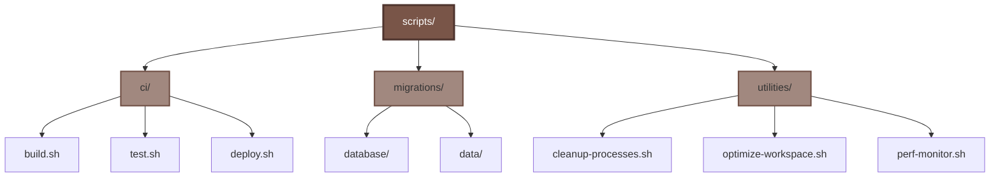
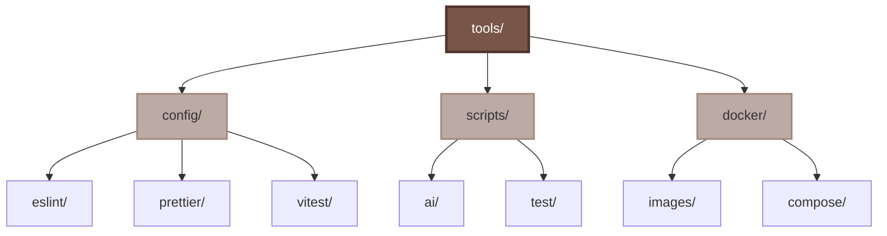
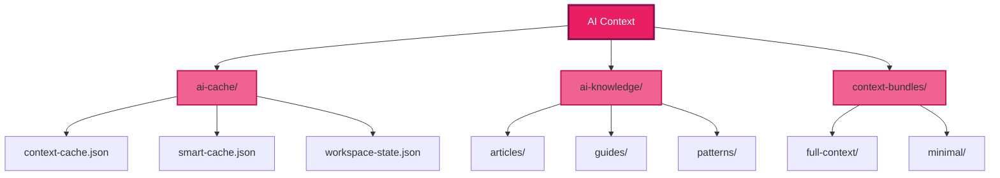
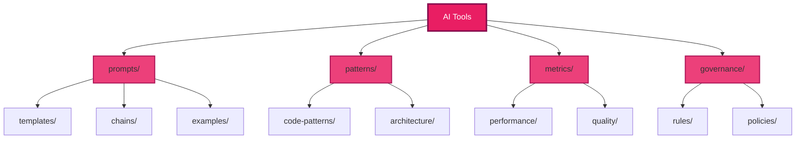
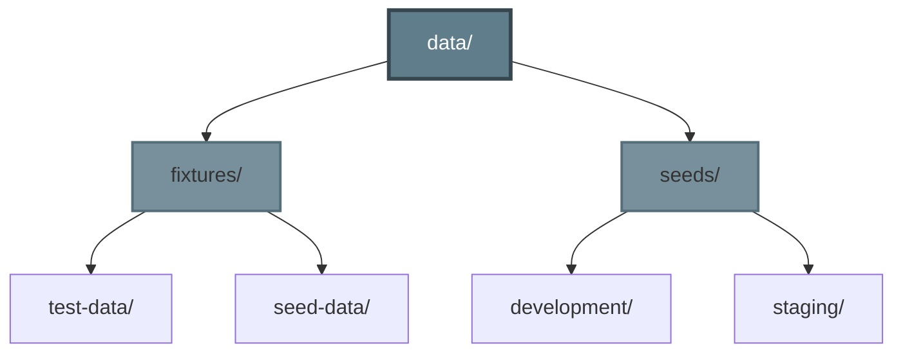
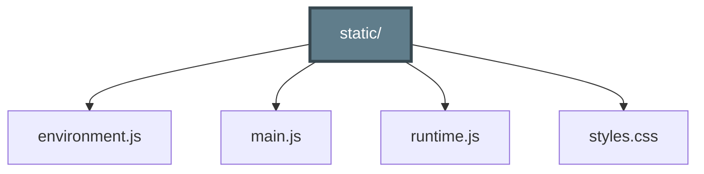
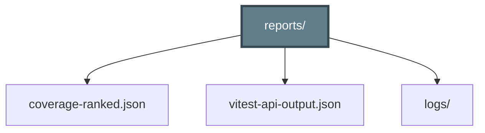

# Political Sphere - File Structure# Political Sphere - Interactive File Structure


> **Interactive tree diagram - click folders to expand/collapse**> **Click to expand sections and explore the codebase hierarchy**


<style>## 📋 Quick Navigation

.tree {

  font-family: 'SF Mono', 'Monaco', 'Cascadia Code', monospace;<details open>

  font-size: 14px;<summary><strong>🎯 How to Use This Document</strong></summary>

  line-height: 1.6;

  color: #24292f;Click on any section heading (with the triangle ▶) to expand/collapse it. Each section contains Mermaid diagrams showing the file structure for that area.

  background: #f6f8fa;

  padding: 20px;**Color Legend:**

  border-radius: 6px;- 🔵 Blue - Root/Primary containers

  margin: 20px 0;- 🟢 Green - Applications & Services  

}- 🟠 Orange - Libraries & Utilities

- 🟣 Purple - Documentation & Governance

.tree ul {- 🔷 Cyan - Infrastructure & DevOps

  list-style: none;- 🟤 Brown - Scripts & Tools

  margin: 0;- 🔴 Pink - AI Assets & Models

  padding-left: 20px;

}</details>


.tree li {---

  position: relative;

  padding-left: 20px;## 📊 Project Overview

  margin: 2px 0;

}```mermaid

graph LR

.tree li::before {    Root[political-sphere/]

  content: '├─';

  position: absolute;    Root --> Apps[📱 Apps<br/>12 applications]

  left: 0;    Root --> Libs[📚 Libs<br/>17+ libraries]

  color: #8b949e;    Root --> Docs[📖 Docs<br/>12 sections]

}    Root --> Infra[🏗️ Infrastructure<br/>IaC & K8s]

    Root --> Scripts[🔧 Scripts<br/>Automation]

.tree li:last-child::before {    Root --> AI[🤖 AI Assets<br/>Context & Tools]

  content: '└─';

}    style Root fill:#2196F3,stroke:#1565C0,stroke-width:3px,color:#fff

    style Apps fill:#4CAF50,stroke:#2E7D32,stroke-width:2px,color:#fff

.tree details {    style Libs fill:#FF9800,stroke:#E65100,stroke-width:2px,color:#fff

  margin: 0;    style Docs fill:#9C27B0,stroke:#6A1B9A,stroke-width:2px,color:#fff

}    style Infra fill:#00BCD4,stroke:#00838F,stroke-width:2px,color:#fff

    style Scripts fill:#795548,stroke:#4E342E,stroke-width:2px,color:#fff

.tree summary {    style AI fill:#E91E63,stroke:#880E4F,stroke-width:2px,color:#fff

  cursor: pointer;```

  user-select: none;

  padding: 2px 0;---

  margin-left: -20px;

  padding-left: 20px;<details>

  transition: background 0.2s;<summary><h2>📦 Root Configuration Files</h2></summary>

  border-radius: 3px;

}### Standard Project Files


.tree summary:hover {```mermaid

  background: rgba(33, 150, 243, 0.1);graph TB

}    Root[Root Files]


.tree summary::marker {    Root --> Docs[📄 Documentation]

  color: #2196F3;    Docs --> readme[README.md]

  font-size: 12px;    Docs --> changelog[CHANGELOG.md]

}    Docs --> contrib[CONTRIBUTING.md]

    Docs --> license[LICENSE]

.tree .folder {    Docs --> conduct[CODE_OF_CONDUCT.md]

  font-weight: 600;

  color: #2196F3;    Root --> Config[⚙️ Configuration]

}    Config --> package[package.json]

    Config --> nx[nx.json]

.tree .app {    Config --> ts[tsconfig.json]

  color: #4CAF50;    Config --> vitest[vitest.config.js]

  font-weight: 600;    Config --> pnpm[pnpm-workspace.yaml]

}

    Root --> Tooling[🔧 Tooling]

.tree .lib {    Tooling --> prettier[.prettierrc]

  color: #FF9800;    Tooling --> eslint[.eslintrc]

  font-weight: 600;    Tooling --> editor[.editorconfig]

}    Tooling --> git[.gitignore]

    Tooling --> lefthook[.lefthook.yml]

.tree .doc {

  color: #9C27B0;    style Root fill:#2196F3,stroke:#1565C0,stroke-width:3px,color:#fff

  font-weight: 600;    style Docs fill:#66BB6A,stroke:#388E3C,stroke-width:2px

}    style Config fill:#42A5F5,stroke:#1976D2,stroke-width:2px

    style Tooling fill:#AB47BC,stroke:#7B1FA2,stroke-width:2px

.tree .infra {```

  color: #00BCD4;

  font-weight: 600;</details>

}

---

.tree .script {

  color: #795548;<details>

  font-weight: 600;<summary><h2>🔧 Development Environment</h2></summary>

}

### IDE and Container Setup

.tree .ai {

  color: #E91E63;```mermaid

  font-weight: 600;graph LR

}    DevEnv[Development Environment]


.tree .file {    DevEnv --> Container[🐳 .devcontainer/]

  color: #57606a;    Container --> devjson[devcontainer.json]

}    Container --> dockerfile[Dockerfile]

    Container --> compose[docker-compose.dev.yml]

.tree .config {

  color: #8b949e;    DevEnv --> VSCode[💻 .vscode/]

  font-style: italic;    VSCode --> extensions[extensions.json]

}    VSCode --> settings[settings.json]

    VSCode --> tasks[tasks.json]

.legend {    VSCode --> launch[launch.json]

  background: #fff;

  border: 1px solid #d0d7de;    DevEnv --> Cache[💾 Build Cache]

  border-radius: 6px;    Cache --> nx[.nx/workspace-data/]

  padding: 15px;    Cache --> vitest[.vitest/cache/]

  margin: 20px 0;

  font-size: 13px;    style DevEnv fill:#FF6F00,stroke:#E65100,stroke-width:3px,color:#fff

}    style Container fill:#26A69A,stroke:#00796B,stroke-width:2px

    style VSCode fill:#5C6BC0,stroke:#3949AB,stroke-width:2px

.legend-item {    style Cache fill:#78909C,stroke:#546E7A,stroke-width:2px

  display: inline-block;```

  margin-right: 20px;

  margin-bottom: 5px;</details>

}

---

.legend-item::before {

  content: '■';<details>

  margin-right: 5px;<summary><h2>🤖 GitHub & CI/CD</h2></summary>

  font-weight: bold;

}### Workflows

</style>

```mermaid

<div class="legend">graph TB

  <strong>Color Legend:</strong><br>    GitHub[.github/]

  <span class="legend-item" style="color: #2196F3;">📁 Folders</span>

  <span class="legend-item" style="color: #4CAF50;">📱 Applications</span>    GitHub --> Workflows[workflows/]

  <span class="legend-item" style="color: #FF9800;">📚 Libraries</span>    Workflows --> ci[ci.yml]

  <span class="legend-item" style="color: #9C27B0;">📖 Documentation</span>    Workflows --> release[release.yml]

  <span class="legend-item" style="color: #00BCD4;">🏗️ Infrastructure</span>    Workflows --> security[security.yml]

  <span class="legend-item" style="color: #795548;">🔧 Scripts</span>    Workflows --> tests[test-*.yml]

  <span class="legend-item" style="color: #E91E63;">🤖 AI Assets</span>

</div>    GitHub --> Actions[actions/]

    Actions --> setup[setup-node/]

<div class="tree">    Actions --> test[run-tests/]

<ul>    Actions --> quality[quality-checks/]

  <li><details open>

    <summary><span class="folder">📁 political-sphere/</span></summary>    GitHub --> Templates[Templates]

    <ul>    Templates --> issues[ISSUE_TEMPLATE/]

      <li><details>    Templates --> pr[PULL_REQUEST_TEMPLATE.md]

        <summary><span class="folder">📄 Root Files</span></summary>

        <ul>    GitHub --> Docs[Documentation]

          <li><span class="file">README.md</span></li>    Docs --> copilot[copilot-instructions.md]

          <li><span class="file">LICENSE</span></li>    Docs --> codeowners[CODEOWNERS]

          <li><span class="file">CHANGELOG.md</span></li>

          <li><span class="file">CONTRIBUTING.md</span></li>    style GitHub fill:#FF6F00,stroke:#E65100,stroke-width:3px,color:#fff

          <li><span class="file">CODE_OF_CONDUCT.md</span></li>    style Workflows fill:#26A69A,stroke:#00796B,stroke-width:2px

          <li><span class="config">package.json</span></li>    style Actions fill:#5C6BC0,stroke:#3949AB,stroke-width:2px

          <li><span class="config">pnpm-workspace.yaml</span></li>    style Templates fill:#EC407A,stroke:#AD1457,stroke-width:2px

          <li><span class="config">nx.json</span></li>    style Docs fill:#AB47BC,stroke:#7B1FA2,stroke-width:2px

          <li><span class="config">tsconfig.json</span></li>```

          <li><span class="config">vitest.config.js</span></li>

          <li><span class="config">.prettierrc</span></li></details>

          <li><span class="config">.eslintrc</span></li>

          <li><span class="config">.editorconfig</span></li>---

          <li><span class="config">.gitignore</span></li>

          <li><span class="config">.lefthook.yml</span></li><details>

        </ul><summary><h2>📱 Applications (12 Apps)</h2></summary>

      </details></li>

      ### Core Services

      <li><details>

        <summary><span class="folder">🔧 .devcontainer/</span></summary><details>

        <ul><summary><strong>Backend & Game Engine</strong></summary>

          <li><span class="config">devcontainer.json</span></li>

          <li><span class="file">Dockerfile</span></li>```mermaid

          <li><span class="config">docker-compose.dev.yml</span></li>graph TB

        </ul>    Core[Core Services]

      </details></li>    

          Core --> API[api/]

      <li><details>    API --> apiSrc[src/]

        <summary><span class="folder">💻 .vscode/</span></summary>    API --> apiTest[__tests__/]

        <ul>    API --> apiConfig[config/]

          <li><span class="config">extensions.json</span></li>    

          <li><span class="config">settings.json</span></li>    Core --> GameServer[game-server/]

          <li><span class="config">tasks.json</span></li>    GameServer --> gsSrc[src/]

          <li><span class="config">launch.json</span></li>    GameServer --> gsEngine[engine/]

        </ul>    GameServer --> gsTests[__tests__/]

      </details></li>    

          Core --> Worker[worker/]

      <li><details>    Worker --> wSrc[src/]

        <summary><span class="folder">🤖 .github/</span></summary>    Worker --> wJobs[jobs/]

        <ul>    Worker --> wTests[__tests__/]

          <li><details>

            <summary><span class="folder">workflows/</span></summary>    style Core fill:#4CAF50,stroke:#2E7D32,stroke-width:3px,color:#fff

            <ul>    style API fill:#66BB6A,stroke:#388E3C,stroke-width:2px

              <li><span class="file">ci.yml</span></li>    style GameServer fill:#66BB6A,stroke:#388E3C,stroke-width:2px

              <li><span class="file">release.yml</span></li>    style Worker fill:#66BB6A,stroke:#388E3C,stroke-width:2px

              <li><span class="file">security.yml</span></li>```

              <li><span class="file">test-coverage.yml</span></li>

              <li><span class="file">test-e2e.yml</span></li></details>

            </ul>

          </details></li>### Frontend Applications

          <li><details>

            <summary><span class="folder">actions/</span></summary><details>

            <ul><summary><strong>Web & Microfrontends</strong></summary>

              <li><span class="folder">setup-node/</span></li>

              <li><span class="folder">run-tests/</span></li>```mermaid

              <li><span class="folder">quality-checks/</span></li>graph TB

              <li><span class="folder">deploy/</span></li>    Frontend[Frontend Apps]

            </ul>    

          </details></li>    Frontend --> Web[web/]

          <li><span class="folder">ISSUE_TEMPLATE/</span></li>    Web --> webSrc[src/]

          <li><span class="file">PULL_REQUEST_TEMPLATE.md</span></li>    Web --> webPages[pages/]

          <li><span class="file">copilot-instructions.md</span></li>    Web --> webComponents[components/]

          <li><span class="file">CODEOWNERS</span></li>    

        </ul>    Frontend --> Shell[shell/]

      </details></li>    Shell --> shellSrc[src/]

          Shell --> shellConfig[module-federation.config.js]

      <li><details>    

        <summary><span class="app">📱 apps/</span> <em>(12 applications)</em></summary>    Frontend --> AuthRemote[feature-auth-remote/]

        <ul>    AuthRemote --> authSrc[src/]

          <li><details>    AuthRemote --> authComponents[components/]

            <summary><span class="app">api/</span> <em>REST API services</em></summary>    

            <ul>    Frontend --> DashRemote[feature-dashboard-remote/]

              <li><span class="folder">src/</span></li>    DashRemote --> dashSrc[src/]

              <li><span class="folder">__tests__/</span></li>    DashRemote --> dashWidgets[widgets/]

              <li><span class="folder">config/</span></li>

              <li><span class="config">project.json</span></li>    style Frontend fill:#4CAF50,stroke:#2E7D32,stroke-width:3px,color:#fff

            </ul>    style Web fill:#81C784,stroke:#4CAF50,stroke-width:2px

          </details></li>    style Shell fill:#81C784,stroke:#4CAF50,stroke-width:2px

              style AuthRemote fill:#81C784,stroke:#4CAF50,stroke-width:2px

          <li><details>    style DashRemote fill:#81C784,stroke:#4CAF50,stroke-width:2px

            <summary><span class="app">game-server/</span> <em>Real-time simulation</em></summary>```

            <ul>

              <li><span class="folder">src/</span></li></details>

              <li><span class="folder">engine/</span></li>

              <li><span class="folder">__tests__/</span></li>### Support & Infrastructure

              <li><span class="config">project.json</span></li>

            </ul><details>

          </details></li><summary><strong>Testing, Documentation & Development</strong></summary>

          

          <li><details>```mermaid

            <summary><span class="app">worker/</span> <em>Background jobs</em></summary>graph TB

            <ul>    Support[Support Apps]

              <li><span class="folder">src/</span></li>    

              <li><span class="folder">jobs/</span></li>    Support --> E2E[e2e/]

              <li><span class="folder">__tests__/</span></li>    E2E --> e2eTests[tests/]

              <li><span class="config">project.json</span></li>    E2E --> e2eFixtures[fixtures/]

            </ul>    E2E --> e2eConfig[playwright.config.ts]

          </details></li>    

              Support --> LoadTest[load-test/]

          <li><details>    LoadTest --> ltScripts[scripts/]

            <summary><span class="app">web/</span> <em>Main web application</em></summary>    LoadTest --> ltScenarios[scenarios/]

            <ul>    

              <li><span class="folder">src/</span></li>    Support --> DocsApp[docs/]

              <li><span class="folder">pages/</span></li>    DocsApp --> docsPages[pages/]

              <li><span class="folder">components/</span></li>    DocsApp --> docsPublic[public/]

              <li><span class="folder">public/</span></li>    

              <li><span class="config">vite.config.ts</span></li>    Support --> Dev[dev/]

              <li><span class="config">project.json</span></li>    Dev --> devExperiments[experiments/]

            </ul>    Dev --> devPrototypes[prototypes/]

          </details></li>    

              Support --> Infra[infrastructure/]

          <li><details>    Infra --> terraform[terraform/]

            <summary><span class="app">shell/</span> <em>Module federation host</em></summary>    Infra --> k8s[kubernetes/]

            <ul>    Infra --> docker[docker/]

              <li><span class="folder">src/</span></li>

              <li><span class="config">module-federation.config.js</span></li>    style Support fill:#4CAF50,stroke:#2E7D32,stroke-width:3px,color:#fff

              <li><span class="config">project.json</span></li>    style E2E fill:#A5D6A7,stroke:#66BB6A,stroke-width:2px

            </ul>    style LoadTest fill:#A5D6A7,stroke:#66BB6A,stroke-width:2px

          </details></li>    style DocsApp fill:#A5D6A7,stroke:#66BB6A,stroke-width:2px

              style Dev fill:#A5D6A7,stroke:#66BB6A,stroke-width:2px

          <li><details>    style Infra fill:#A5D6A7,stroke:#66BB6A,stroke-width:2px

            <summary><span class="app">feature-auth-remote/</span> <em>Auth microfrontend</em></summary>```

            <ul>

              <li><span class="folder">src/</span></li></details>

              <li><span class="folder">components/</span></li>

              <li><span class="config">project.json</span></li></details>

            </ul>

          </details></li>---

          

          <li><details><details>

            <summary><span class="app">feature-dashboard-remote/</span> <em>Dashboard microfrontend</em></summary><summary><h2>📚 Libraries (17+ Modules)</h2></summary>

            <ul>

              <li><span class="folder">src/</span></li>### Shared Utilities

              <li><span class="folder">widgets/</span></li>

              <li><span class="config">project.json</span></li><details>

            </ul><summary><strong>Common Code & Types</strong></summary>

          </details></li>

          ```mermaid

          <li><details>graph TB

            <summary><span class="app">e2e/</span> <em>End-to-end tests</em></summary>    Shared[shared/]

            <ul>    

              <li><span class="folder">tests/</span></li>    Shared --> Utils[utils/]

              <li><span class="folder">fixtures/</span></li>    Utils --> validation[validation/]

              <li><span class="config">playwright.config.ts</span></li>    Utils --> formatting[formatting/]

            </ul>    Utils --> helpers[helpers/]

          </details></li>    

              Shared --> Types[types/]

          <li><details>    Types --> models[models/]

            <summary><span class="app">load-test/</span> <em>Performance testing</em></summary>    Types --> interfaces[interfaces/]

            <ul>    Types --> enums[enums/]

              <li><span class="folder">scripts/</span></li>    

              <li><span class="folder">scenarios/</span></li>    Shared --> Constants[constants/]

              <li><span class="config">k6.config.js</span></li>    Constants --> config[config/]

            </ul>    Constants --> defaults[defaults/]

          </details></li>    

              Shared --> Config[config/]

          <li><details>    Config --> env[environment/]

            <summary><span class="app">docs/</span> <em>Documentation site</em></summary>    Config --> feature[feature-flags/]

            <ul>

              <li><span class="folder">pages/</span></li>    style Shared fill:#FF9800,stroke:#E65100,stroke-width:3px,color:#fff

              <li><span class="folder">public/</span></li>    style Utils fill:#FFB74D,stroke:#FB8C00,stroke-width:2px

              <li><span class="config">project.json</span></li>    style Types fill:#FFB74D,stroke:#FB8C00,stroke-width:2px

            </ul>    style Constants fill:#FFB74D,stroke:#FB8C00,stroke-width:2px

          </details></li>    style Config fill:#FFB74D,stroke:#FB8C00,stroke-width:2px

          ```

          <li><details>

            <summary><span class="app">dev/</span> <em>Experimental features</em></summary></details>

            <ul>

              <li><span class="folder">experiments/</span></li>### Platform Services

              <li><span class="folder">prototypes/</span></li>

            </ul><details>

          </details></li><summary><strong>Core Platform Infrastructure</strong></summary>

          

          <li><details>```mermaid

            <summary><span class="app">infrastructure/</span> <em>IaC & deployment</em></summary>graph TB

            <ul>    Platform[platform/]

              <li><details>    

                <summary><span class="infra">terraform/</span></summary>    Platform --> Auth[auth/]

                <ul>    Auth --> authServices[services/]

                  <li><span class="folder">modules/</span></li>    Auth --> authGuards[guards/]

                  <li><span class="folder">environments/</span></li>    Auth --> authTokens[tokens/]

                  <li><span class="file">main.tf</span></li>    

                  <li><span class="file">variables.tf</span></li>    Platform --> APIClient[api-client/]

                </ul>    APIClient --> apiEndpoints[endpoints/]

              </details></li>    APIClient --> apiInterceptors[interceptors/]

              <li><details>    

                <summary><span class="infra">kubernetes/</span></summary>    Platform --> State[state/]

                <ul>    State --> storeSetup[store/]

                  <li><span class="folder">base/</span></li>    State --> slices[slices/]

                  <li><span class="folder">helm/</span></li>    State --> middleware[middleware/]

                  <li><span class="folder">overlays/</span></li>    

                </ul>    Platform --> Routing[routing/]

              </details></li>    Routing --> routes[routes/]

              <li><details>    Routing --> navigation[navigation/]

                <summary><span class="infra">docker/</span></summary>

                <ul>    style Platform fill:#FF9800,stroke:#E65100,stroke-width:3px,color:#fff

                  <li><span class="folder">images/</span></li>    style Auth fill:#FFA726,stroke:#F57C00,stroke-width:2px

                  <li><span class="file">docker-compose.yml</span></li>    style APIClient fill:#FFA726,stroke:#F57C00,stroke-width:2px

                </ul>    style State fill:#FFA726,stroke:#F57C00,stroke-width:2px

              </details></li>    style Routing fill:#FFA726,stroke:#F57C00,stroke-width:2px

              <li><span class="folder">environments/</span></li>```

              <li><span class="folder">secrets/</span></li>

            </ul></details>

          </details></li>

        </ul>### Domain Logic

      </details></li>

      <details>

      <li><details><summary><strong>Game Engine & Business Logic</strong></summary>

        <summary><span class="lib">📚 libs/</span> <em>(17+ libraries)</em></summary>

        <ul>```mermaid

          <li><details>graph TB

            <summary><span class="lib">shared/</span> <em>Common utilities</em></summary>    GameEngine[game-engine/]

            <ul>    

              <li><details>    GameEngine --> Core[core/]

                <summary><span class="folder">utils/</span></summary>    Core --> rules[rules/]

                <ul>    Core --> mechanics[mechanics/]

                  <li><span class="folder">validation/</span></li>    Core --> systems[systems/]

                  <li><span class="folder">formatting/</span></li>    

                  <li><span class="folder">helpers/</span></li>    GameEngine --> Simulation[simulation/]

                </ul>    Simulation --> algorithms[algorithms/]

              </details></li>    Simulation --> models[models/]

              <li><details>    Simulation --> ai[ai/]

                <summary><span class="folder">types/</span></summary>    

                <ul>    GameEngine --> Events[events/]

                  <li><span class="folder">models/</span></li>    Events --> handlers[handlers/]

                  <li><span class="folder">interfaces/</span></li>    Events --> emitters[emitters/]

                  <li><span class="folder">enums/</span></li>    Events --> listeners[listeners/]

                </ul>

              </details></li>    style GameEngine fill:#FF9800,stroke:#E65100,stroke-width:3px,color:#fff

              <li><span class="folder">constants/</span></li>    style Core fill:#FF8A65,stroke:#FF5722,stroke-width:2px

              <li><span class="folder">config/</span></li>    style Simulation fill:#FF8A65,stroke:#FF5722,stroke-width:2px

            </ul>    style Events fill:#FF8A65,stroke:#FF5722,stroke-width:2px

          </details></li>```

          

          <li><details></details>

            <summary><span class="lib">platform/</span> <em>Core services</em></summary>

            <ul>### Infrastructure Libraries

              <li><details>

                <summary><span class="folder">auth/</span></summary><details>

                <ul><summary><strong>Data Layer & Operations</strong></summary>

                  <li><span class="folder">services/</span></li>

                  <li><span class="folder">guards/</span></li>```mermaid

                  <li><span class="folder">tokens/</span></li>graph TB

                </ul>    Infrastructure[infrastructure/]

              </details></li>    

              <li><details>    Infrastructure --> Database[database/]

                <summary><span class="folder">api-client/</span></summary>    Database --> repositories[repositories/]

                <ul>    Database --> migrations[migrations/]

                  <li><span class="folder">endpoints/</span></li>    Database --> seeds[seeds/]

                  <li><span class="folder">interceptors/</span></li>    

                </ul>    Infrastructure --> Monitoring[monitoring/]

              </details></li>    Monitoring --> metrics[metrics/]

              <li><details>    Monitoring --> logging[logging/]

                <summary><span class="folder">state/</span></summary>    Monitoring --> tracing[tracing/]

                <ul>    

                  <li><span class="folder">store/</span></li>    Infrastructure --> Deployment[deployment/]

                  <li><span class="folder">slices/</span></li>    Deployment --> scripts[scripts/]

                  <li><span class="folder">middleware/</span></li>    Deployment --> configs[configs/]

                </ul>

              </details></li>    style Infrastructure fill:#FF9800,stroke:#E65100,stroke-width:3px,color:#fff

              <li><span class="folder">routing/</span></li>    style Database fill:#FFAB91,stroke:#FF7043,stroke-width:2px

            </ul>    style Monitoring fill:#FFAB91,stroke:#FF7043,stroke-width:2px

          </details></li>    style Deployment fill:#FFAB91,stroke:#FF7043,stroke-width:2px

          ```

          <li><details>

            <summary><span class="lib">game-engine/</span> <em>Game logic</em></summary></details>

            <ul>

              <li><details>### UI Components

                <summary><span class="folder">core/</span></summary>

                <ul><details>

                  <li><span class="folder">rules/</span></li><summary><strong>Design System & Accessibility</strong></summary>

                  <li><span class="folder">mechanics/</span></li>

                  <li><span class="folder">systems/</span></li>```mermaid

                </ul>graph TB

              </details></li>    UI[ui/]

              <li><details>    

                <summary><span class="folder">simulation/</span></summary>    UI --> Components[components/]

                <ul>    Components --> atoms[atoms/]

                  <li><span class="folder">algorithms/</span></li>    Components --> molecules[molecules/]

                  <li><span class="folder">models/</span></li>    Components --> organisms[organisms/]

                  <li><span class="folder">ai/</span></li>    

                </ul>    UI --> DesignSystem[design-system/]

              </details></li>    DesignSystem --> tokens[tokens/]

              <li><details>    DesignSystem --> themes[themes/]

                <summary><span class="folder">events/</span></summary>    DesignSystem --> patterns[patterns/]

                <ul>    

                  <li><span class="folder">handlers/</span></li>    UI --> Accessibility[accessibility/]

                  <li><span class="folder">emitters/</span></li>    Accessibility --> utils[utils/]

                  <li><span class="folder">listeners/</span></li>    Accessibility --> hooks[hooks/]

                </ul>    Accessibility --> tests[tests/]

              </details></li>

            </ul>    style UI fill:#FF9800,stroke:#E65100,stroke-width:3px,color:#fff

          </details></li>    style Components fill:#FFCC80,stroke:#FFA726,stroke-width:2px

              style DesignSystem fill:#FFCC80,stroke:#FFA726,stroke-width:2px

          <li><details>    style Accessibility fill:#FFCC80,stroke:#FFA726,stroke-width:2px

            <summary><span class="lib">infrastructure/</span> <em>Data & ops</em></summary>```

            <ul>

              <li><details></details>

                <summary><span class="folder">database/</span></summary>

                <ul></details>

                  <li><span class="folder">repositories/</span></li>

                  <li><span class="folder">migrations/</span></li>---

                  <li><span class="folder">seeds/</span></li>

                </ul><details>

              </details></li><summary><h2>📖 Documentation (12 Sections)</h2></summary>

              <li><details>

                <summary><span class="folder">monitoring/</span></summary>### Foundation & Strategy

                <ul>

                  <li><span class="folder">metrics/</span></li><details>

                  <li><span class="folder">logging/</span></li><summary><strong>Core Principles & Planning</strong></summary>

                  <li><span class="folder">tracing/</span></li>

                </ul>```mermaid

              </details></li>graph TB

              <li><span class="folder">deployment/</span></li>    Foundation[Documentation]

            </ul>    

          </details></li>    Foundation --> F00[00-foundation/]

              F00 --> principles[principles.md]

          <li><details>    F00 --> organization[organization.md]

            <summary><span class="lib">ui/</span> <em>Design system</em></summary>    F00 --> standards[standards/]

            <ul>    

              <li><details>    Foundation --> F01[01-strategy/]

                <summary><span class="folder">components/</span></summary>    F01 --> roadmap[roadmap.md]

                <ul>    F01 --> vision[vision.md]

                  <li><span class="folder">atoms/</span></li>    F01 --> strategy[strategy.md]

                  <li><span class="folder">molecules/</span></li>

                  <li><span class="folder">organisms/</span></li>    style Foundation fill:#9C27B0,stroke:#6A1B9A,stroke-width:3px,color:#fff

                </ul>    style F00 fill:#BA68C8,stroke:#8E24AA,stroke-width:2px

              </details></li>    style F01 fill:#BA68C8,stroke:#8E24AA,stroke-width:2px

              <li><details>```

                <summary><span class="folder">design-system/</span></summary>

                <ul></details>

                  <li><span class="folder">tokens/</span></li>

                  <li><span class="folder">themes/</span></li>### Governance & Legal

                  <li><span class="folder">patterns/</span></li>

                </ul><details>

              </details></li><summary><strong>Policies & Compliance</strong></summary>

              <li><span class="folder">accessibility/</span></li>

            </ul>```mermaid

          </details></li>graph TB

              Governance[Governance & Legal]

          <li><span class="lib">ci/</span></li>    

        </ul>    Governance --> F02[02-governance/]

      </details></li>    F02 --> framework[framework.md]

          F02 --> policies[policies/]

      <li><details>    F02 --> constitution[constitution.md]

        <summary><span class="doc">📖 docs/</span> <em>(12 sections)</em></summary>    

        <ul>    Governance --> F03[03-legal-and-compliance/]

          <li><span class="file">README.md</span></li>    F03 --> gdpr[gdpr/]

          <li><span class="file">TODO.md</span></li>    F03 --> ccpa[ccpa/]

          <li><span class="file">quick-ref.md</span></li>    F03 --> compliance[compliance.md]

          <li><details>

            <summary><span class="doc">00-foundation/</span></summary>    style Governance fill:#9C27B0,stroke:#6A1B9A,stroke-width:3px,color:#fff

            <ul>    style F02 fill:#AB47BC,stroke:#7B1FA2,stroke-width:2px

              <li><span class="file">principles.md</span></li>    style F03 fill:#AB47BC,stroke:#7B1FA2,stroke-width:2px

              <li><span class="file">organization.md</span></li>```

              <li><span class="folder">standards/</span></li>

            </ul></details>

          </details></li>

          <li><details>### Technical Documentation

            <summary><span class="doc">01-strategy/</span></summary>

            <ul><details>

              <li><span class="file">roadmap.md</span></li><summary><strong>Architecture & Engineering</strong></summary>

              <li><span class="file">vision.md</span></li>

              <li><span class="file">strategy.md</span></li>```mermaid

            </ul>graph TB

          </details></li>    Technical[Technical Docs]

          <li><details>    

            <summary><span class="doc">02-governance/</span></summary>    Technical --> F04[04-architecture/]

            <ul>    F04 --> decisions[decisions/]

              <li><span class="file">framework.md</span></li>    F04 --> diagrams[diagrams/]

              <li><span class="folder">policies/</span></li>    F04 --> patterns[patterns/]

              <li><span class="file">constitution.md</span></li>    

            </ul>    Technical --> F05[05-engineering-and-devops/]

          </details></li>    F05 --> development[development/]

          <li><details>    F05 --> testing[testing.md]

            <summary><span class="doc">03-legal-and-compliance/</span></summary>    F05 --> languages[languages/]

            <ul>    

              <li><span class="folder">gdpr/</span></li>    Technical --> F06[06-security-and-risk/]

              <li><span class="folder">ccpa/</span></li>    F06 --> policies[security-policies/]

              <li><span class="file">compliance.md</span></li>    F06 --> risk[risk-register.md]

            </ul>    F06 --> incidents[incidents/]

          </details></li>

          <li><details>    style Technical fill:#9C27B0,stroke:#6A1B9A,stroke-width:3px,color:#fff

            <summary><span class="doc">04-architecture/</span></summary>    style F04 fill:#CE93D8,stroke:#AB47BC,stroke-width:2px

            <ul>    style F05 fill:#CE93D8,stroke:#AB47BC,stroke-width:2px

              <li><span class="folder">decisions/</span></li>    style F06 fill:#CE93D8,stroke:#AB47BC,stroke-width:2px

              <li><span class="folder">diagrams/</span></li>```

              <li><span class="folder">patterns/</span></li>

            </ul></details>

          </details></li>

          <li><details>### Product & Operations

            <summary><span class="doc">05-engineering-and-devops/</span></summary>

            <ul><details>

              <li><span class="folder">development/</span></li><summary><strong>AI, Game Design & Operations</strong></summary>

              <li><span class="file">testing.md</span></li>

              <li><span class="folder">languages/</span></li>```mermaid

              <li><span class="folder">ui/</span></li>graph TB

            </ul>    Product[Product & Ops]

          </details></li>    

          <li><details>    Product --> F07[07-ai-and-simulation/]

            <summary><span class="doc">06-security-and-risk/</span></summary>    F07 --> governance[ai-governance.md]

            <ul>    F07 --> models[models/]

              <li><span class="folder">security-policies/</span></li>    F07 --> ethics[ethics/]

              <li><span class="file">risk-register.md</span></li>    

              <li><span class="folder">incidents/</span></li>    Product --> F08[08-game-design-and-mechanics/]

            </ul>    F08 --> rules[rules/]

          </details></li>    F08 --> balance[balance/]

          <li><details>    F08 --> content[content/]

            <summary><span class="doc">07-ai-and-simulation/</span></summary>    

            <ul>    Product --> F09[09-observability-and-ops/]

              <li><span class="file">ai-governance.md</span></li>    F09 --> runbooks[runbooks/]

              <li><span class="folder">models/</span></li>    F09 --> monitoring[monitoring/]

              <li><span class="folder">ethics/</span></li>    F09 --> sre[sre/]

            </ul>

          </details></li>    style Product fill:#9C27B0,stroke:#6A1B9A,stroke-width:3px,color:#fff

          <li><details>    style F07 fill:#E1BEE7,stroke:#CE93D8,stroke-width:2px

            <summary><span class="doc">08-game-design-and-mechanics/</span></summary>    style F08 fill:#E1BEE7,stroke:#CE93D8,stroke-width:2px

            <ul>    style F09 fill:#E1BEE7,stroke:#CE93D8,stroke-width:2px

              <li><span class="folder">rules/</span></li>```

              <li><span class="folder">balance/</span></li>

              <li><span class="folder">content/</span></li></details>

            </ul>

          </details></li>### Meta Documentation

          <li><details>

            <summary><span class="doc">09-observability-and-ops/</span></summary><details>

            <ul><summary><strong>Audit & Control</strong></summary>

              <li><span class="folder">runbooks/</span></li>

              <li><span class="folder">monitoring/</span></li>```mermaid

              <li><span class="folder">sre/</span></li>graph TB

            </ul>    Meta[Meta Docs]

          </details></li>    

          <li><span class="doc">audit-trail/</span></li>    Meta --> Audit[audit-trail/]

          <li><span class="doc">document-control/</span></li>    Audit --> logs[audit-logs/]

        </ul>    Audit --> compliance[compliance-records/]

      </details></li>    

          Meta --> Control[document-control/]

      <li><details>    Control --> versions[versions/]

        <summary><span class="script">🔧 scripts/</span></summary>    Control --> review[review-process.md]

        <ul>

          <li><details>    style Meta fill:#9C27B0,stroke:#6A1B9A,stroke-width:3px,color:#fff

            <summary><span class="folder">ci/</span></summary>    style Audit fill:#F3E5F5,stroke:#E1BEE7,stroke-width:2px

            <ul>    style Control fill:#F3E5F5,stroke:#E1BEE7,stroke-width:2px

              <li><span class="file">build.sh</span></li>```

              <li><span class="file">test.sh</span></li>

              <li><span class="file">deploy.sh</span></li></details>

            </ul>

          </details></li></details>

          <li><span class="folder">migrations/</span></li>

          <li><span class="file">cleanup-processes.sh</span></li>---

          <li><span class="file">optimize-workspace.sh</span></li>

          <li><span class="file">perf-monitor.sh</span></li><details>

        </ul><summary><h2>🏗️ Infrastructure</h2></summary>

      </details></li>

      ### Cloud Resources

      <li><details>

        <summary><span class="script">🔧 tools/</span></summary><details>

        <ul><summary><strong>Terraform & IaC</strong></summary>

          <li><details>

            <summary><span class="folder">config/</span></summary>```mermaid

            <ul>graph TB

              <li><span class="folder">eslint/</span></li>    Terraform[apps/infrastructure/terraform/]

              <li><span class="folder">prettier/</span></li>    

              <li><span class="folder">vitest/</span></li>    Terraform --> Modules[modules/]

            </ul>    Modules --> vpc[vpc/]

          </details></li>    Modules --> eks[eks/]

          <li><details>    Modules --> rds[rds/]

            <summary><span class="folder">scripts/</span></summary>    

            <ul>    Terraform --> Environments[environments/]

              <li><span class="folder">ai/</span></li>    Environments --> dev[dev/]

              <li><span class="folder">test/</span></li>    Environments --> staging[staging/]

            </ul>    Environments --> prod[prod/]

          </details></li>    

          <li><span class="folder">docker/</span></li>    Terraform --> State[state/]

        </ul>    State --> backend[backend.tf]

      </details></li>    State --> locks[locks/]

      

      <li><details>    style Terraform fill:#00BCD4,stroke:#00838F,stroke-width:3px,color:#fff

        <summary><span class="ai">🤖 ai/</span></summary>    style Modules fill:#26C6DA,stroke:#00ACC1,stroke-width:2px

        <ul>    style Environments fill:#26C6DA,stroke:#00ACC1,stroke-width:2px

          <li><details>    style State fill:#26C6DA,stroke:#00ACC1,stroke-width:2px

            <summary><span class="folder">ai-cache/</span></summary>```

            <ul>

              <li><span class="file">context-cache.json</span></li></details>

              <li><span class="file">smart-cache.json</span></li>

              <li><span class="file">workspace-state.json</span></li>### Container Orchestration

            </ul>

          </details></li><details>

          <li><details><summary><strong>Kubernetes & Docker</strong></summary>

            <summary><span class="folder">ai-knowledge/</span></summary>

            <ul>```mermaid

              <li><span class="folder">articles/</span></li>graph TB

              <li><span class="folder">guides/</span></li>    K8s[apps/infrastructure/kubernetes/]

              <li><span class="folder">patterns/</span></li>    

            </ul>    K8s --> Base[base/]

          </details></li>    Base --> namespaces[namespaces/]

          <li><span class="folder">context-bundles/</span></li>    Base --> services[services/]

          <li><span class="folder">prompts/</span></li>    Base --> deployments[deployments/]

          <li><span class="folder">patterns/</span></li>    

          <li><span class="folder">metrics/</span></li>    K8s --> Helm[helm/]

          <li><span class="folder">governance/</span></li>    Helm --> charts[charts/]

        </ul>    Helm --> values[values/]

      </details></li>    

          K8s --> Overlays[overlays/]

      <li><details>    Overlays --> devOverlay[dev/]

        <summary><span class="folder">📊 data/</span></summary>    Overlays --> prodOverlay[prod/]

        <ul>    

          <li><span class="folder">fixtures/</span></li>    Docker[apps/infrastructure/docker/]

          <li><span class="folder">seeds/</span></li>    Docker --> dockerfiles[Dockerfiles/]

        </ul>    Docker --> compose[docker-compose/]

      </details></li>

          style K8s fill:#00BCD4,stroke:#00838F,stroke-width:3px,color:#fff

      <li><details>    style Docker fill:#00BCD4,stroke:#00838F,stroke-width:3px,color:#fff

        <summary><span class="folder">📈 reports/</span></summary>    style Base fill:#4DD0E1,stroke:#26C6DA,stroke-width:2px

        <ul>    style Helm fill:#4DD0E1,stroke:#26C6DA,stroke-width:2px

          <li><span class="file">coverage-ranked.json</span></li>    style Overlays fill:#4DD0E1,stroke:#26C6DA,stroke-width:2px

          <li><span class="file">vitest-api-output.json</span></li>```

        </ul>

      </details></li></details>

      

      <li><details>### Secrets & Configuration

        <summary><span class="folder">💾 coverage/</span></summary>

        <ul><details>

          <li><span class="file">index.html</span></li><summary><strong>Environment Management</strong></summary>

          <li><span class="folder">apps/</span></li>

          <li><span class="folder">libs/</span></li>```mermaid

        </ul>graph TB

      </details></li>    Config[Configuration]

          

      <li><span class="folder">📝 logs/</span></li>    Config --> Secrets[secrets/]

      <li><span class="folder">🗂️ static/</span></li>    Secrets --> encrypted[encrypted/]

    </ul>    Secrets --> templates[templates/]

  </details></li>    

</ul>    Config --> Envs[environments/]

</div>    Envs --> devEnv[dev.env]

    Envs --> stagingEnv[staging.env]

---    Envs --> prodEnv[prod.env]


## 💡 Usage Tips    style Config fill:#00BCD4,stroke:#00838F,stroke-width:3px,color:#fff

    style Secrets fill:#80DEEA,stroke:#4DD0E1,stroke-width:2px

- **Click folder names** with the triangle (▶) to expand/collapse subdirectories    style Envs fill:#80DEEA,stroke:#4DD0E1,stroke-width:2px

- **Color coding** helps identify different types of content at a glance```

- **Nested structure** shows the complete hierarchy - expand as deep as needed

- **Lightweight** - all functionality works in GitHub's Markdown viewer</details>


---</details>


*Last Updated: November 8, 2025*---


<details>
<summary><h2>🔧 Scripts & Tools</h2></summary>

### Automation Scripts

<details>
<summary><strong>CI/CD & Migrations</strong></summary>



</details>

### Development Tools

<details>
<summary><strong>Tooling & Configuration</strong></summary>



</details>

</details>

---

<details>
<summary><h2>🤖 AI Assets</h2></summary>

### Context & Knowledge

<details>
<summary><strong>AI Cache & Learning</strong></summary>



</details>

### Tools & Metrics

<details>
<summary><strong>Prompts & Performance</strong></summary>



</details>

</details>

---

## 📚 Additional Resources

<details>
<summary><h3>Data & Configuration</h3></summary>

### Runtime Data



### Configuration Files



### Reports & Metrics



</details>

---

## 🎨 Color Legend

- **🔵 Blue (#2196F3)** - Root containers and primary navigation
- **🟢 Green (#4CAF50)** - Applications and services
- **🟠 Orange (#FF9800)** - Libraries and utilities
- **🟣 Purple (#9C27B0)** - Documentation and governance
- **🔷 Cyan (#00BCD4)** - Infrastructure and DevOps
- **🟤 Brown (#795548)** - Scripts and tools
- **🔴 Pink (#E91E63)** - AI assets and models
- **🔘 Gray (#607D8B)** - Data and configuration

---

## 📖 How to Navigate

1. **Click section headers** to expand/collapse content
2. **Nested details** allow drilling down into subsections
3. **Mermaid diagrams** provide visual hierarchy
4. **Color coding** groups related components
5. **Breadth-first** organization for quick scanning

---

*Last Updated: November 7, 2025*
