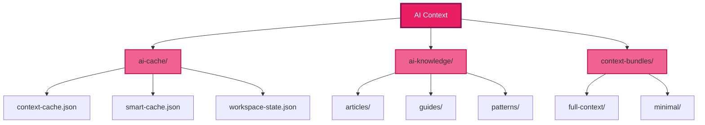
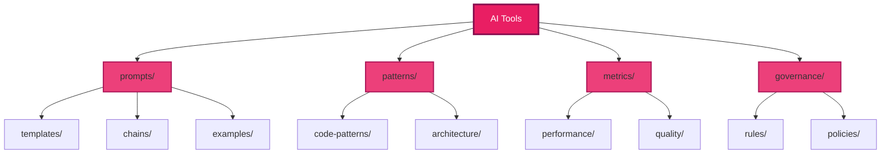
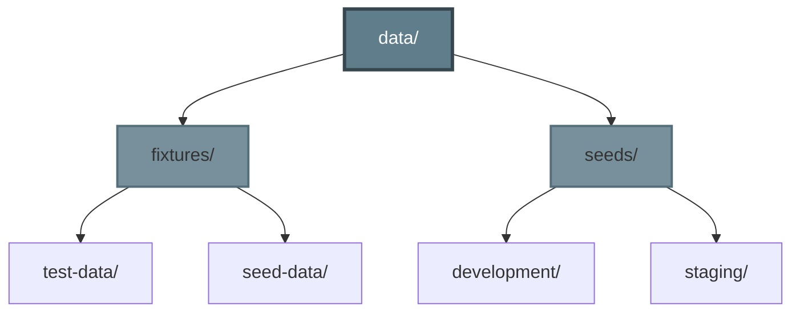
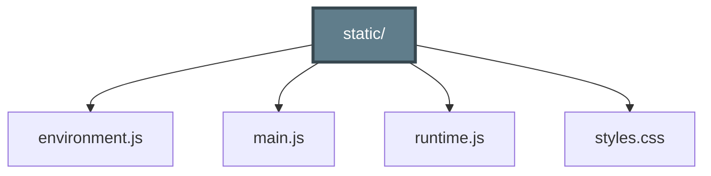
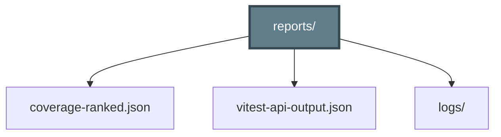

# Political Sphere - File Structure# Political Sphere - File Structure

> **Click to expand sections and explore the codebase hierarchy**> **Click to expand sections and explore the codebase hierarchy**

## 📋 Quick Navigation## 📋 Quick Navigation

<details open><details open>

<summary><strong>🎯 How to Use This Document</strong></summary><summary><strong>🎯 How to Use This Document</strong></summary>

Click on any section heading (with the triangle ▶) to expand/collapse it. Each section contains Mermaid diagrams showing the file structure for that area.Click on any section heading (with the triangle ▶) to expand/collapse it. Each section contains Mermaid diagrams showing the file structure for that area.

**Color Legend:\*\***Color Legend:\*\*

- 🔵 Blue - Root/Primary containers- 🔵 Blue - Root/Primary containers

- 🟢 Green - Applications & Services - 🟢 Green - Applications & Services

- 🟠 Orange - Libraries & Utilities- 🟠 Orange - Libraries & Utilities

- 🟣 Purple - Documentation & Governance- 🟣 Purple - Documentation & Governance

- 🔷 Cyan - Infrastructure & DevOps

- 🟤 Brown - Scripts & Tools { name: ".gitignore", type: "config" },.tree ul {- 🔷 Cyan - Infrastructure & DevOps

- 🔴 Pink - AI Assets & Models

        { name: ".lefthook.yml", type: "config" }

</details>

      ]  list-style: none;- 🟤 Brown - Scripts & Tools

---

    },

## 📊 Project Overview

    {  margin: 0;- 🔴 Pink - AI Assets & Models

```mermaid

graph LR      name: ".devcontainer",

    Root[political-sphere/]

          type: "folder",  padding-left: 20px;

    Root --> Apps[📱 Apps<br/>12 applications]

    Root --> Libs[📚 Libs<br/>17+ libraries]      children: [

    Root --> Docs[📖 Docs<br/>12 sections]

    Root --> Infra[🏗️ Infrastructure<br/>IaC & K8s]        { name: "devcontainer.json", type: "config" },}</details>

    Root --> Scripts[🔧 Scripts<br/>Automation]

    Root --> AI[🤖 AI Assets<br/>Context & Tools]        { name: "Dockerfile", type: "file" },


    style Root fill:#2196F3,stroke:#1565C0,stroke-width:3px,color:#fff        { name: "docker-compose.dev.yml", type: "config" }

    style Apps fill:#4CAF50,stroke:#2E7D32,stroke-width:2px,color:#fff

    style Libs fill:#FF9800,stroke:#E65100,stroke-width:2px,color:#fff      ]

    style Docs fill:#9C27B0,stroke:#6A1B9A,stroke-width:2px,color:#fff

    style Infra fill:#00BCD4,stroke:#00838F,stroke-width:2px,color:#fff    },.tree li {---

    style Scripts fill:#795548,stroke:#4E342E,stroke-width:2px,color:#fff

    style AI fill:#E91E63,stroke:#880E4F,stroke-width:2px,color:#fff    {

```

      name: ".vscode",  position: relative;

---

      type: "folder",

<details>

<summary><h2>📦 Root Configuration Files</h2></summary>      children: [  padding-left: 20px;## 📊 Project Overview

### Standard Project Files { name: "extensions.json", type: "config" },

````mermaid { name: "settings.json", type: "config" },  margin: 2px 0;

graph TB

    Root[Root Files]        { name: "tasks.json", type: "config" },


    Root --> Docs[📄 Documentation]        { name: "launch.json", type: "config" }}```mermaid

    Docs --> readme[README.md]

    Docs --> changelog[CHANGELOG.md]      ]

    Docs --> contrib[CONTRIBUTING.md]

    Docs --> license[LICENSE]    },graph LR

    Docs --> conduct[CODE_OF_CONDUCT.md]

        {

    Root --> Config[⚙️ Configuration]

    Config --> package[package.json]      name: ".github",.tree li::before {    Root[political-sphere/]

    Config --> nx[nx.json]

    Config --> ts[tsconfig.json]      type: "folder",

    Config --> vitest[vitest.config.js]

    Config --> pnpm[pnpm-workspace.yaml]      children: [  content: '├─';


    Root --> Tooling[🔧 Tooling]        {

    Tooling --> prettier[.prettierrc]

    Tooling --> eslint[.eslintrc]          name: "workflows",  position: absolute;    Root --> Apps[📱 Apps<br/>12 applications]

    Tooling --> editor[.editorconfig]

    Tooling --> git[.gitignore]          type: "folder",

    Tooling --> lefthook[.lefthook.yml]

              children: [  left: 0;    Root --> Libs[📚 Libs<br/>17+ libraries]

    style Root fill:#2196F3,stroke:#1565C0,stroke-width:3px,color:#fff

    style Docs fill:#66BB6A,stroke:#388E3C,stroke-width:2px            { name: "ci.yml", type: "file" },

    style Config fill:#42A5F5,stroke:#1976D2,stroke-width:2px

    style Tooling fill:#AB47BC,stroke:#7B1FA2,stroke-width:2px            { name: "release.yml", type: "file" },  color: #8b949e;    Root --> Docs[📖 Docs<br/>12 sections]

````

            { name: "security.yml", type: "file" },

</details>

            { name: "test-coverage.yml", type: "file" },}    Root --> Infra[🏗️ Infrastructure<br/>IaC & K8s]

---

            { name: "test-e2e.yml", type: "file" }

<details>

<summary><h2>🔧 Development Environment</h2></summary>          ]    Root --> Scripts[🔧 Scripts<br/>Automation]

### IDE and Container Setup },

```mermaid {.tree li:last-child::before {    Root --> AI[🤖 AI Assets<br/>Context & Tools]

graph LR

    DevEnv[Development Environment]          name: "actions",


    DevEnv --> Container[🐳 .devcontainer/]          type: "folder",  content: '└─';

    Container --> devjson[devcontainer.json]

    Container --> dockerfile[Dockerfile]          children: [

    Container --> compose[docker-compose.dev.yml]

                { name: "setup-node/", type: "folder" },}    style Root fill:#2196F3,stroke:#1565C0,stroke-width:3px,color:#fff

    DevEnv --> VSCode[💻 .vscode/]

    VSCode --> extensions[extensions.json]            { name: "run-tests/", type: "folder" },

    VSCode --> settings[settings.json]

    VSCode --> tasks[tasks.json]            { name: "quality-checks/", type: "folder" },    style Apps fill:#4CAF50,stroke:#2E7D32,stroke-width:2px,color:#fff

    VSCode --> launch[launch.json]

                { name: "deploy/", type: "folder" }

    DevEnv --> Cache[💾 Build Cache]

    Cache --> nx[.nx/workspace-data/]          ].tree details {    style Libs fill:#FF9800,stroke:#E65100,stroke-width:2px,color:#fff

    Cache --> vitest[.vitest/cache/]

            },

    style DevEnv fill:#FF6F00,stroke:#E65100,stroke-width:3px,color:#fff

    style Container fill:#26A69A,stroke:#00796B,stroke-width:2px        { name: "ISSUE_TEMPLATE/", type: "folder" },  margin: 0;    style Docs fill:#9C27B0,stroke:#6A1B9A,stroke-width:2px,color:#fff

    style VSCode fill:#5C6BC0,stroke:#3949AB,stroke-width:2px

    style Cache fill:#78909C,stroke:#546E7A,stroke-width:2px        { name: "PULL_REQUEST_TEMPLATE.md", type: "file" },

```

        { name: "copilot-instructions.md", type: "file" },}    style Infra fill:#00BCD4,stroke:#00838F,stroke-width:2px,color:#fff

</details>

        { name: "CODEOWNERS", type: "file" }

---

      ]    style Scripts fill:#795548,stroke:#4E342E,stroke-width:2px,color:#fff

<details>

<summary><h2>🤖 GitHub & CI/CD</h2></summary>    },

### Workflows {.tree summary { style AI fill:#E91E63,stroke:#880E4F,stroke-width:2px,color:#fff

````mermaid name: "📱 apps (12 applications)",

graph TB

    GitHub[.github/]      type: "app",  cursor: pointer;```


    GitHub --> Workflows[workflows/]      children: [

    Workflows --> ci[ci.yml]

    Workflows --> release[release.yml]        {  user-select: none;

    Workflows --> security[security.yml]

    Workflows --> tests[test-*.yml]          name: "api",


    GitHub --> Actions[actions/]          type: "app",  padding: 2px 0;---

    Actions --> setup[setup-node/]

    Actions --> test[run-tests/]          children: [

    Actions --> quality[quality-checks/]

                { name: "src/", type: "folder" },  margin-left: -20px;

    GitHub --> Templates[Templates]

    Templates --> issues[ISSUE_TEMPLATE/]            { name: "__tests__/", type: "folder" },

    Templates --> pr[PULL_REQUEST_TEMPLATE.md]

                { name: "config/", type: "folder" },  padding-left: 20px;<details>

    GitHub --> Docs[Documentation]

    Docs --> copilot[copilot-instructions.md]            { name: "project.json", type: "config" }

    Docs --> codeowners[CODEOWNERS]

              ]  transition: background 0.2s;<summary><h2>📦 Root Configuration Files</h2></summary>

    style GitHub fill:#FF6F00,stroke:#E65100,stroke-width:3px,color:#fff

    style Workflows fill:#26A69A,stroke:#00796B,stroke-width:2px        },

    style Actions fill:#5C6BC0,stroke:#3949AB,stroke-width:2px

    style Templates fill:#EC407A,stroke:#AD1457,stroke-width:2px        {  border-radius: 3px;

    style Docs fill:#AB47BC,stroke:#7B1FA2,stroke-width:2px

```          name: "game-server",


</details>          type: "app",}### Standard Project Files


---          children: [


<details>            { name: "src/", type: "folder" },

<summary><h2>📱 Applications (12 Apps)</h2></summary>

            { name: "engine/", type: "folder" },

### Core Services

            { name: "__tests__/", type: "folder" },.tree summary:hover {```mermaid

<details>

<summary><strong>Backend & Game Engine</strong></summary>            { name: "project.json", type: "config" }


```mermaid          ]  background: rgba(33, 150, 243, 0.1);graph TB

graph TB

    Core[Core Services]        },


    Core --> API[api/]        {}    Root[Root Files]

    API --> apiSrc[src/]

    API --> apiTest[__tests__/]          name: "worker",

    API --> apiConfig[config/]

              type: "app",

    Core --> GameServer[game-server/]

    GameServer --> gsSrc[src/]          children: [

    GameServer --> gsEngine[engine/]

    GameServer --> gsTests[__tests__/]            { name: "src/", type: "folder" },.tree summary::marker {    Root --> Docs[📄 Documentation]


    Core --> Worker[worker/]            { name: "jobs/", type: "folder" },

    Worker --> wSrc[src/]

    Worker --> wJobs[jobs/]            { name: "__tests__/", type: "folder" },  color: #2196F3;    Docs --> readme[README.md]

    Worker --> wTests[__tests__/]

                { name: "project.json", type: "config" }

    style Core fill:#4CAF50,stroke:#2E7D32,stroke-width:3px,color:#fff

    style API fill:#66BB6A,stroke:#388E3C,stroke-width:2px          ]  font-size: 12px;    Docs --> changelog[CHANGELOG.md]

    style GameServer fill:#66BB6A,stroke:#388E3C,stroke-width:2px

    style Worker fill:#66BB6A,stroke:#388E3C,stroke-width:2px        },

````

        {}    Docs --> contrib[CONTRIBUTING.md]

</details>

          name: "web",

### Frontend Applications

          type: "app",    Docs --> license[LICENSE]

<details>

<summary><strong>Web & Microfrontends</strong></summary>          children: [

````mermaid { name: "src/", type: "folder" },.tree .folder {    Docs --> conduct[CODE_OF_CONDUCT.md]

graph TB

    Frontend[Frontend Apps]            { name: "pages/", type: "folder" },


    Frontend --> Web[web/]            { name: "components/", type: "folder" },  font-weight: 600;

    Web --> webSrc[src/]

    Web --> webPages[pages/]            { name: "public/", type: "folder" },

    Web --> webComponents[components/]

                { name: "vite.config.ts", type: "config" },  color: #2196F3;    Root --> Config[⚙️ Configuration]

    Frontend --> Shell[shell/]

    Shell --> shellSrc[src/]            { name: "project.json", type: "config" }

    Shell --> shellConfig[module-federation.config.js]

              ]}    Config --> package[package.json]

    Frontend --> AuthRemote[feature-auth-remote/]

    AuthRemote --> authSrc[src/]        },

    AuthRemote --> authComponents[components/]

            {    Config --> nx[nx.json]

    Frontend --> DashRemote[feature-dashboard-remote/]

    DashRemote --> dashSrc[src/]          name: "shell",

    DashRemote --> dashWidgets[widgets/]

              type: "app",.tree .app {    Config --> ts[tsconfig.json]

    style Frontend fill:#4CAF50,stroke:#2E7D32,stroke-width:3px,color:#fff

    style Web fill:#81C784,stroke:#4CAF50,stroke-width:2px          children: [

    style Shell fill:#81C784,stroke:#4CAF50,stroke-width:2px

    style AuthRemote fill:#81C784,stroke:#4CAF50,stroke-width:2px            { name: "src/", type: "folder" },  color: #4CAF50;    Config --> vitest[vitest.config.js]

    style DashRemote fill:#81C784,stroke:#4CAF50,stroke-width:2px

```            { name: "module-federation.config.js", type: "config" },


</details>            { name: "project.json", type: "config" }  font-weight: 600;    Config --> pnpm[pnpm-workspace.yaml]


### Support & Infrastructure          ]


<details>        },}

<summary><strong>Testing, Documentation & Development</strong></summary>

        {

```mermaid

graph TB          name: "feature-auth-remote",    Root --> Tooling[🔧 Tooling]

    Support[Support Apps]

              type: "app",

    Support --> E2E[e2e/]

    E2E --> e2eTests[tests/]          children: [.tree .lib {    Tooling --> prettier[.prettierrc]

    E2E --> e2eFixtures[fixtures/]

    E2E --> e2eConfig[playwright.config.ts]            { name: "src/", type: "folder" },


    Support --> LoadTest[load-test/]            { name: "components/", type: "folder" },  color: #FF9800;    Tooling --> eslint[.eslintrc]

    LoadTest --> ltScripts[scripts/]

    LoadTest --> ltScenarios[scenarios/]            { name: "project.json", type: "config" }


    Support --> DocsApp[docs/]          ]  font-weight: 600;    Tooling --> editor[.editorconfig]

    DocsApp --> docsPages[pages/]

    DocsApp --> docsPublic[public/]        },


    Support --> Dev[dev/]        {}    Tooling --> git[.gitignore]

    Dev --> devExperiments[experiments/]

    Dev --> devPrototypes[prototypes/]          name: "feature-dashboard-remote",


    Support --> Infra[infrastructure/]          type: "app",    Tooling --> lefthook[.lefthook.yml]

    Infra --> terraform[terraform/]

    Infra --> k8s[kubernetes/]          children: [

    Infra --> docker[docker/]

                { name: "src/", type: "folder" },.tree .doc {

    style Support fill:#4CAF50,stroke:#2E7D32,stroke-width:3px,color:#fff

    style E2E fill:#A5D6A7,stroke:#66BB6A,stroke-width:2px            { name: "widgets/", type: "folder" },

    style LoadTest fill:#A5D6A7,stroke:#66BB6A,stroke-width:2px

    style DocsApp fill:#A5D6A7,stroke:#66BB6A,stroke-width:2px            { name: "project.json", type: "config" }  color: #9C27B0;    style Root fill:#2196F3,stroke:#1565C0,stroke-width:3px,color:#fff

    style Dev fill:#A5D6A7,stroke:#66BB6A,stroke-width:2px

    style Infra fill:#A5D6A7,stroke:#66BB6A,stroke-width:2px          ]

````

        },  font-weight: 600;    style Docs fill:#66BB6A,stroke:#388E3C,stroke-width:2px

</details>

        {

</details>

          name: "e2e",}    style Config fill:#42A5F5,stroke:#1976D2,stroke-width:2px

---

          type: "app",

<details>

<summary><h2>📚 Libraries (17+ Modules)</h2></summary>          children: [    style Tooling fill:#AB47BC,stroke:#7B1FA2,stroke-width:2px

### Shared Utilities { name: "tests/", type: "folder" },

<details>            { name: "fixtures/", type: "folder" },.tree .infra {```

<summary><strong>Common Code & Types</strong></summary>

            { name: "playwright.config.ts", type: "config" }

````mermaid

graph TB          ]  color: #00BCD4;

    Shared[shared/]

            },

    Shared --> Utils[utils/]

    Utils --> validation[validation/]        {  font-weight: 600;</details>

    Utils --> formatting[formatting/]

    Utils --> helpers[helpers/]          name: "load-test",


    Shared --> Types[types/]          type: "app",}

    Types --> models[models/]

    Types --> interfaces[interfaces/]          children: [

    Types --> enums[enums/]

                { name: "scripts/", type: "folder" },---

    Shared --> Constants[constants/]

    Constants --> config[config/]            { name: "scenarios/", type: "folder" },

    Constants --> defaults[defaults/]

                { name: "k6.config.js", type: "config" }.tree .script {

    Shared --> Config[config/]

    Config --> env[environment/]          ]

    Config --> feature[feature-flags/]

            },  color: #795548;<details>

    style Shared fill:#FF9800,stroke:#E65100,stroke-width:3px,color:#fff

    style Utils fill:#FFB74D,stroke:#FB8C00,stroke-width:2px        {

    style Types fill:#FFB74D,stroke:#FB8C00,stroke-width:2px

    style Constants fill:#FFB74D,stroke:#FB8C00,stroke-width:2px          name: "docs",  font-weight: 600;<summary><h2>🔧 Development Environment</h2></summary>

    style Config fill:#FFB74D,stroke:#FB8C00,stroke-width:2px

```          type: "app",


</details>          children: [}


### Platform Services            { name: "pages/", type: "folder" },


<details>            { name: "public/", type: "folder" },### IDE and Container Setup

<summary><strong>Core Platform Infrastructure</strong></summary>

            { name: "project.json", type: "config" }

```mermaid

graph TB          ].tree .ai {

    Platform[platform/]

            },

    Platform --> Auth[auth/]

    Auth --> authServices[services/]        {  color: #E91E63;```mermaid

    Auth --> authGuards[guards/]

    Auth --> authTokens[tokens/]          name: "dev",


    Platform --> APIClient[api-client/]          type: "app",  font-weight: 600;graph LR

    APIClient --> apiEndpoints[endpoints/]

    APIClient --> apiInterceptors[interceptors/]          children: [


    Platform --> State[state/]            { name: "experiments/", type: "folder" },}    DevEnv[Development Environment]

    State --> storeSetup[store/]

    State --> slices[slices/]            { name: "prototypes/", type: "folder" }

    State --> middleware[middleware/]

              ]

    Platform --> Routing[routing/]

    Routing --> routes[routes/]        },

    Routing --> navigation[navigation/]

            {.tree .file {    DevEnv --> Container[🐳 .devcontainer/]

    style Platform fill:#FF9800,stroke:#E65100,stroke-width:3px,color:#fff

    style Auth fill:#FFA726,stroke:#F57C00,stroke-width:2px          name: "infrastructure",

    style APIClient fill:#FFA726,stroke:#F57C00,stroke-width:2px

    style State fill:#FFA726,stroke:#F57C00,stroke-width:2px          type: "app",  color: #57606a;    Container --> devjson[devcontainer.json]

    style Routing fill:#FFA726,stroke:#F57C00,stroke-width:2px

```          children: [


</details>            {}    Container --> dockerfile[Dockerfile]


### Domain Logic              name: "terraform",


<details>              type: "infra",    Container --> compose[docker-compose.dev.yml]

<summary><strong>Game Engine & Business Logic</strong></summary>

              children: [

```mermaid

graph TB                { name: "modules/", type: "folder" },.tree .config {

    GameEngine[game-engine/]

                    { name: "environments/", type: "folder" },

    GameEngine --> Core[core/]

    Core --> rules[rules/]                { name: "main.tf", type: "file" },  color: #8b949e;    DevEnv --> VSCode[💻 .vscode/]

    Core --> mechanics[mechanics/]

    Core --> systems[systems/]                { name: "variables.tf", type: "file" }


    GameEngine --> Simulation[simulation/]              ]  font-style: italic;    VSCode --> extensions[extensions.json]

    Simulation --> algorithms[algorithms/]

    Simulation --> models[models/]            },

    Simulation --> ai[ai/]

                {}    VSCode --> settings[settings.json]

    GameEngine --> Events[events/]

    Events --> handlers[handlers/]              name: "kubernetes",

    Events --> emitters[emitters/]

    Events --> listeners[listeners/]              type: "infra",    VSCode --> tasks[tasks.json]


    style GameEngine fill:#FF9800,stroke:#E65100,stroke-width:3px,color:#fff              children: [

    style Core fill:#FF8A65,stroke:#FF5722,stroke-width:2px

    style Simulation fill:#FF8A65,stroke:#FF5722,stroke-width:2px                { name: "base/", type: "folder" },.legend {    VSCode --> launch[launch.json]

    style Events fill:#FF8A65,stroke:#FF5722,stroke-width:2px

```                { name: "helm/", type: "folder" },


</details>                { name: "overlays/", type: "folder" }  background: #fff;


### Infrastructure Libraries              ]


<details>            },  border: 1px solid #d0d7de;    DevEnv --> Cache[💾 Build Cache]

<summary><strong>Data Layer & Operations</strong></summary>

            {

```mermaid

graph TB              name: "docker",  border-radius: 6px;    Cache --> nx[.nx/workspace-data/]

    Infrastructure[infrastructure/]

                  type: "infra",

    Infrastructure --> Database[database/]

    Database --> repositories[repositories/]              children: [  padding: 15px;    Cache --> vitest[.vitest/cache/]

    Database --> migrations[migrations/]

    Database --> seeds[seeds/]                { name: "images/", type: "folder" },


    Infrastructure --> Monitoring[monitoring/]                { name: "docker-compose.yml", type: "config" }  margin: 20px 0;

    Monitoring --> metrics[metrics/]

    Monitoring --> logging[logging/]              ]

    Monitoring --> tracing[tracing/]

                },  font-size: 13px;    style DevEnv fill:#FF6F00,stroke:#E65100,stroke-width:3px,color:#fff

    Infrastructure --> Deployment[deployment/]

    Deployment --> scripts[scripts/]            { name: "environments/", type: "folder" },

    Deployment --> configs[configs/]

                { name: "secrets/", type: "folder" }}    style Container fill:#26A69A,stroke:#00796B,stroke-width:2px

    style Infrastructure fill:#FF9800,stroke:#E65100,stroke-width:3px,color:#fff

    style Database fill:#FFAB91,stroke:#FF7043,stroke-width:2px          ]

    style Monitoring fill:#FFAB91,stroke:#FF7043,stroke-width:2px

    style Deployment fill:#FFAB91,stroke:#FF7043,stroke-width:2px        }    style VSCode fill:#5C6BC0,stroke:#3949AB,stroke-width:2px

````

      ]

</details>

    },.legend-item {    style Cache fill:#78909C,stroke:#546E7A,stroke-width:2px

### UI Components

    {

<details>

<summary><strong>Design System & Accessibility</strong></summary>      name: "📚 libs (17+ libraries)",  display: inline-block;```

```mermaid type: "lib",

graph TB

    UI[ui/]      children: [  margin-right: 20px;


    UI --> Components[components/]        {

    Components --> atoms[atoms/]

    Components --> molecules[molecules/]          name: "shared",  margin-bottom: 5px;</details>

    Components --> organisms[organisms/]

              type: "lib",

    UI --> DesignSystem[design-system/]

    DesignSystem --> tokens[tokens/]          children: [}

    DesignSystem --> themes[themes/]

    DesignSystem --> patterns[patterns/]            {


    UI --> Accessibility[accessibility/]              name: "utils",---

    Accessibility --> utils[utils/]

    Accessibility --> hooks[hooks/]              type: "folder",

    Accessibility --> tests[tests/]

                  children: [.legend-item::before {

    style UI fill:#FF9800,stroke:#E65100,stroke-width:3px,color:#fff

    style Components fill:#FFCC80,stroke:#FFA726,stroke-width:2px                { name: "validation/", type: "folder" },

    style DesignSystem fill:#FFCC80,stroke:#FFA726,stroke-width:2px

    style Accessibility fill:#FFCC80,stroke:#FFA726,stroke-width:2px                { name: "formatting/", type: "folder" },  content: '■';<details>

```

                { name: "helpers/", type: "folder" }

</details>

              ]  margin-right: 5px;<summary><h2>🤖 GitHub & CI/CD</h2></summary>

</details>

            },

---

            {  font-weight: bold;

<details>

<summary><h2>📖 Documentation (12 Sections)</h2></summary>              name: "types",

### Foundation & Strategy type: "folder",}### Workflows

<details>              children: [

<summary><strong>Core Principles & Planning</strong></summary>

                { name: "models/", type: "folder" },</style>

`````mermaid

graph TB                { name: "interfaces/", type: "folder" },

    Foundation[Documentation]

                    { name: "enums/", type: "folder" }````mermaid

    Foundation --> F00[00-foundation/]

    F00 --> principles[principles.md]              ]

    F00 --> organization[organization.md]

    F00 --> standards[standards/]            },<div class="legend">graph TB


    Foundation --> F01[01-strategy/]            { name: "constants/", type: "folder" },

    F01 --> roadmap[roadmap.md]

    F01 --> vision[vision.md]            { name: "config/", type: "folder" }  <strong>Color Legend:</strong><br>    GitHub[.github/]

    F01 --> strategy[strategy.md]

              ]

    style Foundation fill:#9C27B0,stroke:#6A1B9A,stroke-width:3px,color:#fff

    style F00 fill:#BA68C8,stroke:#8E24AA,stroke-width:2px        },  <span class="legend-item" style="color: #2196F3;">📁 Folders</span>

    style F01 fill:#BA68C8,stroke:#8E24AA,stroke-width:2px

```        {


</details>          name: "platform",  <span class="legend-item" style="color: #4CAF50;">📱 Applications</span>    GitHub --> Workflows[workflows/]


### Governance & Legal          type: "lib",


<details>          children: [  <span class="legend-item" style="color: #FF9800;">📚 Libraries</span>    Workflows --> ci[ci.yml]

<summary><strong>Policies & Compliance</strong></summary>

            {

```mermaid

graph TB              name: "auth",  <span class="legend-item" style="color: #9C27B0;">📖 Documentation</span>    Workflows --> release[release.yml]

    Governance[Governance & Legal]

                  type: "folder",

    Governance --> F02[02-governance/]

    F02 --> framework[framework.md]              children: [  <span class="legend-item" style="color: #00BCD4;">🏗️ Infrastructure</span>    Workflows --> security[security.yml]

    F02 --> policies[policies/]

    F02 --> constitution[constitution.md]                { name: "services/", type: "folder" },


    Governance --> F03[03-legal-and-compliance/]                { name: "guards/", type: "folder" },  <span class="legend-item" style="color: #795548;">🔧 Scripts</span>    Workflows --> tests[test-*.yml]

    F03 --> gdpr[gdpr/]

    F03 --> ccpa[ccpa/]                { name: "tokens/", type: "folder" }

    F03 --> compliance[compliance.md]

                  ]  <span class="legend-item" style="color: #E91E63;">🤖 AI Assets</span>

    style Governance fill:#9C27B0,stroke:#6A1B9A,stroke-width:3px,color:#fff

    style F02 fill:#AB47BC,stroke:#7B1FA2,stroke-width:2px            },

    style F03 fill:#AB47BC,stroke:#7B1FA2,stroke-width:2px

```            {</div>    GitHub --> Actions[actions/]


</details>              name: "api-client",


### Technical Documentation              type: "folder",    Actions --> setup[setup-node/]


<details>              children: [

<summary><strong>Architecture & Engineering</strong></summary>

                { name: "endpoints/", type: "folder" },<div class="tree">    Actions --> test[run-tests/]

```mermaid

graph TB                { name: "interceptors/", type: "folder" }

    Technical[Technical Docs]

                  ]<ul>    Actions --> quality[quality-checks/]

    Technical --> F04[04-architecture/]

    F04 --> decisions[decisions/]            },

    F04 --> diagrams[diagrams/]

    F04 --> patterns[patterns/]            {  <li><details open>


    Technical --> F05[05-engineering-and-devops/]              name: "state",

    F05 --> development[development/]

    F05 --> testing[testing.md]              type: "folder",    <summary><span class="folder">📁 political-sphere/</span></summary>    GitHub --> Templates[Templates]

    F05 --> languages[languages/]

                  children: [

    Technical --> F06[06-security-and-risk/]

    F06 --> policies[security-policies/]                { name: "store/", type: "folder" },    <ul>    Templates --> issues[ISSUE_TEMPLATE/]

    F06 --> risk[risk-register.md]

    F06 --> incidents[incidents/]                { name: "slices/", type: "folder" },


    style Technical fill:#9C27B0,stroke:#6A1B9A,stroke-width:3px,color:#fff                { name: "middleware/", type: "folder" }      <li><details>    Templates --> pr[PULL_REQUEST_TEMPLATE.md]

    style F04 fill:#CE93D8,stroke:#AB47BC,stroke-width:2px

    style F05 fill:#CE93D8,stroke:#AB47BC,stroke-width:2px              ]

    style F06 fill:#CE93D8,stroke:#AB47BC,stroke-width:2px

```            },        <summary><span class="folder">📄 Root Files</span></summary>


</details>            { name: "routing/", type: "folder" }


### Product & Operations          ]        <ul>    GitHub --> Docs[Documentation]


<details>        },

<summary><strong>AI, Game Design & Operations</strong></summary>

        {          <li><span class="file">README.md</span></li>    Docs --> copilot[copilot-instructions.md]

```mermaid

graph TB          name: "game-engine",

    Product[Product & Ops]

              type: "lib",          <li><span class="file">LICENSE</span></li>    Docs --> codeowners[CODEOWNERS]

    Product --> F07[07-ai-and-simulation/]

    F07 --> governance[ai-governance.md]          children: [

    F07 --> models[models/]

    F07 --> ethics[ethics/]            {          <li><span class="file">CHANGELOG.md</span></li>


    Product --> F08[08-game-design-and-mechanics/]              name: "core",

    F08 --> rules[rules/]

    F08 --> balance[balance/]              type: "folder",          <li><span class="file">CONTRIBUTING.md</span></li>    style GitHub fill:#FF6F00,stroke:#E65100,stroke-width:3px,color:#fff

    F08 --> content[content/]

                  children: [

    Product --> F09[09-observability-and-ops/]

    F09 --> runbooks[runbooks/]                { name: "rules/", type: "folder" },          <li><span class="file">CODE_OF_CONDUCT.md</span></li>    style Workflows fill:#26A69A,stroke:#00796B,stroke-width:2px

    F09 --> monitoring[monitoring/]

    F09 --> sre[sre/]                { name: "mechanics/", type: "folder" },


    style Product fill:#9C27B0,stroke:#6A1B9A,stroke-width:3px,color:#fff                { name: "systems/", type: "folder" }          <li><span class="config">package.json</span></li>    style Actions fill:#5C6BC0,stroke:#3949AB,stroke-width:2px

    style F07 fill:#E1BEE7,stroke:#CE93D8,stroke-width:2px

    style F08 fill:#E1BEE7,stroke:#CE93D8,stroke-width:2px              ]

    style F09 fill:#E1BEE7,stroke:#CE93D8,stroke-width:2px

```            },          <li><span class="config">pnpm-workspace.yaml</span></li>    style Templates fill:#EC407A,stroke:#AD1457,stroke-width:2px


</details>            {


### Meta Documentation              name: "simulation",          <li><span class="config">nx.json</span></li>    style Docs fill:#AB47BC,stroke:#7B1FA2,stroke-width:2px


<details>              type: "folder",

<summary><strong>Audit & Control</strong></summary>

              children: [          <li><span class="config">tsconfig.json</span></li>```

```mermaid

graph TB                { name: "algorithms/", type: "folder" },

    Meta[Meta Docs]

                    { name: "models/", type: "folder" },          <li><span class="config">vitest.config.js</span></li>

    Meta --> Audit[audit-trail/]

    Audit --> logs[audit-logs/]                { name: "ai/", type: "folder" }

    Audit --> compliance[compliance-records/]

                  ]          <li><span class="config">.prettierrc</span></li></details>

    Meta --> Control[document-control/]

    Control --> versions[versions/]            },

    Control --> review[review-process.md]

                {          <li><span class="config">.eslintrc</span></li>

    style Meta fill:#9C27B0,stroke:#6A1B9A,stroke-width:3px,color:#fff

    style Audit fill:#F3E5F5,stroke:#E1BEE7,stroke-width:2px              name: "events",

    style Control fill:#F3E5F5,stroke:#E1BEE7,stroke-width:2px

```              type: "folder",          <li><span class="config">.editorconfig</span></li>---


</details>              children: [


</details>                { name: "handlers/", type: "folder" },          <li><span class="config">.gitignore</span></li>


---                { name: "emitters/", type: "folder" },


<details>                { name: "listeners/", type: "folder" }          <li><span class="config">.lefthook.yml</span></li><details>

<summary><h2>🏗️ Infrastructure</h2></summary>

              ]

### Cloud Resources

            }        </ul><summary><h2>📱 Applications (12 Apps)</h2></summary>

<details>

<summary><strong>Terraform & IaC</strong></summary>          ]


```mermaid        },      </details></li>

graph TB

    Terraform[apps/infrastructure/terraform/]        {


    Terraform --> Modules[modules/]          name: "infrastructure",      ### Core Services

    Modules --> vpc[vpc/]

    Modules --> eks[eks/]          type: "lib",

    Modules --> rds[rds/]

              children: [      <li><details>

    Terraform --> Environments[environments/]

    Environments --> dev[dev/]            {

    Environments --> staging[staging/]

    Environments --> prod[prod/]              name: "database",        <summary><span class="folder">🔧 .devcontainer/</span></summary><details>


    Terraform --> State[state/]              type: "folder",

    State --> backend[backend.tf]

    State --> locks[locks/]              children: [        <ul><summary><strong>Backend & Game Engine</strong></summary>


    style Terraform fill:#00BCD4,stroke:#00838F,stroke-width:3px,color:#fff                { name: "repositories/", type: "folder" },

    style Modules fill:#26C6DA,stroke:#00ACC1,stroke-width:2px

    style Environments fill:#26C6DA,stroke:#00ACC1,stroke-width:2px                { name: "migrations/", type: "folder" },          <li><span class="config">devcontainer.json</span></li>

    style State fill:#26C6DA,stroke:#00ACC1,stroke-width:2px

```                { name: "seeds/", type: "folder" }


</details>              ]          <li><span class="file">Dockerfile</span></li>```mermaid


### Container Orchestration            },


<details>            {          <li><span class="config">docker-compose.dev.yml</span></li>graph TB

<summary><strong>Kubernetes & Docker</strong></summary>

              name: "monitoring",

```mermaid

graph TB              type: "folder",        </ul>    Core[Core Services]

    K8s[apps/infrastructure/kubernetes/]

                  children: [

    K8s --> Base[base/]

    Base --> namespaces[namespaces/]                { name: "metrics/", type: "folder" },      </details></li>

    Base --> services[services/]

    Base --> deployments[deployments/]                { name: "logging/", type: "folder" },


    K8s --> Helm[helm/]                { name: "tracing/", type: "folder" }          Core --> API[api/]

    Helm --> charts[charts/]

    Helm --> values[values/]              ]


    K8s --> Overlays[overlays/]            },      <li><details>    API --> apiSrc[src/]

    Overlays --> devOverlay[dev/]

    Overlays --> prodOverlay[prod/]            { name: "deployment/", type: "folder" }


    Docker[apps/infrastructure/docker/]          ]        <summary><span class="folder">💻 .vscode/</span></summary>    API --> apiTest[__tests__/]

    Docker --> dockerfiles[Dockerfiles/]

    Docker --> compose[docker-compose/]        },


    style K8s fill:#00BCD4,stroke:#00838F,stroke-width:3px,color:#fff        {        <ul>    API --> apiConfig[config/]

    style Docker fill:#00BCD4,stroke:#00838F,stroke-width:3px,color:#fff

    style Base fill:#4DD0E1,stroke:#26C6DA,stroke-width:2px          name: "ui",

    style Helm fill:#4DD0E1,stroke:#26C6DA,stroke-width:2px

    style Overlays fill:#4DD0E1,stroke:#26C6DA,stroke-width:2px          type: "lib",          <li><span class="config">extensions.json</span></li>

`````

          children: [

</details>

            {          <li><span class="config">settings.json</span></li>    Core --> GameServer[game-server/]

### Secrets & Configuration

              name: "components",

<details>

<summary><strong>Environment Management</strong></summary>              type: "folder",          <li><span class="config">tasks.json</span></li>    GameServer --> gsSrc[src/]

````mermaid children: [

graph TB

    Config[Configuration]                { name: "atoms/", type: "folder" },          <li><span class="config">launch.json</span></li>    GameServer --> gsEngine[engine/]


    Config --> Secrets[secrets/]                { name: "molecules/", type: "folder" },

    Secrets --> encrypted[encrypted/]

    Secrets --> templates[templates/]                { name: "organisms/", type: "folder" }        </ul>    GameServer --> gsTests[__tests__/]


    Config --> Envs[environments/]              ]

    Envs --> devEnv[dev.env]

    Envs --> stagingEnv[staging.env]            },      </details></li>

    Envs --> prodEnv[prod.env]

                {

    style Config fill:#00BCD4,stroke:#00838F,stroke-width:3px,color:#fff

    style Secrets fill:#80DEEA,stroke:#4DD0E1,stroke-width:2px              name: "design-system",          Core --> Worker[worker/]

    style Envs fill:#80DEEA,stroke:#4DD0E1,stroke-width:2px

```              type: "folder",


</details>              children: [      <li><details>    Worker --> wSrc[src/]


</details>                { name: "tokens/", type: "folder" },


---                { name: "themes/", type: "folder" },        <summary><span class="folder">🤖 .github/</span></summary>    Worker --> wJobs[jobs/]


<details>                { name: "patterns/", type: "folder" }

<summary><h2>🔧 Scripts & Tools</h2></summary>

              ]        <ul>    Worker --> wTests[__tests__/]

### Automation Scripts

            },

<details>

<summary><strong>CI/CD & Migrations</strong></summary>            { name: "accessibility/", type: "folder" }          <li><details>


```mermaid          ]

graph TB

    Scripts[scripts/]        },            <summary><span class="folder">workflows/</span></summary>    style Core fill:#4CAF50,stroke:#2E7D32,stroke-width:3px,color:#fff


    Scripts --> CI[ci/]        { name: "ci/", type: "folder" }

    CI --> build[build.sh]

    CI --> test[test.sh]      ]            <ul>    style API fill:#66BB6A,stroke:#388E3C,stroke-width:2px

    CI --> deploy[deploy.sh]

        },

    Scripts --> Migrations[migrations/]

    Migrations --> db[database/]    {              <li><span class="file">ci.yml</span></li>    style GameServer fill:#66BB6A,stroke:#388E3C,stroke-width:2px

    Migrations --> data[data/]

          name: "📖 docs (12 sections)",

    Scripts --> Utils[utilities/]

    Utils --> cleanup[cleanup-processes.sh]      type: "doc",              <li><span class="file">release.yml</span></li>    style Worker fill:#66BB6A,stroke:#388E3C,stroke-width:2px

    Utils --> optimize[optimize-workspace.sh]

    Utils --> monitor[perf-monitor.sh]      children: [


    style Scripts fill:#795548,stroke:#4E342E,stroke-width:3px,color:#fff        { name: "README.md", type: "file" },              <li><span class="file">security.yml</span></li>```

    style CI fill:#A1887F,stroke:#6D4C41,stroke-width:2px

    style Migrations fill:#A1887F,stroke:#6D4C41,stroke-width:2px        { name: "TODO.md", type: "file" },

    style Utils fill:#A1887F,stroke:#6D4C41,stroke-width:2px

```        { name: "quick-ref.md", type: "file" },              <li><span class="file">test-coverage.yml</span></li>


</details>        {


### Development Tools          name: "00-foundation",              <li><span class="file">test-e2e.yml</span></li></details>


<details>          type: "doc",

<summary><strong>Tooling & Configuration</strong></summary>

          children: [            </ul>

```mermaid

graph TB            { name: "principles.md", type: "file" },

    Tools[tools/]

                { name: "organization.md", type: "file" },          </details></li>### Frontend Applications

    Tools --> Config[config/]

    Config --> eslint[eslint/]            { name: "standards/", type: "folder" }

    Config --> prettier[prettier/]

    Config --> vitest[vitest/]          ]          <li><details>


    Tools --> Scripts[scripts/]        },

    Scripts --> ai[ai/]

    Scripts --> test[test/]        {            <summary><span class="folder">actions/</span></summary><details>


    Tools --> Docker[docker/]          name: "01-strategy",

    Docker --> images[images/]

    Docker --> compose[compose/]          type: "doc",            <ul><summary><strong>Web & Microfrontends</strong></summary>


    style Tools fill:#795548,stroke:#4E342E,stroke-width:3px,color:#fff          children: [

    style Config fill:#BCAAA4,stroke:#A1887F,stroke-width:2px

    style Scripts fill:#BCAAA4,stroke:#A1887F,stroke-width:2px            { name: "roadmap.md", type: "file" },              <li><span class="folder">setup-node/</span></li>

    style Docker fill:#BCAAA4,stroke:#A1887F,stroke-width:2px

```            { name: "vision.md", type: "file" },


</details>            { name: "strategy.md", type: "file" }              <li><span class="folder">run-tests/</span></li>```mermaid


</details>          ]


---        },              <li><span class="folder">quality-checks/</span></li>graph TB


<details>        {

<summary><h2>🤖 AI Assets</h2></summary>

          name: "02-governance",              <li><span class="folder">deploy/</span></li>    Frontend[Frontend Apps]

### Context & Knowledge

          type: "doc",

<details>

<summary><strong>AI Cache & Learning</strong></summary>          children: [            </ul>


```mermaid            { name: "framework.md", type: "file" },

graph TB

    AIContext[AI Context]            { name: "policies/", type: "folder" },          </details></li>    Frontend --> Web[web/]


    AIContext --> Cache[ai-cache/]            { name: "constitution.md", type: "file" }

    Cache --> context[context-cache.json]

    Cache --> smart[smart-cache.json]          ]          <li><span class="folder">ISSUE_TEMPLATE/</span></li>    Web --> webSrc[src/]

    Cache --> workspace[workspace-state.json]

            },

    AIContext --> Knowledge[ai-knowledge/]

    Knowledge --> articles[articles/]        {          <li><span class="file">PULL_REQUEST_TEMPLATE.md</span></li>    Web --> webPages[pages/]

    Knowledge --> guides[guides/]

    Knowledge --> patterns[patterns/]          name: "03-legal-and-compliance",


    AIContext --> Bundles[context-bundles/]          type: "doc",          <li><span class="file">copilot-instructions.md</span></li>    Web --> webComponents[components/]

    Bundles --> full[full-context/]

    Bundles --> minimal[minimal/]          children: [


    style AIContext fill:#E91E63,stroke:#880E4F,stroke-width:3px,color:#fff            { name: "gdpr/", type: "folder" },          <li><span class="file">CODEOWNERS</span></li>

    style Cache fill:#F06292,stroke:#C2185B,stroke-width:2px

    style Knowledge fill:#F06292,stroke:#C2185B,stroke-width:2px            { name: "ccpa/", type: "folder" },

    style Bundles fill:#F06292,stroke:#C2185B,stroke-width:2px

```            { name: "compliance.md", type: "file" }        </ul>    Frontend --> Shell[shell/]


</details>          ]


### Tools & Metrics        },      </details></li>    Shell --> shellSrc[src/]


<details>        {

<summary><strong>Prompts & Performance</strong></summary>

          name: "04-architecture",          Shell --> shellConfig[module-federation.config.js]

```mermaid

graph TB          type: "doc",

    AITools[AI Tools]

              children: [      <li><details>

    AITools --> Prompts[prompts/]

    Prompts --> templates[templates/]            { name: "decisions/", type: "folder" },

    Prompts --> chains[chains/]

    Prompts --> examples[examples/]            { name: "diagrams/", type: "folder" },        <summary><span class="app">📱 apps/</span> <em>(12 applications)</em></summary>    Frontend --> AuthRemote[feature-auth-remote/]


    AITools --> Patterns[patterns/]            { name: "patterns/", type: "folder" }

    Patterns --> code[code-patterns/]

    Patterns --> arch[architecture/]          ]        <ul>    AuthRemote --> authSrc[src/]


    AITools --> Metrics[metrics/]        },

    Metrics --> performance[performance/]

    Metrics --> quality[quality/]        {          <li><details>    AuthRemote --> authComponents[components/]


    AITools --> Governance[governance/]          name: "05-engineering-and-devops",

    Governance --> rules[rules/]

    Governance --> policies[policies/]          type: "doc",            <summary><span class="app">api/</span> <em>REST API services</em></summary>


    style AITools fill:#E91E63,stroke:#880E4F,stroke-width:3px,color:#fff          children: [

    style Prompts fill:#EC407A,stroke:#AD1457,stroke-width:2px

    style Patterns fill:#EC407A,stroke:#AD1457,stroke-width:2px            { name: "development/", type: "folder" },            <ul>    Frontend --> DashRemote[feature-dashboard-remote/]

    style Metrics fill:#EC407A,stroke:#AD1457,stroke-width:2px

    style Governance fill:#EC407A,stroke:#AD1457,stroke-width:2px            { name: "testing.md", type: "file" },

````

            { name: "languages/", type: "folder" },              <li><span class="folder">src/</span></li>    DashRemote --> dashSrc[src/]

</details>

            { name: "ui/", type: "folder" }

</details>

          ]              <li><span class="folder">__tests__/</span></li>    DashRemote --> dashWidgets[widgets/]

---

        },

## 📚 Additional Resources

        {              <li><span class="folder">config/</span></li>

<details>

<summary><h3>Data & Configuration</h3></summary>          name: "06-security-and-risk",

### Runtime Data type: "doc", <li><span class="config">project.json</span></li> style Frontend fill:#4CAF50,stroke:#2E7D32,stroke-width:3px,color:#fff

```mermaid children: [

graph TB

    Data[data/]            { name: "security-policies/", type: "folder" },            </ul>    style Web fill:#81C784,stroke:#4CAF50,stroke-width:2px


    Data --> Fixtures[fixtures/]            { name: "risk-register.md", type: "file" },

    Fixtures --> test[test-data/]

    Fixtures --> seed[seed-data/]            { name: "incidents/", type: "folder" }          </details></li>    style Shell fill:#81C784,stroke:#4CAF50,stroke-width:2px


    Data --> Seeds[seeds/]          ]

    Seeds --> dev[development/]

    Seeds --> staging[staging/]        },              style AuthRemote fill:#81C784,stroke:#4CAF50,stroke-width:2px


    style Data fill:#607D8B,stroke:#37474F,stroke-width:3px,color:#fff        {

    style Fixtures fill:#78909C,stroke:#546E7A,stroke-width:2px

    style Seeds fill:#78909C,stroke:#546E7A,stroke-width:2px          name: "07-ai-and-simulation",          <li><details>    style DashRemote fill:#81C784,stroke:#4CAF50,stroke-width:2px

```

          type: "doc",

### Configuration Files

          children: [            <summary><span class="app">game-server/</span> <em>Real-time simulation</em></summary>```

```mermaid

graph TB            { name: "ai-governance.md", type: "file" },

    Static[static/]

                { name: "models/", type: "folder" },            <ul>

    Static --> env[environment.js]

    Static --> main[main.js]            { name: "ethics/", type: "folder" }

    Static --> runtime[runtime.js]

    Static --> styles[styles.css]          ]              <li><span class="folder">src/</span></li></details>


    style Static fill:#607D8B,stroke:#37474F,stroke-width:3px,color:#fff        },

```

        {              <li><span class="folder">engine/</span></li>

### Reports & Metrics

          name: "08-game-design-and-mechanics",

````mermaid

graph TB          type: "doc",              <li><span class="folder">__tests__/</span></li>### Support & Infrastructure

    Reports[reports/]

              children: [

    Reports --> coverage[coverage-ranked.json]

    Reports --> vitest[vitest-api-output.json]            { name: "rules/", type: "folder" },              <li><span class="config">project.json</span></li>

    Reports --> logs[logs/]

                { name: "balance/", type: "folder" },

    style Reports fill:#607D8B,stroke:#37474F,stroke-width:3px,color:#fff

```            { name: "content/", type: "folder" }            </ul><details>


</details>          ]


---        },          </details></li><summary><strong>Testing, Documentation & Development</strong></summary>


## 🎨 Color Legend        {


- **🔵 Blue (#2196F3)** - Root containers and primary navigation          name: "09-observability-and-ops",

- **🟢 Green (#4CAF50)** - Applications and services

- **🟠 Orange (#FF9800)** - Libraries and utilities          type: "doc",

- **🟣 Purple (#9C27B0)** - Documentation and governance

- **🔷 Cyan (#00BCD4)** - Infrastructure and DevOps          children: [          <li><details>```mermaid

- **🟤 Brown (#795548)** - Scripts and tools

- **🔴 Pink (#E91E63)** - AI assets and models            { name: "runbooks/", type: "folder" },

- **🔘 Gray (#607D8B)** - Data and configuration

            { name: "monitoring/", type: "folder" },            <summary><span class="app">worker/</span> <em>Background jobs</em></summary>graph TB

---

            { name: "sre/", type: "folder" }

## 📖 How to Navigate

          ]            <ul>    Support[Support Apps]

1. **Click section headers** to expand/collapse content

2. **Nested details** allow drilling down into subsections        },

3. **Mermaid diagrams** provide visual hierarchy

4. **Color coding** groups related components        { name: "audit-trail/", type: "folder" },              <li><span class="folder">src/</span></li>

5. **Breadth-first** organization for quick scanning

        { name: "document-control/", type: "folder" }

---

      ]              <li><span class="folder">jobs/</span></li>    Support --> E2E[e2e/]

_Last Updated: November 8, 2025_

    },

    {              <li><span class="folder">__tests__/</span></li>    E2E --> e2eTests[tests/]

      name: "🔧 scripts",

      type: "script",              <li><span class="config">project.json</span></li>    E2E --> e2eFixtures[fixtures/]

      children: [

        {            </ul>    E2E --> e2eConfig[playwright.config.ts]

          name: "ci",

          type: "folder",          </details></li>

          children: [

            { name: "build.sh", type: "file" },              Support --> LoadTest[load-test/]

            { name: "test.sh", type: "file" },

            { name: "deploy.sh", type: "file" }          <li><details>    LoadTest --> ltScripts[scripts/]

          ]

        },            <summary><span class="app">web/</span> <em>Main web application</em></summary>    LoadTest --> ltScenarios[scenarios/]

        { name: "migrations/", type: "folder" },

        { name: "cleanup-processes.sh", type: "file" },            <ul>

        { name: "optimize-workspace.sh", type: "file" },

        { name: "perf-monitor.sh", type: "file" }              <li><span class="folder">src/</span></li>    Support --> DocsApp[docs/]

      ]

    },              <li><span class="folder">pages/</span></li>    DocsApp --> docsPages[pages/]

    {

      name: "🔧 tools",              <li><span class="folder">components/</span></li>    DocsApp --> docsPublic[public/]

      type: "script",

      children: [              <li><span class="folder">public/</span></li>

        {

          name: "config",              <li><span class="config">vite.config.ts</span></li>    Support --> Dev[dev/]

          type: "folder",

          children: [              <li><span class="config">project.json</span></li>    Dev --> devExperiments[experiments/]

            { name: "eslint/", type: "folder" },

            { name: "prettier/", type: "folder" },            </ul>    Dev --> devPrototypes[prototypes/]

            { name: "vitest/", type: "folder" }

          ]          </details></li>

        },

        {              Support --> Infra[infrastructure/]

          name: "scripts",

          type: "folder",          <li><details>    Infra --> terraform[terraform/]

          children: [

            { name: "ai/", type: "folder" },            <summary><span class="app">shell/</span> <em>Module federation host</em></summary>    Infra --> k8s[kubernetes/]

            { name: "test/", type: "folder" }

          ]            <ul>    Infra --> docker[docker/]

        },

        { name: "docker/", type: "folder" }              <li><span class="folder">src/</span></li>

      ]

    },              <li><span class="config">module-federation.config.js</span></li>    style Support fill:#4CAF50,stroke:#2E7D32,stroke-width:3px,color:#fff

    {

      name: "🤖 ai",              <li><span class="config">project.json</span></li>    style E2E fill:#A5D6A7,stroke:#66BB6A,stroke-width:2px

      type: "ai",

      children: [            </ul>    style LoadTest fill:#A5D6A7,stroke:#66BB6A,stroke-width:2px

        {

          name: "ai-cache",          </details></li>    style DocsApp fill:#A5D6A7,stroke:#66BB6A,stroke-width:2px

          type: "folder",

          children: [              style Dev fill:#A5D6A7,stroke:#66BB6A,stroke-width:2px

            { name: "context-cache.json", type: "file" },

            { name: "smart-cache.json", type: "file" },          <li><details>    style Infra fill:#A5D6A7,stroke:#66BB6A,stroke-width:2px

            { name: "workspace-state.json", type: "file" }

          ]            <summary><span class="app">feature-auth-remote/</span> <em>Auth microfrontend</em></summary>```

        },

        {            <ul>

          name: "ai-knowledge",

          type: "folder",              <li><span class="folder">src/</span></li></details>

          children: [

            { name: "articles/", type: "folder" },              <li><span class="folder">components/</span></li>

            { name: "guides/", type: "folder" },

            { name: "patterns/", type: "folder" }              <li><span class="config">project.json</span></li></details>

          ]

        },            </ul>

        { name: "context-bundles/", type: "folder" },

        { name: "prompts/", type: "folder" },          </details></li>---

        { name: "patterns/", type: "folder" },

        { name: "metrics/", type: "folder" },

        { name: "governance/", type: "folder" }

      ]          <li><details><details>

    },

    {            <summary><span class="app">feature-dashboard-remote/</span> <em>Dashboard microfrontend</em></summary><summary><h2>📚 Libraries (17+ Modules)</h2></summary>

      name: "data",

      type: "folder",            <ul>

      children: [

        { name: "fixtures/", type: "folder" },              <li><span class="folder">src/</span></li>### Shared Utilities

        { name: "seeds/", type: "folder" }

      ]              <li><span class="folder">widgets/</span></li>

    },

    {              <li><span class="config">project.json</span></li><details>

      name: "reports",

      type: "folder",            </ul><summary><strong>Common Code & Types</strong></summary>

      children: [

        { name: "coverage-ranked.json", type: "file" },          </details></li>

        { name: "vitest-api-output.json", type: "file" }

      ]          ```mermaid

    },

    {          <li><details>graph TB

      name: "coverage",

      type: "folder",            <summary><span class="app">e2e/</span> <em>End-to-end tests</em></summary>    Shared[shared/]

      children: [

        { name: "index.html", type: "file" },            <ul>

        { name: "apps/", type: "folder" },

        { name: "libs/", type: "folder" }              <li><span class="folder">tests/</span></li>    Shared --> Utils[utils/]

      ]

    },              <li><span class="folder">fixtures/</span></li>    Utils --> validation[validation/]

    { name: "logs/", type: "folder" },

    { name: "static/", type: "folder" }              <li><span class="config">playwright.config.ts</span></li>    Utils --> formatting[formatting/]

]

}; </ul> Utils --> helpers[helpers/]

const colors = { </details></li>

root: '#2196F3',

folder: '#666', Shared --> Types[types/]

app: '#4CAF50',

lib: '#FF9800', <li><details> Types --> models[models/]

doc: '#9C27B0',

infra: '#00BCD4', <summary><span class="app">load-test/</span> <em>Performance testing</em></summary> Types --> interfaces[interfaces/]

script: '#795548',

ai: '#E91E63', <ul> Types --> enums[enums/]

file: '#999',

config: '#AAA' <li><span class="folder">scripts/</span></li>

};

              <li><span class="folder">scenarios/</span></li>    Shared --> Constants[constants/]

function createTree(node, level = 0) {

const li = document.createElement('li'); <li><span class="config">k6.config.js</span></li> Constants --> config[config/]

li.style.marginLeft = `${level * 20}px`;

li.style.listStyle = 'none'; </ul> Constants --> defaults[defaults/]

li.style.padding = '2px 0';

            </details></li>

const content = document.createElement('div');

content.style.display = 'flex'; Shared --> Config[config/]

content.style.alignItems = 'center';

content.style.cursor = node.children ? 'pointer' : 'default'; <li><details> Config --> env[environment/]

content.style.userSelect = 'none';

              <summary><span class="app">docs/</span> <em>Documentation site</em></summary>    Config --> feature[feature-flags/]

if (node.children) {

    const arrow = document.createElement('span');            <ul>

    arrow.textContent = '▶';

    arrow.style.display = 'inline-block';              <li><span class="folder">pages/</span></li>    style Shared fill:#FF9800,stroke:#E65100,stroke-width:3px,color:#fff

    arrow.style.marginRight = '5px';

    arrow.style.fontSize = '10px';              <li><span class="folder">public/</span></li>    style Utils fill:#FFB74D,stroke:#FB8C00,stroke-width:2px

    arrow.style.transition = 'transform 0.2s';

    arrow.style.color = colors[node.type] || colors.folder;              <li><span class="config">project.json</span></li>    style Types fill:#FFB74D,stroke:#FB8C00,stroke-width:2px

    content.appendChild(arrow);

                </ul>    style Constants fill:#FFB74D,stroke:#FB8C00,stroke-width:2px

    const childrenContainer = document.createElement('ul');

    childrenContainer.style.display = 'none';          </details></li>    style Config fill:#FFB74D,stroke:#FB8C00,stroke-width:2px

    childrenContainer.style.paddingLeft = '0';

              ```

    node.children.forEach(child => {

      childrenContainer.appendChild(createTree(child, level + 1));          <li><details>

    });

                <summary><span class="app">dev/</span> <em>Experimental features</em></summary></details>

    content.addEventListener('click', (e) => {

      e.stopPropagation();            <ul>

      const isExpanded = childrenContainer.style.display === 'block';

      childrenContainer.style.display = isExpanded ? 'none' : 'block';              <li><span class="folder">experiments/</span></li>### Platform Services

      arrow.style.transform = isExpanded ? 'rotate(0deg)' : 'rotate(90deg)';

    });              <li><span class="folder">prototypes/</span></li>


    li.appendChild(childrenContainer);            </ul><details>

}

            </details></li><summary><strong>Core Platform Infrastructure</strong></summary>

const name = document.createElement('span');

name.textContent = node.children ? `📁 ${node.name}` : node.name;

name.style.color = colors[node.type] || colors.file;

name.style.fontWeight = node.children ? '600' : '400'; <li><details>```mermaid

content.appendChild(name);

              <summary><span class="app">infrastructure/</span> <em>IaC & deployment</em></summary>graph TB

li.insertBefore(content, li.firstChild);

              <ul>    Platform[platform/]

return li;

} <li><details>

document.addEventListener('DOMContentLoaded', () => { <summary><span class="infra">terraform/</span></summary> Platform --> Auth[auth/]

const container = document.getElementById('tree-container');

const tree = document.createElement('ul'); <ul> Auth --> authServices[services/]

tree.style.fontFamily = "'SF Mono', 'Monaco', 'Cascadia Code', monospace";

tree.style.fontSize = '14px'; <li><span class="folder">modules/</span></li> Auth --> authGuards[guards/]

tree.style.lineHeight = '1.6';

tree.style.backgroundColor = '#f6f8fa'; <li><span class="folder">environments/</span></li> Auth --> authTokens[tokens/]

tree.style.padding = '20px';

tree.style.borderRadius = '6px'; <li><span class="file">main.tf</span></li>

tree.style.margin = '20px 0';

                    <li><span class="file">variables.tf</span></li>    Platform --> APIClient[api-client/]

tree.appendChild(createTree(treeData));

container.appendChild(tree); </ul> APIClient --> apiEndpoints[endpoints/]

// Auto-expand root </details></li> APIClient --> apiInterceptors[interceptors/]

tree.querySelector('div').click();

}); <li><details>

</script>

                <summary><span class="infra">kubernetes/</span></summary>    Platform --> State[state/]

<style>

#tree-container {                <ul>    State --> storeSetup[store/]

  max-width: 100%;

  overflow-x: auto;                  <li><span class="folder">base/</span></li>    State --> slices[slices/]

}

</style>                  <li><span class="folder">helm/</span></li>    State --> middleware[middleware/]

--- <li><span class="folder">overlays/</span></li>

## 🎨 Color Legend </ul> Platform --> Routing[routing/]

- **🔵 Blue** - Root </details></li> Routing --> routes[routes/]

- **⚫ Gray** - Folders

- **🟢 Green** - Applications <li><details> Routing --> navigation[navigation/]

- **🟠 Orange** - Libraries

- **🟣 Purple** - Documentation <summary><span class="infra">docker/</span></summary>

- **🔷 Cyan** - Infrastructure

- **🟤 Brown** - Scripts & Tools <ul> style Platform fill:#FF9800,stroke:#E65100,stroke-width:3px,color:#fff

- **🔴 Pink** - AI Assets

                  <li><span class="folder">images/</span></li>    style Auth fill:#FFA726,stroke:#F57C00,stroke-width:2px

## 💡 Usage

                  <li><span class="file">docker-compose.yml</span></li>    style APIClient fill:#FFA726,stroke:#F57C00,stroke-width:2px

Click any **📁 folder icon** to expand/collapse that directory and see its contents. The entire repository structure is in one interactive diagram!

                </ul>    style State fill:#FFA726,stroke:#F57C00,stroke-width:2px

---

              </details></li>    style Routing fill:#FFA726,stroke:#F57C00,stroke-width:2px

_Last Updated: November 8, 2025_

              <li><span class="folder">environments/</span></li>```

              <li><span class="folder">secrets/</span></li>

            </ul></details>

          </details></li>

        </ul>### Domain Logic

      </details></li>

      <details>

      <li><details><summary><strong>Game Engine & Business Logic</strong></summary>

        <summary><span class="lib">📚 libs/</span> <em>(17+ libraries)</em></summary>

        <ul>```mermaid

          <li><details>graph TB

            <summary><span class="lib">shared/</span> <em>Common utilities</em></summary>    GameEngine[game-engine/]

            <ul>

              <li><details>    GameEngine --> Core[core/]

                <summary><span class="folder">utils/</span></summary>    Core --> rules[rules/]

                <ul>    Core --> mechanics[mechanics/]

                  <li><span class="folder">validation/</span></li>    Core --> systems[systems/]

                  <li><span class="folder">formatting/</span></li>

                  <li><span class="folder">helpers/</span></li>    GameEngine --> Simulation[simulation/]

                </ul>    Simulation --> algorithms[algorithms/]

              </details></li>    Simulation --> models[models/]

              <li><details>    Simulation --> ai[ai/]

                <summary><span class="folder">types/</span></summary>

                <ul>    GameEngine --> Events[events/]

                  <li><span class="folder">models/</span></li>    Events --> handlers[handlers/]

                  <li><span class="folder">interfaces/</span></li>    Events --> emitters[emitters/]

                  <li><span class="folder">enums/</span></li>    Events --> listeners[listeners/]

                </ul>

              </details></li>    style GameEngine fill:#FF9800,stroke:#E65100,stroke-width:3px,color:#fff

              <li><span class="folder">constants/</span></li>    style Core fill:#FF8A65,stroke:#FF5722,stroke-width:2px

              <li><span class="folder">config/</span></li>    style Simulation fill:#FF8A65,stroke:#FF5722,stroke-width:2px

            </ul>    style Events fill:#FF8A65,stroke:#FF5722,stroke-width:2px

          </details></li>```


          <li><details></details>

            <summary><span class="lib">platform/</span> <em>Core services</em></summary>

            <ul>### Infrastructure Libraries

              <li><details>

                <summary><span class="folder">auth/</span></summary><details>

                <ul><summary><strong>Data Layer & Operations</strong></summary>

                  <li><span class="folder">services/</span></li>

                  <li><span class="folder">guards/</span></li>```mermaid

                  <li><span class="folder">tokens/</span></li>graph TB

                </ul>    Infrastructure[infrastructure/]

              </details></li>

              <li><details>    Infrastructure --> Database[database/]

                <summary><span class="folder">api-client/</span></summary>    Database --> repositories[repositories/]

                <ul>    Database --> migrations[migrations/]

                  <li><span class="folder">endpoints/</span></li>    Database --> seeds[seeds/]

                  <li><span class="folder">interceptors/</span></li>

                </ul>    Infrastructure --> Monitoring[monitoring/]

              </details></li>    Monitoring --> metrics[metrics/]

              <li><details>    Monitoring --> logging[logging/]

                <summary><span class="folder">state/</span></summary>    Monitoring --> tracing[tracing/]

                <ul>

                  <li><span class="folder">store/</span></li>    Infrastructure --> Deployment[deployment/]

                  <li><span class="folder">slices/</span></li>    Deployment --> scripts[scripts/]

                  <li><span class="folder">middleware/</span></li>    Deployment --> configs[configs/]

                </ul>

              </details></li>    style Infrastructure fill:#FF9800,stroke:#E65100,stroke-width:3px,color:#fff

              <li><span class="folder">routing/</span></li>    style Database fill:#FFAB91,stroke:#FF7043,stroke-width:2px

            </ul>    style Monitoring fill:#FFAB91,stroke:#FF7043,stroke-width:2px

          </details></li>    style Deployment fill:#FFAB91,stroke:#FF7043,stroke-width:2px

          ```

          <li><details>

            <summary><span class="lib">game-engine/</span> <em>Game logic</em></summary></details>

            <ul>

              <li><details>### UI Components

                <summary><span class="folder">core/</span></summary>

                <ul><details>

                  <li><span class="folder">rules/</span></li><summary><strong>Design System & Accessibility</strong></summary>

                  <li><span class="folder">mechanics/</span></li>

                  <li><span class="folder">systems/</span></li>```mermaid

                </ul>graph TB

              </details></li>    UI[ui/]

              <li><details>

                <summary><span class="folder">simulation/</span></summary>    UI --> Components[components/]

                <ul>    Components --> atoms[atoms/]

                  <li><span class="folder">algorithms/</span></li>    Components --> molecules[molecules/]

                  <li><span class="folder">models/</span></li>    Components --> organisms[organisms/]

                  <li><span class="folder">ai/</span></li>

                </ul>    UI --> DesignSystem[design-system/]

              </details></li>    DesignSystem --> tokens[tokens/]

              <li><details>    DesignSystem --> themes[themes/]

                <summary><span class="folder">events/</span></summary>    DesignSystem --> patterns[patterns/]

                <ul>

                  <li><span class="folder">handlers/</span></li>    UI --> Accessibility[accessibility/]

                  <li><span class="folder">emitters/</span></li>    Accessibility --> utils[utils/]

                  <li><span class="folder">listeners/</span></li>    Accessibility --> hooks[hooks/]

                </ul>    Accessibility --> tests[tests/]

              </details></li>

            </ul>    style UI fill:#FF9800,stroke:#E65100,stroke-width:3px,color:#fff

          </details></li>    style Components fill:#FFCC80,stroke:#FFA726,stroke-width:2px

              style DesignSystem fill:#FFCC80,stroke:#FFA726,stroke-width:2px

          <li><details>    style Accessibility fill:#FFCC80,stroke:#FFA726,stroke-width:2px

            <summary><span class="lib">infrastructure/</span> <em>Data & ops</em></summary>```

            <ul>

              <li><details></details>

                <summary><span class="folder">database/</span></summary>

                <ul></details>

                  <li><span class="folder">repositories/</span></li>

                  <li><span class="folder">migrations/</span></li>---

                  <li><span class="folder">seeds/</span></li>

                </ul><details>

              </details></li><summary><h2>📖 Documentation (12 Sections)</h2></summary>

              <li><details>

                <summary><span class="folder">monitoring/</span></summary>### Foundation & Strategy

                <ul>

                  <li><span class="folder">metrics/</span></li><details>

                  <li><span class="folder">logging/</span></li><summary><strong>Core Principles & Planning</strong></summary>

                  <li><span class="folder">tracing/</span></li>

                </ul>```mermaid

              </details></li>graph TB

              <li><span class="folder">deployment/</span></li>    Foundation[Documentation]

            </ul>

          </details></li>    Foundation --> F00[00-foundation/]

              F00 --> principles[principles.md]

          <li><details>    F00 --> organization[organization.md]

            <summary><span class="lib">ui/</span> <em>Design system</em></summary>    F00 --> standards[standards/]

            <ul>

              <li><details>    Foundation --> F01[01-strategy/]

                <summary><span class="folder">components/</span></summary>    F01 --> roadmap[roadmap.md]

                <ul>    F01 --> vision[vision.md]

                  <li><span class="folder">atoms/</span></li>    F01 --> strategy[strategy.md]

                  <li><span class="folder">molecules/</span></li>

                  <li><span class="folder">organisms/</span></li>    style Foundation fill:#9C27B0,stroke:#6A1B9A,stroke-width:3px,color:#fff

                </ul>    style F00 fill:#BA68C8,stroke:#8E24AA,stroke-width:2px

              </details></li>    style F01 fill:#BA68C8,stroke:#8E24AA,stroke-width:2px

              <li><details>```

                <summary><span class="folder">design-system/</span></summary>

                <ul></details>

                  <li><span class="folder">tokens/</span></li>

                  <li><span class="folder">themes/</span></li>### Governance & Legal

                  <li><span class="folder">patterns/</span></li>

                </ul><details>

              </details></li><summary><strong>Policies & Compliance</strong></summary>

              <li><span class="folder">accessibility/</span></li>

            </ul>```mermaid

          </details></li>graph TB

              Governance[Governance & Legal]

          <li><span class="lib">ci/</span></li>

        </ul>    Governance --> F02[02-governance/]

      </details></li>    F02 --> framework[framework.md]

          F02 --> policies[policies/]

      <li><details>    F02 --> constitution[constitution.md]

        <summary><span class="doc">📖 docs/</span> <em>(12 sections)</em></summary>

        <ul>    Governance --> F03[03-legal-and-compliance/]

          <li><span class="file">README.md</span></li>    F03 --> gdpr[gdpr/]

          <li><span class="file">TODO.md</span></li>    F03 --> ccpa[ccpa/]

          <li><span class="file">quick-ref.md</span></li>    F03 --> compliance[compliance.md]

          <li><details>

            <summary><span class="doc">00-foundation/</span></summary>    style Governance fill:#9C27B0,stroke:#6A1B9A,stroke-width:3px,color:#fff

            <ul>    style F02 fill:#AB47BC,stroke:#7B1FA2,stroke-width:2px

              <li><span class="file">principles.md</span></li>    style F03 fill:#AB47BC,stroke:#7B1FA2,stroke-width:2px

              <li><span class="file">organization.md</span></li>```

              <li><span class="folder">standards/</span></li>

            </ul></details>

          </details></li>

          <li><details>### Technical Documentation

            <summary><span class="doc">01-strategy/</span></summary>

            <ul><details>

              <li><span class="file">roadmap.md</span></li><summary><strong>Architecture & Engineering</strong></summary>

              <li><span class="file">vision.md</span></li>

              <li><span class="file">strategy.md</span></li>```mermaid

            </ul>graph TB

          </details></li>    Technical[Technical Docs]

          <li><details>

            <summary><span class="doc">02-governance/</span></summary>    Technical --> F04[04-architecture/]

            <ul>    F04 --> decisions[decisions/]

              <li><span class="file">framework.md</span></li>    F04 --> diagrams[diagrams/]

              <li><span class="folder">policies/</span></li>    F04 --> patterns[patterns/]

              <li><span class="file">constitution.md</span></li>

            </ul>    Technical --> F05[05-engineering-and-devops/]

          </details></li>    F05 --> development[development/]

          <li><details>    F05 --> testing[testing.md]

            <summary><span class="doc">03-legal-and-compliance/</span></summary>    F05 --> languages[languages/]

            <ul>

              <li><span class="folder">gdpr/</span></li>    Technical --> F06[06-security-and-risk/]

              <li><span class="folder">ccpa/</span></li>    F06 --> policies[security-policies/]

              <li><span class="file">compliance.md</span></li>    F06 --> risk[risk-register.md]

            </ul>    F06 --> incidents[incidents/]

          </details></li>

          <li><details>    style Technical fill:#9C27B0,stroke:#6A1B9A,stroke-width:3px,color:#fff

            <summary><span class="doc">04-architecture/</span></summary>    style F04 fill:#CE93D8,stroke:#AB47BC,stroke-width:2px

            <ul>    style F05 fill:#CE93D8,stroke:#AB47BC,stroke-width:2px

              <li><span class="folder">decisions/</span></li>    style F06 fill:#CE93D8,stroke:#AB47BC,stroke-width:2px

              <li><span class="folder">diagrams/</span></li>```

              <li><span class="folder">patterns/</span></li>

            </ul></details>

          </details></li>

          <li><details>### Product & Operations

            <summary><span class="doc">05-engineering-and-devops/</span></summary>

            <ul><details>

              <li><span class="folder">development/</span></li><summary><strong>AI, Game Design & Operations</strong></summary>

              <li><span class="file">testing.md</span></li>

              <li><span class="folder">languages/</span></li>```mermaid

              <li><span class="folder">ui/</span></li>graph TB

            </ul>    Product[Product & Ops]

          </details></li>

          <li><details>    Product --> F07[07-ai-and-simulation/]

            <summary><span class="doc">06-security-and-risk/</span></summary>    F07 --> governance[ai-governance.md]

            <ul>    F07 --> models[models/]

              <li><span class="folder">security-policies/</span></li>    F07 --> ethics[ethics/]

              <li><span class="file">risk-register.md</span></li>

              <li><span class="folder">incidents/</span></li>    Product --> F08[08-game-design-and-mechanics/]

            </ul>    F08 --> rules[rules/]

          </details></li>    F08 --> balance[balance/]

          <li><details>    F08 --> content[content/]

            <summary><span class="doc">07-ai-and-simulation/</span></summary>

            <ul>    Product --> F09[09-observability-and-ops/]

              <li><span class="file">ai-governance.md</span></li>    F09 --> runbooks[runbooks/]

              <li><span class="folder">models/</span></li>    F09 --> monitoring[monitoring/]

              <li><span class="folder">ethics/</span></li>    F09 --> sre[sre/]

            </ul>

          </details></li>    style Product fill:#9C27B0,stroke:#6A1B9A,stroke-width:3px,color:#fff

          <li><details>    style F07 fill:#E1BEE7,stroke:#CE93D8,stroke-width:2px

            <summary><span class="doc">08-game-design-and-mechanics/</span></summary>    style F08 fill:#E1BEE7,stroke:#CE93D8,stroke-width:2px

            <ul>    style F09 fill:#E1BEE7,stroke:#CE93D8,stroke-width:2px

              <li><span class="folder">rules/</span></li>```

              <li><span class="folder">balance/</span></li>

              <li><span class="folder">content/</span></li></details>

            </ul>

          </details></li>### Meta Documentation

          <li><details>

            <summary><span class="doc">09-observability-and-ops/</span></summary><details>

            <ul><summary><strong>Audit & Control</strong></summary>

              <li><span class="folder">runbooks/</span></li>

              <li><span class="folder">monitoring/</span></li>```mermaid

              <li><span class="folder">sre/</span></li>graph TB

            </ul>    Meta[Meta Docs]

          </details></li>

          <li><span class="doc">audit-trail/</span></li>    Meta --> Audit[audit-trail/]

          <li><span class="doc">document-control/</span></li>    Audit --> logs[audit-logs/]

        </ul>    Audit --> compliance[compliance-records/]

      </details></li>

          Meta --> Control[document-control/]

      <li><details>    Control --> versions[versions/]

        <summary><span class="script">🔧 scripts/</span></summary>    Control --> review[review-process.md]

        <ul>

          <li><details>    style Meta fill:#9C27B0,stroke:#6A1B9A,stroke-width:3px,color:#fff

            <summary><span class="folder">ci/</span></summary>    style Audit fill:#F3E5F5,stroke:#E1BEE7,stroke-width:2px

            <ul>    style Control fill:#F3E5F5,stroke:#E1BEE7,stroke-width:2px

              <li><span class="file">build.sh</span></li>```

              <li><span class="file">test.sh</span></li>

              <li><span class="file">deploy.sh</span></li></details>

            </ul>

          </details></li></details>

          <li><span class="folder">migrations/</span></li>

          <li><span class="file">cleanup-processes.sh</span></li>---

          <li><span class="file">optimize-workspace.sh</span></li>

          <li><span class="file">perf-monitor.sh</span></li><details>

        </ul><summary><h2>🏗️ Infrastructure</h2></summary>

      </details></li>

      ### Cloud Resources

      <li><details>

        <summary><span class="script">🔧 tools/</span></summary><details>

        <ul><summary><strong>Terraform & IaC</strong></summary>

          <li><details>

            <summary><span class="folder">config/</span></summary>```mermaid

            <ul>graph TB

              <li><span class="folder">eslint/</span></li>    Terraform[apps/infrastructure/terraform/]

              <li><span class="folder">prettier/</span></li>

              <li><span class="folder">vitest/</span></li>    Terraform --> Modules[modules/]

            </ul>    Modules --> vpc[vpc/]

          </details></li>    Modules --> eks[eks/]

          <li><details>    Modules --> rds[rds/]

            <summary><span class="folder">scripts/</span></summary>

            <ul>    Terraform --> Environments[environments/]

              <li><span class="folder">ai/</span></li>    Environments --> dev[dev/]

              <li><span class="folder">test/</span></li>    Environments --> staging[staging/]

            </ul>    Environments --> prod[prod/]

          </details></li>

          <li><span class="folder">docker/</span></li>    Terraform --> State[state/]

        </ul>    State --> backend[backend.tf]

      </details></li>    State --> locks[locks/]


      <li><details>    style Terraform fill:#00BCD4,stroke:#00838F,stroke-width:3px,color:#fff

        <summary><span class="ai">🤖 ai/</span></summary>    style Modules fill:#26C6DA,stroke:#00ACC1,stroke-width:2px

        <ul>    style Environments fill:#26C6DA,stroke:#00ACC1,stroke-width:2px

          <li><details>    style State fill:#26C6DA,stroke:#00ACC1,stroke-width:2px

            <summary><span class="folder">ai-cache/</span></summary>```

            <ul>

              <li><span class="file">context-cache.json</span></li></details>

              <li><span class="file">smart-cache.json</span></li>

              <li><span class="file">workspace-state.json</span></li>### Container Orchestration

            </ul>

          </details></li><details>

          <li><details><summary><strong>Kubernetes & Docker</strong></summary>

            <summary><span class="folder">ai-knowledge/</span></summary>

            <ul>```mermaid

              <li><span class="folder">articles/</span></li>graph TB

              <li><span class="folder">guides/</span></li>    K8s[apps/infrastructure/kubernetes/]

              <li><span class="folder">patterns/</span></li>

            </ul>    K8s --> Base[base/]

          </details></li>    Base --> namespaces[namespaces/]

          <li><span class="folder">context-bundles/</span></li>    Base --> services[services/]

          <li><span class="folder">prompts/</span></li>    Base --> deployments[deployments/]

          <li><span class="folder">patterns/</span></li>

          <li><span class="folder">metrics/</span></li>    K8s --> Helm[helm/]

          <li><span class="folder">governance/</span></li>    Helm --> charts[charts/]

        </ul>    Helm --> values[values/]

      </details></li>

          K8s --> Overlays[overlays/]

      <li><details>    Overlays --> devOverlay[dev/]

        <summary><span class="folder">📊 data/</span></summary>    Overlays --> prodOverlay[prod/]

        <ul>

          <li><span class="folder">fixtures/</span></li>    Docker[apps/infrastructure/docker/]

          <li><span class="folder">seeds/</span></li>    Docker --> dockerfiles[Dockerfiles/]

        </ul>    Docker --> compose[docker-compose/]

      </details></li>

          style K8s fill:#00BCD4,stroke:#00838F,stroke-width:3px,color:#fff

      <li><details>    style Docker fill:#00BCD4,stroke:#00838F,stroke-width:3px,color:#fff

        <summary><span class="folder">📈 reports/</span></summary>    style Base fill:#4DD0E1,stroke:#26C6DA,stroke-width:2px

        <ul>    style Helm fill:#4DD0E1,stroke:#26C6DA,stroke-width:2px

          <li><span class="file">coverage-ranked.json</span></li>    style Overlays fill:#4DD0E1,stroke:#26C6DA,stroke-width:2px

          <li><span class="file">vitest-api-output.json</span></li>```

        </ul>

      </details></li></details>


      <li><details>### Secrets & Configuration

        <summary><span class="folder">💾 coverage/</span></summary>

        <ul><details>

          <li><span class="file">index.html</span></li><summary><strong>Environment Management</strong></summary>

          <li><span class="folder">apps/</span></li>

          <li><span class="folder">libs/</span></li>```mermaid

        </ul>graph TB

      </details></li>    Config[Configuration]


      <li><span class="folder">📝 logs/</span></li>    Config --> Secrets[secrets/]

      <li><span class="folder">🗂️ static/</span></li>    Secrets --> encrypted[encrypted/]

    </ul>    Secrets --> templates[templates/]

  </details></li>

</ul>    Config --> Envs[environments/]

</div>    Envs --> devEnv[dev.env]

    Envs --> stagingEnv[staging.env]

--- Envs --> prodEnv[prod.env]

## 💡 Usage Tips style Config fill:#00BCD4,stroke:#00838F,stroke-width:3px,color:#fff

    style Secrets fill:#80DEEA,stroke:#4DD0E1,stroke-width:2px

- **Click folder names** with the triangle (▶) to expand/collapse subdirectories style Envs fill:#80DEEA,stroke:#4DD0E1,stroke-width:2px

- **Color coding** helps identify different types of content at a glance```

- **Nested structure** shows the complete hierarchy - expand as deep as needed

- **Lightweight** - all functionality works in GitHub's Markdown viewer</details>

---</details>

_Last Updated: November 8, 2025_---

<details>
<summary><h2>🔧 Scripts & Tools</h2></summary>

### Automation Scripts

<details>
<summary><strong>CI/CD & Migrations</strong></summary>

```mermaid
graph TB
    Scripts[scripts/]

    Scripts --> CI[ci/]
    CI --> build[build.sh]
    CI --> test[test.sh]
    CI --> deploy[deploy.sh]

    Scripts --> Migrations[migrations/]
    Migrations --> db[database/]
    Migrations --> data[data/]

    Scripts --> Utils[utilities/]
    Utils --> cleanup[cleanup-processes.sh]
    Utils --> optimize[optimize-workspace.sh]
    Utils --> monitor[perf-monitor.sh]

    style Scripts fill:#795548,stroke:#4E342E,stroke-width:3px,color:#fff
    style CI fill:#A1887F,stroke:#6D4C41,stroke-width:2px
    style Migrations fill:#A1887F,stroke:#6D4C41,stroke-width:2px
    style Utils fill:#A1887F,stroke:#6D4C41,stroke-width:2px
````

</details>

### Development Tools

<details>
<summary><strong>Tooling & Configuration</strong></summary>

```mermaid
graph TB
    Tools[tools/]

    Tools --> Config[config/]
    Config --> eslint[eslint/]
    Config --> prettier[prettier/]
    Config --> vitest[vitest/]

    Tools --> Scripts[scripts/]
    Scripts --> ai[ai/]
    Scripts --> test[test/]

    Tools --> Docker[docker/]
    Docker --> images[images/]
    Docker --> compose[compose/]

    style Tools fill:#795548,stroke:#4E342E,stroke-width:3px,color:#fff
    style Config fill:#BCAAA4,stroke:#A1887F,stroke-width:2px
    style Scripts fill:#BCAAA4,stroke:#A1887F,stroke-width:2px
    style Docker fill:#BCAAA4,stroke:#A1887F,stroke-width:2px
```

</details>

</details>

---

<details>
<summary><h2>🤖 AI Assets</h2></summary>

### Context & Knowledge

<details>
<summary><strong>AI Cache & Learning</strong></summary>



</details>

### Tools & Metrics

<details>
<summary><strong>Prompts & Performance</strong></summary>



</details>

</details>

---

## 📚 Additional Resources

<details>
<summary><h3>Data & Configuration</h3></summary>

### Runtime Data



### Configuration Files



### Reports & Metrics



</details>

---

## 🎨 Color Legend

- **🔵 Blue (#2196F3)** - Root containers and primary navigation
- **🟢 Green (#4CAF50)** - Applications and services
- **🟠 Orange (#FF9800)** - Libraries and utilities
- **🟣 Purple (#9C27B0)** - Documentation and governance
- **🔷 Cyan (#00BCD4)** - Infrastructure and DevOps
- **🟤 Brown (#795548)** - Scripts and tools
- **🔴 Pink (#E91E63)** - AI assets and models
- **🔘 Gray (#607D8B)** - Data and configuration

---

## 📖 How to Navigate

1. **Click section headers** to expand/collapse content
2. **Nested details** allow drilling down into subsections
3. **Mermaid diagrams** provide visual hierarchy
4. **Color coding** groups related components
5. **Breadth-first** organization for quick scanning

---

_Last Updated: November 7, 2025_
