# Political Sphere - Interactive File Structure

> **Click to expand sections and explore the codebase hierarchy**

## 📋 Quick Navigation

<details open>
<summary><strong>🎯 How to Use This Document</strong></summary>

Click on any section heading (with the triangle ▶) to expand/collapse it. Each section contains Mermaid diagrams showing the file structure for that area.

**Color Legend:**
- 🔵 Blue - Root/Primary containers
- 🟢 Green - Applications & Services  
- 🟠 Orange - Libraries & Utilities
- 🟣 Purple - Documentation & Governance
- 🔷 Cyan - Infrastructure & DevOps
- 🟤 Brown - Scripts & Tools
- 🔴 Pink - AI Assets & Models

</details>

---

## 📊 Project Overview

```mermaid
graph LR
    Root[political-sphere/]

    Root --> Apps[📱 Apps<br/>12 applications]
    Root --> Libs[📚 Libs<br/>17+ libraries]
    Root --> Docs[📖 Docs<br/>12 sections]
    Root --> Infra[🏗️ Infrastructure<br/>IaC & K8s]
    Root --> Scripts[🔧 Scripts<br/>Automation]
    Root --> AI[🤖 AI Assets<br/>Context & Tools]

    style Root fill:#2196F3,stroke:#1565C0,stroke-width:3px,color:#fff
    style Apps fill:#4CAF50,stroke:#2E7D32,stroke-width:2px,color:#fff
    style Libs fill:#FF9800,stroke:#E65100,stroke-width:2px,color:#fff
    style Docs fill:#9C27B0,stroke:#6A1B9A,stroke-width:2px,color:#fff
    style Infra fill:#00BCD4,stroke:#00838F,stroke-width:2px,color:#fff
    style Scripts fill:#795548,stroke:#4E342E,stroke-width:2px,color:#fff
    style AI fill:#E91E63,stroke:#880E4F,stroke-width:2px,color:#fff
```



---

<details>
<summary><h2>📦 Root Configuration Files</h2></summary>

### Standard Project Files

```mermaid
graph TB
    Root[Root Files]

    Root --> Docs[📄 Documentation]
    Docs --> readme[README.md]
    Docs --> changelog[CHANGELOG.md]
    Docs --> contrib[CONTRIBUTING.md]
    Docs --> license[LICENSE]
    Docs --> conduct[CODE_OF_CONDUCT.md]

    Root --> Config[⚙️ Configuration]
    Config --> package[package.json]
    Config --> nx[nx.json]
    Config --> ts[tsconfig.json]
    Config --> vitest[vitest.config.js]
    Config --> pnpm[pnpm-workspace.yaml]

    Root --> Tooling[🔧 Tooling]
    Tooling --> prettier[.prettierrc]
    Tooling --> eslint[.eslintrc]
    Tooling --> editor[.editorconfig]
    Tooling --> git[.gitignore]
    Tooling --> lefthook[.lefthook.yml]

    style Root fill:#2196F3,stroke:#1565C0,stroke-width:3px,color:#fff
    style Docs fill:#66BB6A,stroke:#388E3C,stroke-width:2px
    style Config fill:#42A5F5,stroke:#1976D2,stroke-width:2px
    style Tooling fill:#AB47BC,stroke:#7B1FA2,stroke-width:2px
```



</details>

---

<details>
<summary><h2>🔧 Development Environment</h2></summary>

### IDE and Container Setup

```mermaid
graph LR
    DevEnv[Development Environment]

    DevEnv --> Container[🐳 .devcontainer/]
    Container --> devjson[devcontainer.json]
    Container --> dockerfile[Dockerfile]
    Container --> compose[docker-compose.dev.yml]

    DevEnv --> VSCode[💻 .vscode/]
    VSCode --> extensions[extensions.json]
    VSCode --> settings[settings.json]
    VSCode --> tasks[tasks.json]
    VSCode --> launch[launch.json]

    DevEnv --> Cache[💾 Build Cache]
    Cache --> nx[.nx/workspace-data/]
    Cache --> vitest[.vitest/cache/]

    style DevEnv fill:#FF6F00,stroke:#E65100,stroke-width:3px,color:#fff
    style Container fill:#26A69A,stroke:#00796B,stroke-width:2px
    style VSCode fill:#5C6BC0,stroke:#3949AB,stroke-width:2px
    style Cache fill:#78909C,stroke:#546E7A,stroke-width:2px
```



</details>

---

<details>
<summary><h2>🤖 GitHub & CI/CD</h2></summary>

### Workflows


</details>

---

<details>
<summary><h2>📱 Applications (12 Apps)</h2></summary>

### Core Services

<details>
<summary><strong>Backend & Game Engine</strong></summary>


</details>

### Frontend Applications

<details>
<summary><strong>Web & Microfrontends</strong></summary>


</details>

### Support & Infrastructure

<details>
<summary><strong>Testing, Documentation & Development</strong></summary>


</details>

</details>

---

<details>
<summary><h2>📚 Libraries (17+ Modules)</h2></summary>

### Shared Utilities

<details>
<summary><strong>Common Code & Types</strong></summary>


</details>

### Platform Services

<details>
<summary><strong>Core Platform Infrastructure</strong></summary>


</details>

### Domain Logic

<details>
<summary><strong>Game Engine & Business Logic</strong></summary>


</details>

### Infrastructure Libraries

<details>
<summary><strong>Data Layer & Operations</strong></summary>


</details>

### UI Components

<details>
<summary><strong>Design System & Accessibility</strong></summary>


</details>

</details>

---

<details>
<summary><h2>📖 Documentation (12 Sections)</h2></summary>

### Foundation & Strategy

<details>
<summary><strong>Core Principles & Planning</strong></summary>


</details>

### Governance & Legal

<details>
<summary><strong>Policies & Compliance</strong></summary>


</details>

### Technical Documentation

<details>
<summary><strong>Architecture & Engineering</strong></summary>


</details>

### Product & Operations

<details>
<summary><strong>AI, Game Design & Operations</strong></summary>


</details>

### Meta Documentation

<details>
<summary><strong>Audit & Control</strong></summary>


</details>

</details>

---

<details>
<summary><h2>🏗️ Infrastructure</h2></summary>

### Cloud Resources

<details>
<summary><strong>Terraform & IaC</strong></summary>


</details>

### Container Orchestration

<details>
<summary><strong>Kubernetes & Docker</strong></summary>


</details>

### Secrets & Configuration

<details>
<summary><strong>Environment Management</strong></summary>


</details>

</details>

---

<details>
<summary><h2>🔧 Scripts & Tools</h2></summary>

### Automation Scripts

<details>
<summary><strong>CI/CD & Migrations</strong></summary>

```mermaid
graph TB
    Scripts[scripts/]
    
    Scripts --> CI[ci/]
    CI --> build[build.sh]
    CI --> test[test.sh]
    CI --> deploy[deploy.sh]
    
    Scripts --> Migrations[migrations/]
    Migrations --> db[database/]
    Migrations --> data[data/]
    
    Scripts --> Utils[utilities/]
    Utils --> cleanup[cleanup-processes.sh]
    Utils --> optimize[optimize-workspace.sh]
    Utils --> monitor[perf-monitor.sh]

    style Scripts fill:#795548,stroke:#4E342E,stroke-width:3px,color:#fff
    style CI fill:#A1887F,stroke:#6D4C41,stroke-width:2px
    style Migrations fill:#A1887F,stroke:#6D4C41,stroke-width:2px
    style Utils fill:#A1887F,stroke:#6D4C41,stroke-width:2px
```

</details>

### Development Tools

<details>
<summary><strong>Tooling & Configuration</strong></summary>

```mermaid
graph TB
    Tools[tools/]
    
    Tools --> Config[config/]
    Config --> eslint[eslint/]
    Config --> prettier[prettier/]
    Config --> vitest[vitest/]
    
    Tools --> Scripts[scripts/]
    Scripts --> ai[ai/]
    Scripts --> test[test/]
    
    Tools --> Docker[docker/]
    Docker --> images[images/]
    Docker --> compose[compose/]

    style Tools fill:#795548,stroke:#4E342E,stroke-width:3px,color:#fff
    style Config fill:#BCAAA4,stroke:#A1887F,stroke-width:2px
    style Scripts fill:#BCAAA4,stroke:#A1887F,stroke-width:2px
    style Docker fill:#BCAAA4,stroke:#A1887F,stroke-width:2px
```

</details>

</details>

---

<details>
<summary><h2>🤖 AI Assets</h2></summary>

### Context & Knowledge

<details>
<summary><strong>AI Cache & Learning</strong></summary>

```mermaid
graph TB
    AIContext[AI Context]
    
    AIContext --> Cache[ai-cache/]
    Cache --> context[context-cache.json]
    Cache --> smart[smart-cache.json]
    Cache --> workspace[workspace-state.json]
    
    AIContext --> Knowledge[ai-knowledge/]
    Knowledge --> articles[articles/]
    Knowledge --> guides[guides/]
    Knowledge --> patterns[patterns/]
    
    AIContext --> Bundles[context-bundles/]
    Bundles --> full[full-context/]
    Bundles --> minimal[minimal/]

    style AIContext fill:#E91E63,stroke:#880E4F,stroke-width:3px,color:#fff
    style Cache fill:#F06292,stroke:#C2185B,stroke-width:2px
    style Knowledge fill:#F06292,stroke:#C2185B,stroke-width:2px
    style Bundles fill:#F06292,stroke:#C2185B,stroke-width:2px
```

</details>

### Tools & Metrics

<details>
<summary><strong>Prompts & Performance</strong></summary>

```mermaid
graph TB
    AITools[AI Tools]
    
    AITools --> Prompts[prompts/]
    Prompts --> templates[templates/]
    Prompts --> chains[chains/]
    Prompts --> examples[examples/]
    
    AITools --> Patterns[patterns/]
    Patterns --> code[code-patterns/]
    Patterns --> arch[architecture/]
    
    AITools --> Metrics[metrics/]
    Metrics --> performance[performance/]
    Metrics --> quality[quality/]
    
    AITools --> Governance[governance/]
    Governance --> rules[rules/]
    Governance --> policies[policies/]

    style AITools fill:#E91E63,stroke:#880E4F,stroke-width:3px,color:#fff
    style Prompts fill:#EC407A,stroke:#AD1457,stroke-width:2px
    style Patterns fill:#EC407A,stroke:#AD1457,stroke-width:2px
    style Metrics fill:#EC407A,stroke:#AD1457,stroke-width:2px
    style Governance fill:#EC407A,stroke:#AD1457,stroke-width:2px
```

</details>

</details>

---

## 📚 Additional Resources

<details>
<summary><h3>Data & Configuration</h3></summary>

### Runtime Data

```mermaid
graph TB
    Data[data/]
    
    Data --> Fixtures[fixtures/]
    Fixtures --> test[test-data/]
    Fixtures --> seed[seed-data/]
    
    Data --> Seeds[seeds/]
    Seeds --> dev[development/]
    Seeds --> staging[staging/]

    style Data fill:#607D8B,stroke:#37474F,stroke-width:3px,color:#fff
    style Fixtures fill:#78909C,stroke:#546E7A,stroke-width:2px
    style Seeds fill:#78909C,stroke:#546E7A,stroke-width:2px
```

### Configuration Files

```mermaid
graph TB
    Static[static/]
    
    Static --> env[environment.js]
    Static --> main[main.js]
    Static --> runtime[runtime.js]
    Static --> styles[styles.css]

    style Static fill:#607D8B,stroke:#37474F,stroke-width:3px,color:#fff
```

### Reports & Metrics

```mermaid
graph TB
    Reports[reports/]
    
    Reports --> coverage[coverage-ranked.json]
    Reports --> vitest[vitest-api-output.json]
    Reports --> logs[logs/]

    style Reports fill:#607D8B,stroke:#37474F,stroke-width:3px,color:#fff
```

</details>

---

## 🎨 Color Legend

- **🔵 Blue (#2196F3)** - Root containers and primary navigation
- **🟢 Green (#4CAF50)** - Applications and services
- **🟠 Orange (#FF9800)** - Libraries and utilities
- **🟣 Purple (#9C27B0)** - Documentation and governance
- **🔷 Cyan (#00BCD4)** - Infrastructure and DevOps
- **🟤 Brown (#795548)** - Scripts and tools
- **🔴 Pink (#E91E63)** - AI assets and models
- **🔘 Gray (#607D8B)** - Data and configuration

---

## 📖 How to Navigate

1. **Click section headers** to expand/collapse content
2. **Nested details** allow drilling down into subsections
3. **Mermaid diagrams** provide visual hierarchy
4. **Color coding** groups related components
5. **Breadth-first** organization for quick scanning

---

*Last Updated: November 7, 2025*
